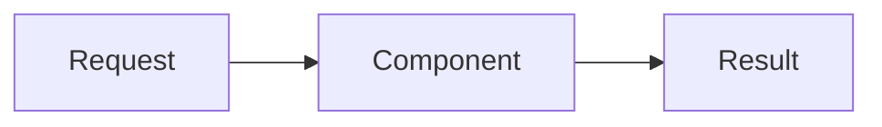

# <Chapter Title>

<!--
CANONICAL MICRO-CHAPTER TEMPLATE — copy this file, keep the section order.
Delete a section ONLY if it is genuinely not applicable, and say why in a comment.
Target length: 150–450 lines. If longer, split into two micro-chapters.
Optimised for smartphone reading: short paragraphs, small tables, one idea per section.
-->

!!! abstract "Learning objectives"
    By the end of this chapter you can:

    - [ ] Objective 1 (verb + measurable outcome)
    - [ ] Objective 2
    - [ ] Objective 3

    **Syllabus:** `<Topic Area> → <Sub-topic>` ·
    **Level:** Advanced / Expert ·
    **Est. time:** X min ·
    **Prerequisites:** [Chapter](../path/to.md)

---

## Theory

Plain, progressive explanation of the concept. Define terms before using them.
Short paragraphs. Prefer a small table or list over a wall of text.

## Deep Dive — how it works internally

The heart of every chapter. Explain **why** and **how internally**, not only *how*:

- **Classes & interfaces involved** — name the exact FQCNs.
- **Execution flow / lifecycle** — order of operations.
- **Container compilation vs runtime** behaviour where relevant.
- **Extension points** — interfaces/tags/events you can hook into.
- **Trade-offs, performance & memory** implications.
- **Security implications** where relevant.



!!! note "Source reference"
    `Symfony\Component\...\SomeClass` —
    [symfony/symfony `8.0`](https://github.com/symfony/symfony/blob/8.0/src/Symfony/...).

## Configuration & code

Show the same thing across the formats the exam cares about. Use tabs.

=== "PHP Attributes"

    ```php
    <?php
    declare(strict_types=1);
    // ...
    ```

=== "YAML"

    ```yaml
    # config/...
    ```

=== "Console"

    ```console
    $ php bin/console ...
    ```

<!-- Add an XML tab only when XML is relevant to the topic. -->

## Best practices & anti-patterns

| ✅ Do | ❌ Avoid |
|---|---|
| … | … |

## When (not) to use it / alternatives

Decision guidance. A comparison table or decision tree when there is a real choice.

!!! danger "Certification traps"
    - Trap 1 — the subtle detail the exam tests.
    - Trap 2 — a common misconception.
    - Trap 3 — a version-specific gotcha (Symfony 8 vs older).

!!! warning "Common mistakes"
    - Mistake 1 and the correct approach.
    - Mistake 2.

## Exercises

1. **(Level)** Task description with a clear expected outcome.
2. **(Level)** …

??? success "Solutions"

    **1.** Worked solution with code and a one-line rationale.

    **2.** …

## Certification questions

??? question "Q1. <question text>"
    - [ ] A. …
    - [x] B. … ✅
    - [ ] C. …

    **Why:** explanation. **Ref:** [official docs](https://symfony.com/doc/8.0/...).

## Key takeaways

- Bullet the 3–6 things to remember.

## Last-minute revision

!!! tip "Cheat sheet"
    - Ultra-condensed facts, signatures, config keys — glanceable the night before.

## Official References

<!-- MANDATORY. No chapter is valid without this section. Include official
     Symfony docs for every Symfony concept, and php.net for every PHP concept.
     Add the Symfony source and any RFC/design doc when relevant. -->

- [Official Symfony docs — <topic>](https://symfony.com/doc/8.0/...)
- [PHP manual — <feature>](https://www.php.net/manual/en/...) <!-- when PHP-relevant -->
- [Symfony source — <Class>](https://github.com/symfony/symfony/blob/8.0/...)

---

<small>Related: [Chapter A](../a.md) · [Chapter B](../b.md)</small>
