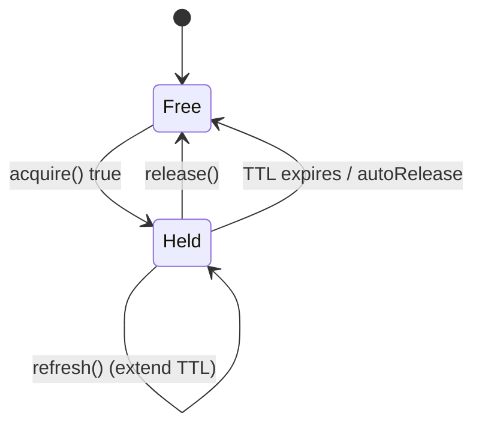

# Lock Component

!!! danger "Hors syllabus officiel Symfony 8.0"
    Le composant Lock ne figure pas au programme officiel de la certification
    Symfony 8. Ce chapitre est conservé dans les [Appendices](index.md) comme
    contenu additionnel / d'approfondissement — voir la section « Out-of-scope /
    Additional Learning » de `specs/TraceabilityMatrix.md` pour la séparation
    officiel/additionnel — et n'est pas testé dans les examens générés ni
    compté dans la couverture officielle du syllabus.

!!! tip "In a nutshell"
    Lock empêche deux processus d'exécuter le même travail critique en même
    temps : obtenez un `LockInterface` via `LockFactory`, `acquire()`,
    travaillez, `release()`. À retenir pour l'examen : `acquire()` est
    **non bloquant** par défaut (il retourne `false` si le lock est détenu),
    et les stores locaux (Flock/Semaphore) ne protègent qu'une seule machine.

!!! example "Real-world analogy"
    Un lock, c'est le **panneau « occupé » sur la porte des toilettes**.
    `acquire()` essaie la porte : si elle est libre, vous basculez le panneau et
    entrez ; si elle indique déjà occupé, vous recevez un simple « non »
    (`false`) et passez votre chemin — vous ne faites pas la queue sauf si vous
    le demandez (blocking). `release()` remet le panneau sur libre, et le
    **TTL** est un ressort qui fait revenir le panneau sur libre au bout d'un
    moment, afin qu'un occupant évanoui ne bloque pas tout le monde pour
    toujours (`refresh()` réarme ce ressort).

!!! abstract "Learning objectives"
    À la fin de ce chapitre, vous saurez :

    - [ ] Créer des locks avec `LockFactory` et les acquérir/libérer/rafraîchir.
    - [ ] Choisir entre acquisition blocking et non-blocking, et un store adapté.
    - [ ] Utiliser en toute sécurité les locks expirants (auto-rafraîchis) et les locks partagés (read/write).

    **Syllabus:** `Miscellaneous → Lock` ·
    **Level:** Advanced → Expert ·
    **Est. time:** 35 min ·
    **Prerequisites:** [Dependency Injection](../../dependency-injection/index.md)

---

## 🧠 Pour les nuls

**C'est quoi ce chapitre ?** Le composant Lock empêche deux processus de faire le même travail critique en même temps — par exemple, éviter que deux tâches planifiées identiques ne s'exécutent en double.

**Pourquoi ça existe ?** Sans verrou, deux workers qui démarrent en même temps pourraient tous les deux, par exemple, envoyer la même facture deux fois.

**🏠 Analogie de la vraie vie :** Le panneau "occupé" d'une porte de toilettes. `acquire()` essaie la porte : si elle est libre, tu retournes le panneau et entres ; si elle est déjà occupée, tu reçois un simple "non" et tu repars — tu ne fais pas la queue sauf si tu le demandes explicitement (mode bloquant).

**Symfony dans la vraie vie :** `$lock = $lockFactory->createLock('tache-quotidienne'); if ($lock->acquire()) { /* travail */ $lock->release(); }` — un seul worker à la fois exécute réellement la tâche.

**⚠️ Erreur fréquente :** croire que le Lock component est testé à l'examen — ce n'est **pas** un sous-sujet officiel du syllabus.

**🧠 Comment le mémoriser :** "Un verrou, c'est un panneau `occupé` — `acquire()` par défaut ne fait jamais la queue, il dit juste oui ou non."


## Theory

Le composant Lock empêche deux processus d'exécuter le même travail critique en
même temps (p. ex. deux exécutions cron, deux workers). Vous obtenez un
`LockInterface` auprès d'une `LockFactory` pour une **resource** nommée, vous
l'`acquire()`, faites le travail, puis `release()`. Un **store** sous-tend le
lock ; sa portée (local ou partagé) détermine si l'exclusion mutuelle tient
d'un serveur à l'autre.

```php
$lock = $lockFactory->createLock('nightly-report'); // LockInterface from the LockFactory
if ($lock->acquire()) {          // got it — no other process holds the resource
    try {
        // ... critical work ...
    } finally {
        $lock->release();        // hand the resource back
    }
}
```

## Deep Dive — how it works internally

!!! question "Predict first"
    Deux exécutions cron démarrent en même temps. Chacune fait
    `if (!$lock->acquire()) return;` avec un `acquire()` par défaut. La seconde
    bloque-t-elle, lève-t-elle une exception, ou retourne-t-elle immédiatement ?

??? note "Reveal"
    Elle retourne **`false` immédiatement** — `acquire()` est non bloquant par
    défaut, donc la seconde exécution saute le travail. Ne passez `acquire(true)`
    que lorsque le travail doit finir par s'exécuter (il attend alors au lieu
    d'abandonner).

### Factory, lock, store

| Role | FQCN |
|---|---|
| Factory | `Symfony\Component\Lock\LockFactory` |
| Lock | `Symfony\Component\Lock\LockInterface` (impl `Lock`) |
| Store contract | `Symfony\Component\Lock\PersistingStoreInterface` |
| Key | `Symfony\Component\Lock\Key` |

`LockFactory::createLock(string $resource, ?float $ttl = 300.0, bool $autoRelease = true)`
retourne un `Lock`. En interne, une `Key` identifie la resource ; le store
persiste la propriété de cette clé. `autoRelease` libère le lock quand l'objet
`Lock` est détruit (fin de la request ou du script).

```php
// createLock(resource, ttl = 300.0, autoRelease = true)
$lock = $factory->createLock('report-nightly', ttl: 60.0, autoRelease: true);
// Internally a Key('report-nightly') identifies the resource in the store;
// with autoRelease the Lock is released when the object is destroyed
```

### Acquire: blocking vs non-blocking

- `acquire(false)` — **non-blocking** (par défaut) : retourne `true` si le lock
  est acquis, `false` immédiatement s'il est déjà détenu. Utilisez-le pour
  sauter un travail qu'un autre processus est en train de faire.
- `acquire(true)` — **blocking** : attend que le lock soit libre (le store doit
  supporter le blocking, sinon le composant réessaie). À utiliser quand le
  travail doit finir par s'exécuter.

```php
// Non-blocking (default): bail out if another process is already working
if (!$lock->acquire(false)) {
    return; // held elsewhere — skip the duplicate work
}

// Blocking: wait until the lock becomes free, then proceed
$lock->acquire(true);
```



### Expiring locks & auto-refresh

Un lock a un **TTL** afin qu'un processus planté ne le détienne pas pour
toujours. Pour un travail susceptible de dépasser le TTL, appelez `refresh()`
périodiquement pour le prolonger. Sans refresh, le store peut considérer le
lock comme expiré et laisser un autre processus l'acquérir — brisant
l'exclusion mutuelle. Choisissez un TTL confortablement supérieur à la durée
d'exécution attendue, et appelez `refresh()` dans les boucles longues.

```php
$lock = $factory->createLock('video-encode', ttl: 30.0); // TTL in seconds
$lock->acquire();
foreach ($chunks as $chunk) {
    $encoder->process($chunk);
    $lock->refresh(); // extend the TTL so the lock never expires mid-work
}
$lock->release();
```

### Stores

| Store | Scope |
|---|---|
| `FlockStore` | Système de fichiers local (serveur unique) |
| `SemaphoreStore` | Local, sémaphores SysV |
| `RedisStore` | Distribué (partagé) |
| `MemcachedStore` | Distribué |
| `PostgreSqlStore` / `DoctrineDbalStore` | Adossé à une base de données |
| `ZookeeperStore` | Coordination distribuée |
| `InMemoryStore` | Par processus (tests) |

Les stores locaux (`Flock`, `Semaphore`) ne garantissent l'exclusion **que sur
une seule machine**. Pour les déploiements multi-serveurs, utilisez un store
partagé (Redis, base de données). `CombinedStore` avec un quorum peut couvrir
plusieurs serveurs Redis.

```php
use Symfony\Component\Lock\Store\CombinedStore;
use Symfony\Component\Lock\Store\FlockStore;
use Symfony\Component\Lock\Store\RedisStore;
use Symfony\Component\Lock\Strategy\ConsensusStrategy;

$local  = new FlockStore();                 // Flock: one machine only
$shared = new RedisStore($redisConnection); // shared across servers
// Quorum spanning several Redis servers:
$quorum = new CombinedStore([$shared, $otherRedisStore], new ConsensusStrategy());
```

### Shared (read/write) locks

`SharedLockInterface` ajoute `acquireRead()` : plusieurs lecteurs peuvent
détenir le lock simultanément, mais l'`acquire()` d'un écrivain est exclusif.
Tous les stores ne supportent pas les locks partagés (Flock oui ; Redis via
l'implémentation du composant).

```php
$lock = $factory->createLock('catalog'); // Lock implements SharedLockInterface
// Readers: many processes may hold the read lock at the same time
if ($lock->acquireRead()) {
    // ... read the resource ...
    $lock->release();
}
// Writer: acquire() stays exclusive
if ($lock->acquire()) {
    // ... write the resource ...
    $lock->release();
}
```

!!! note "Source reference"
    `Symfony\Component\Lock\LockFactory` et `Lock::acquire()` —
    [symfony/symfony `8.0`](https://github.com/symfony/symfony/blob/8.0/src/Symfony/Component/Lock/Lock.php).

### Null behavior

Lock signale la contention avec un **booléen, pas un null** : `acquire(false)`
retourne `false` quand la resource est déjà détenue et `true` quand vous
l'avez obtenue — `createLock()` retourne toujours un `Lock`, jamais null.
Le bug classique consiste à traiter `acquire()` comme quelque chose qui lève
une exception ou retourne null quand c'est « occupé » : ce n'est pas le cas,
donc `if (!$lock->acquire()) { return; }` est la bonne garde. (Le blocking
`acquire(true)` attend au contraire et finit par retourner `true` ou lever
`LockConflictedException`.) Comme `false` est une valeur ordinaire, oublier de
la vérifier signifie entrer dans la section critique sans protection.

```php
$lock = $factory->createLock('import');  // createLock() returns a Lock, never null
if (!$lock->acquire(false)) {            // non-blocking: false means "busy", no throw
    return;                              // the mandatory guard
}
// Blocking variant: waits, returns true or throws LockConflictedException
// $ok = $lock->acquire(true);
```

!!! note "Null in real life"
    Une porte occupée ne vous donne pas *rien* — elle vous donne un « occupé »
    clair (`false`). Interpréter ce « non » explicite comme « bon, ça doit
    aller » est exactement la façon dont deux personnes se retrouvent dans la
    même cabine.

## Configuration & code

=== "PHP Attributes"

    ```php
    <?php
    declare(strict_types=1);

    namespace App\Command;

    use Symfony\Component\Lock\LockFactory;

    final class ReportGenerator
    {
        public function __construct(private readonly LockFactory $lockFactory) {}

        public function run(): void
        {
            $lock = $this->lockFactory->createLock('report-nightly', ttl: 120);
            if (!$lock->acquire()) {
                return; // another run holds it — skip
            }
            try {
                // ... long work; extend if needed:
                $lock->refresh();
            } finally {
                $lock->release();
            }
        }
    }
    ```

=== "YAML"

    ```yaml
    # config/packages/lock.yaml
    framework:
        lock:
            default: '%env(LOCK_DSN)%'   # e.g. redis://localhost, flock, semaphore
    ```

=== "Console"

    ```console
    $ php bin/console debug:container lock.factory
    ```

## Best practices & anti-patterns

| ✅ Do | ❌ Avoid |
|---|---|
| `release()` dans un bloc `finally` | Laisser fuir des locks détenus en cas d'exception |
| Utiliser un store **partagé** pour l'exclusion multi-serveurs | `FlockStore` réparti sur plusieurs machines |
| Fixer un TTL > durée d'exécution attendue et `refresh()` | Un TTL trop court qui expire en plein travail |
| `acquire()` non-blocking pour sauter le travail en double | Bloquer indéfiniment sans timeout |

## When (not) to use it / alternatives

Utilisez Lock pour sérialiser des sections critiques entre processus (cron,
workers, déploiements). Pour la limitation de débit, utilisez le composant
RateLimiter ; pour la concurrence au sein d'un seul processus, vous n'avez pas
besoin de Lock. Ne comptez pas sur un store local pour une application scalée
horizontalement.

!!! danger "Certification traps"
    - `acquire()` est **non-blocking** par défaut ; passez `true` pour le blocking.
    - Les locks ont un **TTL** (300 s par défaut) — les jobs longs doivent appeler `refresh()`.
    - `FlockStore`/`SemaphoreStore` sont **locaux uniquement** ; utilisez Redis ou une base de données pour le distribué.
    - `autoRelease` libère le lock quand l'objet `Lock` est ramassé par le garbage collector.
    - Les locks partagés nécessitent `SharedLockInterface` et un store qui les supporte.

!!! warning "Common mistakes"
    - Supposer qu'un lock sur le système de fichiers protège entre serveurs.
    - Ne pas libérer dans `finally`, si bien qu'une exception laisse le lock en rade jusqu'au TTL.

## Exercises

1. **(Advanced)** Garantissez qu'une commande de rapport nocturne ne s'exécute qu'une seule fois même si elle est déclenchée deux fois.
2. **(Expert)** Expliquez pourquoi un job long avec un TTL de lock de 120 s doit appeler `refresh()`.

??? success "Solutions"

    **1.** Voir `ReportGenerator::run()` — l'`acquire()` non-blocking retourne
    immédiatement si une autre exécution détient `report-nightly`.

    **2.** Après 120 s, le store considère le lock comme expiré et un autre
    processus pourrait l'acquérir, brisant l'exclusion. `refresh()` prolonge le
    TTL pour que le propriétaire conserve le lock tant qu'il travaille.

## Certification questions

??? question "Q1. `LockInterface::acquire()` with no argument is…"
    - [x] A. non-blocking — returns false immediately if held ✅
    - [ ] B. blocking until free
    - [ ] C. throws if held

    **Why:** Le comportement par défaut est non-blocking ; `acquire(true)` bloque. **Ref:** [Lock](https://symfony.com/doc/8.0/lock.html#blocking-locks).

??? question "Q2. Which store works across multiple servers?"
    - [ ] A. `FlockStore`
    - [ ] B. `SemaphoreStore`
    - [x] C. `RedisStore` ✅

    **Why:** Flock/Semaphore sont locaux ; les stores Redis (et base de données) sont partagés.
    **Ref:** [Lock stores](https://symfony.com/doc/8.0/components/lock.html#available-stores).

??? question "Q3. Why call `refresh()` during a long critical section?"
    - [x] A. To extend the lock's TTL before it expires ✅
    - [ ] B. To reacquire after release
    - [ ] C. To switch stores

    **Why:** `refresh()` prolonge le TTL pour que le lock ne soit pas considéré comme périmé en plein job.
    **Ref:** [Expiring locks](https://symfony.com/doc/8.0/components/lock.html#expiring-locks).

## Key takeaways

- `LockFactory::createLock($resource, $ttl)` → `acquire()`/`release()`/`refresh()`.
- Non-blocking par défaut ; `acquire(true)` bloque.
- La portée du store compte : local (Flock/Semaphore) vs partagé (Redis/base de données).
- TTL + `refresh()` évitent à la fois les deadlocks et l'expiration prématurée.

## Last-minute revision

!!! tip "Cheat sheet"
    - `createLock(name, ttl=300, autoRelease=true)`.
    - `acquire(bool $blocking=false)`, `release()`, `refresh()`, `isAcquired()`.
    - Partagé : `SharedLockInterface::acquireRead()`.
    - DSN : `flock`, `semaphore`, `redis://…`, `%env(LOCK_DSN)%`.

## Connections

- **Depends on:** [Dependency Injection](../../dependency-injection/index.md) — la `LockFactory` est autowirée à partir du DSN de store configuré.
- **Reused in:** [Messenger](../../messenger/index.md) — sérialiser les exécutions de workers en double ; [Process](../../miscellaneous/process.md) — protéger des outils externes partagés.
- **Confused with:** la protection contre le stampede de [Cache](../../miscellaneous/cache.md) — Lock impose une exclusion mutuelle stricte ; le cache ne fait que réduire les recalculs en double.

## Official References
- [Official docs — Lock](https://symfony.com/doc/8.0/lock.html)
- [Official docs — Lock component](https://symfony.com/doc/8.0/components/lock.html)
- [Symfony source — Lock](https://github.com/symfony/symfony/blob/8.0/src/Symfony/Component/Lock/Lock.php)

## Video references

!!! tip "Watch & learn"
    Voici des chaînes vidéo officielles, mises à jour en continu — cherchez-y
    "Symfony components" pour consolider ce chapitre. Nous lions des chaînes
    stables plutôt que des vidéos individuelles afin que les références ne se
    périment jamais.

    - [SymfonyCasts screencasts](https://symfonycasts.com/tracks/symfony) — tutoriels scénarisés à suivre en codant.
    - [Symfony official YouTube](https://www.youtube.com/@SymfonyOfficial) — conférences et keynotes SymfonyCon.
    - [Official docs for this topic](https://symfony.com/doc/8.0/lock.html#blocking-locks) — certaines pages de la doc Symfony intègrent un screencast.

## Confidence check

Je suis prêt quand je peux :

- [ ] expliquer **pourquoi** un store distribué est nécessaire pour l'exclusion multi-serveurs
- [ ] acquérir/libérer/rafraîchir un lock en Symfony 8, en libérant dans `finally`
- [ ] déboguer un lock perdu en plein job (TTL expiré, pas de `refresh()`) ou un Flock réparti sur plusieurs serveurs
- [ ] repérer le piège : `acquire()` est non-blocking et retourne `false`, pas null
- [ ] décrire comment une `Key` + un store persistent la propriété et le TTL

---

<small>Related: [Cache](../../miscellaneous/cache.md) · [Process](../../miscellaneous/process.md) · [Messenger](../../messenger/index.md)</small>
