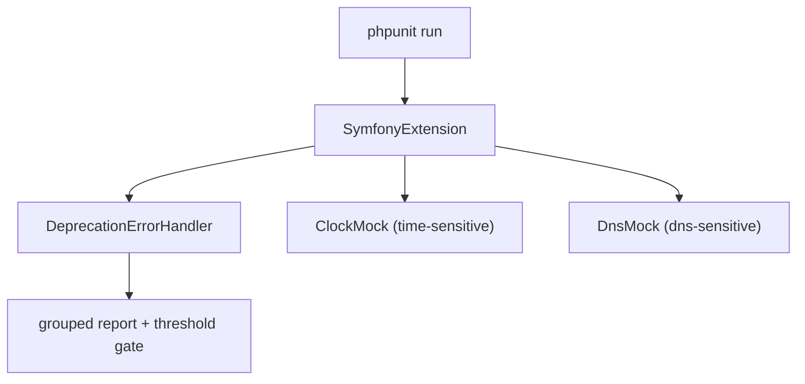

# The PHPUnit Bridge

!!! danger "Hors syllabus officiel Symfony 8.0"
    Le PHPUnit Bridge ne figure pas au programme officiel de la certification
    Symfony 8. Ce chapitre est conservé dans les [Appendices](index.md) comme
    contenu additionnel / d'approfondissement — voir la section « Out-of-scope /
    Additional Learning » de `specs/TraceabilityMatrix.md` pour la séparation
    officiel/additionnel — et n'est pas testé dans les examens générés ni
    compté dans la couverture officielle du syllabus.

!!! tip "In a nutshell"
    `symfony/phpunit-bridge` augmente PHPUnit avec la collecte des dépréciations
    plus le mocking de l'horloge et du DNS, le tout câblé en enregistrant
    `SymfonyExtension`. Point d'examen : le mocking horloge/DNS s'active par
    groupe (`time-sensitive` / `dns-sensitive`), et
    `SYMFONY_DEPRECATIONS_HELPER` est une variable d'environnement, pas un
    drapeau CLI.

!!! example "Real-world analogy"
    Pensez aux équipements additionnels d'un plateau de cinéma qu'on boulonne
    sur un décor ordinaire. L'un est une scripte qui note chaque réplique
    désuète et en fait le total à la fin du tournage (la collecte des
    dépréciations). Un autre est une horloge de studio pilotable qui permet de
    sauter des heures en un instant, et une machine à fausse météo qui fabrique
    de la pluie sur commande (le mocking de l'horloge et du DNS). Point
    crucial : l'horloge et la machine météo ne s'activent que pour les scènes
    que vous avez explicitement étiquetées "time-sensitive" ou "dns-sensitive",
    et aucun membre de l'équipe ne se présente si vous ne l'avez pas d'abord
    inscrit sur la feuille de service (l'enregistrement de `SymfonyExtension`).

!!! abstract "Learning objectives"
    À la fin de ce chapitre, vous saurez :

    - [ ] Lister ce que `symfony/phpunit-bridge` ajoute par-dessus PHPUnit
    - [ ] Enregistrer l'extension PHPUnit du bridge dans `phpunit.dist.xml`
    - [ ] Mocker le temps et le DNS avec les helpers horloge/DNS du bridge
    - [ ] Configurer le signalement des dépréciations via `SYMFONY_DEPRECATIONS_HELPER`

    **Syllabus:** `Automated Tests → PHPUnit bridge` ·
    **Level:** Expert ·
    **Est. time:** 25 min ·
    **Prerequisites:** [Unit Tests](../../testing/unit-tests.md)

---

## 🧠 Pour les nuls

**C'est quoi ce chapitre ?** Le PHPUnit Bridge ajoute à PHPUnit la capacité de compter les dépréciations rencontrées pendant les tests, plus des outils pour figer l'heure ou simuler le réseau dans un test.

**Pourquoi ça existe ?** Sans lui, une dépréciation silencieuse pourrait passer inaperçue jusqu'à ce qu'une future version majeure supprime la fonctionnalité concernée — le bridge la fait remonter dès maintenant, pendant les tests.

**🏠 Analogie de la vraie vie :** Un scripte de plateau de cinéma qui note chaque réplique obsolète prononcée pendant le tournage, pour faire le bilan à la fin — plus une horloge de studio réglable qui permet de sauter des heures instantanément pour une scène.

**Symfony dans la vraie vie :** Activer `SymfonyExtension` dans `phpunit.dist.xml` fait échouer la suite de tests si trop de dépréciations sont détectées — un signal précoce avant une montée de version majeure.

**⚠️ Erreur fréquente :** croire que le PHPUnit Bridge est testé à l'examen — ce n'est **pas** un sous-sujet officiel du syllabus Automated Tests.

**🧠 Comment le mémoriser :** "Le bridge est le scripte de plateau qui note chaque réplique dépassée — pas testé à l'examen, mais indispensable en vrai projet."


## Theory

`symfony/phpunit-bridge` est un petit paquet qui **augmente PHPUnit** avec des
comportements propres à Symfony. Sa fonctionnalité phare est la **collecte des
dépréciations** : il compte chaque `E_USER_DEPRECATED` déclenché pendant la
suite et affiche un rapport groupé, faisant échouer le build si vous dépassez
les seuils configurés. Il fournit aussi le **mocking de l'horloge** et le
**mocking du DNS** afin de rendre déterministe le code sensible au temps et au
réseau.

```php
// symfony/phpunit-bridge intercepts every E_USER_DEPRECATED raised in the suite...
@trigger_error('Since acme/lib 2.1: "legacyCall()" is deprecated.', E_USER_DEPRECATED);

// ...and prints a grouped report at the end, failing on configured thresholds:
//   Remaining direct deprecations (1)
//     1x: Since acme/lib 2.1: "legacyCall()" is deprecated.
```

!!! question "Predict first"
    Vous ajoutez `sleep(61)` à un test en espérant qu'il s'exécute
    instantanément grâce au mocking de l'horloge, mais la suite attend vraiment
    61 secondes. Que manque-t-il ?

??? note "Reveal"
    Le mocking de l'horloge s'active **par groupe** : le test (ou la classe)
    doit être dans le groupe `time-sensitive`, et `SymfonyExtension` doit être
    enregistrée. Sans les deux, `ClockMock` ne surcharge jamais le `sleep()`
    global.

## Deep Dive — how it works internally

Le bridge installe une **extension** PHPUnit,
`Symfony\Bridge\PhpUnit\SymfonyExtension`, enregistrée dans la configuration
XML de PHPUnit. L'extension câble :

- `Symfony\Bridge\PhpUnit\DeprecationErrorHandler` — un gestionnaire d'erreurs
  qui intercepte `E_USER_DEPRECATED`, classe chaque dépréciation en **self /
  direct / indirect / legacy**, et en fin d'exécution affiche les compteurs et
  applique les seuils de `SYMFONY_DEPRECATIONS_HELPER`.
- `Symfony\Bridge\PhpUnit\ClockMock` — quand un test/une classe est dans le
  groupe `time-sensitive`, il surcharge `time()`, `microtime()`, `sleep()`,
  `usleep()`, `date()` etc. **dans le namespace testé** afin que le temps puisse
  avancer par programmation, sans attente réelle.
- `Symfony\Bridge\PhpUnit\DnsMock` — pour le groupe `dns-sensitive`, remplace
  `dns_get_record()`, `checkdnsrr()`, `gethostbyname()`, etc.

```php
// Everything below is wired by SymfonyExtension (registered in phpunit XML).

// 1) DeprecationErrorHandler: intercepts E_USER_DEPRECATED,
//    thresholds read from SYMFONY_DEPRECATIONS_HELPER (e.g. "max[direct]=0")
@trigger_error('Since acme/lib 2.1: X is deprecated.', E_USER_DEPRECATED);

// 2) ClockMock ("time-sensitive" group): virtual time, no real waits
ClockMock::register(Rate::class);   // override time() etc. in Rate's namespace
ClockMock::withClockMock(true);
sleep(60);                          // instant: advances the virtual clock
usleep(500);                        // mocked too
echo time(), microtime(true), date('H:i'); // all read the virtual clock

// 3) DnsMock ("dns-sensitive" group): stubbed DNS, no network
DnsMock::withMockedHosts(['example.com' => [['type' => 'A', 'ip' => '1.2.3.4']]]);
checkdnsrr('example.com', 'A');        // true (stubbed)
gethostbyname('example.com');          // "1.2.3.4"
dns_get_record('example.com', DNS_A);  // stubbed records
```

Le regroupement utilise les attributs PHPUnit `#[Group('time-sensitive')]` /
`#[Group('dns-sensitive')]` (ou le docblock `@group` sur les installations plus
anciennes).

```php
use PHPUnit\Framework\Attributes\Group;

#[Group('time-sensitive')]   // ClockMock activates for this class
final class ExpiryTest extends TestCase { /* ... */ }

#[Group('dns-sensitive')]    // DnsMock activates for this class
final class MxLookupTest extends TestCase { /* ... */ }

// Older setups: docblock equivalent of the attribute
/** @group time-sensitive */
```



!!! note "Source reference"
    `Symfony\Bridge\PhpUnit\DeprecationErrorHandler` et `SymfonyExtension`
    ([symfony/symfony `8.0`](https://github.com/symfony/symfony/blob/8.0/src/Symfony/Bridge/PhpUnit/DeprecationErrorHandler.php)).

### `SYMFONY_DEPRECATIONS_HELPER`

Cette variable d'environnement (posée dans `phpunit.dist.xml` ou le shell)
règle le gestionnaire :

| Value | Effect |
|---|---|
| `max[total]=0` | échoue si **une seule** dépréciation est déclenchée |
| `max[self]=0` | échoue sur les dépréciations de **votre propre** code uniquement |
| `max[direct]=0` | échoue sur les dépréciations de **vos appels directs** |
| `disabled=1` | ne collecte ni ne signale rien du tout |
| `weak` | signale mais ne fait **jamais** échouer le build |
| `baselineFile=…&generateBaseline=true` | enregistre les dépréciations actuelles pour les ignorer ensuite |

`self`, `direct`, `indirect` classifient le code *de qui* a déclenché la
dépréciation (le vôtre, une dépendance appelée directement, ou au fond d'une
dépendance) — voir le [chapitre sur les dépréciations](../../testing/deprecations.md).

```console
# self: your own code triggers the deprecation
$ SYMFONY_DEPRECATIONS_HELPER='max[self]=0' php bin/phpunit

# direct: your code calls a deprecated API of a direct dependency
$ SYMFONY_DEPRECATIONS_HELPER='max[direct]=0' php bin/phpunit

# indirect: triggered deep inside a dependency calling another dependency
$ SYMFONY_DEPRECATIONS_HELPER='max[indirect]=5' php bin/phpunit
```

## Configuration & code

=== "phpunit.dist.xml"

    ```xml
    <?xml version="1.0" encoding="UTF-8"?>
    <phpunit xmlns:xsi="https://www.w3.org/2001/XMLSchema-instance"
             xsi:noNamespaceSchemaLocation="vendor/phpunit/phpunit/phpunit.xsd"
             bootstrap="tests/bootstrap.php">
        <php>
            <env name="APP_ENV" value="test" force="true"/>
            <server name="SYMFONY_DEPRECATIONS_HELPER" value="max[direct]=0"/>
        </php>

        <extensions>
            <bootstrap class="Symfony\Bridge\PhpUnit\SymfonyExtension"/>
        </extensions>

        <testsuites>
            <testsuite name="Project Test Suite">
                <directory>tests</directory>
            </testsuite>
        </testsuites>
    </phpunit>
    ```

=== "Time-sensitive test"

    ```php
    <?php
    declare(strict_types=1);

    namespace App\Tests\Time;

    use App\Time\Rate;
    use PHPUnit\Framework\Attributes\Group;
    use PHPUnit\Framework\TestCase;

    #[Group('time-sensitive')]              // ClockMock overrides time() in Rate's namespace
    final class RateTest extends TestCase
    {
        public function testExpires(): void
        {
            $rate = new Rate(ttl: 60);      // uses time() internally
            self::assertFalse($rate->isExpired());

            sleep(61);                       // mocked: instant, advances virtual clock
            self::assertTrue($rate->isExpired());
        }
    }
    ```

=== "Console"

    ```console
    $ composer require --dev symfony/phpunit-bridge
    $ php bin/phpunit
    $ SYMFONY_DEPRECATIONS_HELPER=max[total]=0 php bin/phpunit
    ```

## Best practices & anti-patterns

| ✅ Do | ❌ Avoid |
|---|---|
| Enregistrer `SymfonyExtension` dans le XML | Compter sur le binaire `simple-phpunit`, supprimé |
| `#[Group('time-sensitive')]` pour les tests d'horloge | De vrais `sleep()` dans les tests |
| Échouer au moins sur les dépréciations `self` | `disabled=1` qui cache votre propre dette technique |
| Préférer le `MockClock` du composant Clock pour le code en DI | Le mock d'horloge global quand vous injectez une horloge |

## When (not) to use it / alternatives

Utilisez le bridge dans pratiquement chaque projet Symfony — il fait partie du
test pack par défaut. Pour le **code applicatif qui injecte `ClockInterface`**,
préférez substituer un `Symfony\Component\Clock\MockClock` (plus propre, sans
magie de groupe) à `ClockMock` ; réservez `ClockMock` au code legacy qui appelle
directement `time()`/`sleep()` globaux.

!!! danger "Certification traps"
    - Le bridge enregistre `Symfony\Bridge\PhpUnit\SymfonyExtension` — le
      mocking horloge/DNS et la collecte des dépréciations ne fonctionnent
      **pas** sans elle.
    - Le mocking horloge/DNS s'active **par groupe** : `time-sensitive` /
      `dns-sensitive`.
    - `SYMFONY_DEPRECATIONS_HELPER` est une **variable d'environnement/serveur**,
      pas un drapeau CLI.
    - Le wrapper historique `bin/simple-phpunit` est déprécié au profit de
      l'extension + PHPUnit pur.

!!! warning "Common mistakes"
    - S'attendre à ce que `sleep()` soit mocké sans le groupe `time-sensitive`.
    - Passer le deprecation helper en `--option` au lieu d'une variable
      d'environnement.

## Exercises

1. **(Basic)** Ajoutez la `SymfonyExtension` et une valeur de
   `SYMFONY_DEPRECATIONS_HELPER` à `phpunit.dist.xml` qui fait échouer le build
   sur toute dépréciation *directe*.
2. **(Intermediate)** Écrivez un test `time-sensitive` prouvant qu'un token créé
   avec un TTL de 60 s est expiré après un `sleep(61)` mocké.

??? success "Solutions"

    **1.**

    ```xml
    <php>
        <server name="SYMFONY_DEPRECATIONS_HELPER" value="max[direct]=0"/>
    </php>
    <extensions>
        <bootstrap class="Symfony\Bridge\PhpUnit\SymfonyExtension"/>
    </extensions>
    ```

    Échoue dès que votre code déclenche une dépréciation via un appel direct à
    une dépendance.

    **2.**

    ```php
    <?php
    declare(strict_types=1);

    namespace App\Tests\Security;

    use App\Security\Token;
    use PHPUnit\Framework\Attributes\Group;
    use PHPUnit\Framework\TestCase;

    #[Group('time-sensitive')]
    final class TokenTest extends TestCase
    {
        public function testExpiry(): void
        {
            $token = new Token(ttl: 60);
            sleep(61);
            self::assertTrue($token->isExpired());
        }
    }
    ```

## Certification questions

??? question "Q1. Which class must be registered to enable the bridge's features?"
    - [x] A. `Symfony\Bridge\PhpUnit\SymfonyExtension` ✅
    - [ ] B. `Symfony\Bridge\PhpUnit\PhpUnitBundle`
    - [ ] C. `Symfony\Component\PhpUnit\Extension`
    - [ ] D. `PHPUnit\Bridge\Symfony`

    **Why:** l'extension PHPUnit câble le gestionnaire de dépréciations et les
    mocks horloge/DNS.
    **Ref:** [PHPUnit bridge](https://symfony.com/doc/8.0/components/phpunit_bridge.html).

??? question "Q2. To mock `time()`/`sleep()` in a test you…"
    - [x] A. Put the test in the `time-sensitive` group ✅
    - [ ] B. Call `time_mock_enable()`
    - [ ] C. Set `APP_MOCK_TIME=1`
    - [ ] D. Extend `ClockTestCase`

    **Why:** `ClockMock` s'active pour le groupe `time-sensitive`.
    **Ref:** [PHPUnit bridge — time-sensitive](https://symfony.com/doc/8.0/components/phpunit_bridge.html#time-sensitive-tests).

??? question "Q3. `SYMFONY_DEPRECATIONS_HELPER=weak` means…"
    - [x] A. Deprecations are reported but never fail the build ✅
    - [ ] B. Deprecations are hidden entirely
    - [ ] C. The build fails on the first deprecation
    - [ ] D. Only self deprecations count

    **Why:** `weak` collecte et affiche mais n'applique pas les seuils ;
    `disabled` coupe la collecte.
    **Ref:** [PHPUnit bridge](https://symfony.com/doc/8.0/components/phpunit_bridge.html#configuration).

??? question "Q4. `SYMFONY_DEPRECATIONS_HELPER` is set as…"
    - [x] A. An environment/server variable (e.g. in phpunit XML `<php>`) ✅
    - [ ] B. A PHPUnit CLI flag
    - [ ] C. A composer script
    - [ ] D. A PHP ini setting

    **Why:** elle est lue depuis l'environnement ; placez-la dans
    `<php><server .../></php>`.
    **Ref:** [PHPUnit bridge](https://symfony.com/doc/8.0/components/phpunit_bridge.html#configuration).

## Key takeaways

- Le bridge ajoute la collecte des dépréciations + le mocking horloge/DNS,
  câblés par `SymfonyExtension`.
- Le mocking horloge/DNS s'active via les groupes `time-sensitive` /
  `dns-sensitive`.
- `SYMFONY_DEPRECATIONS_HELPER` (variable d'environnement) règle le
  signalement : `max[...]`, `weak`, `disabled`, baseline.
- Préférez le `MockClock` du composant Clock pour le code qui injecte
  `ClockInterface`.

## Last-minute revision

!!! tip "Cheat sheet"
    - Installation : `composer require --dev symfony/phpunit-bridge`.
    - Enregistrement : `<bootstrap class="Symfony\Bridge\PhpUnit\SymfonyExtension"/>`.
    - Groupes : `#[Group('time-sensitive')]`, `#[Group('dns-sensitive')]`.
    - Env : `SYMFONY_DEPRECATIONS_HELPER=max[direct]=0` / `weak` / `disabled=1`.

## Connections

- **Depends on:** [Unit Tests](../../testing/unit-tests.md) — le bridge augmente les exécutions de `TestCase` PHPUnit pur.
- **Reused in:** [Handling Deprecated Code](../../testing/deprecations.md) — le gestionnaire du bridge classe et filtre les dépréciations.
- **Confused with:** [Clock Component](../../miscellaneous/clock.md) — injectez `MockClock` pour le code en DI ; réservez `ClockMock` aux `time()`/`sleep()` globaux.

## Official References
- [Official Symfony docs — PHPUnit bridge](https://symfony.com/doc/8.0/components/phpunit_bridge.html)
- [Symfony source — DeprecationErrorHandler](https://github.com/symfony/symfony/blob/8.0/src/Symfony/Bridge/PhpUnit/DeprecationErrorHandler.php)
- [Symfony source — ClockMock](https://github.com/symfony/symfony/blob/8.0/src/Symfony/Bridge/PhpUnit/ClockMock.php)

## Video references

!!! tip "Watch & learn"
    Voici des chaînes vidéo officielles, mises à jour en continu — cherchez-y
    "Symfony testing" pour consolider ce chapitre. Nous lions des chaînes
    stables plutôt que des vidéos individuelles afin que les références ne
    périment jamais.

    - [SymfonyCasts screencasts](https://symfonycasts.com/tracks/symfony) — tutoriels scénarisés à suivre en codant.
    - [Symfony official YouTube](https://www.youtube.com/@SymfonyOfficial) — conférences et keynotes SymfonyCon.
    - [Official docs for this topic](https://symfony.com/doc/8.0/components/phpunit_bridge.html) — certaines pages de la doc Symfony intègrent un screencast.

## Confidence check

Je suis prêt quand je peux :

- [ ] expliquer **pourquoi** le bridge existe par-dessus PHPUnit vanilla
- [ ] enregistrer `SymfonyExtension` et configurer `SYMFONY_DEPRECATIONS_HELPER` dans Symfony 8
- [ ] déboguer un mocking d'horloge qui ne s'active jamais (groupe ou extension manquants)
- [ ] repérer le piège : le helper est une variable d'environnement/serveur, pas un drapeau CLI
- [ ] expliquer comment l'extension câble le gestionnaire de dépréciations et les mocks horloge/DNS

---

<small>Related: [Handling Deprecated Code](../../testing/deprecations.md) · [Unit Tests](../../testing/unit-tests.md) · [Clock Component](../../miscellaneous/clock.md)</small>
