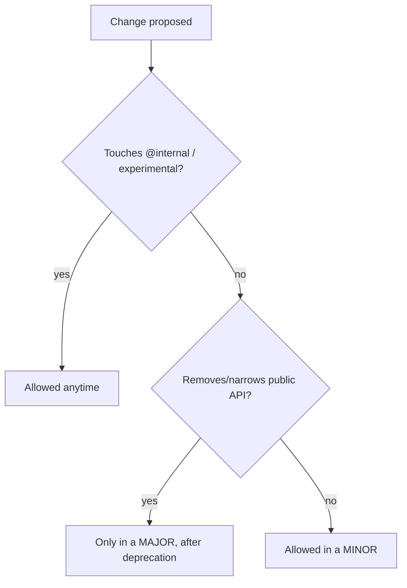

# Backward Compatibility Promise

!!! tip "In a nutshell"
    La promesse de BC garantit que le code écrit contre l'API publique stable continue
    de fonctionner à travers chaque version mineure et patch d'une même majeure. À retenir en
    priorité : les ruptures de BC ne surviennent **que dans une majeure, et seulement après
    dépréciation** — `@internal`, `@experimental` et `final` sont exclus de la promesse.

!!! example "Real-world analogy"
    Un bail de location garantit que l'appartement pour lequel vous avez signé — la porte
    d'entrée, la cuisine, les équipements convenus — reste identique pendant toute la durée
    du bail ; le propriétaire ne peut abattre un mur porteur qu'au renouvellement du bail
    (une majeure), et seulement après vous avoir donné un préavis formel (la dépréciation).
    Les pièces marquées « réservé au personnel » (`@internal`) ou « encore en construction »
    (`@experimental`) n'ont jamais fait partie de votre bail, elles peuvent donc changer du
    jour au lendemain. Et un mur estampillé « ne rien fixer » (`final`) peut être redécoré
    par le propriétaire à sa guise — y visser votre propre étagère n'a jamais été couvert.

!!! abstract "Learning objectives"
    À la fin de ce chapitre, vous saurez :

    - [ ] Énoncer ce que garantit la promesse de BC et pour combien de temps.
    - [ ] Expliquer `@internal`, `@final`/`#[\Deprecated]` et les marqueurs experimental.
    - [ ] Prédire si un changement donné constitue une rupture de BC du point de vue *utilisateur* ou *auteur*.
    - [ ] Savoir sur quel code vous pouvez vous appuyer en toute sécurité.

    **Syllabus:** `Symfony Architecture → Backward Compatibility` ·
    **Level:** Expert ·
    **Est. time:** 25 min ·
    **Prerequisites:** [Release Management](release-management.md)

---

## Theory

La **promesse de rétrocompatibilité (BC)** est le contrat de Symfony avec ses
utilisateurs : le code que vous écrivez contre une API publique et stable continuera de
fonctionner à travers **toutes les versions mineures et patchs d'une même version
majeure**. La BC ne peut être rompue que dans une version **majeure**, et uniquement pour
des API qui ont d'abord été **dépréciées**. C'est ce qui rend la
[cadence de publication](release-management.md) sûre.

## Deep Dive — how it works internally

!!! question "Predict first"
    Une version mineure ajoute une nouvelle méthode **optionnelle** à une classe Symfony
    `final` dont vous avez fait une sous-classe. Est-ce une rupture de BC, et êtes-vous
    protégé ?

??? note "Reveal"
    Ajouter une méthode optionnelle n'est **pas** une rupture pour les utilisateurs. Mais
    vous avez hérité d'une classe `final` — l'étendre n'a jamais été couvert par la
    promesse, votre surcharge peut donc casser à tout moment. Décorez plutôt.

### Two viewpoints

La promesse est rédigée selon **deux points de vue** :

- **Utiliser le code** — ce que vous pouvez faire en tant que consommateur (appeler des
  méthodes, implémenter les interfaces prévues, lire les valeurs de retour) tout en
  restant protégé.
- **Étendre le code** — hériter, surcharger, implémenter des interfaces que Symfony
  marque comme *non destinées à l'implémentation*. Davantage d'actions peuvent casser ici,
  car Symfony se réserve le droit d'ajouter des méthodes à ses propres interfaces.

La matrice complète figure dans la promesse de BC officielle ; l'examen teste
l'**esprit** : l'API publique, non-`@internal` et non expérimentale est couverte ; les
mécanismes internes ne le sont pas.

### The markers that carve out the API

| Marqueur | Signification | Couvert par la BC ? |
|---|---|---|
| (aucun) | API publique stable | ✅ Oui |
| `@internal` | Détail d'implémentation ; à ne pas utiliser | ❌ Non |
| `@final` / `final` | Non destiné à être étendu | L'étendre n'est pas protégé |
| `@experimental` | Nouveau, peut changer avant stabilisation | ❌ Non |
| `#[\Deprecated]` / `@deprecated` | Voué à être supprimé dans la prochaine majeure | Fonctionne maintenant ; supprimé plus tard |

- Les classes/méthodes **`@internal`** peuvent changer ou disparaître dans **n'importe
  quelle** version — ne vous y fiez jamais, même si elles sont `public` au sens PHP.
- **`final`** (mot-clé ou `@final`) signale que vous ne devez pas en hériter ; Symfony
  peut modifier les mécanismes internes librement. Préférez la
  **composition/décoration**.
- Les fonctionnalités **`@experimental`** (souvent des composants entiers lors de leur
  première version) sont explicitement exclues de la BC jusqu'à ce qu'elles soient
  marquées stables.

```php
/**
 * @internal — excluded from the BC promise; may change in ANY release,
 *             even though it is "public" in PHP terms
 */
class InternalHashHelper {}

// final keyword: subclassing is never BC-protected — decorate instead
final class SignedUriFactory {}

/** @final — same contract as the keyword, enforced by convention only */
class SoftFinalNormalizer {}

/**
 * @experimental — excluded from BC until the feature is marked stable
 */
class ExperimentalProfileStreamer {}
```

### What counts as a BC break

Les changements cassants sur une API couverte incluent : supprimer/renommer une méthode
publique, ajouter un paramètre obligatoire, restreindre un type de retour, changer la
valeur d'une constante, etc. **Ajouter** une nouvelle fonctionnalité optionnelle n'est
*pas* une rupture. Comme Symfony peut ajouter des méthodes à *ses* interfaces,
**implémenter vous-même une interface Symfony** n'est sûr que pour les interfaces qui ne
sont pas réservées à une implémentation interne.



!!! note "Source reference"
    La promesse est appliquée à l'échelle du dépôt ; les API internes sont annotées
    `@internal` et les `final` sont présents partout dans
    [symfony/symfony `8.0`](https://github.com/symfony/symfony/tree/8.0/src/Symfony).

### Compilation vs runtime

La promesse de BC est une garantie de **développement/publication** portant sur les API
sources. Elle n'a aucun mécanisme à l'exécution, mais l'outillage (Roave BC Check en CI,
avis de dépréciation à l'exécution — voir [Deprecations](deprecations.md)) aide à
détecter les violations.

## Configuration & code

=== "Respecting @final via decoration"

    ```php
    <?php
    declare(strict_types=1);

    namespace App\Cache;

    use Psr\Cache\CacheItemPoolInterface;

    // Do NOT subclass a @final Symfony class; wrap it instead.
    final class LoggingCache implements CacheItemPoolInterface
    {
        public function __construct(private readonly CacheItemPoolInterface $inner) {}

        public function getItem(mixed $key): \Psr\Cache\CacheItemInterface
        {
            return $this->inner->getItem($key);
        }

        // ...delegate remaining interface methods to $this->inner
    }
    ```

=== "Marking your own internals"

    ```php
    <?php
    declare(strict_types=1);

    namespace App\Internal;

    /**
     * @internal — not covered by any BC guarantee.
     */
    final class HashHelper
    {
    }
    ```

## Best practices & anti-patterns

| ✅ Do | ❌ Avoid |
|---|---|
| Ne dépendre que de l'API publique non-`@internal` | Appeler des méthodes `@internal` |
| Décorer les classes `final` | Hériter des classes `final`/`@final` |
| Traiter `@experimental` comme instable | Bâtir des chemins critiques sur du code expérimental |
| Corriger les dépréciations avant la prochaine majeure | Ignorer les avis de dépréciation |

## When (not) to use it / alternatives

La promesse vous protège *automatiquement* tant que vous restez sur l'API publique. Si
vous devez toucher à un élément interne, isolez-le derrière votre propre interface afin
qu'une rupture future reste contenue. Pour l'extension, utilisez les **events**, la
**décoration** et la **dependency injection** plutôt que l'héritage des classes du
framework.

!!! danger "Certification traps"
    - Les ruptures de BC ne sont autorisées **que dans une majeure**, et seulement après
      **dépréciation**.
    - `@internal` = **aucune** garantie de BC même si l'élément est `public` en PHP.
    - Le code `@experimental` est **exclu** de la BC jusqu'à stabilisation.
    - Ajouter une méthode à une interface Symfony n'est *pas* une rupture pour les
      **utilisateurs**, mais peut casser votre **implémentation** de celle-ci —
      n'implémentez donc que les interfaces prévues à cet effet.

!!! warning "Common mistakes"
    - Hériter d'une classe `final` du vendor et s'étonner que cela casse à la mise à jour.
    - Supposer que `public` en PHP signifie « couvert » — `@internal` prime sur cela.

## Exercises

1. **(Advanced)** Classez chaque élément comme couvert/non couvert : une méthode `public`
   sans annotation ; une méthode `@internal public` ; une classe `@experimental`.
2. **(Expert)** Vous devez modifier le comportement d'un service Symfony `final`. Quelle
   est l'approche sûre du point de vue de la BC ?

??? success "Solutions"

    **1.** Couvert / non couvert / non couvert.

    **2.** **Décorez** le service (implémentez la même interface, enveloppez l'instance
    originale injectée) ou enregistrez une **décoration** dans la dependency injection —
    n'héritez jamais de la classe `final`.

## Certification questions

??? question "Q1. When can Symfony break backward compatibility?"
    - [x] A. Only in a major release, after prior deprecation ✅
    - [ ] B. In any minor release
    - [ ] C. In patch releases

    **Why:** Les ruptures de BC sont réservées aux majeures et exigent un parcours de
    dépréciation.
    **Ref:** [BC promise](https://symfony.com/doc/current/contributing/code/bc.html).

??? question "Q2. What does `@internal` mean for BC?"
    - [x] A. The element is excluded from the BC promise ✅
    - [ ] B. It is extra-stable
    - [ ] C. It is deprecated

    **Why:** `@internal` marque des détails d'implémentation non couverts par la BC. **Ref:**
    [Coding standards / @internal](https://symfony.com/doc/current/contributing/code/bc.html).

??? question "Q3. How should you customise a `final` Symfony class?"
    - [x] A. Decorate/compose it ✅
    - [ ] B. Subclass and override
    - [ ] C. Edit it in vendor

    **Why:** `final` interdit l'héritage ; utilisez la décoration. **Ref:**
    [Service decoration](https://symfony.com/doc/current/service_container/service_decoration.html).

## Key takeaways

- L'API publique, non-`@internal` et non expérimentale est stable au sein d'une majeure.
- Ruptures de BC uniquement dans les majeures, uniquement après dépréciation.
- `@internal`, `final`/`@final`, `@experimental` créent des exceptions dans la promesse.
- Étendez via les events/la décoration/la dependency injection, pas via l'héritage des
  classes du framework.

## Last-minute revision

!!! tip "Cheat sheet"
    - Couvert : l'API publique stable au sein d'une majeure.
    - Non couvert : `@internal`, `@experimental` ; n'héritez pas de `final`.
    - Ruptures : majeure uniquement, après dépréciation.
    - Utilisateurs vs étendeurs : ceux qui étendent ont moins de garanties.

## Connections

- **Depends on:** [Release Management](release-management.md) — la promesse est ce qui rend les mises à jour mineures sûres au sein d'une majeure.
- **Reused in:** [Deprecations](deprecations.md) — le parcours de dépréciation est la manière dont l'API couverte est supprimée sans rupture surprise ; la décoration en [Dependency Injection](../dependency-injection/index.md) est l'alternative sûre à l'héritage.
- **Confused with:** [Framework Overloading](overloading.md) — surcharger les ressources d'un bundle est une personnalisation applicative, pas une affirmation sur la stabilité de l'API.

## Official References
- [Backward Compatibility promise](https://symfony.com/doc/current/contributing/code/bc.html)
- [Conventions — @internal / @final](https://symfony.com/doc/current/contributing/code/conventions.html)
- [Experimental features](https://symfony.com/doc/current/contributing/code/experimental.html)

## Video references

!!! tip "Watch & learn"
    Voici des chaînes vidéo officielles, mises à jour en continu — cherchez-y
    « Symfony architecture » pour consolider ce chapitre. Nous lions des chaînes stables
    plutôt que des vidéos individuelles afin que les références ne périment jamais.

    - [SymfonyCasts screencasts](https://symfonycasts.com/tracks/symfony) — tutoriels scénarisés à suivre en codant.
    - [Symfony official YouTube](https://www.youtube.com/@SymfonyOfficial) — conférences et keynotes SymfonyCon.
    - [Official docs for this topic](https://symfony.com/doc/current/contributing/code/bc.html) — certaines pages de la documentation Symfony intègrent un screencast.

## Confidence check

Je suis prêt quand je peux :

- [ ] expliquer **pourquoi** la promesse de BC existe et ce qu'elle garantit au sein d'une majeure
- [ ] appliquer correctement `@internal`, `final`/`@final` et `@experimental` dans mon code
- [ ] déboguer une casse à la mise à jour causée par une dépendance à une API `@internal`
- [ ] repérer que l'héritage d'une classe `final` n'est jamais protégé par la BC
- [ ] expliquer la différence de garanties entre *utilisateurs* et *étendeurs*

---

<small>Related: [Release Management](release-management.md) · [Deprecations](deprecations.md) · [Roadmap & Schedule](roadmap-schedule.md)</small>
