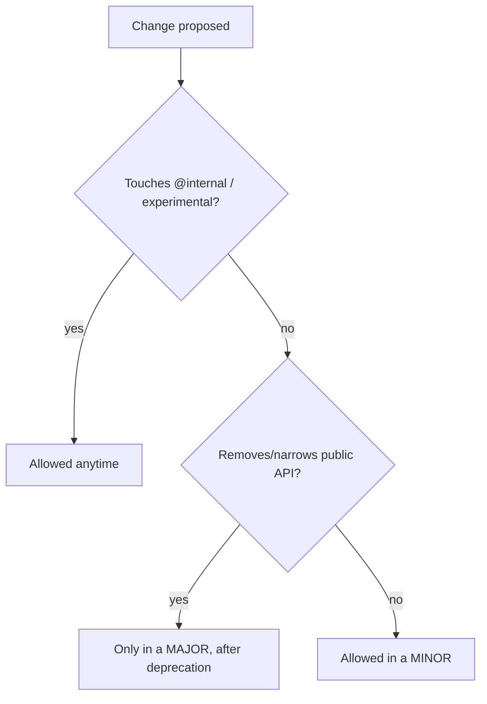

# Backward Compatibility Promise

!!! tip "In a nutshell"
    The BC promise guarantees code written against the stable public API keeps
    working across every minor and patch within a major. Highest-yield: BC breaks
    happen **only in a major, and only after deprecation** — `@internal`,
    `@experimental` and `final` sit outside the promise.

!!! example "Real-world analogy"
    A rental lease guarantees the apartment you signed for — the front door, the
    kitchen, the agreed fixtures — stays the same for the whole term; the landlord may
    only knock down a load-bearing wall when the lease renews (a major), and only after
    giving you formal notice first (deprecation). Rooms marked "staff only" (`@internal`)
    or "still being built" (`@experimental`) were never part of your lease, so they can
    change any day. And a wall stamped "do not attach anything" (`final`) can be
    redecorated by the landlord at will — bolting your own shelf to it was never covered.

!!! abstract "Learning objectives"
    By the end of this chapter you can:

    - [ ] State what the BC promise guarantees and for how long.
    - [ ] Explain `@internal`, `@final`/`#[\Deprecated]`, and experimental markers.
    - [ ] Predict whether a given change is a BC break from the *user* or *author* side.
    - [ ] Know which code you may safely rely on.

    **Syllabus:** `Symfony Architecture → Backward Compatibility` ·
    **Level:** Expert ·
    **Est. time:** 25 min ·
    **Prerequisites:** [Release Management](release-management.md)

---

## Theory

The **Backward Compatibility (BC) promise** is Symfony's contract with its users:
code you write against a stable, public API will keep working across **all minor
and patch releases within a major version**. BC may only be broken in a **major**
release, and only for APIs that were **deprecated** first. This is what makes the
[release cadence](release-management.md) safe.

## Deep Dive — how it works internally

!!! question "Predict first"
    A minor release adds a new **optional** method to a `final` Symfony class you
    have subclassed. Is that a BC break, and are you protected?

??? note "Reveal"
    Adding an optional method is **not** a break for users. But you subclassed a
    `final` class — extending it was never covered by the promise, so your override
    can break at any time. Decorate instead.

### Two viewpoints

The promise is written from **two sides**:

- **Using code** — what you may do as a consumer (call methods, implement given
  interfaces, read return values) and still be protected.
- **Extending code** — subclassing, overriding, implementing interfaces Symfony
  marks as *not for implementation*. More actions here can break because Symfony
  reserves the right to add methods to its own interfaces.

The full matrix lives in the official BC promise; the exam tests the **spirit**:
public, non-`@internal`, non-experimental API is covered; internals are not.

### The markers that carve out the API

| Marker | Meaning | Covered by BC? |
|---|---|---|
| (none) | Stable public API | ✅ Yes |
| `@internal` | Implementation detail; do not use | ❌ No |
| `@final` / `final` | Not meant to be extended | Extending it isn't protected |
| `@experimental` | New, may change before stabilising | ❌ No |
| `#[\Deprecated]` / `@deprecated` | Slated for removal in next major | Works now; removed later |

- **`@internal`** classes/methods can change or vanish in **any** release — never
  depend on them, even if `public` in PHP terms.
- **`final`** (keyword or `@final`) signals you must not subclass; Symfony may
  change internals freely. Prefer **composition/decoration** instead.
- **`@experimental`** features (often whole components in their first release) are
  explicitly excluded from BC until marked stable.

```php
/**
 * @internal — excluded from the BC promise; may change in ANY release,
 *             even though it is "public" in PHP terms
 */
class InternalHashHelper {}

// final keyword: subclassing is never BC-protected — decorate instead
final class SignedUriFactory {}

/** @final — same contract as the keyword, enforced by convention only */
class SoftFinalNormalizer {}

/**
 * @experimental — excluded from BC until the feature is marked stable
 */
class ExperimentalProfileStreamer {}
```

### What counts as a BC break

Breaking changes to covered API include: removing/renaming a public method,
adding a required parameter, narrowing a return type, changing a constant's value,
etc. **Adding** a new optional feature is *not* a break. Because Symfony can add
methods to *its* interfaces, **implementing a Symfony interface** yourself is only
safe for interfaces not reserved for internal implementation.



!!! note "Source reference"
    The promise is enforced repo-wide; internal APIs are annotated `@internal` and
    finals throughout
    [symfony/symfony `8.0`](https://github.com/symfony/symfony/tree/8.0/src/Symfony).

### Compilation vs runtime

The BC promise is a **development/release-time** guarantee about source APIs. It has
no runtime mechanism, but tooling (Roave BC Check in CI, deprecation notices at
runtime — see [Deprecations](deprecations.md)) helps detect violations.

## Configuration & code

=== "Respecting @final via decoration"

    ```php
    <?php
    declare(strict_types=1);

    namespace App\Cache;

    use Psr\Cache\CacheItemPoolInterface;

    // Do NOT subclass a @final Symfony class; wrap it instead.
    final class LoggingCache implements CacheItemPoolInterface
    {
        public function __construct(private readonly CacheItemPoolInterface $inner) {}

        public function getItem(mixed $key): \Psr\Cache\CacheItemInterface
        {
            return $this->inner->getItem($key);
        }

        // ...delegate remaining interface methods to $this->inner
    }
    ```

=== "Marking your own internals"

    ```php
    <?php
    declare(strict_types=1);

    namespace App\Internal;

    /**
     * @internal — not covered by any BC guarantee.
     */
    final class HashHelper
    {
    }
    ```

## Best practices & anti-patterns

| ✅ Do | ❌ Avoid |
|---|---|
| Depend only on public, non-`@internal` API | Calling `@internal` methods |
| Decorate `final` classes | Subclassing `final`/`@final` classes |
| Treat `@experimental` as unstable | Building critical paths on experimental code |
| Fix deprecations before the next major | Ignoring deprecation notices |

## When (not) to use it / alternatives

The promise protects you *automatically* when you stay on public API. If you must
touch an internal, isolate it behind your own interface so a future break is
contained. For extension, use **events**, **decoration** and **DI** rather than
inheritance of framework classes.

!!! danger "Certification traps"
    - BC breaks are allowed **only in a major**, and only after **deprecation**.
    - `@internal` = **no** BC guarantee even though PHP-`public`.
    - `@experimental` code is **excluded** from BC until stabilised.
    - Adding a method to a Symfony interface is *not* a break for **users**, but can
      break your **implementation** of it — so implement only interfaces meant for it.

!!! warning "Common mistakes"
    - Subclassing a `final` class in vendor and being surprised it breaks on upgrade.
    - Assuming `public` in PHP means "covered" — `@internal` overrides that.

## Exercises

1. **(Advanced)** Classify each as covered/uncovered: a `public` method with no
   annotation; a `@internal public` method; an `@experimental` class.
2. **(Expert)** You need to change a `final` Symfony service's behaviour. What is the
   BC-safe approach?

??? success "Solutions"

    **1.** Covered / uncovered / uncovered.

    **2.** **Decorate** the service (implement the same interface, wrap the original
    injected instance) or register a **decoration** in DI — never subclass the
    `final` class.

## Certification questions

??? question "Q1. When can Symfony break backward compatibility?"
    - [x] A. Only in a major release, after prior deprecation ✅
    - [ ] B. In any minor release
    - [ ] C. In patch releases

    **Why:** BC breaks are reserved for majors and require a deprecation path.
    **Ref:** [BC promise](https://symfony.com/doc/current/contributing/code/bc.html).

??? question "Q2. What does `@internal` mean for BC?"
    - [x] A. The element is excluded from the BC promise ✅
    - [ ] B. It is extra-stable
    - [ ] C. It is deprecated

    **Why:** `@internal` marks implementation details not covered by BC. **Ref:**
    [Coding standards / @internal](https://symfony.com/doc/current/contributing/code/bc.html).

??? question "Q3. How should you customise a `final` Symfony class?"
    - [x] A. Decorate/compose it ✅
    - [ ] B. Subclass and override
    - [ ] C. Edit it in vendor

    **Why:** `final` forbids inheritance; use decoration. **Ref:**
    [Service decoration](https://symfony.com/doc/current/service_container/service_decoration.html).

## Key takeaways

- Public, non-`@internal`, non-experimental API is stable within a major.
- BC breaks only in majors, only after deprecation.
- `@internal`, `final`/`@final`, `@experimental` carve exceptions out of the promise.
- Extend via events/decoration/DI, not inheritance of framework classes.

## Last-minute revision

!!! tip "Cheat sheet"
    - Covered: stable public API within a major.
    - Not covered: `@internal`, `@experimental`; don't subclass `final`.
    - Breaks: major only, post-deprecation.
    - Users vs extenders: extenders have fewer guarantees.

## Connections

- **Depends on:** [Release Management](release-management.md) — the promise is what makes minor upgrades safe within a major.
- **Reused in:** [Deprecations](deprecations.md) — the deprecation path is how covered API is removed without a surprise break; [Dependency Injection](../dependency-injection/index.md) decoration is the BC-safe alternative to subclassing.
- **Confused with:** [Framework Overloading](overloading.md) — overriding a bundle's resources is app-level customisation, not a statement about API stability.

## Official References
- [Backward Compatibility promise](https://symfony.com/doc/current/contributing/code/bc.html)
- [Conventions — @internal / @final](https://symfony.com/doc/current/contributing/code/conventions.html)
- [Experimental features](https://symfony.com/doc/current/contributing/code/experimental.html)

## Video references

!!! tip "Watch & learn"
    These are official, continuously-updated video channels — search them for
    "Symfony architecture" to reinforce this chapter. We link stable channels rather than
    individual videos so the references never rot.

    - [SymfonyCasts screencasts](https://symfonycasts.com/tracks/symfony) — scripted, code-along tutorials.
    - [Symfony official YouTube](https://www.youtube.com/@SymfonyOfficial) — SymfonyCon conference talks & keynotes.
    - [Official docs for this topic](https://symfony.com/doc/current/contributing/code/bc.html) — some Symfony doc pages embed a screencast.

## Confidence check

I'm ready when I can:

- [ ] explain **why** the BC promise exists and what it guarantees within a major
- [ ] apply `@internal`, `final`/`@final` and `@experimental` correctly in my code
- [ ] debug an upgrade break caused by relying on `@internal` API
- [ ] spot that subclassing a `final` class is never BC-protected
- [ ] explain the difference in guarantees for *users* vs *extenders*

---

<small>Related: [Release Management](release-management.md) · [Deprecations](deprecations.md) · [Roadmap & Schedule](roadmap-schedule.md)</small>
