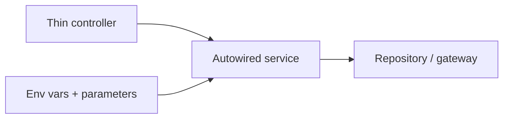

# Official Best Practices

!!! tip "In a nutshell"
    Les Best Practices officielles de Symfony sont les conventions pragmatiques que
    l'examen attend de vous : les connaître et les justifier. À retenir en priorité : la
    logique métier va dans des **services privés et autowirés** (controllers minces), le
    routing et la validation utilisent les **attributs**, et les secrets vivent dans le
    vault.

!!! example "Real-world analogy"
    Pensez à un restaurant bien tenu. Le serveur (le controller) ne fait que prendre votre
    commande et apporter l'assiette terminée — il ne cuisine jamais ; la vraie cuisine se
    fait à des postes spécialisés (les services autowirés) qui partagent les mêmes plans de
    travail et ingrédients (le container). C'est le fait de garder le serveur « mince » qui
    permet à la cuisine de servir de nombreuses tables à la fois. La recette de la sauce
    secrète reste enfermée dans le coffre du bureau (le vault des Secrets) plutôt
    qu'imprimée sur le menu, et chaque poste a un emplacement fixe et étiqueté (les
    attributs et les conventions) pour que chacun le trouve instantanément.

!!! abstract "Learning objectives"
    À la fin de ce chapitre, vous saurez :

    - [ ] Restituer les best practices officielles de Symfony pour la structure du projet, la config, les controllers, les services, les templates et la sécurité.
    - [ ] Justifier chaque pratique au regard de l'architecture du framework.
    - [ ] Repérer les violations lors d'une revue de code.

    **Syllabus:** `Symfony Architecture → Official Best Practices` ·
    **Level:** Advanced ·
    **Est. time:** 25 min ·
    **Prerequisites:** [Code Organization](code-organization.md), [Dependency Injection](../dependency-injection/index.md)

---

## Pour les nuls

### L'idée en une phrase
Les bonnes pratiques Symfony disent, en substance : "garde tes contrôleurs fins, mets ta logique dans des services, et range chaque type de config à sa place."

### Imagine dans la vraie vie
Dans un restaurant bien tenu, le serveur (le contrôleur) prend seulement la commande et rapporte l'assiette finie — il ne cuisine jamais lui-même ; la cuisine se fait à des postes spécialisés (les services) qui partagent le même plan de travail (le container). Garder le serveur "léger" est ce qui permet de servir plusieurs tables à la fois.

### Dans Symfony
Un contrôleur qui interroge directement la base de données et formate du HTML à la main viole deux règles à la fois — la logique devrait vivre dans un service autowiré et injectable, testable indépendamment du contrôleur.

### Exemple simple
```php
// ❌ logique dans le contrôleur
public function show(): Response { $data = $this->db->query('SELECT ...'); ... }

// ✅ logique déléguée à un service
public function show(ProductFinder $finder): Response { return $this->render('...', ['p' => $finder->find()]); }
```

### Comment le mémoriser 🧠
"Le serveur ne cuisine jamais" : un contrôleur qui contient de la logique métier est le signal d'alarme numéro un à repérer en review de code.


## Theory

Symfony publie un guide officiel de **Best Practices** : des conventions pragmatiques
qui gardent les applications idiomatiques, testables et faciles à mettre à jour. Ce sont
des *recommandations*, calibrées pour des applications web classiques — pas des lois —
mais la certification attend de vous que vous les connaissiez, ainsi que le *pourquoi*
de leur existence.

## Deep Dive — how it works internally

!!! question "Predict first"
    Un développeur junior marque chaque service `public: true` « par sécurité » et
    interroge la base de données directement dans une action de controller. Quelles sont
    les deux best practices enfreintes, et que cela coûte-t-il ?

??? note "Reveal"
    La logique métier appartient à un **service autowiré**, pas au controller ; et les
    services applicatifs doivent être **privés** par défaut. Les services publics
    empêchent le compilateur de la dependency injection d'inliner/supprimer et invitent
    l'anti-pattern du service locator.

### The practices, grouped

| Domaine | Best practice |
|---|---|
| **Projet** | Utiliser le squelette par défaut ; une application par dépôt ; placer les binaires dans `bin/` |
| **Config** | Config d'infra → variables d'environnement ; secrets → le vault des Secrets ; comportement de l'app → paramètres |
| **Config** | Utiliser un préfixe `APP_` et des processeurs de variables d'environnement typés (`%env(int:...)%`) |
| **Logique métier** | La garder dans des **services autowirés et privés**, pas dans les controllers |
| **Controllers** | Étendre `AbstractController`, les garder minces, une action par méthode |
| **Routing** | Utiliser les **attributs PHP** (`#[Route]`) sur les controllers |
| **Templates** | `templates/`, noms en snake_case, préférer Twig aux templates PHP |
| **Forms** | Construire les forms dans des classes `FormType` dédiées |
| **Validation** | Placer les constraints sur l'entité/le DTO via des attributs |
| **Sécurité** | Hacher les mots de passe via le hasher ; un seul firewall si possible ; utiliser les voters pour les règles complexes |
| **Tests** | Au minimum, un smoke test pour chaque URL publique ; des tests fonctionnels pour les chemins critiques |

### Why these fall out of the architecture

- **Des services plutôt que des controllers obèses** — le [container](../dependency-injection/index.md)
  autowire les dépendances ; des controllers minces gardent la logique réutilisable et
  testable unitairement.
- **Des attributs pour le routing/la config** — cela co-localise la configuration avec le
  code et c'est le défaut de Symfony 8 ; le router les compile dans le matcher mis en
  cache.
- **Des variables d'environnement pour l'infra** — les *processeurs* de variables
  d'environnement se résolvent à la construction du container ou à l'exécution, si bien
  que le même container compilé tourne dans chaque environnement.
- **Des services privés et autowirés** — le compilateur supprime les services privés
  inutilisés et les inline ; les services `public` bloquent l'optimisation et invitent
  l'anti-pattern du service locator.



!!! note "Source reference"
    Guide des Best Practices —
    [symfony.com/doc/8.0/best_practices.html](https://symfony.com/doc/8.0/best_practices.html).

### Compilation vs runtime angle

Beaucoup de pratiques existent pour garder le **container compilé** léger : services
privés, autowiring et injection par constructeur permettent au compilateur de la
dependency injection d'optimiser et d'inliner. Récupérer depuis le container à
l'exécution (le service location) annule cela et est déconseillé en dehors de quelques
patterns.

## Configuration & code

=== "PHP Attributes (idiomatic controller)"

    ```php
    <?php
    declare(strict_types=1);

    namespace App\Controller;

    use App\Service\InvoiceGenerator;
    use Symfony\Bundle\FrameworkBundle\Controller\AbstractController;
    use Symfony\Component\HttpFoundation\Response;
    use Symfony\Component\Routing\Attribute\Route;

    final class InvoiceController extends AbstractController
    {
        #[Route('/invoices/{id}', name: 'invoice_show')]
        public function show(int $id, InvoiceGenerator $generator): Response
        {
            // Business logic lives in the service, not here.
            return $this->render('invoice/show.html.twig', [
                'pdf' => $generator->render($id),
            ]);
        }
    }
    ```

=== "YAML (autowire defaults)"

    ```yaml
    # config/services.yaml
    services:
        _defaults:
            autowire: true
            autoconfigure: true
            public: false
        App\:
            resource: '../src/'
    ```

=== "Env var with processor"

    ```yaml
    # config/packages/framework.yaml
    parameters:
        app.page_size: '%env(int:APP_PAGE_SIZE)%'
    ```

## Best practices & anti-patterns

| ✅ Do | ❌ Avoid |
|---|---|
| Controllers minces, logique dans les services | Logique métier dans les controllers |
| Autowiring + services privés | Services publics / `get()` manuel |
| Attributs pour le routing et la validation | Du YAML/XML éparpillé pour tout |
| Variables d'environnement pour l'infra, vault des secrets pour le sensible | Committer des secrets dans la config |
| Smoke test des URL publiques | Livrer des routes non testées |

## When (not) to use it / alternatives

Les best practices visent les applications web classiques. Les bibliothèques et les
bundles ont leurs **propres** conventions (par exemple une configuration de services
plus explicite pour être partageable). Ne vous en écartez qu'avec une raison claire, et
documentez-la.

!!! danger "Certification traps"
    - La logique métier appartient aux **services**, pas aux controllers.
    - Les services doivent être **privés et autowirés** par défaut.
    - Les secrets vont dans le **vault des Secrets**, l'infra dans les **variables
      d'environnement**, le comportement dans les **paramètres** — ne les mélangez pas.
    - Préférez les **attributs** pour le routing/la validation en Symfony 8.

!!! warning "Common mistakes"
    - Rendre les services `public` « par sécurité » — cela bloque l'optimisation du
      container.
    - Placer des valeurs propres à un environnement dans des paramètres codés en dur au
      lieu de variables d'environnement.

## Exercises

1. **(Advanced)** Refactorisez un controller qui interroge et formate des données en
   ligne afin que la logique vive dans un service.
2. **(Expert)** Décidez où va chaque élément : une URL de base de données, un feature
   toggle, une clé privée d'API.

??? success "Solutions"

    **1.** Extrayez le code de requête/formatage dans un service autowiré ; injectez-le
    comme argument de controller ; l'action se contente de l'appeler et de faire le rendu.

    **2.** URL de base de données → **variable d'environnement** ; feature toggle →
    **paramètre** (ou variable d'environnement si elle varie selon l'environnement) ; clé
    privée d'API → **vault des Secrets**.

## Certification questions

??? question "Q1. Where should business logic live?"
    - [x] A. In autowired services ✅
    - [ ] B. In controllers
    - [ ] C. In Twig templates

    **Why:** Des controllers minces délèguent aux services pour la réutilisation et la
    testabilité.
    **Ref:** [Best practices](https://symfony.com/doc/8.0/best_practices.html).

??? question "Q2. What visibility should app services have by default?"
    - [x] A. Private ✅
    - [ ] B. Public
    - [ ] C. Protected

    **Why:** Les services privés permettent l'optimisation de la dependency injection et
    découragent le service location.
    **Ref:** [Service container](https://symfony.com/doc/8.0/service_container.html).

??? question "Q3. Where do sensitive credentials belong?"
    - [x] A. The Secrets vault ✅
    - [ ] B. `config/services.yaml`
    - [ ] C. Hard-coded parameters

    **Why:** Les secrets doivent utiliser le vault, pas une config committée. **Ref:**
    [Secrets](https://symfony.com/doc/8.0/configuration/secrets.html).

## Key takeaways

- Controllers minces ; logique métier dans des services privés et autowirés.
- Attributs pour le routing/la validation ; variables d'environnement/secrets pour la config.
- Ces pratiques existent pour garder le container compilé léger et l'application testable.
- Ce sont des recommandations pour les applications — les bundles ont leurs propres conventions.

## Last-minute revision

!!! tip "Cheat sheet"
    - Logique → services (privés, autowirés).
    - Routing/validation → attributs.
    - Infra → variables d'environnement · secrets → vault · comportement → paramètres.
    - Smoke test de chaque URL publique.

## Connections

- **Depends on:** [Dependency Injection](../dependency-injection/index.md) — controllers minces plus services privés autowirés sont ce qui permet au compilateur d'optimiser ; [Code Organization](code-organization.md) fixe l'emplacement de chaque fichier.
- **Reused in:** [Controllers](../controllers/index.md) — la règle du « controller mince » façonne chaque action que vous écrivez.
- **Confused with:** [Naming Conventions](naming-conventions.md) — les conventions sont des règles mécaniques ; les best practices sont le *pourquoi* des applications idiomatiques.

## Official References
- [Official Symfony Best Practices](https://symfony.com/doc/8.0/best_practices.html)
- [Service container](https://symfony.com/doc/8.0/service_container.html)
- [Secrets management](https://symfony.com/doc/8.0/configuration/secrets.html)

## Video references

!!! tip "Watch & learn"
    Voici des chaînes vidéo officielles, mises à jour en continu — cherchez-y
    « Symfony architecture » pour consolider ce chapitre. Nous lions des chaînes stables
    plutôt que des vidéos individuelles afin que les références ne périment jamais.

    - [SymfonyCasts screencasts](https://symfonycasts.com/tracks/symfony) — tutoriels scénarisés à suivre en codant.
    - [Symfony official YouTube](https://www.youtube.com/@SymfonyOfficial) — conférences et keynotes SymfonyCon.
    - [Official docs for this topic](https://symfony.com/doc/8.0/best_practices.html) — certaines pages de la documentation Symfony intègrent un screencast.

## Confidence check

Je suis prêt quand je peux :

- [ ] expliquer **pourquoi** chaque best practice découle de l'architecture de Symfony
- [ ] implémenter un controller mince qui délègue à un service privé et autowiré
- [ ] déboguer une odeur de service location introduite en rendant les services publics
- [ ] repérer où appartient une valeur : variable d'environnement vs paramètre vs vault des secrets
- [ ] justifier les attributs pour le routing/la validation lors d'une revue de code

---

<small>Related: [Code Organization](code-organization.md) · [Naming Conventions](naming-conventions.md) · [Dependency Injection](../dependency-injection/index.md)</small>
