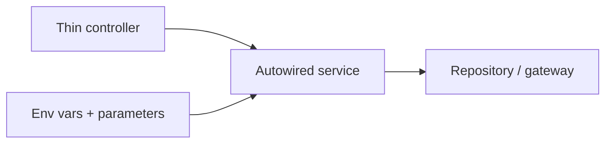

# Official Best Practices

!!! tip "In a nutshell"
    Symfony's official Best Practices are the pragmatic conventions the exam expects
    you to know and justify. Highest-yield: business logic goes in **private,
    autowired services** (thin controllers), routing/validation use **attributes**,
    and secrets live in the vault.

!!! example "Real-world analogy"
    Think of a well-run restaurant. The waiter (the controller) only takes your order
    and carries the finished plate out — they never cook; the actual cooking happens at
    specialised stations (autowired services) that share the same prep counters and
    ingredients (the container). Keeping the waiter "thin" is what lets the kitchen serve
    many tables at once. The secret sauce recipe stays locked in the office safe (the
    Secrets vault) rather than printed on the menu, and every station has a fixed,
    labelled spot (attributes and conventions) so anyone can find it instantly.

!!! abstract "Learning objectives"
    By the end of this chapter you can:

    - [ ] Recall the official Symfony best practices for project structure, config, controllers, services, templates and security.
    - [ ] Justify each practice in terms of the framework's architecture.
    - [ ] Spot violations in a code review.

    **Syllabus:** `Symfony Architecture → Official Best Practices` ·
    **Level:** Advanced ·
    **Est. time:** 25 min ·
    **Prerequisites:** [Code Organization](code-organization.md), [Dependency Injection](../dependency-injection/index.md)

---

## Theory

Symfony publishes an official **Best Practices** guide: pragmatic conventions that
keep apps idiomatic, testable and upgradeable. They are *recommendations*, tuned for
typical web apps — not laws — but the certification expects you to know them and
*why* they exist.

## Deep Dive — how it works internally

!!! question "Predict first"
    A junior marks every service `public: true` "to be safe" and queries the
    database directly inside a controller action. Which two best practices did they
    break, and what does it cost?

??? note "Reveal"
    Business logic belongs in an **autowired service**, not the controller; and app
    services should be **private** by default. Public services block the DI
    compiler's inlining/removal and invite the service-locator anti-pattern.

### The practices, grouped

| Area | Best practice |
|---|---|
| **Project** | Use the default skeleton; one app per repo; put binaries in `bin/` |
| **Config** | Infra config → env vars; secrets → the Secrets vault; app behaviour → parameters |
| **Config** | Use a `APP_` prefix and typed env var processors (`%env(int:...)%`) |
| **Business logic** | Keep it in **autowired, private services**, not controllers |
| **Controllers** | Extend `AbstractController`, keep them thin, one action per method |
| **Routing** | Use **PHP attributes** (`#[Route]`) on controllers |
| **Templates** | `templates/`, snake_case names, prefer Twig over PHP templates |
| **Forms** | Build forms in dedicated `FormType` classes |
| **Validation** | Put constraints on the entity/DTO via attributes |
| **Security** | Hash passwords via the hasher; one firewall where possible; use voters for complex rules |
| **Tests** | At least smoke-test every public URL; functional tests for critical paths |

### Why these fall out of the architecture

- **Services over fat controllers** — the [container](../dependency-injection/index.md)
  autowires dependencies; thin controllers keep logic reusable and unit-testable.
- **Attributes for routing/config** — co-locates configuration with code and is the
  Symfony 8 default; the router compiles them into the cached matcher.
- **Env vars for infra** — env var *processors* resolve at container build/runtime,
  so the same compiled container runs in every environment.
- **Private, autowired services** — the compiler removes unused private services and
  inlines them; `public` services block optimisation and invite the service locator
  anti-pattern.



!!! note "Source reference"
    Best Practices guide —
    [symfony.com/doc/8.0/best_practices.html](https://symfony.com/doc/8.0/best_practices.html).

### Compilation vs runtime angle

Many practices exist to keep the **compiled container** lean: private services,
autowiring, and constructor injection let the DI compiler optimise and inline.
Fetching from the container at runtime (service location) defeats this and is
discouraged outside a few patterns.

## Configuration & code

=== "PHP Attributes (idiomatic controller)"

    ```php
    <?php
    declare(strict_types=1);

    namespace App\Controller;

    use App\Service\InvoiceGenerator;
    use Symfony\Bundle\FrameworkBundle\Controller\AbstractController;
    use Symfony\Component\HttpFoundation\Response;
    use Symfony\Component\Routing\Attribute\Route;

    final class InvoiceController extends AbstractController
    {
        #[Route('/invoices/{id}', name: 'invoice_show')]
        public function show(int $id, InvoiceGenerator $generator): Response
        {
            // Business logic lives in the service, not here.
            return $this->render('invoice/show.html.twig', [
                'pdf' => $generator->render($id),
            ]);
        }
    }
    ```

=== "YAML (autowire defaults)"

    ```yaml
    # config/services.yaml
    services:
        _defaults:
            autowire: true
            autoconfigure: true
            public: false
        App\:
            resource: '../src/'
    ```

=== "Env var with processor"

    ```yaml
    # config/packages/framework.yaml
    parameters:
        app.page_size: '%env(int:APP_PAGE_SIZE)%'
    ```

## Best practices & anti-patterns

| ✅ Do | ❌ Avoid |
|---|---|
| Thin controllers, logic in services | Business logic inside controllers |
| Autowire + private services | Public services / manual `get()` |
| Attributes for routing & validation | Scattered YAML/XML for everything |
| Env vars for infra, secrets vault for sensitive | Committing secrets to config |
| Smoke-test public URLs | Shipping untested routes |

## When (not) to use it / alternatives

Best practices target typical web apps. Libraries and bundles have their **own**
conventions (e.g. more explicit service config for shareability). Deviate only with a
clear reason, and document it.

!!! danger "Certification traps"
    - Business logic belongs in **services**, not controllers.
    - Services should be **private and autowired** by default.
    - Secrets go in the **Secrets vault**, infra in **env vars**, behaviour in **parameters** — don't mix them up.
    - Prefer **attributes** for routing/validation in Symfony 8.

!!! warning "Common mistakes"
    - Making services `public` "to be safe" — it blocks container optimisation.
    - Putting environment-specific values as hard-coded parameters instead of env vars.

## Exercises

1. **(Advanced)** Refactor a controller that queries and formats data inline so the
   logic lives in a service.
2. **(Expert)** Decide where each belongs: a database URL, a feature toggle, an API
   private key.

??? success "Solutions"

    **1.** Extract the query/format code into an autowired service; inject it as a
    controller argument; the action just calls it and renders.

    **2.** Database URL → **env var**; feature toggle → **parameter** (or env var if
    it varies per environment); API private key → **Secrets vault**.

## Certification questions

??? question "Q1. Where should business logic live?"
    - [x] A. In autowired services ✅
    - [ ] B. In controllers
    - [ ] C. In Twig templates

    **Why:** Thin controllers delegate to services for reuse and testability.
    **Ref:** [Best practices](https://symfony.com/doc/8.0/best_practices.html).

??? question "Q2. What visibility should app services have by default?"
    - [x] A. Private ✅
    - [ ] B. Public
    - [ ] C. Protected

    **Why:** Private services enable DI optimisation and discourage service location.
    **Ref:** [Service container](https://symfony.com/doc/8.0/service_container.html).

??? question "Q3. Where do sensitive credentials belong?"
    - [x] A. The Secrets vault ✅
    - [ ] B. `config/services.yaml`
    - [ ] C. Hard-coded parameters

    **Why:** Secrets should use the vault, not committed config. **Ref:**
    [Secrets](https://symfony.com/doc/8.0/configuration/secrets.html).

## Key takeaways

- Thin controllers; business logic in private, autowired services.
- Attributes for routing/validation; env vars/secrets for config.
- Practices exist to keep the compiled container lean and the app testable.
- They're recommendations for apps — bundles have their own conventions.

## Last-minute revision

!!! tip "Cheat sheet"
    - Logic → services (private, autowired).
    - Routing/validation → attributes.
    - Infra → env vars · secrets → vault · behaviour → parameters.
    - Smoke-test every public URL.

## Connections

- **Depends on:** [Dependency Injection](../dependency-injection/index.md) — thin controllers plus private autowired services are what let the compiler optimise; [Code Organization](code-organization.md) sets where each file lives.
- **Reused in:** [Controllers](../controllers/index.md) — the "thin controller" rule shapes every action you write.
- **Confused with:** [Naming Conventions](naming-conventions.md) — conventions are mechanical rules; best practices are the *why* behind idiomatic apps.

## Official References
- [Official Symfony Best Practices](https://symfony.com/doc/8.0/best_practices.html)
- [Service container](https://symfony.com/doc/8.0/service_container.html)
- [Secrets management](https://symfony.com/doc/8.0/configuration/secrets.html)

## Video references

!!! tip "Watch & learn"
    These are official, continuously-updated video channels — search them for
    "Symfony architecture" to reinforce this chapter. We link stable channels rather than
    individual videos so the references never rot.

    - [SymfonyCasts screencasts](https://symfonycasts.com/tracks/symfony) — scripted, code-along tutorials.
    - [Symfony official YouTube](https://www.youtube.com/@SymfonyOfficial) — SymfonyCon conference talks & keynotes.
    - [Official docs for this topic](https://symfony.com/doc/8.0/best_practices.html) — some Symfony doc pages embed a screencast.

## Confidence check

I'm ready when I can:

- [ ] explain **why** each best practice falls out of Symfony's architecture
- [ ] implement a thin controller delegating to a private, autowired service
- [ ] debug a service-location smell introduced by making services public
- [ ] spot where a value belongs: env var vs parameter vs secrets vault
- [ ] justify attributes for routing/validation in a code review

---

<small>Related: [Code Organization](code-organization.md) · [Naming Conventions](naming-conventions.md) · [Dependency Injection](../dependency-injection/index.md)</small>
