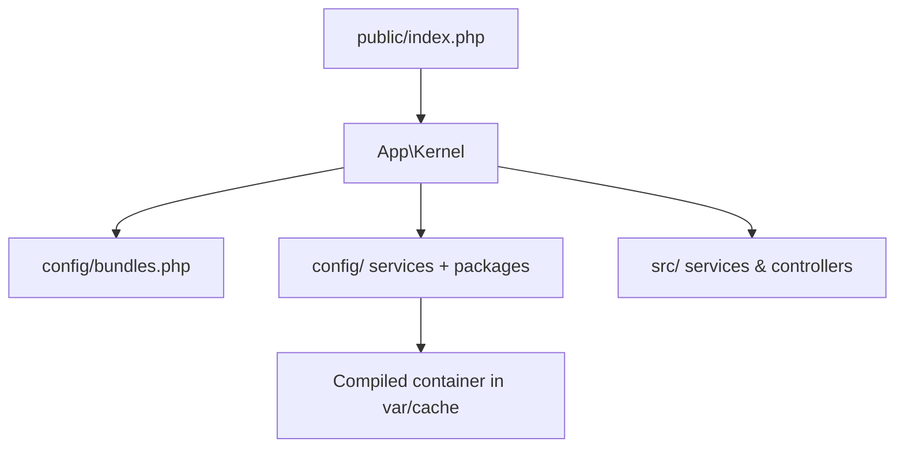

# Code Organization

!!! tip "In a nutshell"
    Une application Symfony suit une arborescence conventionnelle afin que les outils,
    les recipes et les développeurs sachent où tout se trouve. À retenir en priorité :
    `public/` est l'unique racine web (`public/index.php`), les bundles sont activés
    dans `config/bundles.php`, et `App\Kernel` reste minuscule grâce à
    `MicroKernelTrait`.

!!! example "Real-world analogy"
    La structure du squelette est un **atelier bien rangé** : chaque outil a son
    tiroir étiqueté, si bien que n'importe quel développeur — ou outil, ou recipe
    Flex — sait où le trouver sans demander. `public/` est le comptoir que voient les
    clients, `src/` est l'établi, `var/` est le bac à copeaux que l'on vide
    régulièrement, et `config/` est le classeur d'instructions. `App\Kernel` est le
    chef d'atelier qui connaît déjà toute la disposition par cœur.

!!! abstract "Learning objectives"
    À la fin de ce chapitre, vous saurez :

    - [ ] Décrire chaque répertoire de premier niveau du squelette standard d'application.
    - [ ] Expliquer la structure moderne des répertoires d'un bundle et `Kernel`/`MicroKernelTrait`.
    - [ ] Placer un nouveau controller, un template, un fichier de configuration et un asset au bon endroit.
    - [ ] Distinguer la configuration applicative (`config/`) de la configuration fournie par un bundle.

    **Syllabus:** `Symfony Architecture → Code Organization` ·
    **Level:** Advanced ·
    **Est. time:** 25 min ·
    **Prerequisites:** [Flex](flex.md)

---

## Theory

Une application Symfony suit une **organisation conventionnelle** afin que les
outils, les recipes et les autres développeurs sachent où se trouvent les choses. Le
squelette créé par `symfony new` / `composer create-project symfony/skeleton` vous
donne une arborescence réduite et prévisible. Les conventions sont fortes mais pas
magiques — elles sont câblées par le `Kernel` et Flex.

```console
# Both commands create the same conventional skeleton tree
$ symfony new my_app
$ composer create-project symfony/skeleton my_app

# The conventions are wired by src/Kernel.php (the Kernel class) and Flex
$ ls my_app/
bin/  config/  public/  src/  var/  vendor/  composer.json  symfony.lock
```

## Deep Dive — how it works internally

!!! question "Predict first"
    Votre `App\Kernel` de squelette est quasiment vide — pas de corps pour
    `registerBundles()`. Comment Symfony sait-il malgré tout quels bundles charger et
    où se trouve la configuration ?

??? note "Reveal"
    `MicroKernelTrait` fournit `registerBundles()` (qui lit `config/bundles.php`) et
    `registerContainerConfiguration()` (qui charge `config/packages/*` et
    `services.yaml`). C'est grâce à ce trait que la classe n'a presque besoin
    d'aucun code.

### The application skeleton

| Path | Purpose |
|---|---|
| `bin/console` | Point d'entrée CLI (`Application` + vos commandes) |
| `config/` | Configuration de l'application (voir ci-dessous) |
| `public/` | Racine web ; `public/index.php` est le seul front controller |
| `src/` | Votre PHP : `Kernel.php`, `Controller/`, `Entity/`, services |
| `templates/` | Templates Twig |
| `translations/` | Catalogues de traduction |
| `var/` | Généré : `var/cache/`, `var/log/` (ignoré par git) |
| `vendor/` | Dépendances Composer (ignoré par git) |
| `tests/` | Tests automatisés |
| `.env` | Variables d'environnement par défaut |
| `composer.json`, `symfony.lock` | Dépendances + état des recipes |

### Inside `config/`

| Path | Purpose |
|---|---|
| `config/services.yaml` | Vos définitions de services + valeurs par défaut (autowire/autoconfigure) |
| `config/bundles.php` | Carte bundle → environnement (gérée par [Flex](flex.md)) |
| `config/packages/` | Configuration par bundle, p. ex. `framework.yaml` |
| `config/packages/<env>/` | Surcharges spécifiques à un environnement |
| `config/routes/` + `config/routes.yaml` | Imports/définitions de routes |

### The Kernel and MicroKernelTrait

`App\Kernel` étend `Symfony\Component\HttpKernel\Kernel` et utilise
`Symfony\Bundle\FrameworkBundle\Kernel\MicroKernelTrait`. Ce trait implémente
`registerBundles()` (qui lit `config/bundles.php`) et
`registerContainerConfiguration()` (qui charge `config/{packages}/*` et
`config/services.yaml`), ainsi que les conventions de `getProjectDir()`. C'est
pourquoi le `Kernel` d'un squelette moderne est presque vide.

```php
<?php
// src/Kernel.php
declare(strict_types=1);

namespace App;

use Symfony\Bundle\FrameworkBundle\Kernel\MicroKernelTrait;
use Symfony\Component\HttpKernel\Kernel as BaseKernel;

final class Kernel extends BaseKernel
{
    use MicroKernelTrait;
}
```

### Bundle structure (modern)

Un bundle moderne utilise la **nouvelle** disposition de répertoires et étend
souvent `Symfony\Component\HttpKernel\Bundle\AbstractBundle` :

| Path | Purpose |
|---|---|
| `src/` | Le PHP du bundle, y compris la classe `*Bundle` |
| `config/` | Services/configuration fournis par le bundle |
| `templates/` | Templates du bundle |
| `translations/` | Traductions du bundle |
| `public/` | Assets web du bundle |
| `tests/` | Tests du bundle |

`Bundle::build(ContainerBuilder $container)` permet à un bundle d'ajouter des
compiler passes ; `getContainerExtension()` expose son extension de configuration.
`AbstractBundle::configure()` / `loadExtension()` offrent une API de configuration
plus simple. L'**héritage** de bundles (`getParent()`) a été supprimé dans
Symfony 5 ; surchargez plutôt le comportement via
[Framework Overloading](overloading.md).

```php
// src/AcmeBlogBundle.php — a modern bundle class
final class AcmeBlogBundle extends AbstractBundle
{
    // Bundle::build(): add compiler passes to the container
    public function build(ContainerBuilder $container): void
    {
        $container->addCompilerPass(new CollectBlogWidgetsPass());
    }

    // AbstractBundle::configure(): define the bundle's config tree
    public function configure(DefinitionConfigurator $definition): void
    {
        $definition->rootNode()->children()->booleanNode('enabled')->defaultTrue()->end();
    }

    // loadExtension(): load services — no hand-written getContainerExtension() needed
    public function loadExtension(array $config, ContainerConfigurator $container, ContainerBuilder $builder): void
    {
        $container->import('../config/services.php');
    }

    // getParent() bundle inheritance was removed in Symfony 5 — do not use it
}
```



!!! note "Source reference"
    `MicroKernelTrait` et `AbstractBundle` —
    [symfony/symfony `8.0`](https://github.com/symfony/symfony/blob/8.0/src/Symfony/Bundle/FrameworkBundle/Kernel/MicroKernelTrait.php).

### Compilation vs runtime

`config/` est analysé à la **compilation** pour produire le container déversé dans
`var/cache/<env>/`. À l'exécution, l'application charge ce cache ;
`public/index.php` reste minuscule et aucun YAML n'est analysé sur le chemin chaud
(en `prod`).

```console
# Compile time: config/ is parsed once and dumped into var/cache/<env>/
$ php bin/console cache:warmup --env=prod
$ ls var/cache/prod/
App_KernelProdContainer.php  ...

# Runtime: public/index.php only boots this cached container (no YAML parsing)
```

## Configuration & code

=== "PHP Attributes (a controller)"

    ```php
    <?php
    declare(strict_types=1);

    namespace App\Controller;

    use Symfony\Bundle\FrameworkBundle\Controller\AbstractController;
    use Symfony\Component\HttpFoundation\Response;
    use Symfony\Component\Routing\Attribute\Route;

    final class HomeController extends AbstractController
    {
        #[Route('/', name: 'home')]
        public function index(): Response
        {
            return $this->render('home/index.html.twig');
        }
    }
    ```

=== "YAML (services)"

    ```yaml
    # config/services.yaml
    services:
        _defaults:
            autowire: true
            autoconfigure: true
        App\:
            resource: '../src/'
            exclude: '../src/{Kernel.php}'
    ```

=== "Console"

    ```console
    $ php bin/console debug:container --parameters | grep kernel.project_dir
    ```

## Best practices & anti-patterns

| ✅ Do | ❌ Avoid |
|---|---|
| Limiter `public/` au front controller + assets | Mettre de la logique PHP dans `public/` |
| Une seule racine de namespace `App\` mappée sur `src/` | Des namespaces profonds et incohérents |
| Configuration par environnement sous `config/packages/<env>/` | Des branchements sur l'environnement dans le code |
| Laisser `var/` et `vendor/` ignorés par git | Committer les caches |

## When (not) to use it / alternatives

La structure du squelette est le défaut attendu. Ne vous en écartez que pour des
runtimes particuliers (p. ex. serverless), et même dans ce cas conservez
`public/index.php`, `src/`, `config/`. Créer un **bundle** n'a de sens que pour une
fonctionnalité réutilisable et partageable — pas pour le code applicatif.

!!! danger "Certification traps"
    - Le **seul** répertoire accessible via le web est `public/` ; le front controller est `public/index.php`.
    - Les bundles sont enregistrés dans `config/bundles.php`, pas dans `services.yaml`.
    - L'héritage de bundles via `getParent()` a **disparu** dans Symfony moderne.
    - `var/` et `vendor/` sont générés et ignorés par git.

!!! warning "Common mistakes"
    - Placer des templates hors de `templates/` et s'étonner que Twig ne les trouve pas.
    - Confondre la configuration applicative (`config/`) avec la configuration livrée par un bundle.

## Exercises

1. **(Advanced)** Indiquez le répertoire correct pour : un controller, un template
   Twig, un fichier de traduction et la configuration du framework spécifique à un
   environnement.
2. **(Expert)** Expliquez pourquoi `App\Kernel` peut être presque vide.

??? success "Solutions"

    **1.** Controller → `src/Controller/` ; template → `templates/` ; traduction →
    `translations/` ; configuration d'environnement → `config/packages/<env>/framework.yaml`.

    **2.** `MicroKernelTrait` fournit `registerBundles()` (qui lit
    `config/bundles.php`) et `registerContainerConfiguration()` (qui charge
    `config/`), si bien que la classe n'a qu'à faire un `use` du trait.

## Certification questions

??? question "Q1. Which directory is the web root?"
    - [x] A. `public/` ✅
    - [ ] B. `src/`
    - [ ] C. `web/`

    **Why:** `public/` contient `index.php` et les assets ; rien d'autre n'est accessible via le web.
    **Ref:** [Directory structure](https://symfony.com/doc/current/configuration.html).

??? question "Q2. Where are bundles enabled?"
    - [x] A. `config/bundles.php` ✅
    - [ ] B. `config/services.yaml`
    - [ ] C. `src/Kernel.php` manually

    **Why:** La carte des bundles se trouve dans `config/bundles.php`. **Ref:**
    [Bundles](https://symfony.com/doc/current/bundles.html).

??? question "Q3. What supplies `registerBundles()` in a skeleton Kernel?"
    - [x] A. `MicroKernelTrait` ✅
    - [ ] B. `AbstractController`
    - [ ] C. `FrameworkBundle` extension

    **Why:** Le trait implémente ce code répétitif à votre place. **Ref:**
    [MicroKernelTrait](https://symfony.com/doc/current/configuration/micro_kernel_trait.html).

## Key takeaways

- Squelette : `bin/ config/ public/ src/ templates/ var/ vendor/ tests/`.
- `public/index.php` est l'unique front controller ; la racine web est `public/`.
- `App\Kernel` utilise `MicroKernelTrait` pour charger les bundles + la configuration.
- Les bundles modernes utilisent la nouvelle structure ; l'héritage via `getParent()` est supprimé.

## Last-minute revision

!!! tip "Cheat sheet"
    - Racine web = `public/` ; caches/logs = `var/` ; dépendances = `vendor/`.
    - Bundles → `config/bundles.php` ; services → `config/services.yaml`.
    - Surcharges d'environnement → `config/packages/<env>/`.
    - Kernel = `MicroKernelTrait`.

## Connections

- **Depends on:** [Flex](flex.md) — les recipes créent et maintiennent les fichiers conventionnels que cette structure attend.
- **Reused in:** [Dependency Injection](../dependency-injection/index.md) — `config/` est compilé dans le container ; les [Controllers](../controllers/index.md) vivent sous `src/Controller/`.
- **Confused with:** [Framework Overloading](overloading.md) — la configuration applicative dans `config/` et la surcharge de la configuration livrée par un bundle sont deux préoccupations différentes.

## Official References
- [Official docs — Configuration & structure](https://symfony.com/doc/current/configuration.html)
- [Official docs — Best practices](https://symfony.com/doc/current/best_practices.html)
- [Symfony source — MicroKernelTrait](https://github.com/symfony/symfony/blob/8.0/src/Symfony/Bundle/FrameworkBundle/Kernel/MicroKernelTrait.php)

## Video references

!!! tip "Watch & learn"
    Voici des chaînes vidéo officielles, mises à jour en continu — cherchez-y
    "Symfony architecture" pour consolider ce chapitre. Nous lions des chaînes stables
    plutôt que des vidéos individuelles afin que les références ne périment jamais.

    - [SymfonyCasts screencasts](https://symfonycasts.com/tracks/symfony) — tutoriels scénarisés à suivre en codant.
    - [Symfony official YouTube](https://www.youtube.com/@SymfonyOfficial) — conférences et keynotes SymfonyCon.
    - [Official docs for this topic](https://symfony.com/doc/current/configuration.html) — certaines pages de la documentation Symfony intègrent un screencast.

## Confidence check

Je suis prêt lorsque je peux :

- [ ] expliquer **pourquoi** une structure conventionnelle permet aux outils et aux recipes de fonctionner sans configuration
- [ ] placer correctement un controller, un template, une traduction et un fichier de configuration d'environnement
- [ ] déboguer un template que Twig ne trouve pas parce qu'il se trouve hors de `templates/`
- [ ] repérer que les bundles s'activent dans `config/bundles.php`, pas dans `services.yaml`
- [ ] expliquer comment `MicroKernelTrait` maintient `App\Kernel` presque vide

---

<small>Related: [Flex](flex.md) · [Framework Overloading](overloading.md) · [Naming Conventions](naming-conventions.md)</small>
