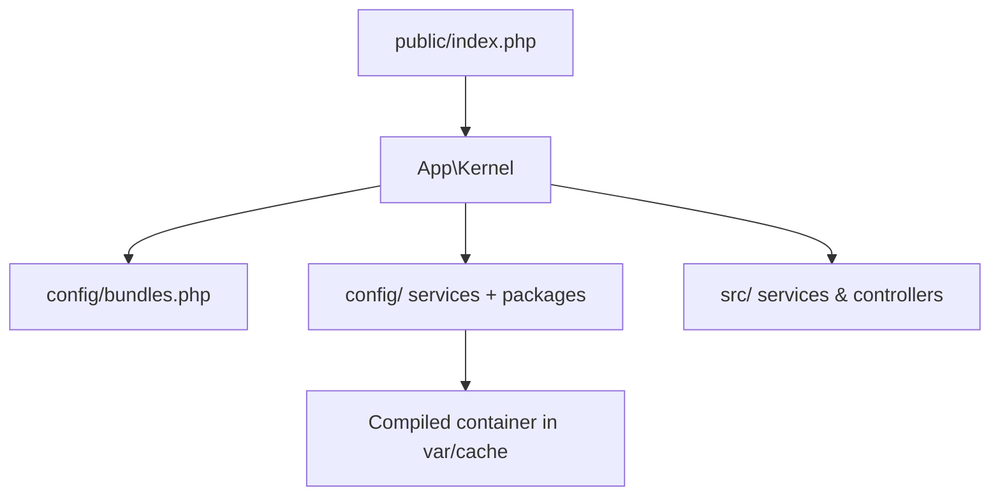

# Code Organization

!!! tip "In a nutshell"
    A Symfony app follows a conventional tree so tools, recipes and developers know
    where everything lives. Highest-yield: `public/` is the only web root
    (`public/index.php`), bundles are enabled in `config/bundles.php`, and
    `App\Kernel` stays tiny thanks to `MicroKernelTrait`.

!!! example "Real-world analogy"
    The skeleton layout is a **well-organized workshop**: every tool has a labelled
    drawer, so any developer — or tool, or Flex recipe — knows where to reach without
    asking. `public/` is the shop-front counter customers see, `src/` is the
    workbench, `var/` is the bin of shavings you sweep away, and `config/` is the
    instruction binder. `App\Kernel` is the foreman who already knows the whole
    layout by heart.

!!! abstract "Learning objectives"
    By the end of this chapter you can:

    - [ ] Describe every top-level directory of the standard app skeleton.
    - [ ] Explain the modern bundle directory structure and `Kernel`/`MicroKernelTrait`.
    - [ ] Place a new controller, template, config file and asset in the right place.
    - [ ] Distinguish app-level config (`config/`) from bundle-provided config.

    **Syllabus:** `Symfony Architecture → Code Organization` ·
    **Level:** Advanced ·
    **Est. time:** 25 min ·
    **Prerequisites:** [Flex](flex.md)

---

## Theory

A Symfony application follows a **conventional layout** so tools, recipes and other
developers know where things live. The skeleton created by `symfony new` /
`composer create-project symfony/skeleton` gives you a small, predictable tree.
Conventions here are strong but not magic — they are wired by the `Kernel` and Flex.

```console
# Both commands create the same conventional skeleton tree
$ symfony new my_app
$ composer create-project symfony/skeleton my_app

# The conventions are wired by src/Kernel.php (the Kernel class) and Flex
$ ls my_app/
bin/  config/  public/  src/  var/  vendor/  composer.json  symfony.lock
```

## Deep Dive — how it works internally

!!! question "Predict first"
    Your skeleton `App\Kernel` is almost empty — no `registerBundles()` body. How
    does Symfony still know which bundles to load and where config lives?

??? note "Reveal"
    `MicroKernelTrait` supplies `registerBundles()` (reads `config/bundles.php`) and
    `registerContainerConfiguration()` (loads `config/packages/*` and
    `services.yaml`). The trait is why the class needs almost no code.

### The application skeleton

| Path | Purpose |
|---|---|
| `bin/console` | CLI entry point (`Application` + your commands) |
| `config/` | App configuration (see below) |
| `public/` | Web root; `public/index.php` front controller only |
| `src/` | Your PHP: `Kernel.php`, `Controller/`, `Entity/`, services |
| `templates/` | Twig templates |
| `translations/` | Translation catalogues |
| `var/` | Generated: `var/cache/`, `var/log/` (git-ignored) |
| `vendor/` | Composer dependencies (git-ignored) |
| `tests/` | Automated tests |
| `.env` | Default environment variables |
| `composer.json`, `symfony.lock` | Dependencies + recipe state |

### Inside `config/`

| Path | Purpose |
|---|---|
| `config/services.yaml` | Your service definitions + defaults (autowire/autoconfigure) |
| `config/bundles.php` | Bundle → environment map (managed by [Flex](flex.md)) |
| `config/packages/` | Per-bundle config, e.g. `framework.yaml` |
| `config/packages/<env>/` | Environment-specific overrides |
| `config/routes/` + `config/routes.yaml` | Route imports/definitions |

### The Kernel and MicroKernelTrait

`App\Kernel` extends `Symfony\Component\HttpKernel\Kernel` and uses
`Symfony\Bundle\FrameworkBundle\Kernel\MicroKernelTrait`. The trait implements
`registerBundles()` (reads `config/bundles.php`) and
`registerContainerConfiguration()` (loads `config/{packages}/*` and
`config/services.yaml`), plus `getProjectDir()` conventions. This is why a modern
skeleton `Kernel` is almost empty.

```php
<?php
// src/Kernel.php
declare(strict_types=1);

namespace App;

use Symfony\Bundle\FrameworkBundle\Kernel\MicroKernelTrait;
use Symfony\Component\HttpKernel\Kernel as BaseKernel;

final class Kernel extends BaseKernel
{
    use MicroKernelTrait;
}
```

### Bundle structure (modern)

A modern bundle uses the **new** directory layout and often extends
`Symfony\Component\HttpKernel\Bundle\AbstractBundle`:

| Path | Purpose |
|---|---|
| `src/` | Bundle PHP, including the `*Bundle` class |
| `config/` | Services/config shipped by the bundle |
| `templates/` | Bundle templates |
| `translations/` | Bundle translations |
| `public/` | Bundle web assets |
| `tests/` | Bundle tests |

`Bundle::build(ContainerBuilder $container)` lets a bundle add compiler passes;
`getContainerExtension()` exposes its config extension.
`AbstractBundle::configure()` / `loadExtension()` provide a simpler config API.
Bundle **inheritance** (`getParent()`) was removed in Symfony 5; override behaviour
via [Framework Overloading](overloading.md) instead.

```php
// src/AcmeBlogBundle.php — a modern bundle class
final class AcmeBlogBundle extends AbstractBundle
{
    // Bundle::build(): add compiler passes to the container
    public function build(ContainerBuilder $container): void
    {
        $container->addCompilerPass(new CollectBlogWidgetsPass());
    }

    // AbstractBundle::configure(): define the bundle's config tree
    public function configure(DefinitionConfigurator $definition): void
    {
        $definition->rootNode()->children()->booleanNode('enabled')->defaultTrue()->end();
    }

    // loadExtension(): load services — no hand-written getContainerExtension() needed
    public function loadExtension(array $config, ContainerConfigurator $container, ContainerBuilder $builder): void
    {
        $container->import('../config/services.php');
    }

    // getParent() bundle inheritance was removed in Symfony 5 — do not use it
}
```



!!! note "Source reference"
    `MicroKernelTrait` and `AbstractBundle` —
    [symfony/symfony `8.0`](https://github.com/symfony/symfony/blob/8.0/src/Symfony/Bundle/FrameworkBundle/Kernel/MicroKernelTrait.php).

### Compilation vs runtime

`config/` is parsed at **compile time** into the dumped container in
`var/cache/<env>/`. At runtime the app loads that cache; `public/index.php` stays
tiny and no YAML is parsed on the hot path (in `prod`).

```console
# Compile time: config/ is parsed once and dumped into var/cache/<env>/
$ php bin/console cache:warmup --env=prod
$ ls var/cache/prod/
App_KernelProdContainer.php  ...

# Runtime: public/index.php only boots this cached container (no YAML parsing)
```

## Configuration & code

=== "PHP Attributes (a controller)"

    ```php
    <?php
    declare(strict_types=1);

    namespace App\Controller;

    use Symfony\Bundle\FrameworkBundle\Controller\AbstractController;
    use Symfony\Component\HttpFoundation\Response;
    use Symfony\Component\Routing\Attribute\Route;

    final class HomeController extends AbstractController
    {
        #[Route('/', name: 'home')]
        public function index(): Response
        {
            return $this->render('home/index.html.twig');
        }
    }
    ```

=== "YAML (services)"

    ```yaml
    # config/services.yaml
    services:
        _defaults:
            autowire: true
            autoconfigure: true
        App\:
            resource: '../src/'
            exclude: '../src/{Kernel.php}'
    ```

=== "Console"

    ```console
    $ php bin/console debug:container --parameters | grep kernel.project_dir
    ```

## Best practices & anti-patterns

| ✅ Do | ❌ Avoid |
|---|---|
| Keep `public/` to the front controller + assets | Putting PHP logic in `public/` |
| One namespace root `App\` mapped to `src/` | Deep, inconsistent namespaces |
| Env-specific config under `config/packages/<env>/` | Branching on env inside code |
| Let `var/`, `vendor/` stay git-ignored | Committing caches |

## When (not) to use it / alternatives

The skeleton layout is the expected default. Deviate only for special runtimes
(e.g. serverless) and even then keep `public/index.php`, `src/`, `config/`. Creating
a **bundle** makes sense only for reusable, shareable functionality — not for app
code.

!!! danger "Certification traps"
    - The **only** web-accessible directory is `public/`; the front controller is `public/index.php`.
    - Bundles are registered in `config/bundles.php`, not in `services.yaml`.
    - Bundle inheritance via `getParent()` is **gone** in modern Symfony.
    - `var/` and `vendor/` are generated and git-ignored.

!!! warning "Common mistakes"
    - Putting templates outside `templates/` and wondering why Twig can't find them.
    - Confusing app config (`config/`) with a bundle's shipped config.

## Exercises

1. **(Advanced)** State the correct directory for: a controller, a Twig template, a
   translation file, and env-specific framework config.
2. **(Expert)** Explain why `App\Kernel` can be nearly empty.

??? success "Solutions"

    **1.** Controller → `src/Controller/`; template → `templates/`; translation →
    `translations/`; env config → `config/packages/<env>/framework.yaml`.

    **2.** `MicroKernelTrait` supplies `registerBundles()` (reads
    `config/bundles.php`) and `registerContainerConfiguration()` (loads `config/`),
    so the class only needs to `use` the trait.

## Certification questions

??? question "Q1. Which directory is the web root?"
    - [x] A. `public/` ✅
    - [ ] B. `src/`
    - [ ] C. `web/`

    **Why:** `public/` holds `index.php` and assets; nothing else is web-accessible.
    **Ref:** [Directory structure](https://symfony.com/doc/current/configuration.html).

??? question "Q2. Where are bundles enabled?"
    - [x] A. `config/bundles.php` ✅
    - [ ] B. `config/services.yaml`
    - [ ] C. `src/Kernel.php` manually

    **Why:** The bundles map lives in `config/bundles.php`. **Ref:**
    [Bundles](https://symfony.com/doc/current/bundles.html).

??? question "Q3. What supplies `registerBundles()` in a skeleton Kernel?"
    - [x] A. `MicroKernelTrait` ✅
    - [ ] B. `AbstractController`
    - [ ] C. `FrameworkBundle` extension

    **Why:** The trait implements the boilerplate. **Ref:**
    [MicroKernelTrait](https://symfony.com/doc/current/configuration/micro_kernel_trait.html).

## Key takeaways

- Skeleton: `bin/ config/ public/ src/ templates/ var/ vendor/ tests/`.
- `public/index.php` is the only front controller; web root is `public/`.
- `App\Kernel` uses `MicroKernelTrait` to load bundles + config.
- Modern bundles use the new layout; `getParent()` inheritance is removed.

## Last-minute revision

!!! tip "Cheat sheet"
    - Web root = `public/`; caches/logs = `var/`; deps = `vendor/`.
    - Bundles → `config/bundles.php`; services → `config/services.yaml`.
    - Env overrides → `config/packages/<env>/`.
    - Kernel = `MicroKernelTrait`.

## Connections

- **Depends on:** [Flex](flex.md) — recipes create and maintain the conventional files this layout expects.
- **Reused in:** [Dependency Injection](../dependency-injection/index.md) — `config/` is compiled into the container; [Controllers](../controllers/index.md) live under `src/Controller/`.
- **Confused with:** [Framework Overloading](overloading.md) — app config in `config/` vs overriding a bundle's shipped config are different concerns.

## Official References
- [Official docs — Configuration & structure](https://symfony.com/doc/current/configuration.html)
- [Official docs — Best practices](https://symfony.com/doc/current/best_practices.html)
- [Symfony source — MicroKernelTrait](https://github.com/symfony/symfony/blob/8.0/src/Symfony/Bundle/FrameworkBundle/Kernel/MicroKernelTrait.php)

## Video references

!!! tip "Watch & learn"
    These are official, continuously-updated video channels — search them for
    "Symfony architecture" to reinforce this chapter. We link stable channels rather than
    individual videos so the references never rot.

    - [SymfonyCasts screencasts](https://symfonycasts.com/tracks/symfony) — scripted, code-along tutorials.
    - [Symfony official YouTube](https://www.youtube.com/@SymfonyOfficial) — SymfonyCon conference talks & keynotes.
    - [Official docs for this topic](https://symfony.com/doc/current/configuration.html) — some Symfony doc pages embed a screencast.

## Confidence check

I'm ready when I can:

- [ ] explain **why** a conventional layout lets tools and recipes work without config
- [ ] place a controller, template, translation and env-config file correctly
- [ ] debug a template Twig can't find because it sits outside `templates/`
- [ ] spot that bundles are enabled in `config/bundles.php`, not `services.yaml`
- [ ] explain how `MicroKernelTrait` keeps `App\Kernel` nearly empty

---

<small>Related: [Flex](flex.md) · [Framework Overloading](overloading.md) · [Naming Conventions](naming-conventions.md)</small>
