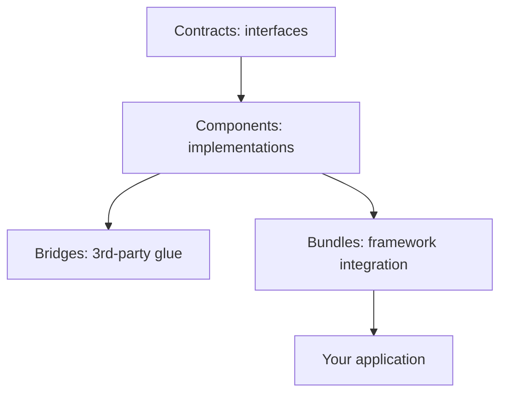

# Components

!!! tip "In a nutshell"
    Symfony est à la fois un ensemble de **components** autonomes (des packages
    Composer indépendants) et un **framework** qui les assemble. À retenir en
    priorité : les components sont utilisables sans le framework, et les contracts
    (`symfony/*-contracts`) sont des packages composés uniquement d'interfaces sur
    lesquels vous typez vos dépendances.

!!! example "Real-world analogy"
    Les components Symfony sont des **appareils électroménagers autonomes** : une
    bouilloire, un grille-pain et un mixeur fonctionnent chacun parfaitement seuls.
    Les **contracts** (`symfony/*-contracts`) sont la **prise électrique standard**
    sur laquelle ils se branchent tous, ce qui vous permet de remplacer une marque
    par une autre sans refaire le câblage. Le **framework** est la cuisine entièrement
    équipée qui fixe chaque appareil à sa place et raccorde le câblage pour vous.

!!! abstract "Learning objectives"
    À la fin de ce chapitre, vous saurez :

    - [ ] Expliquer la philosophie des components découplés et comment elle favorise la réutilisation.
    - [ ] Distinguer un **component**, un **contract**, un **bridge** et un **bundle**.
    - [ ] Nommer les components clés et ce que chacun fournit.
    - [ ] Utiliser un component de manière autonome via Composer.

    **Syllabus:** `Symfony Architecture → Components` ·
    **Level:** Advanced ·
    **Est. time:** 25 min ·
    **Prerequisites:** [Code Organization](code-organization.md)

---

## Theory

Symfony est **deux choses à la fois** : un ensemble de bibliothèques PHP autonomes
appelées **components**, et un **framework** (FrameworkBundle et consorts) qui les
assemble en un tout productif. Chaque component est un package Composer distinct
(`symfony/http-foundation`, `symfony/routing`, …) avec ses propres tests et son
versionnement sémantique, utilisable **sans** le framework complet. Laravel, Drupal
et bien d'autres s'appuient sur les components Symfony précisément pour cette
raison.

```console
# Each component is its own SemVer-versioned Composer package
$ composer require symfony/http-foundation   # OO Request/Response, standalone
$ composer require symfony/routing           # URL matching, no kernel needed

# The framework wiring only arrives with FrameworkBundle
$ composer require symfony/framework-bundle
```

## Deep Dive — how it works internally

!!! question "Predict first"
    Vous avez besoin de faire correspondre des URL dans un simple script PHP en
    ligne de commande, sans kernel. Pouvez-vous utiliser `symfony/routing` seul, et
    sur quoi devriez-vous typer vos dépendances ailleurs pour pouvoir en changer ?

??? note "Reveal"
    Oui — les components sont des packages Composer autonomes ; `composer require
    symfony/routing` puis utilisez `UrlMatcher` directement. Pour pouvoir changer
    d'implémentation, typez sur les interfaces des **contracts**
    (`symfony/*-contracts`), pas sur les classes concrètes.

### Decoupling by design

Les components dépendent d'**interfaces**, pas d'implémentations. Les packages
`symfony/*-contracts` (p. ex. `symfony/event-dispatcher-contracts`,
`symfony/http-client-contracts`, `symfony/cache-contracts`) contiennent les
interfaces stables, si bien que les consommateurs peuvent typer sur le contract et
changer d'implémentation. C'est pour cela que vous pouvez dépendre de
`Psr\Log\LoggerInterface` ou de
`Symfony\Contracts\HttpClient\HttpClientInterface` sans tirer une classe concrète.

```php
// Contracts packages ship interfaces only — type-hint them, not concrete classes
use Psr\Log\LoggerInterface;                                    // PSR-3
use Symfony\Contracts\Cache\CacheInterface;                     // symfony/cache-contracts
use Symfony\Contracts\EventDispatcher\EventDispatcherInterface; // symfony/event-dispatcher-contracts
use Symfony\Contracts\HttpClient\HttpClientInterface;           // symfony/http-client-contracts

final class ReleaseNotifier
{
    public function __construct(
        private HttpClientInterface $http,        // any implementation can be swapped in
        private CacheInterface $cache,
        private EventDispatcherInterface $events,
        private LoggerInterface $logger,
    ) {
    }
}
```



### Component vs contract vs bridge vs bundle

| Term | What it is | Example package |
|---|---|---|
| **Contract** | Interfaces/traits stables | `symfony/service-contracts` |
| **Component** | Bibliothèque autonome | `symfony/routing` |
| **Bridge** | Glu vers une bibliothèque tierce | `symfony/twig-bridge` |
| **Bundle** | Câblage/configuration du framework | `symfony/framework-bundle` |

Consultez [Bridges](bridges.md) pour les détails des bridges et
[Code Organization](code-organization.md) pour la structure des bundles.

### Key components (non-exhaustive)

| Component | Provides |
|---|---|
| `HttpFoundation` | `Request`/`Response`/`Session` orientés objet par-dessus les globales PHP |
| `HttpKernel` | Le moteur request→response et ses events |
| `Routing` | Correspondance et génération d'URL |
| `DependencyInjection` | Le service container + le compilateur |
| `EventDispatcher` | Système d'events / médiateur (PSR-14) |
| `Console` | Framework de commandes CLI |
| `Config` | Chargement/validation des arbres de configuration |
| `Security` (core/http/…) | Authentification & autorisation |
| `Serializer`, `Validator`, `Form` | Mapping de données, validation, forms |
| `Messenger` | Bus de messages, transports synchrones/asynchrones |
| `Cache`, `Lock`, `Clock`, `Process` | Utilitaires d'infrastructure |

### How the framework composes them

`FrameworkBundle` enregistre des services pour les components qu'il active et expose
l'arbre de configuration `framework:`. Le `Kernel` construit un `ContainerBuilder`,
l'**extension** de chaque bundle charge ses services, les compiler passes optimisent
le tout, et le container est déversé dans `var/cache`. À l'exécution, les components
ne sont que des services que vous récupérez ou faites injecter par autowiring — voir
[Dependency Injection](../dependency-injection/index.md).

```php
use Symfony\Bundle\FrameworkBundle\Kernel\MicroKernelTrait;
use Symfony\Component\DependencyInjection\ContainerBuilder;
use Symfony\Component\HttpKernel\Kernel as BaseKernel;

// The Kernel builds a ContainerBuilder; FrameworkBundle's extension loads the
// services enabled under the "framework:" config tree; compiler passes optimise;
// the compiled container is dumped to var/cache.
final class Kernel extends BaseKernel
{
    use MicroKernelTrait;

    protected function build(ContainerBuilder $container): void
    {
        // add compiler passes here, before compilation
    }
}
```

!!! note "Source reference"
    Liste et organisation des components —
    [symfony/symfony `8.0` `src/Symfony/Component`](https://github.com/symfony/symfony/tree/8.0/src/Symfony/Component).

!!! info "Expert note"
    Les packages `symfony/*-contracts` sont versionnés **indépendamment** des
    components qui les implémentent et n'embarquent quasiment aucune dépendance.
    C'est ce qui permet à une bibliothèque de dépendre de
    `symfony/event-dispatcher-contracts` sans tirer toute l'implémentation
    `symfony/event-dispatcher` — la manière classique de rester agnostique du
    framework tout en demeurant compatible Symfony.

??? example "Debugging story"
    **Symptôme :** une bibliothèque partagée entraînait tout le framework dans
    l'arbre de dépendances d'un projet qui n'avait rien à voir. **Diagnostic :**
    `composer why symfony/framework-bundle` a remonté la piste jusqu'à la
    bibliothèque qui typait sur une classe concrète d'un component et exigeait
    `symfony/framework-bundle` « par sécurité ». **Correctif :** ne dépendre que du
    component nécessaire (ou de son package `-contracts`) et typer sur l'interface.
    **À éviter :** ne jamais exiger le metapackage `symfony/symfony` ni un bundle
    depuis une bibliothèque.

??? abstract "Source-code tour"
    - Chaque component vit sous `src/Symfony/Component/<Name>` dans le monorepo et
      est publié comme son propre package `symfony/<name>`.
    - Les contracts vivent sous `src/Symfony/Contracts` sous forme de
      `symfony/*-contracts`
      (p. ex. `Symfony\Contracts\EventDispatcher\EventDispatcherInterface`).
    - L'extension DI de chaque bundle enregistre les services d'un component dans le container.
    - `Symfony\Component\DependencyInjection\ContainerBuilder` compile ces
      services ; voir [Dependency Injection](../dependency-injection/index.md).
    - Les bridges sous `src/Symfony/Bridge` relient les components aux bibliothèques tierces.

## Configuration & code

=== "Standalone (Composer)"

    ```console
    $ composer require symfony/routing symfony/http-foundation
    ```

=== "Using a component alone"

    ```php
    <?php
    declare(strict_types=1);

    use Symfony\Component\Routing\{Route, RouteCollection, RequestContext};
    use Symfony\Component\Routing\Matcher\UrlMatcher;

    $routes = new RouteCollection();
    $routes->add('hello', new Route('/hello/{name}'));

    $matcher = new UrlMatcher($routes, new RequestContext('/'));
    $params = $matcher->match('/hello/sf'); // ['_route' => 'hello', 'name' => 'sf']
    ```

=== "Console"

    ```console
    $ composer show 'symfony/*' --direct
    ```

## Best practices & anti-patterns

| ✅ Do | ❌ Avoid |
|---|---|
| Typer sur les contracts/interfaces | Typer sur des classes concrètes du framework |
| Ne tirer que les components nécessaires | Exiger le metapackage `symfony/symfony` |
| Laisser l'autowiring injecter les components | Instancier les components à la main (`new`) dans les services |

## When (not) to use it / alternatives

Utilisez les components autonomes dans des **bibliothèques** ou des applications
non-Symfony pour éviter le framework complet. Dans une application Symfony, vous
consommez presque toujours les components via des services et de la configuration,
pas en les instanciant.

!!! danger "Certification traps"
    - Les components sont des **packages Composer indépendants**, chacun versionné en SemVer.
    - Contracts ≠ components : les contracts sont des packages composés uniquement d'interfaces.
    - Le package monorepo `symfony/symfony` est déconseillé ; exigez les packages individuels.

!!! warning "Common mistakes"
    - Confondre un **bundle** (intégration au framework) avec un **component** (bibliothèque).
    - Supposer que les components ont besoin du kernel — la plupart s'en passent.

## Exercises

1. **(Advanced)** Utilisez le component `Filesystem` dans un simple script PHP (sans kernel).
2. **(Expert)** Expliquez pourquoi les packages `symfony/*-contracts` existent séparément.

??? success "Solutions"

    **1.** `composer require symfony/filesystem`, puis
    `(new Symfony\Component\Filesystem\Filesystem())->mkdir('/tmp/demo');` — aucun
    container n'est nécessaire.

    **2.** Les contracts offrent aux consommateurs une **interface stable et
    minimale** dont dépendre, découplée du cycle de publication d'une implémentation
    concrète, ce qui permet le remplacement et évite un couplage fort de versions.

## Certification questions

??? question "Q1. What is a Symfony component?"
    - [x] A. A standalone, reusable PHP library shipped as its own package ✅
    - [ ] B. A configuration file
    - [ ] C. A bundle that only runs inside the framework

    **Why:** Les components sont des bibliothèques découplées, utilisables sans le framework.
    **Ref:** [The Components](https://symfony.com/doc/current/components/index.html).

??? question "Q2. What do `symfony/*-contracts` packages contain?"
    - [x] A. Stable interfaces/traits to depend on ✅
    - [ ] B. Compiled containers
    - [ ] C. Twig templates

    **Why:** Les contracts sont des packages composés uniquement d'interfaces. **Ref:**
    [Symfony Contracts](https://github.com/symfony/contracts).

??? question "Q3. Can `symfony/routing` be used without FrameworkBundle?"
    - [x] A. Yes — it is standalone ✅
    - [ ] B. No — it requires the kernel
    - [ ] C. Only in dev

    **Why:** Les components sont découplés et installables indépendamment. **Ref:**
    [Routing component](https://symfony.com/doc/current/components/routing.html).

## Key takeaways

- Symfony = des components découplés + un framework qui les assemble.
- Les contracts contiennent les interfaces ; les components, les implémentations ; les bundles assurent l'intégration.
- Chaque component est son propre package Composer en SemVer, utilisable de manière autonome.

## Last-minute revision

!!! tip "Cheat sheet"
    - Component = bibliothèque · Contract = interfaces · Bridge = glu vers du tiers · Bundle = câblage du framework.
    - Typez sur les contracts/interfaces pour pouvoir changer d'implémentation.
    - `composer require symfony/<name>` — pas besoin du framework complet.

## Connections

- **Depends on:** [Bridges](bridges.md) — la couche de glu qui permet à un component d'intégrer une bibliothèque tierce précise.
- **Reused in:** [Dependency Injection](../dependency-injection/index.md) — le framework câble chaque component comme service du container ; [HTTP](../http/request.md) *est* le component `HttpFoundation`.
- **Confused with:** [Interoperability & PSRs](psr.md) — les contracts sont des packages d'interfaces propres à Symfony ; les PSR sont des standards inter-éditeurs.

## Official References
- [Official docs — The Components](https://symfony.com/doc/current/components/index.html)
- [Symfony Contracts](https://github.com/symfony/contracts)
- [Symfony source — components](https://github.com/symfony/symfony/tree/8.0/src/Symfony/Component)

## Video references

!!! tip "Watch & learn"
    Voici des chaînes vidéo officielles, mises à jour en continu — cherchez-y
    "Symfony architecture" pour consolider ce chapitre. Nous lions des chaînes stables
    plutôt que des vidéos individuelles afin que les références ne périment jamais.

    - [SymfonyCasts screencasts](https://symfonycasts.com/tracks/symfony) — tutoriels scénarisés à suivre en codant.
    - [Symfony official YouTube](https://www.youtube.com/@SymfonyOfficial) — conférences et keynotes SymfonyCon.
    - [Official docs for this topic](https://symfony.com/doc/current/components/index.html) — certaines pages de la documentation Symfony intègrent un screencast.

## Confidence check

Je suis prêt lorsque je peux :

- [ ] expliquer **pourquoi** des components découplés permettent la réutilisation hors du framework
- [ ] utiliser un component (p. ex. `Routing`) de manière autonome via Composer
- [ ] déboguer un arbre de dépendances qui tire à tort tout le framework
- [ ] repérer la différence entre un component, un contract, un bridge et un bundle
- [ ] expliquer comment FrameworkBundle compose les components en services du container

---

<small>Related: [Bridges](bridges.md) · [Code Organization](code-organization.md) · [Dependency Injection](../dependency-injection/index.md)</small>
