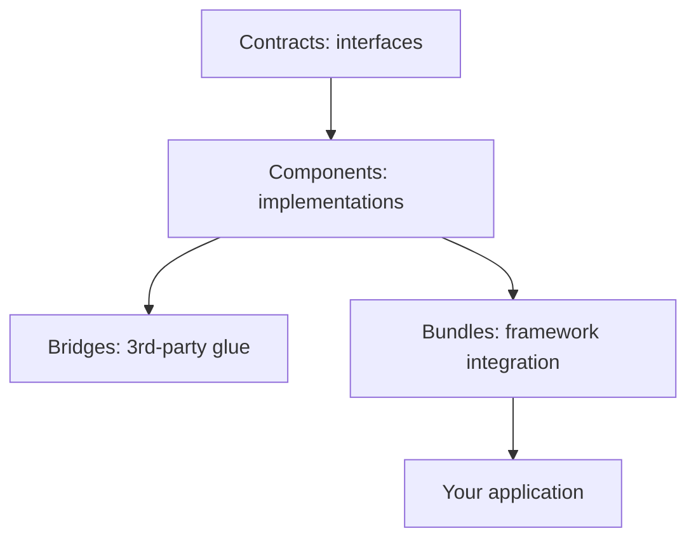

# Components

!!! tip "In a nutshell"
    Symfony is both a set of standalone **components** (independent Composer
    packages) and a **framework** that wires them together. Highest-yield:
    components are usable without the framework, and contracts (`symfony/*-contracts`)
    are interface-only packages you type-hint against.

!!! example "Real-world analogy"
    Symfony components are **standalone appliances**: a kettle, a toaster and a
    blender each work perfectly on their own. The **contracts**
    (`symfony/*-contracts`) are the **standard power socket** they all plug into, so
    you can swap one brand for another without rewiring. The **framework** is the
    fully fitted kitchen that mounts every appliance in place and connects the wiring
    for you.

!!! abstract "Learning objectives"
    By the end of this chapter you can:

    - [ ] Explain the decoupled-component philosophy and how it enables reuse.
    - [ ] Distinguish a **component**, a **contract**, a **bridge** and a **bundle**.
    - [ ] Name the key components and what each provides.
    - [ ] Use a component standalone via Composer.

    **Syllabus:** `Symfony Architecture → Components` ·
    **Level:** Advanced ·
    **Est. time:** 25 min ·
    **Prerequisites:** [Code Organization](code-organization.md)

---

## Theory

Symfony is **two things**: a set of standalone PHP libraries called
**components**, and a **framework** (FrameworkBundle + friends) that wires them
into a productive whole. Each component is a separate Composer package
(`symfony/http-foundation`, `symfony/routing`, …) with its own tests and semantic
versioning, usable **without** the full framework. Laravel, Drupal and many others
build on Symfony components for exactly this reason.

## Deep Dive — how it works internally

!!! question "Predict first"
    You need URL matching in a plain PHP CLI script with no kernel. Can you use
    `symfony/routing` on its own, and what should you type-hint elsewhere for
    swap-ability?

??? note "Reveal"
    Yes — components are standalone Composer packages; `composer require
    symfony/routing` and use `UrlMatcher` directly. For swap-ability, type-hint the
    **contract** interfaces (`symfony/*-contracts`), not concrete classes.

### Decoupling by design

Components depend on **interfaces**, not implementations. The
`symfony/*-contracts` packages (e.g. `symfony/event-dispatcher-contracts`,
`symfony/http-client-contracts`, `symfony/cache-contracts`) hold the stable
interfaces so that consumers can type-hint the contract and swap implementations.
This is why you can depend on `Psr\Log\LoggerInterface` or
`Symfony\Contracts\HttpClient\HttpClientInterface` without pulling a concrete
class.



### Component vs contract vs bridge vs bundle

| Term | What it is | Example package |
|---|---|---|
| **Contract** | Stable interfaces/traits | `symfony/service-contracts` |
| **Component** | Standalone library | `symfony/routing` |
| **Bridge** | Glue to a third-party lib | `symfony/twig-bridge` |
| **Bundle** | Framework wiring/config | `symfony/framework-bundle` |

See [Bridges](bridges.md) for the bridge details and
[Code Organization](code-organization.md) for bundle structure.

### Key components (non-exhaustive)

| Component | Provides |
|---|---|
| `HttpFoundation` | OO `Request`/`Response`/`Session` over PHP globals |
| `HttpKernel` | The request→response engine and events |
| `Routing` | URL matching and generation |
| `DependencyInjection` | The service container + compiler |
| `EventDispatcher` | Mediator/event system (PSR-14) |
| `Console` | CLI command framework |
| `Config` | Loading/validating configuration trees |
| `Security` (core/http/…) | Authentication & authorization |
| `Serializer`, `Validator`, `Form` | Data mapping, validation, forms |
| `Messenger` | Message bus, sync/async transports |
| `Cache`, `Lock`, `Clock`, `Process` | Infra utilities |

### How the framework composes them

`FrameworkBundle` registers services for the components it enables and exposes the
`framework:` config tree. The `Kernel` builds a `ContainerBuilder`, each bundle's
**extension** loads its services, compiler passes optimise, and the container is
dumped to `var/cache`. At runtime the components are just services you fetch or
autowire — see [Dependency Injection](../dependency-injection/index.md).

!!! note "Source reference"
    Component list and layout —
    [symfony/symfony `8.0` `src/Symfony/Component`](https://github.com/symfony/symfony/tree/8.0/src/Symfony/Component).

!!! info "Expert note"
    The `symfony/*-contracts` packages are versioned **independently** of the
    components that implement them and carry almost no dependencies. That is what
    lets a library depend on `symfony/event-dispatcher-contracts` without dragging in
    the full `symfony/event-dispatcher` implementation — the classic way to stay
    framework-agnostic while remaining Symfony-compatible.

??? example "Debugging story"
    **Symptom:** a shared library pulled the entire framework into an unrelated
    project's dependency tree. **Diagnosis:** `composer why symfony/framework-bundle`
    traced it to the library type-hinting a concrete component class and requiring
    `symfony/framework-bundle` "to be safe". **Fix:** depend only on the needed
    component (or its `-contracts` package) and type-hint the interface. **Avoid:**
    never require the `symfony/symfony` metapackage or a bundle from a library.

??? abstract "Source-code tour"
    - Each component lives under `src/Symfony/Component/<Name>` in the monorepo and
      ships as its own `symfony/<name>` package.
    - Contracts live under `src/Symfony/Contracts` as `symfony/*-contracts`
      (e.g. `Symfony\Contracts\EventDispatcher\EventDispatcherInterface`).
    - Each bundle's DI extension registers a component's services into the container.
    - `Symfony\Component\DependencyInjection\ContainerBuilder` compiles those
      services; see [Dependency Injection](../dependency-injection/index.md).
    - Bridges under `src/Symfony/Bridge` glue components to third-party libraries.

## Configuration & code

=== "Standalone (Composer)"

    ```console
    $ composer require symfony/routing symfony/http-foundation
    ```

=== "Using a component alone"

    ```php
    <?php
    declare(strict_types=1);

    use Symfony\Component\Routing\{Route, RouteCollection, RequestContext};
    use Symfony\Component\Routing\Matcher\UrlMatcher;

    $routes = new RouteCollection();
    $routes->add('hello', new Route('/hello/{name}'));

    $matcher = new UrlMatcher($routes, new RequestContext('/'));
    $params = $matcher->match('/hello/sf'); // ['_route' => 'hello', 'name' => 'sf']
    ```

=== "Console"

    ```console
    $ composer show 'symfony/*' --direct
    ```

## Best practices & anti-patterns

| ✅ Do | ❌ Avoid |
|---|---|
| Type-hint contracts/interfaces | Type-hinting concrete framework classes |
| Pull only the components you need | Requiring `symfony/symfony` metapackage |
| Let autowiring inject components | `new`-ing components manually in services |

## When (not) to use it / alternatives

Use standalone components in **libraries** or non-Symfony apps to avoid the full
framework. In a Symfony application you almost always consume components through
services and configuration, not by instantiating them.

!!! danger "Certification traps"
    - Components are **independent Composer packages**, each SemVer-versioned.
    - Contracts ≠ components: contracts are interface-only packages.
    - The `symfony/symfony` monorepo package is discouraged; require individual packages.

!!! warning "Common mistakes"
    - Confusing a **bundle** (framework integration) with a **component** (library).
    - Assuming components need the kernel — most don't.

## Exercises

1. **(Advanced)** Use the `Filesystem` component in a plain PHP script (no kernel).
2. **(Expert)** Explain why `symfony/*-contracts` packages exist separately.

??? success "Solutions"

    **1.** `composer require symfony/filesystem`, then
    `(new Symfony\Component\Filesystem\Filesystem())->mkdir('/tmp/demo');` — no
    container needed.

    **2.** Contracts give consumers a **stable, minimal interface** to depend on,
    decoupled from a concrete implementation's release cycle, enabling swapping and
    avoiding hard version coupling.

## Certification questions

??? question "Q1. What is a Symfony component?"
    - [x] A. A standalone, reusable PHP library shipped as its own package ✅
    - [ ] B. A configuration file
    - [ ] C. A bundle that only runs inside the framework

    **Why:** Components are decoupled libraries usable without the framework.
    **Ref:** [The Components](https://symfony.com/doc/current/components/index.html).

??? question "Q2. What do `symfony/*-contracts` packages contain?"
    - [x] A. Stable interfaces/traits to depend on ✅
    - [ ] B. Compiled containers
    - [ ] C. Twig templates

    **Why:** Contracts are interface-only packages. **Ref:**
    [Symfony Contracts](https://github.com/symfony/contracts).

??? question "Q3. Can `symfony/routing` be used without FrameworkBundle?"
    - [x] A. Yes — it is standalone ✅
    - [ ] B. No — it requires the kernel
    - [ ] C. Only in dev

    **Why:** Components are decoupled and independently installable. **Ref:**
    [Routing component](https://symfony.com/doc/current/components/routing.html).

## Key takeaways

- Symfony = decoupled components + a framework that wires them.
- Contracts hold interfaces; components hold implementations; bundles integrate.
- Each component is its own SemVer Composer package, usable standalone.

## Last-minute revision

!!! tip "Cheat sheet"
    - Component = library · Contract = interfaces · Bridge = 3rd-party glue · Bundle = framework wiring.
    - Type-hint contracts/interfaces for swap-ability.
    - `composer require symfony/<name>` — no full framework needed.

## Connections

- **Depends on:** [Bridges](bridges.md) — the glue layer that lets a component integrate a specific third-party library.
- **Reused in:** [Dependency Injection](../dependency-injection/index.md) — the framework wires every component in as a container service; [HTTP](../http/request.md) *is* the `HttpFoundation` component.
- **Confused with:** [Interoperability & PSRs](psr.md) — contracts are Symfony-specific interface packages; PSRs are cross-vendor standards.

## Official References
- [Official docs — The Components](https://symfony.com/doc/current/components/index.html)
- [Symfony Contracts](https://github.com/symfony/contracts)
- [Symfony source — components](https://github.com/symfony/symfony/tree/8.0/src/Symfony/Component)

## Video references

!!! tip "Watch & learn"
    These are official, continuously-updated video channels — search them for
    "Symfony architecture" to reinforce this chapter. We link stable channels rather than
    individual videos so the references never rot.

    - [SymfonyCasts screencasts](https://symfonycasts.com/tracks/symfony) — scripted, code-along tutorials.
    - [Symfony official YouTube](https://www.youtube.com/@SymfonyOfficial) — SymfonyCon conference talks & keynotes.
    - [Official docs for this topic](https://symfony.com/doc/current/components/index.html) — some Symfony doc pages embed a screencast.

## Confidence check

I'm ready when I can:

- [ ] explain **why** decoupled components enable reuse outside the framework
- [ ] use a component (e.g. `Routing`) standalone via Composer
- [ ] debug a dependency tree that wrongly pulls in the whole framework
- [ ] spot the difference between a component, a contract, a bridge and a bundle
- [ ] explain how FrameworkBundle composes components into container services

---

<small>Related: [Bridges](bridges.md) · [Code Organization](code-organization.md) · [Dependency Injection](../dependency-injection/index.md)</small>
