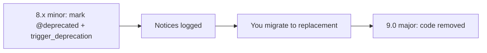

# Deprecations Best Practices

!!! tip "In a nutshell"
    Une dépréciation indique qu'une API fonctionne encore aujourd'hui mais sera
    supprimée dans la prochaine version majeure, ce qui vous laisse un cycle complet
    pour migrer. À retenir en priorité : déclenchez-les avec
    `trigger_deprecation(package, version, message, ...args)` — une notice
    `E_USER_DEPRECATED` fournie par `symfony/deprecation-contracts`.

!!! example "Real-world analogy"
    Une dépréciation est le panneau d'autoroute qui annonce « Cette sortie fermera
    aux prochains travaux — empruntez plutôt la sortie 12. » La bretelle fonctionne
    encore parfaitement aujourd'hui ; rien ne vous empêche de la prendre, et le
    panneau n'est qu'un avis, pas une barrière. Mais il vous prévient très en avance
    et nomme l'itinéraire de remplacement, si bien que vous avez toute la saison (le
    reste du cycle majeur) pour changer vos habitudes. La bretelle n'est réellement
    démolie qu'au prochain grand chantier (la prochaine version majeure) — et les
    conducteurs qui ont ignoré le panneau sont ceux qui se retrouvent bloqués le
    matin où elle disparaît.

!!! abstract "Learning objectives"
    À la fin de ce chapitre, vous saurez :

    - [ ] Déclencher correctement une dépréciation avec `trigger_deprecation()`.
    - [ ] Détecter les dépréciations à l'exécution, dans le profiler et dans les tests.
    - [ ] Expliquer comment le contrat de dépréciation s'articule avec la promesse de BC.
    - [ ] Corriger méthodiquement les dépréciations avant une montée de version majeure.

    **Syllabus:** `Symfony Architecture → Deprecations` ·
    **Level:** Expert ·
    **Est. time:** 25 min ·
    **Prerequisites:** [BC Promise](bc-promise.md)

---

## Theory

Une **dépréciation** est la promesse qu'une API fonctionne encore *maintenant* mais
sera **supprimée dans la prochaine version majeure**. Elle vous laisse un cycle
majeur entier pour migrer. Symfony émet les dépréciations sous forme de notices
`E_USER_DEPRECATED` via un petit helper sans dépendance fourni par le package
`symfony/deprecation-contracts`.

```php
// symfony/deprecation-contracts provides one global helper function
trigger_deprecation('acme/sdk', '2.4', 'Method "%s()" is deprecated.', 'legacyCall');

// which internally boils down to an E_USER_DEPRECATED notice:
@trigger_error('Since acme/sdk 2.4: Method "legacyCall()" is deprecated.', \E_USER_DEPRECATED);
```

## Deep Dive — how it works internally

!!! question "Predict first"
    Vous appelez `trigger_deprecation('app/foo', '8.1', 'msg')` depuis du code
    exécuté au cours d'une request normale. Quelque chose lève-t-il une exception ?
    Et quelle chaîne de version passe-t-on en deuxième argument ?

??? note "Reveal"
    Rien n'est levé — la fonction émet une notice `E_USER_DEPRECATED` (sauf si la CI
    est configurée pour échouer sur les dépréciations). La version est celle dans
    laquelle l'API a été **dépréciée** (`8.1`), pas la version en cours d'exécution.

### `trigger_deprecation()`

La façon canonique de déclencher une dépréciation est la fonction globale fournie
par `symfony/deprecation-contracts` :

```php
trigger_deprecation(
    string $package,   // e.g. 'symfony/http-kernel'
    string $version,   // version it was deprecated in, e.g. '8.1'
    string $message,   // sprintf-style message
    mixed ...$args     // sprintf arguments
): void
```

En interne, elle se contente d'appeler `@trigger_error(sprintf(...),
E_USER_DEPRECATED)` avec une chaîne formatée, mais seulement si la fonction existe
(c'est le package de contracts qui la fournit). L'utiliser — plutôt que
`trigger_error` directement — garantit un format cohérent
`Since <package> <version>: <message>` que les outils savent analyser.

### The deprecation contract

Le **contrat** est le suivant : les dépréciations ne sont introduites que dans des
versions **mineures**, l'API n'est jamais supprimée *avant* la prochaine version
majeure, et chaque dépréciation s'accompagne d'un message de migration indiquant le
remplacement. C'est ce mécanisme qui permet à la
[BC promise](bc-promise.md) d'autoriser des suppressions dans les majeures sans
surprendre personne.



### Detecting deprecations

| Where | How |
|---|---|
| **Profiler** | La Web Debug Toolbar affiche un compteur de dépréciations ; le profiler les liste |
| **Logs** | Journalisées sur le canal `deprecation` en `dev` |
| **Tests** | `symfony/phpunit-bridge` les collecte et affiche un résumé |
| **Static** | L'IDE et les docblocks `@deprecated` signalent les points d'appel |

Verrouiller la CI sur le nombre de dépréciations (le `SYMFONY_DEPRECATIONS_HELPER`
du PHPUnit bridge) est couvert dans
[Automated Tests → PHPUnit bridge](../testing/phpunit-bridge.md) — **exclu de la
certification Symfony 8**.

### Marking your own deprecations

Combinez le docblock `@deprecated` (et, en PHP 8.4, l'attribut natif
`#[\Deprecated]` lorsque c'est approprié) avec un `trigger_deprecation()` à
l'exécution, afin que l'analyse statique comme l'outillage runtime la voient.

```php
final class Mailer
{
    /**
     * @deprecated since app 8.1, use send() instead.
     */
    #[\Deprecated(message: 'use send() instead', since: 'app 8.1')] // native PHP 8.4 attribute
    public function dispatch(): void
    {
        // runtime notice for logs, profiler and the PHPUnit bridge
        trigger_deprecation('app/mailer', '8.1', 'Method "%s()" is deprecated, use "send()".', __METHOD__);

        $this->send();
    }
}
```

!!! note "Source reference"
    `trigger_deprecation()` —
    [symfony/deprecation-contracts `function.php`](https://github.com/symfony/deprecation-contracts/blob/main/function.php).

### Compilation vs runtime

Certaines dépréciations se déclenchent à la **compilation du container** (p. ex.
une clé de configuration dépréciée ou un alias de service marqué avec
`Definition::setDeprecated()`) ; d'autres à l'**exécution** (l'appel d'une méthode
dépréciée). Les dépréciations de configuration apparaissent lors de `cache:clear` ;
celles d'exécution, pendant l'exécution réelle et les tests.

```php
// Compile-time: deprecate a service definition (surfaces during cache:clear)
$container->getDefinition('app.legacy_mailer')
    ->setDeprecated('app/mailer', '8.1', 'The "%service_id%" service is deprecated.');

// Runtime: notice fires only when the deprecated method is actually called
trigger_deprecation('app/mailer', '8.1', 'Calling "%s()" is deprecated.', __METHOD__);
```

## Configuration & code

=== "Emitting a deprecation"

    ```php
    <?php
    declare(strict_types=1);

    namespace App\Legacy;

    final class ReportBuilder
    {
        /**
         * @deprecated since app 8.1, use build() instead.
         */
        public function generate(): string
        {
            trigger_deprecation('app/reports', '8.1', 'Using "%s::generate()" is deprecated, use "build()".', self::class);

            return $this->build();
        }

        public function build(): string
        {
            return 'report';
        }
    }
    ```

=== "Deprecated service (DI)"

    ```yaml
    # config/services.yaml
    services:
        App\Legacy\ReportBuilder:
            deprecated:
                package: 'app/reports'
                version: '8.1'
                message: 'The "%service_id%" service is deprecated.'
    ```

## Best practices & anti-patterns

| ✅ Do | ❌ Avoid |
|---|---|
| Utiliser `trigger_deprecation()` pour les notices d'exécution | Appeler `trigger_error()` au cas par cas |
| Associer docblock `@deprecated` + notice d'exécution | Un simple docblock (l'outillage passe à côté) |
| Corriger les dépréciations à chaque mineure | Toutes les traiter d'un coup à la frontière de la majeure |

## When (not) to use it / alternatives

Dépréciez (sans jamais supprimer brutalement dans une mineure) chaque fois que vous
devez changer une API publique de votre propre bundle/application. Pour du code
réellement interne marqué `@internal`, vous pouvez le modifier sans dépréciation,
car il est hors du périmètre de la [BC promise](bc-promise.md).

!!! danger "Certification traps"
    - `trigger_deprecation()` provient de **`symfony/deprecation-contracts`**, pas du cœur du framework.
    - L'ordre de la signature est **package, version, message, ...args** (à la manière de `sprintf`).
    - Les dépréciations utilisent le niveau **`E_USER_DEPRECATED`**.
    - Le code déprécié est supprimé dans la **prochaine majeure**, jamais dans une mineure/un patch.

!!! warning "Common mistakes"
    - Passer la version *actuelle* au lieu de la version dans laquelle l'API a été **dépréciée**.
    - S'attendre à ce que les dépréciations lèvent une exception — ce sont des notices, pas des exceptions (sauf si la CI est configurée pour échouer).

## Exercises

1. **(Advanced)** Ajoutez une dépréciation d'exécution à une méthode en cours de
   remplacement, avec un message de migration correct.

??? success "Solutions"

    **1.** Appelez
    `trigger_deprecation('app/foo', '8.1', 'Method "%s::old()" is deprecated, use "new()".', self::class);`
    en tête de l'ancienne méthode et ajoutez le docblock `@deprecated` correspondant.

## Certification questions

??? question "Q1. Which function emits a Symfony deprecation notice?"
    - [x] A. `trigger_deprecation($package, $version, $message, ...$args)` ✅
    - [ ] B. `deprecate($message)`
    - [ ] C. `@trigger_error()` is the only supported way

    **Why:** `symfony/deprecation-contracts` fournit `trigger_deprecation()`.
    **Ref:** [Deprecation contracts](https://github.com/symfony/deprecation-contracts).

??? question "Q2. When is deprecated code removed?"
    - [x] A. In the next major release ✅
    - [ ] B. In the next patch
    - [ ] C. Immediately

    **Why:** Les dépréciations survivent jusqu'à une majeure, conformément à la promesse de BC. **Ref:**
    [BC promise](https://symfony.com/doc/current/contributing/code/bc.html).

## Key takeaways

- Utilisez `trigger_deprecation(package, version, message, ...args)` du package de contracts.
- Les dépréciations sont des notices `E_USER_DEPRECATED`, supprimées uniquement dans la prochaine majeure.
- Détectez-les via le profiler et le canal de log `deprecation`.

## Last-minute revision

!!! tip "Cheat sheet"
    - `trigger_deprecation('pkg', 'X.Y', 'msg %s', $arg)` — package, version, message, arguments.
    - Niveau : `E_USER_DEPRECATED`. Suppression : prochaine majeure.
    - Détection : toolbar/profiler, canal de log `deprecation`.
    - DI : clé `deprecated:` / `Definition::setDeprecated()`.

## Connections

- **Depends on:** [BC Promise](bc-promise.md) — les dépréciations sont le mécanisme qui permet à une majeure de supprimer une API couverte sans surprise.
- **Reused in:** [Release Management](release-management.md) — les dépréciations sont ajoutées dans les mineures et supprimées dans la majeure suivante ; [Dependency Injection](../dependency-injection/index.md) peut déprécier des services via `Definition::setDeprecated()`.
- **Confused with:** [Roadmap & Schedule](roadmap-schedule.md) — le calendrier dit *quand* une majeure arrive ; les dépréciations disent *ce qui* sera alors supprimé.

## Official References
- [Official docs — deprecations](https://symfony.com/doc/current/setup/upgrade_minor.html)
- [Deprecation contracts](https://github.com/symfony/deprecation-contracts)

## Video references

!!! tip "Watch & learn"
    Voici des chaînes vidéo officielles, mises à jour en continu — cherchez-y
    "Symfony architecture" pour consolider ce chapitre. Nous lions des chaînes stables
    plutôt que des vidéos individuelles afin que les références ne périment jamais.

    - [SymfonyCasts screencasts](https://symfonycasts.com/tracks/symfony) — tutoriels scénarisés à suivre en codant.
    - [Symfony official YouTube](https://www.youtube.com/@SymfonyOfficial) — conférences et keynotes SymfonyCon.
    - [Official docs for this topic](https://symfony.com/doc/current/contributing/code/bc.html) — certaines pages de la documentation Symfony intègrent un screencast.

## Confidence check

Je suis prêt lorsque je peux :

- [ ] expliquer **pourquoi** les dépréciations existent et comment elles s'articulent avec la promesse de BC
- [ ] en émettre une correctement avec `trigger_deprecation(package, version, message, ...args)`
- [ ] déboguer une notice de dépréciation et retrouver son point d'appel via le profiler ou les logs
- [ ] repérer le piège consistant à passer la version actuelle au lieu de la version de dépréciation

---

<small>Related: [BC Promise](bc-promise.md) · [Release Management](release-management.md) · [Roadmap & Schedule](roadmap-schedule.md)</small>
