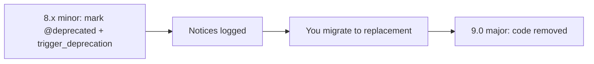

# Deprecations Best Practices

!!! tip "In a nutshell"
    A deprecation says an API still works now but will be removed in the next major,
    giving you a full cycle to migrate. Highest-yield: raise them with
    `trigger_deprecation(package, version, message, ...args)` — an
    `E_USER_DEPRECATED` notice from `symfony/deprecation-contracts`.

!!! example "Real-world analogy"
    A deprecation is the motorway sign that reads "This exit closes at the next
    roadworks — use Exit 12 instead." The ramp still works perfectly today; nothing
    stops you driving it, and the sign is only an advisory notice, not a barrier. But it
    warns you far in advance and names the replacement route, so you have the whole
    season (the rest of the major cycle) to change your habits. The ramp is only actually
    demolished at the next big overhaul (the next major) — and drivers who ignored the
    sign are the ones stranded the morning it disappears.

!!! abstract "Learning objectives"
    By the end of this chapter you can:

    - [ ] Trigger a deprecation correctly with `trigger_deprecation()`.
    - [ ] Detect deprecations at runtime, in the profiler, and in tests.
    - [ ] Explain how the deprecation contract ties into the BC promise.
    - [ ] Fix deprecations methodically before a major upgrade.

    **Syllabus:** `Symfony Architecture → Deprecations` ·
    **Level:** Expert ·
    **Est. time:** 25 min ·
    **Prerequisites:** [BC Promise](bc-promise.md)

---

## Theory

A **deprecation** is a promise that an API still works *now* but will be **removed
in the next major**. It gives you a whole major cycle to migrate. Symfony emits
deprecations as `E_USER_DEPRECATED` notices via a tiny, dependency-free helper from
the `symfony/deprecation-contracts` package.

```php
// symfony/deprecation-contracts provides one global helper function
trigger_deprecation('acme/sdk', '2.4', 'Method "%s()" is deprecated.', 'legacyCall');

// which internally boils down to an E_USER_DEPRECATED notice:
@trigger_error('Since acme/sdk 2.4: Method "legacyCall()" is deprecated.', \E_USER_DEPRECATED);
```

## Deep Dive — how it works internally

!!! question "Predict first"
    You call `trigger_deprecation('app/foo', '8.1', 'msg')` from code under a normal
    request. Does anything throw? And what version string goes in the second
    argument?

??? note "Reveal"
    Nothing throws — it emits an `E_USER_DEPRECATED` notice (unless CI is configured
    to fail on deprecations). The version is the one it was **deprecated in** (`8.1`),
    not the current running version.

### `trigger_deprecation()`

The canonical way to raise a deprecation is the global function from
`symfony/deprecation-contracts`:

```php
trigger_deprecation(
    string $package,   // e.g. 'symfony/http-kernel'
    string $version,   // version it was deprecated in, e.g. '8.1'
    string $message,   // sprintf-style message
    mixed ...$args     // sprintf arguments
): void
```

Internally it simply calls `@trigger_error(sprintf(...), E_USER_DEPRECATED)` with a
formatted string, but only if the function exists (the contracts package provides
it). Using it — rather than `trigger_error` directly — gives a consistent
`Since <package> <version>: <message>` format that tooling can parse.

### The deprecation contract

The **contract** is: deprecations are introduced only in **minor** releases, are
never removed *before* the next major, and every deprecation ships with a migration
message pointing to the replacement. This is the mechanism that lets the
[BC promise](bc-promise.md) allow removals in majors without surprising anyone.



### Detecting deprecations

| Where | How |
|---|---|
| **Profiler** | Web Debug Toolbar shows a deprecation count; the profiler lists them |
| **Logs** | Logged on the `deprecation` channel in `dev` |
| **Tests** | `symfony/phpunit-bridge` collects them and prints a summary |
| **Static** | IDE/`@deprecated` docblocks flag call sites |

Gating CI on the deprecation count (the PHPUnit bridge's `SYMFONY_DEPRECATIONS_HELPER`)
is covered in [Automated Tests → PHPUnit bridge](../testing/phpunit-bridge.md) —
**excluded from Symfony 8 certification**.

### Marking your own deprecations

Combine the `@deprecated` docblock (and, in PHP 8.4, the native `#[\Deprecated]`
attribute where appropriate) with a runtime `trigger_deprecation()` so both static
analysis and runtime tooling see it.

```php
final class Mailer
{
    /**
     * @deprecated since app 8.1, use send() instead.
     */
    #[\Deprecated(message: 'use send() instead', since: 'app 8.1')] // native PHP 8.4 attribute
    public function dispatch(): void
    {
        // runtime notice for logs, profiler and the PHPUnit bridge
        trigger_deprecation('app/mailer', '8.1', 'Method "%s()" is deprecated, use "send()".', __METHOD__);

        $this->send();
    }
}
```

!!! note "Source reference"
    `trigger_deprecation()` —
    [symfony/deprecation-contracts `function.php`](https://github.com/symfony/deprecation-contracts/blob/main/function.php).

### Compilation vs runtime

Some deprecations fire at **container compile time** (e.g. a deprecated config key
or service alias marked with `Definition::setDeprecated()`); others at **runtime**
(a deprecated method call). Config-level deprecations surface during `cache:clear`;
runtime ones during actual execution and tests.

```php
// Compile-time: deprecate a service definition (surfaces during cache:clear)
$container->getDefinition('app.legacy_mailer')
    ->setDeprecated('app/mailer', '8.1', 'The "%service_id%" service is deprecated.');

// Runtime: notice fires only when the deprecated method is actually called
trigger_deprecation('app/mailer', '8.1', 'Calling "%s()" is deprecated.', __METHOD__);
```

## Configuration & code

=== "Emitting a deprecation"

    ```php
    <?php
    declare(strict_types=1);

    namespace App\Legacy;

    final class ReportBuilder
    {
        /**
         * @deprecated since app 8.1, use build() instead.
         */
        public function generate(): string
        {
            trigger_deprecation('app/reports', '8.1', 'Using "%s::generate()" is deprecated, use "build()".', self::class);

            return $this->build();
        }

        public function build(): string
        {
            return 'report';
        }
    }
    ```

=== "Deprecated service (DI)"

    ```yaml
    # config/services.yaml
    services:
        App\Legacy\ReportBuilder:
            deprecated:
                package: 'app/reports'
                version: '8.1'
                message: 'The "%service_id%" service is deprecated.'
    ```

## Best practices & anti-patterns

| ✅ Do | ❌ Avoid |
|---|---|
| Use `trigger_deprecation()` for runtime notices | Calling `trigger_error()` ad hoc |
| Pair `@deprecated` docblock + runtime notice | Only a docblock (tooling misses it) |
| Fix deprecations each minor | Batching them all at the major boundary |

## When (not) to use it / alternatives

Deprecate (never hard-remove in a minor) whenever you must change a public API in
your own bundle/app. For truly internal code marked `@internal`, you can change it
without a deprecation because it is outside the [BC promise](bc-promise.md).

!!! danger "Certification traps"
    - `trigger_deprecation()` comes from **`symfony/deprecation-contracts`**, not core.
    - Signature order is **package, version, message, ...args** (`sprintf` style).
    - Deprecations use the **`E_USER_DEPRECATED`** level.
    - Deprecated code is removed in the **next major**, never in a minor/patch.

!!! warning "Common mistakes"
    - Passing the *current* version instead of the version it was **deprecated in**.
    - Expecting deprecations to throw — they are notices, not exceptions (unless CI is configured to fail).

## Exercises

1. **(Advanced)** Add a runtime deprecation to a method being replaced, with a
   correct migration message.

??? success "Solutions"

    **1.** Call
    `trigger_deprecation('app/foo', '8.1', 'Method "%s::old()" is deprecated, use "new()".', self::class);`
    at the top of the old method and add a matching `@deprecated` docblock.

## Certification questions

??? question "Q1. Which function emits a Symfony deprecation notice?"
    - [x] A. `trigger_deprecation($package, $version, $message, ...$args)` ✅
    - [ ] B. `deprecate($message)`
    - [ ] C. `@trigger_error()` is the only supported way

    **Why:** `symfony/deprecation-contracts` provides `trigger_deprecation()`.
    **Ref:** [Deprecation contracts](https://github.com/symfony/deprecation-contracts).

??? question "Q2. When is deprecated code removed?"
    - [x] A. In the next major release ✅
    - [ ] B. In the next patch
    - [ ] C. Immediately

    **Why:** Deprecations survive until a major, per the BC promise. **Ref:**
    [BC promise](https://symfony.com/doc/current/contributing/code/bc.html).

## Key takeaways

- Use `trigger_deprecation(package, version, message, ...args)` from the contracts package.
- Deprecations are `E_USER_DEPRECATED` notices, removed only in the next major.
- Detect via the profiler and the `deprecation` log channel.

## Last-minute revision

!!! tip "Cheat sheet"
    - `trigger_deprecation('pkg', 'X.Y', 'msg %s', $arg)` — package, version, msg, args.
    - Level: `E_USER_DEPRECATED`. Removed: next major.
    - Detect: toolbar/profiler, `deprecation` log channel.
    - DI: `deprecated:` key / `Definition::setDeprecated()`.

## Connections

- **Depends on:** [BC Promise](bc-promise.md) — deprecations are the mechanism that lets a major remove covered API without surprise.
- **Reused in:** [Release Management](release-management.md) — deprecations are added in minors and removed in the next major; [Dependency Injection](../dependency-injection/index.md) can deprecate services via `Definition::setDeprecated()`.
- **Confused with:** [Roadmap & Schedule](roadmap-schedule.md) — the schedule says *when* a major lands; deprecations say *what* gets removed then.

## Official References
- [Official docs — deprecations](https://symfony.com/doc/current/setup/upgrade_minor.html)
- [Deprecation contracts](https://github.com/symfony/deprecation-contracts)

## Video references

!!! tip "Watch & learn"
    These are official, continuously-updated video channels — search them for
    "Symfony architecture" to reinforce this chapter. We link stable channels rather than
    individual videos so the references never rot.

    - [SymfonyCasts screencasts](https://symfonycasts.com/tracks/symfony) — scripted, code-along tutorials.
    - [Symfony official YouTube](https://www.youtube.com/@SymfonyOfficial) — SymfonyCon conference talks & keynotes.
    - [Official docs for this topic](https://symfony.com/doc/current/contributing/code/bc.html) — some Symfony doc pages embed a screencast.

## Confidence check

I'm ready when I can:

- [ ] explain **why** deprecations exist and how they tie into the BC promise
- [ ] emit one correctly with `trigger_deprecation(package, version, message, ...args)`
- [ ] debug a deprecation notice and find its call site via the profiler or logs
- [ ] spot the trap of passing the current version instead of the deprecated-in version

---

<small>Related: [BC Promise](bc-promise.md) · [Release Management](release-management.md) · [Roadmap & Schedule](roadmap-schedule.md)</small>
