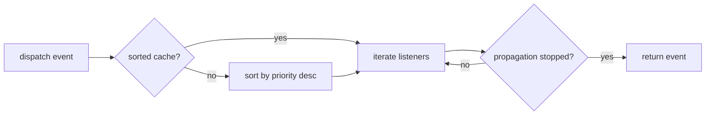
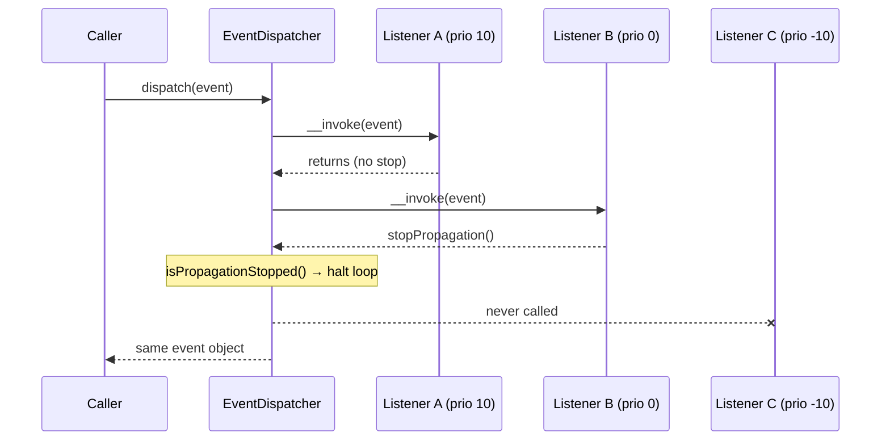

# Event Dispatcher & Kernel Events

!!! tip "In a nutshell"
    L'EventDispatcher est ce qui permet à Symfony de rester découplé : le code
    dispatche un objet event et un nombre quelconque de listeners y réagissent.
    L'essentiel à retenir : **une priorité plus élevée s'exécute en premier**,
    `dispatch()` prend **l'objet event en premier** (PSR-14), et un subscriber
    déclare ses events dans `getSubscribedEvents()`.

!!! example "Real-world analogy"
    Le dispatcher est une **tour de contrôle d'aéroport**. Quand quelque chose se
    produit, elle **diffuse** l'information à tous les listeners à l'écoute de cette
    fréquence — mais pas au hasard : les appareils (listeners) de plus haute
    **priorité** sont autorisés en premier. N'importe quel listener peut appeler
    `stopPropagation()` — comme la tour qui ferme la piste — et ceux encore en file
    d'attente restent au sol. La tour ne pilote jamais les avions elle-même ; elle
    coordonne seulement qui agit et dans quel ordre.

!!! abstract "Learning objectives"
    À la fin de ce chapitre, vous saurez :

    - [ ] Expliquer comment `EventDispatcher` stocke, trie et invoque les listeners.
    - [ ] Choisir entre un **listener** et un **subscriber** et enregistrer les deux correctement.
    - [ ] Utiliser les priorités et `stopPropagation()` de façon délibérée.
    - [ ] Réciter le catalogue des kernel events et leurs classes d'event.

    **Syllabus:** `Symfony Architecture → Event Dispatcher` ·
    **Level:** Expert ·
    **Est. time:** 35 min ·
    **Prerequisites:** [Request Handling](request-handling.md)

---

## Theory

L'**EventDispatcher** implémente le pattern *mediator* : le code dispatche un objet
event nommé, et un nombre quelconque de **listeners** découplés y réagissent. Tout
le modèle d'extensibilité de Symfony — le kernel, la sécurité, les forms, la
console — repose dessus.

Deux façons d'attacher un comportement :

- **Listener** — un callable enregistré sur *un seul* nom d'event.
- **Subscriber** — une classe implémentant `EventSubscriberInterface` qui déclare
  *tous* les events qu'elle gère dans une seule méthode statique.

## Deep Dive — how it works internally

!!! question "Predict first"
    Trois listeners sont enregistrés sur `kernel.response` avec les priorités `10`,
    `0` et `-10`. Dans quel ordre s'exécutent-ils, et que se passe-t-il si celui de
    priorité `0` appelle `stopPropagation()` ?

??? note "Reveal"
    Du plus haut au plus bas : `10`, puis `0`, puis `-10`. La vérification a lieu
    *avant* chaque appel, donc le listener `0` s'exécute encore entièrement, mais
    `stopPropagation()` fait que le listener `-10` n'est jamais invoqué. Les
    listeners déjà exécutés ne sont pas « rembobinés ».

### Classes & interfaces

| Rôle | FQCN |
|---|---|
| Dispatcher | `Symfony\Component\EventDispatcher\EventDispatcher` |
| Contrat | `Symfony\Contracts\EventDispatcher\EventDispatcherInterface` (étend PSR-14) |
| Event de base | `Symfony\Contracts\EventDispatcher\Event` |
| Subscriber | `Symfony\Component\EventDispatcher\EventSubscriberInterface` |
| Attribut de listener | `Symfony\Component\EventDispatcher\Attribute\AsEventListener` |
| Noms du kernel | `Symfony\Component\HttpKernel\KernelEvents` |

`EventDispatcherInterface` étend l'interface PSR-14 `Psr\EventDispatcher\EventDispatcherInterface`,
donc `dispatch()` prend **l'objet event en premier** : `dispatch(object $event, ?string $eventName = null): object`.
Quand aucun nom n'est fourni, c'est le nom de classe de l'event qui est utilisé.

```php
use Symfony\Contracts\EventDispatcher\EventDispatcherInterface;

final class OrderService
{
    public function __construct(private EventDispatcherInterface $dispatcher) {}

    public function place(): void
    {
        // PSR-14 order: event object first, name optional
        $event = $this->dispatcher->dispatch(new OrderPlacedEvent());
        // no name given -> the class name OrderPlacedEvent::class was used
    }
}
```

### How listeners are stored and sorted

En interne, le dispatcher maintient `listeners[eventName][priority][] = callable`
et un cache parallèle `sorted[eventName]`. Au premier dispatch d'un event, il trie
par **priorité décroissante** — *la priorité la plus élevée s'exécute en premier* ;
à priorité égale, l'ordre d'enregistrement s'applique. La liste triée est mémoïsée
jusqu'à ce qu'un listener soit ajouté ou retiré.

```php
$dispatcher = new EventDispatcher();

// stored as listeners['app.order'][priority][] = callable
$dispatcher->addListener('app.order', $auditListener, 10);    // runs first
$dispatcher->addListener('app.order', $mailListener);         // default priority 0
$dispatcher->addListener('app.order', $cleanupListener, -10); // runs last

// first dispatch sorts by priority desc and memoises into sorted['app.order']
$dispatcher->dispatch(new OrderEvent(), 'app.order');
```



### Stopping propagation

N'importe quel listener peut appeler `$event->stopPropagation()`. Avant d'invoquer
chaque listener, le dispatcher vérifie `$event->isPropagationStopped()` et
interrompt la boucle. C'est l'objet event lui-même qui porte ce drapeau — il doit
étendre l'`Event` des contracts.

```php
use Symfony\Contracts\EventDispatcher\Event;

// The event must extend the contracts Event to carry the flag
final class OrderPlacedEvent extends Event {}

$listener = function (OrderPlacedEvent $event): void {
    $event->stopPropagation(); // remaining listeners will be skipped
};

// checked by the dispatcher before invoking each listener:
// if ($event->isPropagationStopped()) { break; }
```



Les listeners s'exécutent par priorité **décroissante** ; la vérification a lieu
*avant* chaque appel, donc `B` s'exécute encore entièrement mais `C` est sauté. Les
listeners déjà invoqués ne sont jamais « rembobinés » — la propagation n'empêche
que les listeners *restants*.

### Compile-time registration

Vous appelez rarement `addListener()` à l'exécution. Le compiler pass
`RegisterListenersPass` scanne les services taggés `kernel.event_listener` /
`kernel.event_subscriber` (et les attributs `#[AsEventListener]`) et les câble dans
le dispatcher **au moment de la compilation du container**. Les listeners sont
instanciés de manière **lazy** — le service n'est construit que lorsque son event
se déclenche réellement, ce qui garde un démarrage peu coûteux.

```yaml
# config/services.yaml — tags scanned by RegisterListenersPass at compile time
services:
    App\EventListener\LegacyRequestListener:
        tags:
            - { name: kernel.event_listener, event: kernel.request, priority: 5 }

    App\EventSubscriber\AuditSubscriber:
        tags: ['kernel.event_subscriber']

# Modern equivalent: #[AsEventListener] on the class — no runtime addListener() calls
```

!!! note "Source reference"
    `Symfony\Component\EventDispatcher\EventDispatcher::dispatch()` et
    `RegisterListenersPass` —
    [symfony/symfony `8.0`](https://github.com/symfony/symfony/blob/8.0/src/Symfony/Component/EventDispatcher/EventDispatcher.php).

### The kernel-events catalogue

| Constante | Classe d'event | Déclenché quand |
|---|---|---|
| `REQUEST` | `RequestEvent` | Au début de chaque request |
| `CONTROLLER` | `ControllerEvent` | Controller résolu |
| `CONTROLLER_ARGUMENTS` | `ControllerArgumentsEvent` | Arguments résolus |
| `VIEW` | `ViewEvent` | Le controller a renvoyé autre chose qu'une Response |
| `RESPONSE` | `ResponseEvent` | Avant de renvoyer la response |
| `FINISH_REQUEST` | `FinishRequestEvent` | À la fin de chaque (sous-)request |
| `EXCEPTION` | `ExceptionEvent` | Une exception s'est échappée |
| `TERMINATE` | `TerminateEvent` | Après l'envoi de la response |

Voir [Request Handling](request-handling.md) pour leur ordre d'exécution.

### Null behavior

`dispatch(object $event, ?string $eventName = null): object` **renvoie toujours le
même objet event** — même quand *aucun* listener n'est enregistré et même quand
tous les listeners l'ont laissé intact. Passer `null` pour `$eventName` (ou
l'omettre) est le cas normal : le dispatcher retombe sur le nom de classe de
l'event. Les listeners eux-mêmes renvoient `void` ; la seule façon pour un résultat
d'atteindre l'appelant est de *muter* l'event, que vous relisez donc sur l'objet
renvoyé (`$response = $dispatcher->dispatch($event)`). Si un listener n'appelle
jamais un setter — `setResponse()` sur un kernel event, par exemple — l'event
revient simplement inchangé : pas d'erreur, pas de retour `null`. Le bug classique
consiste à attendre que `dispatch()` renvoie la valeur de retour d'un listener ; ce
n'est jamais le cas — il renvoie l'event que vous lui avez passé.

```php
// dispatch() always returns the SAME event object you passed in
$event = new OrderPlacedEvent();
$returned = $dispatcher->dispatch($event);

var_dump($returned === $event); // true — even with zero listeners

// results travel only by mutation, e.g. a kernel listener calling setResponse();
// dispatch() never hands back a listener's return value
```

!!! note "Null in real life"
    Un event sans listener est un **appel radio de la tour auquel personne ne
    répond** : le message part quand même et vous revient inchangé — le silence
    n'est pas une erreur.

!!! info "Expert note"
    Les listeners sont enregistrés de manière **lazy** : `RegisterListenersPass`
    stocke l'*id* du service, pas une instance, donc l'objet listener n'est
    construit que la première fois où son event se déclenche réellement. C'est
    pourquoi un constructeur coûteux sur un listener rarement déclenché ne coûte
    rien sur le chemin critique — et pourquoi vous ne devez jamais faire de vrai
    travail dans le `getSubscribedEvents()` d'un subscriber (il est appelé au moment
    de la **compilation** du container).

??? example "Debugging story"
    **Symptôme :** un listener de headers de sécurité a cessé silencieusement
    d'ajouter des headers après un refactoring. **Diagnostic :** un nouveau listener
    `kernel.response` de plus haute priorité appelait `stopPropagation()`
    inconditionnellement, donc les listeners de priorité inférieure ne s'exécutaient
    jamais. `php bin/console debug:event-dispatcher kernel.response` a révélé
    l'ordre réel et l'entrée fautive à haute priorité. **Correctif :** supprimer le
    `stopPropagation()` systématique (il n'avait de sens que sur `kernel.request`)
    et définir des priorités explicites. **À éviter :** n'appelez
    `stopPropagation()` que sur des events que vous possédez vraiment.

??? abstract "Source-code tour"
    - `Symfony\Component\EventDispatcher\EventDispatcher::dispatch()` récupère la
      liste triée des listeners et invoque chacun jusqu'à l'arrêt de la propagation.
    - `EventDispatcher::sortListeners()` ordonne `listeners[eventName][priority]`
      par ordre décroissant et mémoïse le résultat dans `sorted[eventName]`.
    - `Symfony\Contracts\EventDispatcher\Event::stopPropagation()` /
      `isPropagationStopped()` portent le drapeau d'arrêt vérifié avant chaque appel.
    - `Symfony\Component\EventDispatcher\DependencyInjection\RegisterListenersPass`
      câble les services taggés et les attributs `#[AsEventListener]` à la compilation.
    - `Symfony\Component\EventDispatcher\EventSubscriberInterface::getSubscribedEvents()`
      est lue par le même pass pour enregistrer les handlers d'un subscriber.

## Configuration & code

=== "PHP Attributes"

    ```php
    <?php
    declare(strict_types=1);

    namespace App\EventListener;

    use Symfony\Component\EventDispatcher\Attribute\AsEventListener;
    use Symfony\Component\HttpKernel\Event\RequestEvent;
    use Symfony\Component\HttpKernel\KernelEvents;

    // Method-level attribute: no interface, no manual tagging.
    final class LocaleListener
    {
        #[AsEventListener(event: KernelEvents::REQUEST, priority: 15)]
        public function onRequest(RequestEvent $event): void
        {
            $event->getRequest()->setLocale('en');
        }
    }
    ```

=== "Subscriber"

    ```php
    <?php
    declare(strict_types=1);

    namespace App\EventSubscriber;

    use Symfony\Component\EventDispatcher\EventSubscriberInterface;
    use Symfony\Component\HttpKernel\Event\ResponseEvent;
    use Symfony\Component\HttpKernel\KernelEvents;

    final class ResponseSubscriber implements EventSubscriberInterface
    {
        public static function getSubscribedEvents(): array
        {
            return [
                // event => [method, priority]
                KernelEvents::RESPONSE => ['onResponse', -10],
            ];
        }

        public function onResponse(ResponseEvent $event): void
        {
            $event->getResponse()->headers->set('X-App', '1');
        }
    }
    ```

=== "Console"

    ```console
    $ php bin/console debug:event-dispatcher kernel.response
    ```

## Best practices & anti-patterns

| ✅ À faire | ❌ À éviter |
|---|---|
| Utiliser `#[AsEventListener]` pour les listeners ponctuels | `addListener()` manuel dans le code applicatif |
| Utiliser un subscriber quand une classe gère plusieurs events | Éparpiller des handlers liés dans plusieurs fichiers |
| Définir des priorités explicites quand l'ordre compte | Se fier à l'ordre d'enregistrement |
| `stopPropagation()` seulement quand vous possédez vraiment l'event | Stopper silencieusement les listeners des autres |

## When (not) to use it / alternatives

Utilisez les events pour des réactions **transversales et découplées** où vous ne
contrôlez pas l'appelant (ou ne voulez pas vous y coupler). Quand vous contrôlez
les deux côtés *et* qu'il vous faut une valeur de retour, un appel de service
direct ou le composant **Messenger** (pour l'asynchrone) est plus clair qu'un
event.

!!! danger "Certification traps"
    - **Priorité plus élevée = plus tôt.** La priorité par défaut est `0`.
    - `dispatch()` suit PSR-14 : **l'objet event en premier**, le nom optionnel.
    - La valeur du tableau d'un subscriber peut être une méthode sous forme de
      chaîne, `[method, priority]`, ou une liste de paires `[method, priority]` pour
      plusieurs handlers du même event.
    - Les listeners sont **lazy** — le service n'est construit que lorsque son
      event se déclenche.

!!! warning "Common mistakes"
    - Implémenter `EventSubscriberInterface` en oubliant que `getSubscribedEvents()`
      renvoie des **noms d'events → handlers** (et non l'inverse).
    - Attendre de `stopPropagation()` qu'il annule la request — il ne stoppe que les
      listeners restants de *cet* event.

## Exercises

1. **(Advanced)** Convertissez un subscriber à deux events en deux méthodes
   `#[AsEventListener]` et vérifiez un comportement identique avec
   `debug:event-dispatcher`.
2. **(Expert)** Étant donné trois listeners `kernel.response` de priorités `10`,
   `0`, `-10`, indiquez l'ordre d'invocation.

??? success "Solutions"

    **1.** Déplacez chaque handler sur une méthode publique annotée avec
    `#[AsEventListener(event: ..., priority: ...)]` et supprimez l'interface. Le
    `RegisterListenersPass` câble les listeners par attribut de façon identique.

    **2.** `10` → `0` → `-10` (priorité décroissante).

## Certification questions

??? question "Q1. What does a higher listener priority mean?"
    - [x] A. It runs earlier ✅
    - [ ] B. It runs later
    - [ ] C. It cannot be stopped

    **Why:** Les listeners sont triés par priorité **décroissante**. **Ref:**
    [EventDispatcher](https://symfony.com/doc/current/components/event_dispatcher.html#connecting-listeners).

??? question "Q2. What is the signature of `dispatch()` in Symfony 8?"
    - [x] A. `dispatch(object $event, ?string $eventName = null)` ✅
    - [ ] B. `dispatch(string $eventName, Event $event)`
    - [ ] C. `dispatch(Event $event, string $eventName)` (name required)

    **Why:** Symfony suit PSR-14 : l'objet event en premier, le nom optionnel. **Ref:**
    [Generic events](https://symfony.com/doc/current/components/event_dispatcher.html).

??? question "Q3. Which method must a subscriber implement?"
    - [x] A. `public static function getSubscribedEvents(): array` ✅
    - [ ] B. `public function subscribe(): array`
    - [ ] C. `#[AsEventSubscriber]`

    **Why:** `EventSubscriberInterface` définit cette méthode statique. **Ref:**
    [Event subscribers](https://symfony.com/doc/current/event_dispatcher.html#creating-an-event-subscriber).

## Key takeaways

- Le dispatcher trie par priorité (décroissante), mémoïse, et invoque des listeners construits de manière lazy.
- Listener = un event ; subscriber = plusieurs events dans `getSubscribedEvents()`.
- `dispatch(object, ?name)` — ordre PSR-14.
- `stopPropagation()` n'arrête que les listeners restants de l'event en cours.

## Last-minute revision

!!! tip "Cheat sheet"
    - Enregistrement : `#[AsEventListener]`, tag `kernel.event_listener`, ou subscriber.
    - `getSubscribedEvents(): array` → `[EventName => 'method' | ['method', prio] | [['m',prio],…]]`.
    - Priorité par défaut `0` ; la plus haute en premier.
    - Compilé par `RegisterListenersPass`.

## Connections

- **Depends on:** [Dependency Injection](../dependency-injection/index.md) — les listeners et subscribers sont compilés dans le dispatcher par `RegisterListenersPass`.
- **Reused in:** [Request Handling](request-handling.md) — le cycle de vie du kernel est dispatché via ce composant ; [Exception Handling](exception-handling.md) se branche sur `kernel.exception`.
- **Confused with:** [Interoperability & PSRs](psr.md) — le dispatcher de Symfony *implémente* PSR-14 mais y ajoute les priorités et `stopPropagation()`.

## Official References
- [Official docs — EventDispatcher](https://symfony.com/doc/current/components/event_dispatcher.html)
- [Official docs — Events reference](https://symfony.com/doc/current/reference/events.html)
- [Symfony source — EventDispatcher](https://github.com/symfony/symfony/blob/8.0/src/Symfony/Component/EventDispatcher/EventDispatcher.php)

## Video references

!!! tip "Watch & learn"
    Voici des chaînes vidéo officielles, mises à jour en continu — cherchez-y
    « Symfony architecture » pour consolider ce chapitre. Nous lions des chaînes
    stables plutôt que des vidéos individuelles pour que les références ne se
    périment jamais.

    - [SymfonyCasts screencasts](https://symfonycasts.com/tracks/symfony) — tutoriels scénarisés, à coder en suivant.
    - [Symfony official YouTube](https://www.youtube.com/@SymfonyOfficial) — conférences et keynotes des SymfonyCon.
    - [Official docs for this topic](https://symfony.com/doc/current/components/event_dispatcher.html#connecting-listeners) — certaines pages de la doc Symfony intègrent un screencast.

## Confidence check

Je suis prêt quand je peux :

- [ ] expliquer **pourquoi** le dispatcher découple les appelants des réactions (le pattern mediator)
- [ ] implémenter à la fois un `#[AsEventListener]` et un `EventSubscriberInterface`
- [ ] déboguer un listener qui ne s'exécute jamais à cause de la priorité ou de `stopPropagation()`
- [ ] repérer que `dispatch()` renvoie **l'objet event**, pas la valeur d'un listener
- [ ] expliquer comment les listeners sont stockés, triés par priorité et invoqués de manière lazy

---

<small>Related: [Request Handling](request-handling.md) · [Exception Handling](exception-handling.md) · [Components](components.md)</small>
