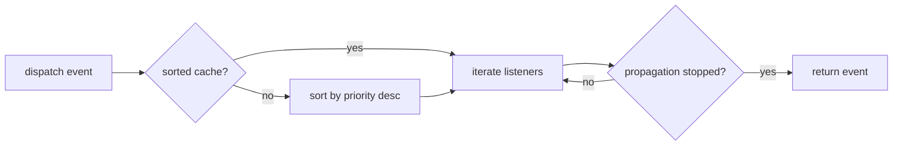

# Event Dispatcher & Kernel Events

!!! abstract "Learning objectives"
    By the end of this chapter you can:

    - [ ] Explain how `EventDispatcher` stores, sorts and invokes listeners.
    - [ ] Choose between a **listener** and a **subscriber** and register both correctly.
    - [ ] Use priorities and `stopPropagation()` deliberately.
    - [ ] Recite the kernel-events catalogue and their event classes.

    **Syllabus:** `Symfony Architecture → Event Dispatcher` ·
    **Level:** Expert ·
    **Est. time:** 35 min ·
    **Prerequisites:** [Request Handling](request-handling.md)

---

## Theory

The **EventDispatcher** implements the *mediator* pattern: code dispatches a named
event object, and any number of decoupled **listeners** react. Symfony's whole
extensibility model — the kernel, security, forms, console — is built on it.

Two ways to attach behaviour:

- **Listener** — a callable registered against *one* event name.
- **Subscriber** — a class implementing `EventSubscriberInterface` that declares
  *all* the events it handles in one static method.

## Deep Dive — how it works internally

### Classes & interfaces

| Role | FQCN |
|---|---|
| Dispatcher | `Symfony\Component\EventDispatcher\EventDispatcher` |
| Contract | `Symfony\Contracts\EventDispatcher\EventDispatcherInterface` (extends PSR-14) |
| Base event | `Symfony\Contracts\EventDispatcher\Event` |
| Subscriber | `Symfony\Component\EventDispatcher\EventSubscriberInterface` |
| Listener attribute | `Symfony\Component\EventDispatcher\Attribute\AsEventListener` |
| Kernel names | `Symfony\Component\HttpKernel\KernelEvents` |

`EventDispatcherInterface` extends the PSR-14 `Psr\EventDispatcher\EventDispatcherInterface`,
so `dispatch()` takes the **event object first**: `dispatch(object $event, ?string $eventName = null): object`.
When no name is given, the event's class name is used.

### How listeners are stored and sorted

Internally the dispatcher keeps `listeners[eventName][priority][] = callable` and a
parallel `sorted[eventName]` cache. On first dispatch for an event it sorts by
**priority descending** — *higher priority runs first*; equal priorities run in
registration order. The sorted list is memoised until a listener is added/removed.



### Stopping propagation

Any listener can call `$event->stopPropagation()`. Before invoking each listener
the dispatcher checks `$event->isPropagationStopped()` and stops the loop. The
event object itself carries this flag — it must extend the contracts `Event`.

### Compile-time registration

You rarely call `addListener()` at runtime. The `RegisterListenersPass` compiler
pass scans services tagged `kernel.event_listener` / `kernel.event_subscriber`
(and `#[AsEventListener]` attributes) and wires them into the dispatcher **at
container compile time**. Listeners are instantiated **lazily** — the service is
only constructed when its event actually fires, which keeps boot cheap.

!!! note "Source reference"
    `Symfony\Component\EventDispatcher\EventDispatcher::dispatch()` and
    `RegisterListenersPass` —
    [symfony/symfony `8.0`](https://github.com/symfony/symfony/blob/8.0/src/Symfony/Component/EventDispatcher/EventDispatcher.php).

### The kernel-events catalogue

| Constant | Event class | Fired when |
|---|---|---|
| `REQUEST` | `RequestEvent` | Start of every request |
| `CONTROLLER` | `ControllerEvent` | Controller resolved |
| `CONTROLLER_ARGUMENTS` | `ControllerArgumentsEvent` | Arguments resolved |
| `VIEW` | `ViewEvent` | Controller returned a non-Response |
| `RESPONSE` | `ResponseEvent` | Before returning the response |
| `FINISH_REQUEST` | `FinishRequestEvent` | End of each (sub)request |
| `EXCEPTION` | `ExceptionEvent` | An exception escaped |
| `TERMINATE` | `TerminateEvent` | After the response is sent |

See [Request Handling](request-handling.md) for their execution order.

## Configuration & code

=== "PHP Attributes"

    ```php
    <?php
    declare(strict_types=1);

    namespace App\EventListener;

    use Symfony\Component\EventDispatcher\Attribute\AsEventListener;
    use Symfony\Component\HttpKernel\Event\RequestEvent;
    use Symfony\Component\HttpKernel\KernelEvents;

    // Method-level attribute: no interface, no manual tagging.
    final class LocaleListener
    {
        #[AsEventListener(event: KernelEvents::REQUEST, priority: 15)]
        public function onRequest(RequestEvent $event): void
        {
            $event->getRequest()->setLocale('en');
        }
    }
    ```

=== "Subscriber"

    ```php
    <?php
    declare(strict_types=1);

    namespace App\EventSubscriber;

    use Symfony\Component\EventDispatcher\EventSubscriberInterface;
    use Symfony\Component\HttpKernel\Event\ResponseEvent;
    use Symfony\Component\HttpKernel\KernelEvents;

    final class ResponseSubscriber implements EventSubscriberInterface
    {
        public static function getSubscribedEvents(): array
        {
            return [
                // event => [method, priority]
                KernelEvents::RESPONSE => ['onResponse', -10],
            ];
        }

        public function onResponse(ResponseEvent $event): void
        {
            $event->getResponse()->headers->set('X-App', '1');
        }
    }
    ```

=== "Console"

    ```console
    $ php bin/console debug:event-dispatcher kernel.response
    ```

## Best practices & anti-patterns

| ✅ Do | ❌ Avoid |
|---|---|
| Use `#[AsEventListener]` for one-off listeners | Manual `addListener()` in app code |
| Use a subscriber when one class handles many events | Splitting related handlers across files |
| Set explicit priorities when order matters | Relying on registration order |
| `stopPropagation()` only when you truly own the event | Silently stopping others' listeners |

## When (not) to use it / alternatives

Use events for **cross-cutting, decoupled** reactions where you don't control (or
don't want to couple to) the caller. When you *do* control both sides and need a
return value, a direct service call or the **Messenger** component (for async) is
clearer than an event.

!!! danger "Certification traps"
    - **Higher priority = earlier.** Default priority is `0`.
    - `dispatch()` is PSR-14: **event object first**, name optional.
    - A subscriber's array value can be a string method, `[method, priority]`, or a
      list of `[method, priority]` pairs for multiple handlers of the same event.
    - Listeners are **lazy** — the service isn't built until its event fires.

!!! warning "Common mistakes"
    - Implementing `EventSubscriberInterface` but forgetting `getSubscribedEvents()`
      returns event **names → handlers** (not the reverse).
    - Expecting `stopPropagation()` to cancel the request — it only stops *this*
      event's remaining listeners.

## Exercises

1. **(Advanced)** Convert a two-event subscriber into two `#[AsEventListener]`
   methods and confirm identical behaviour with `debug:event-dispatcher`.
2. **(Expert)** Given three `kernel.response` listeners with priorities `10`, `0`,
   `-10`, state the invocation order.

??? success "Solutions"

    **1.** Move each handler onto a public method annotated with
    `#[AsEventListener(event: ..., priority: ...)]` and delete the interface. The
    `RegisterListenersPass` wires attribute-based listeners identically.

    **2.** `10` → `0` → `-10` (descending priority).

## Certification questions

??? question "Q1. What does a higher listener priority mean?"
    - [x] A. It runs earlier ✅
    - [ ] B. It runs later
    - [ ] C. It cannot be stopped

    **Why:** Listeners are sorted by priority **descending**. **Ref:**
    [EventDispatcher](https://symfony.com/doc/current/components/event_dispatcher.html#connecting-listeners).

??? question "Q2. What is the signature of `dispatch()` in Symfony 8?"
    - [x] A. `dispatch(object $event, ?string $eventName = null)` ✅
    - [ ] B. `dispatch(string $eventName, Event $event)`
    - [ ] C. `dispatch(Event $event, string $eventName)` (name required)

    **Why:** Symfony follows PSR-14: event object first, name optional. **Ref:**
    [Generic events](https://symfony.com/doc/current/components/event_dispatcher.html).

??? question "Q3. Which method must a subscriber implement?"
    - [x] A. `public static function getSubscribedEvents(): array` ✅
    - [ ] B. `public function subscribe(): array`
    - [ ] C. `#[AsEventSubscriber]`

    **Why:** `EventSubscriberInterface` defines the static method. **Ref:**
    [Event subscribers](https://symfony.com/doc/current/event_dispatcher.html#creating-an-event-subscriber).

## Key takeaways

- Dispatcher sorts by priority (desc), memoises, and invokes lazily-built listeners.
- Listener = one event; subscriber = many events in `getSubscribedEvents()`.
- `dispatch(object, ?name)` — PSR-14 order.
- `stopPropagation()` halts only the current event's remaining listeners.

## Last-minute revision

!!! tip "Cheat sheet"
    - Register: `#[AsEventListener]`, tag `kernel.event_listener`, or subscriber.
    - `getSubscribedEvents(): array` → `[EventName => 'method' | ['method', prio] | [['m',prio],…]]`.
    - Default priority `0`; higher first.
    - Compiled by `RegisterListenersPass`.

## Official References
- [Official docs — EventDispatcher](https://symfony.com/doc/current/components/event_dispatcher.html)
- [Official docs — Events reference](https://symfony.com/doc/current/reference/events.html)
- [Symfony source — EventDispatcher](https://github.com/symfony/symfony/blob/8.0/src/Symfony/Component/EventDispatcher/EventDispatcher.php)

---

<small>Related: [Request Handling](request-handling.md) · [Exception Handling](exception-handling.md) · [Components](components.md)</small>
