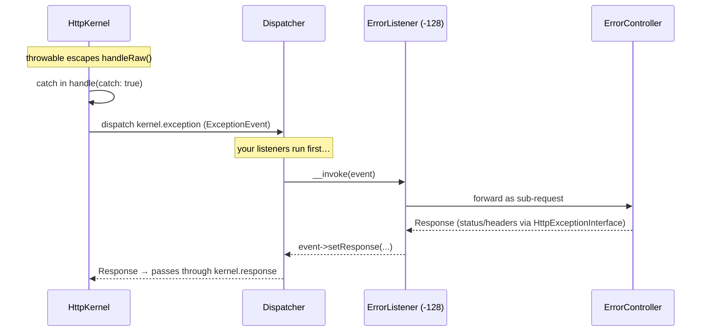
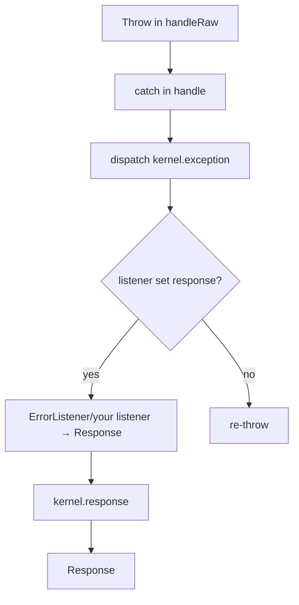

# Exception Handling

!!! tip "In a nutshell"
    Quand une exception non attrapée s'échappe, le kernel l'attrape et dispatche
    `kernel.exception` pour qu'un listener la transforme en `Response`. L'essentiel
    à retenir : `ErrorListener` s'exécute à la priorité **-128** (les vôtres passent
    avant), et seule `HttpExceptionInterface` porte un code de statut — tout le
    reste devient un **500**.

!!! example "Real-world analogy"
    Une exception non attrapée est une **alarme incendie** qui se déclenche dans
    l'immeuble. Le kernel détecte la fumée et diffuse `kernel.exception` aux
    intervenants (les listeners). Vos propres intervenants ont la priorité ; la
    **brigade incendie par défaut de l'immeuble** (`ErrorListener`, priorité `-128`)
    n'intervient que si personne d'autre n'a agi. Le code de statut de l'exception
    est le **niveau de gravité** sur le panneau d'alarme — et si aucun intervenant
    n'agit du tout, l'alarme continue de sonner (l'exception est relancée).

!!! abstract "Learning objectives"
    À la fin de ce chapitre, vous saurez :

    - [ ] Retracer comment une exception non attrapée devient une `Response` HTTP.
    - [ ] Expliquer le rôle d'`ErrorListener`, de `kernel.exception` et de l'error controller.
    - [ ] Associer la classe d'une exception à un code de statut via `HttpExceptionInterface`.
    - [ ] Personnaliser les pages et le comportement d'erreur en toute sécurité.

    **Syllabus:** `Symfony Architecture → Exception Handling` ·
    **Level:** Expert ·
    **Est. time:** 30 min ·
    **Prerequisites:** [Request Handling](request-handling.md), [Events](events.md)

---

## Pour les nuls

### L'idée en une phrase
Une exception non attrapée déclenche une alarme incendie interne (`kernel.exception`) que Symfony écoute pour la transformer en page d'erreur propre, au lieu de laisser planter l'application.

### Imagine dans la vraie vie
Une alarme incendie retentit dans un bâtiment. Le kernel capte la fumée et diffuse l'alerte à tous les secouristes (les listeners). Tes propres secouristes interviennent en premier ; les pompiers par défaut du bâtiment (`ErrorListener`, priorité -128) n'agissent que si personne d'autre ne l'a fait.

### Dans Symfony
Une `NotFoundHttpException` lancée dans un contrôleur devient automatiquement une page 404 stylée — sans que tu aies écrit le moindre code pour la transformer en réponse HTTP.

### Exemple simple
```php
throw new NotFoundHttpException('Produit introuvable.');
// → devient automatiquement une réponse 404, grâce à HttpExceptionInterface
```

### Comment le mémoriser 🧠
Seule une exception qui implémente `HttpExceptionInterface` porte un code de statut précis — toutes les autres deviennent une **500** par défaut. Retiens : "pas d'étiquette HTTP = urgence générique."


## Theory

Quand du code du cycle de la request lève une exception qui n'est pas attrapée, le
kernel doit tout de même produire une `Response`. Il le fait en dispatchant l'event
**`kernel.exception`** ; un listener convertit l'exception en response. La response
candidate vaut sinon `500` par défaut, sauf si l'exception porte son propre code de
statut.

```php
use Symfony\Component\HttpFoundation\Response;
use Symfony\Component\HttpKernel\Event\ExceptionEvent;

// A kernel.exception listener turns the throwable into a Response
final class FallbackExceptionListener
{
    public function __invoke(ExceptionEvent $event): void
    {
        $event->setResponse(new Response('Something broke.', 500));
    }
}
```

## Deep Dive — how it works internally

!!! question "Predict first"
    Un listener `kernel.exception` lit `getThrowable()`, ne correspond à aucune de
    ses branches, et se termine sans appeler `setResponse()`. Que voit le client ?

??? note "Reveal"
    Rien de personnalisé. La response de l'event reste `null`, donc `ErrorListener`
    (priorité `-128`) la remplit avec la page d'erreur par défaut. Si vous aviez
    aussi désactivé `ErrorListener`, le kernel relance l'exception et le client
    reçoit un `500` brut.

### The catch in `handleRaw()`

`HttpKernel::handle(..., catch: true)` enveloppe `handleRaw()` dans un `try/catch`.
Sur une exception, il appelle `handleThrowable()`, qui dispatche un
`Symfony\Component\HttpKernel\Event\ExceptionEvent`. Si un listener définit une
response via `$event->setResponse()`, cette response est renvoyée (en passant
toujours par `kernel.response`) ; sinon, l'exception est relancée. Avec
`catch: false` (souvent utilisé dans les sous-requests et les tests), l'exception
se propage simplement.

```php
// HttpKernel::handle() — catch: true wraps handleRaw() in a try/catch
$response = $kernel->handle($request, HttpKernelInterface::MAIN_REQUEST, catch: true);

// On a throwable, handleThrowable() dispatches an ExceptionEvent;
// a listener may convert it by calling $event->setResponse($response)

// with catch: false the exception simply propagates to the caller
$response = $kernel->handle($request, HttpKernelInterface::SUB_REQUEST, catch: false);
```

### ErrorListener — the default converter

`Symfony\Component\HttpKernel\EventListener\ErrorListener` est enregistré sur
`kernel.exception`. Il :

1. journalise l'exception,
2. transmet à l'**error controller** sous forme de *sous-request*, et
3. définit la response obtenue sur l'event.

Il s'exécute aussi à une **priorité basse (`-128`)**, de sorte que vos propres
listeners `kernel.exception` ont la première chance de gérer ou de transformer
l'exception.



Si l'un de vos listeners de plus haute priorité définit une response en premier,
`ErrorListener` voit qu'une response est déjà définie et ne fait rien ; si aucun ne
le fait, `ErrorListener` produit la page d'erreur de repli (ou le chemin de relance
quand `catch` vaut `false`).

### HttpExceptionInterface → status code

`Symfony\Component\HttpKernel\Exception\HttpExceptionInterface` expose
`getStatusCode(): int` et `getHeaders(): array`. Quand l'exception l'implémente,
`ErrorListener` / l'error controller utilisent ce code de statut et ces headers ;
sinon, la response est un `500`. Les classes intégrées courantes :

```php
use Symfony\Component\HttpKernel\Exception\HttpException;
use Symfony\Component\HttpKernel\Exception\HttpExceptionInterface;

$e = new HttpException(429, 'Too Many Requests', headers: ['Retry-After' => '60']);

if ($e instanceof HttpExceptionInterface) {
    $status  = $e->getStatusCode(); // 429 — used by ErrorListener
    $headers = $e->getHeaders();    // ['Retry-After' => '60']
}
// any other throwable -> 500
```

| Exception | Statut |
|---|---|
| `NotFoundHttpException` | 404 |
| `AccessDeniedHttpException` | 403 |
| `BadRequestHttpException` | 400 |
| `MethodNotAllowedHttpException` | 405 |
| `HttpException` (générique) | quelconque (argument du constructeur) |

L'`AccessDeniedException` de la sécurité (une classe *différente*,
`Symfony\Component\Security\Core\Exception\AccessDeniedException`) est traduite par
le firewall en `403` (ou en redirection vers le login pour les utilisateurs
anonymes) — elle n'est pas elle-même une `HttpExceptionInterface`.

### The error controller

Le service `error_controller` par défaut est
`Symfony\Component\HttpKernel\Controller\ErrorController`. Il rend une exception
via l'error renderer configuré. En `dev`, vous obtenez la page d'exception
détaillée ; en `prod`, une page propre au code de statut. TwigBundle permet de
surcharger les templates par chemin :
`templates/bundles/TwigBundle/Exception/error404.html.twig` (repli :
`error.html.twig`).

```yaml
# config/packages/framework.yaml
framework:
    # default: Symfony\Component\HttpKernel\Controller\ErrorController
    error_controller: App\Controller\ApiErrorController

# Twig template overrides (TwigBundle):
#   templates/bundles/TwigBundle/Exception/error404.html.twig  # status-specific
#   templates/bundles/TwigBundle/Exception/error.html.twig     # generic fallback
```



!!! note "Source reference"
    `Symfony\Component\HttpKernel\EventListener\ErrorListener` et
    `HttpException` —
    [symfony/symfony `8.0`](https://github.com/symfony/symfony/blob/8.0/src/Symfony/Component/HttpKernel/EventListener/ErrorListener.php).

### Compilation vs runtime

L'error controller, les renderers et `ErrorListener` sont câblés à la compilation
par FrameworkBundle. À l'exécution, seuls le dispatch et la sous-request ont lieu.
La page d'exception de `dev` dépend de `kernel.debug = true`, résolu au démarrage.

### Null behavior

Sur `kernel.exception`, une response n'est **pas** garantie :
`ExceptionEvent::getResponse()` renvoie `?Response` et reste `null` jusqu'à ce
qu'un listener appelle `setResponse()`. Après le dispatch, `handleThrowable()`
vérifie `$event->hasResponse()` ; si elle n'est toujours pas définie, le kernel
**relance** le throwable d'origine, qui — avec `catch: true` — parvient au client
sous forme de `500`. En pratique, `ErrorListener` (priorité `-128`) comble ce
manque, si bien que le cas `null` ne pose problème que lorsque vous le remplacez ou
le désactivez. Le bug classique : un listener qui inspecte `getThrowable()` mais
oublie `setResponse()` pour sa branche — la response de l'event reste `null`, donc
votre page personnalisée n'apparaît jamais et c'est la page par défaut (ou un 500)
qui l'emporte.

```php
public function __invoke(ExceptionEvent $event): void
{
    $e = $event->getThrowable();

    // getResponse() stays null until a listener calls setResponse()
    if ($e instanceof PaymentFailedException) {
        $event->setResponse(new JsonResponse(['error' => 'payment'], 402));
    }
    // no setResponse() here -> handleThrowable() sees hasResponse() === false
    // and re-throws the original throwable (surfacing as a 500)
}
```

!!! note "Null in real life"
    Un `kernel.exception` sans response définie est une **alarme incendie à
    laquelle aucun intervenant ne répond** : personne n'agissant, l'immeuble se
    rabat sur la sortie de secours — le 500 relancé.

!!! info "Expert note"
    La response produite par `ErrorListener` est construite en **ré-entrant dans le
    kernel via une sous-request** vers l'error controller — elle passe donc à
    nouveau par `kernel.request` et `kernel.response`. Un listener `kernel.request`
    qui suppose ne s'exécuter que pour de vraies requests client peut donc se
    déclencher de façon inattendue pendant le rendu d'erreur ; protégez-vous avec
    `$event->isMainRequest()` quand cela compte.

??? example "Debugging story"
    **Symptôme :** les clients de l'API recevaient des pages HTML 500 au lieu d'une
    enveloppe d'erreur JSON. **Diagnostic :** le listener `kernel.exception`
    personnalisé n'appelait `setResponse()` que dans une branche
    `if ($e instanceof ApiException)` ; une simple `\RuntimeException` passait au
    travers sans être traitée, donc `ErrorListener` produisait la page HTML par
    défaut. `debug:event-dispatcher kernel.exception` a confirmé que le listener
    s'exécutait mais ne définissait aucune response. **Correctif :** sur le chemin
    `/api`, toujours construire une `JsonResponse`, en dérivant le statut de
    `HttpExceptionInterface::getStatusCode()` (par défaut `500`). **À éviter :**
    chaque branche censée posséder la response doit appeler `setResponse()`.

??? abstract "Source-code tour"
    - `Symfony\Component\HttpKernel\HttpKernel::handle()` attrape le throwable et
      appelle la méthode privée `handleThrowable()`.
    - `handleThrowable()` dispatche `Symfony\Component\HttpKernel\Event\ExceptionEvent`
      et relance l'exception si aucun listener n'a défini de response.
    - `Symfony\Component\HttpKernel\EventListener\ErrorListener` (priorité `-128`)
      journalise et transmet à l'error controller sous forme de sous-request.
    - `Symfony\Component\HttpKernel\Controller\ErrorController` effectue le rendu
      via l'error renderer configuré.
    - `Symfony\Component\HttpKernel\Exception\HttpExceptionInterface::getStatusCode()`
      décide du statut HTTP ; les autres throwables valent `500` par défaut.

## Configuration & code

=== "PHP Attributes"

    ```php
    <?php
    declare(strict_types=1);

    namespace App\EventListener;

    use App\Exception\QuotaExceededException;
    use Symfony\Component\HttpFoundation\JsonResponse;
    use Symfony\Component\EventDispatcher\Attribute\AsEventListener;
    use Symfony\Component\HttpKernel\Event\ExceptionEvent;
    use Symfony\Component\HttpKernel\KernelEvents;

    #[AsEventListener(event: KernelEvents::EXCEPTION, priority: 0)]
    final class ApiExceptionListener
    {
        public function __invoke(ExceptionEvent $event): void
        {
            $e = $event->getThrowable();
            if ($e instanceof QuotaExceededException) {
                $event->setResponse(new JsonResponse(['error' => 'quota'], 429));
            }
        }
    }
    ```

=== "Throwing an HTTP exception"

    ```php
    <?php
    declare(strict_types=1);

    use Symfony\Component\HttpKernel\Exception\NotFoundHttpException;

    throw new NotFoundHttpException('Article not found.');
    // → ErrorListener produces a 404 response
    ```

=== "Twig error template"

    ```twig
    {# templates/bundles/TwigBundle/Exception/error404.html.twig #}
    <h1>Not found</h1>
    ```

## Best practices & anti-patterns

| ✅ À faire | ❌ À éviter |
|---|---|
| Lever des sous-classes de `HttpExceptionInterface` pour la sémantique HTTP | Renvoyer `new Response('...', 500)` depuis du code profond |
| Gérer les exceptions métier dans un listener `kernel.exception` | Tout attraper dans chaque controller |
| Garder la priorité du listener au-dessus de `-128` pour devancer `ErrorListener` | Compter sur `ErrorListener` pour le JSON d'une API |
| Surcharger les templates via `templates/bundles/TwigBundle/Exception/` | Modifier les fichiers de `vendor` |

## When (not) to use it / alternatives

Utilisez `kernel.exception` pour une politique **globale** de conversion
exception → response (enveloppes d'erreur d'API, enrichissement des logs). Pour
l'échec attendu d'un seul controller, lever la bonne `HttpException` suffit.
N'utilisez pas les exceptions comme flux de contrôle normal.

!!! danger "Certification traps"
    - `kernel.exception` ne fait **pas** partie de la séquence principale numérotée ; il ne se déclenche qu'en cas d'erreur.
    - `ErrorListener` s'exécute à la priorité **-128**, donc les listeners personnalisés passent avant.
    - Si aucun listener ne définit de response, l'exception est **relancée** (et devient un 500).
    - `AccessDeniedException` (Security) ≠ `AccessDeniedHttpException` (HttpKernel).

!!! warning "Common mistakes"
    - Oublier que définir une response dans `kernel.exception` passe quand même par
      `kernel.response`.
    - Supposer qu'une simple `\RuntimeException` produit autre chose qu'un `500`.

## Exercises

1. **(Advanced)** Faites en sorte que toutes les exceptions sous `/api` renvoient
   du JSON `{ "error": ... }` avec le bon code de statut.
2. **(Expert)** Expliquez pourquoi un listener `kernel.exception` à la priorité
   `-200` ne verrait jamais l'exception en pratique.

??? success "Solutions"

    **1.** Enregistrez un listener `kernel.exception` ; lisez `getThrowable()`,
    dérivez le statut de `HttpExceptionInterface::getStatusCode()` (par défaut
    `500`), et définissez une `JsonResponse`. Protégez avec
    `str_starts_with($request->getPathInfo(), '/api')`.

    **2.** `ErrorListener` à `-128` aura déjà défini une response et (dans les flux
    plus anciens) peut stopper la suite du traitement ; un listener à `-200`
    s'exécute après lui et ses modifications sont de fait sans effet sur la
    response produite.

## Certification questions

??? question "Q1. Which event turns an exception into a response?"
    - [x] A. `kernel.exception` ✅
    - [ ] B. `kernel.view`
    - [ ] C. `kernel.terminate`

    **Why:** Les listeners de l'`ExceptionEvent` définissent la response. **Ref:**
    [kernel.exception](https://symfony.com/doc/8.0/reference/events.html#kernel-exception).

??? question "Q2. What status code does a bare `\LogicException` produce?"
    - [ ] A. 404
    - [x] B. 500 ✅
    - [ ] C. 400

    **Why:** Seules les exceptions `HttpExceptionInterface` portent un statut ; les autres → 500.
    **Ref:** [Error pages](https://symfony.com/doc/8.0/controller/error_pages.html).

??? question "Q3. Where do you override the 404 template?"
    - [x] A. `templates/bundles/TwigBundle/Exception/error404.html.twig` ✅
    - [ ] B. `templates/error/404.twig` (no effect)
    - [ ] C. In `vendor/`

    **Why:** TwigBundle résout les surcharges sous `templates/bundles/<Bundle>/`.
    **Ref:** [Customizing error pages](https://symfony.com/doc/8.0/controller/error_pages.html).

## Key takeaways

- `handle(catch: true)` attrape, puis dispatche `kernel.exception`.
- `ErrorListener` (priorité `-128`) transmet à l'error controller via une sous-request.
- `HttpExceptionInterface::getStatusCode()` décide du statut ; `500` par défaut.
- Surchargez les templates d'erreur sous `templates/bundles/TwigBundle/Exception/`.

## Last-minute revision

!!! tip "Cheat sheet"
    - `ExceptionEvent::getThrowable()` / `setResponse()`.
    - `NotFoundHttpException` 404 · `AccessDeniedHttpException` 403 · `HttpException` quelconque.
    - `ErrorListener` priorité **-128** ; `error_controller` = `ErrorController`.
    - Pas de response définie → relance → 500.

## Connections

- **Depends on:** [Events](events.md) — tout le mécanisme n'est qu'un dispatch hors-bande de `kernel.exception` ; [Request Handling](request-handling.md) est là où vit le `try/catch`.
- **Reused in:** [Error Pages](../controllers/error-pages.md) — la personnalisation de la page rendue s'appuie directement sur ce flux.
- **Confused with:** [HTTP Response](../http/response.md) — lever une `HttpException` définit un *statut*, mais un listener doit encore la transformer en vraie `Response`.

## Official References
- [Official docs — Error pages](https://symfony.com/doc/8.0/controller/error_pages.html)
- [Official docs — kernel.exception](https://symfony.com/doc/8.0/reference/events.html#kernel-exception)
- [Symfony source — ErrorListener](https://github.com/symfony/symfony/blob/8.0/src/Symfony/Component/HttpKernel/EventListener/ErrorListener.php)

## Video references

!!! tip "Watch & learn"
    Voici des chaînes vidéo officielles, mises à jour en continu — cherchez-y
    « Symfony architecture » pour consolider ce chapitre. Nous lions des chaînes
    stables plutôt que des vidéos individuelles pour que les références ne se
    périment jamais.

    - [SymfonyCasts screencasts](https://symfonycasts.com/tracks/symfony) — tutoriels scénarisés, à coder en suivant.
    - [Symfony official YouTube](https://www.youtube.com/@SymfonyOfficial) — conférences et keynotes des SymfonyCon.
    - [Official docs for this topic](https://symfony.com/doc/8.0/reference/events.html#kernel-exception) — certaines pages de la doc Symfony intègrent un screencast.

## Confidence check

Je suis prêt quand je peux :

- [ ] expliquer **pourquoi** le kernel convertit les exceptions via un event plutôt qu'en ligne
- [ ] implémenter un listener `kernel.exception` qui renvoie une enveloppe d'erreur JSON
- [ ] déboguer une page d'erreur personnalisée qui n'apparaît jamais (un `setResponse()` manquant)
- [ ] repérer qu'une simple `\LogicException` devient un `500`, pas un `404`
- [ ] expliquer la priorité `-128` d'`ErrorListener` et le repli par relance

---

<small>Related: [Request Handling](request-handling.md) · [Events](events.md) · [Error Pages](../controllers/error-pages.md)</small>
