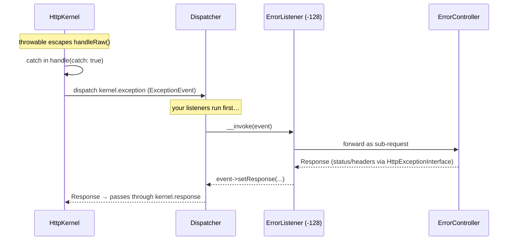
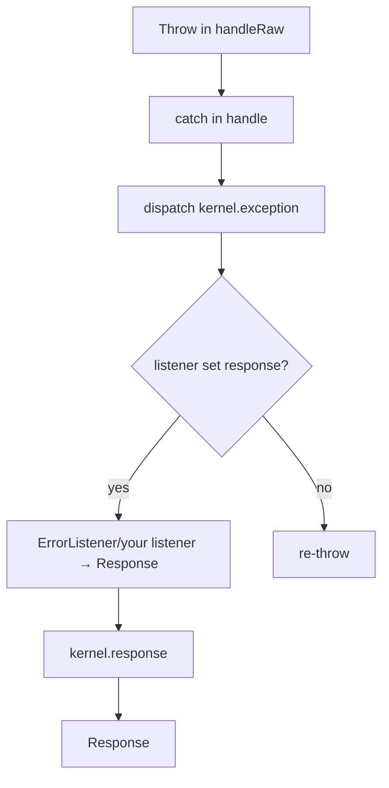

# Exception Handling

!!! tip "In a nutshell"
    When an uncaught exception escapes, the kernel catches it and dispatches
    `kernel.exception` so a listener can turn it into a `Response`. Highest-yield:
    `ErrorListener` runs at priority **-128** (yours run first), and only
    `HttpExceptionInterface` carries a status code — everything else becomes **500**.

!!! example "Real-world analogy"
    An uncaught exception is a **fire alarm** going off in the building. The kernel
    catches the smoke and broadcasts `kernel.exception` to the responders
    (listeners). Your own responders get first shot; the **building's default fire
    brigade** (`ErrorListener`, priority `-128`) only steps in if nobody else acted.
    The exception's status code is the **severity level** on the alarm panel — and if
    no responder acts at all, the alarm keeps ringing (the exception is re-thrown).

!!! abstract "Learning objectives"
    By the end of this chapter you can:

    - [ ] Trace how an uncaught exception becomes an HTTP `Response`.
    - [ ] Explain the role of `ErrorListener`, `kernel.exception` and the error controller.
    - [ ] Map an exception's class to a status code via `HttpExceptionInterface`.
    - [ ] Customise error pages and behaviour safely.

    **Syllabus:** `Symfony Architecture → Exception Handling` ·
    **Level:** Expert ·
    **Est. time:** 30 min ·
    **Prerequisites:** [Request Handling](request-handling.md), [Events](events.md)

---

## Theory

When any code in the request cycle throws and the exception is not caught, the
kernel must still produce a `Response`. It does this by dispatching the
**`kernel.exception`** event; a listener converts the exception into a response.
The candidate response otherwise defaults to `500`, unless the exception carries
its own status code.

```php
use Symfony\Component\HttpFoundation\Response;
use Symfony\Component\HttpKernel\Event\ExceptionEvent;

// A kernel.exception listener turns the throwable into a Response
final class FallbackExceptionListener
{
    public function __invoke(ExceptionEvent $event): void
    {
        $event->setResponse(new Response('Something broke.', 500));
    }
}
```

## Deep Dive — how it works internally

!!! question "Predict first"
    A `kernel.exception` listener reads `getThrowable()`, matches nothing in its
    branch, and returns without calling `setResponse()`. What does the client see?

??? note "Reveal"
    Nothing custom. The event's response stays `null`, so `ErrorListener`
    (priority `-128`) fills it with the default error page. If you had also disabled
    `ErrorListener`, the kernel re-throws and the client gets a bare `500`.

### The catch in `handleRaw()`

`HttpKernel::handle(..., catch: true)` wraps `handleRaw()` in a `try/catch`. On an
exception it calls `handleThrowable()`, which dispatches an
`Symfony\Component\HttpKernel\Event\ExceptionEvent`. If a listener sets a response
via `$event->setResponse()`, that response is returned (still passing through
`kernel.response`); otherwise the exception is re-thrown. With `catch: false`
(often used in sub-requests and tests) the exception simply propagates.

```php
// HttpKernel::handle() — catch: true wraps handleRaw() in a try/catch
$response = $kernel->handle($request, HttpKernelInterface::MAIN_REQUEST, catch: true);

// On a throwable, handleThrowable() dispatches an ExceptionEvent;
// a listener may convert it by calling $event->setResponse($response)

// with catch: false the exception simply propagates to the caller
$response = $kernel->handle($request, HttpKernelInterface::SUB_REQUEST, catch: false);
```

### ErrorListener — the default converter

`Symfony\Component\HttpKernel\EventListener\ErrorListener` is registered on
`kernel.exception`. It:

1. logs the exception,
2. forwards to the **error controller** as a *sub-request*, and
3. sets the resulting response on the event.

It also runs at a **low priority (`-128`)** so your own `kernel.exception`
listeners get first chance to handle or transform the exception.



If one of your higher-priority listeners sets a response first, `ErrorListener`
sees a response already set and does nothing; if none does, `ErrorListener`
produces the fallback error page (or re-throw path when `catch` is `false`).

### HttpExceptionInterface → status code

`Symfony\Component\HttpKernel\Exception\HttpExceptionInterface` exposes
`getStatusCode(): int` and `getHeaders(): array`. When the exception implements it,
`ErrorListener`/the error controller use that status code and headers; otherwise
the response is `500`. Common built-ins:

```php
use Symfony\Component\HttpKernel\Exception\HttpException;
use Symfony\Component\HttpKernel\Exception\HttpExceptionInterface;

$e = new HttpException(429, 'Too Many Requests', headers: ['Retry-After' => '60']);

if ($e instanceof HttpExceptionInterface) {
    $status  = $e->getStatusCode(); // 429 — used by ErrorListener
    $headers = $e->getHeaders();    // ['Retry-After' => '60']
}
// any other throwable -> 500
```

| Exception | Status |
|---|---|
| `NotFoundHttpException` | 404 |
| `AccessDeniedHttpException` | 403 |
| `BadRequestHttpException` | 400 |
| `MethodNotAllowedHttpException` | 405 |
| `HttpException` (generic) | any (constructor arg) |

Security's `AccessDeniedException` (a *different* class,
`Symfony\Component\Security\Core\Exception\AccessDeniedException`) is translated by
the firewall into a `403` (or a redirect to login for anonymous users) — it is not
itself an `HttpExceptionInterface`.

### The error controller

The default `error_controller` service is
`Symfony\Component\HttpKernel\Controller\ErrorController`. It renders an exception
via the configured error renderer. In `dev` you get the rich exception page; in
`prod` you get a clean status-code page. TwigBundle lets you override templates by
path: `templates/bundles/TwigBundle/Exception/error404.html.twig` (fallback:
`error.html.twig`).

```yaml
# config/packages/framework.yaml
framework:
    # default: Symfony\Component\HttpKernel\Controller\ErrorController
    error_controller: App\Controller\ApiErrorController

# Twig template overrides (TwigBundle):
#   templates/bundles/TwigBundle/Exception/error404.html.twig  # status-specific
#   templates/bundles/TwigBundle/Exception/error.html.twig     # generic fallback
```



!!! note "Source reference"
    `Symfony\Component\HttpKernel\EventListener\ErrorListener` and
    `HttpException` —
    [symfony/symfony `8.0`](https://github.com/symfony/symfony/blob/8.0/src/Symfony/Component/HttpKernel/EventListener/ErrorListener.php).

### Compilation vs runtime

The error controller, renderers and `ErrorListener` are wired at compile time by
FrameworkBundle. At runtime only the dispatch + sub-request happen. The `dev`
exception page depends on `kernel.debug = true`, resolved at boot.

### Null behavior

On `kernel.exception` a response is **not** guaranteed: `ExceptionEvent::getResponse()`
returns `?Response` and stays `null` until some listener calls `setResponse()`.
After dispatching, `handleThrowable()` checks `$event->hasResponse()`; if it is
still unset, the kernel **re-throws** the original throwable, which — with
`catch: true` — surfaces to the client as a `500`. In practice `ErrorListener`
(priority `-128`) fills that gap, so the null case only bites when you replace or
disable it. The classic bug: a listener that inspects `getThrowable()` but forgets
`setResponse()` for its branch — the event's response stays `null`, so your custom
page never appears and the default (or a 500) wins instead.

```php
public function __invoke(ExceptionEvent $event): void
{
    $e = $event->getThrowable();

    // getResponse() stays null until a listener calls setResponse()
    if ($e instanceof PaymentFailedException) {
        $event->setResponse(new JsonResponse(['error' => 'payment'], 402));
    }
    // no setResponse() here -> handleThrowable() sees hasResponse() === false
    // and re-throws the original throwable (surfacing as a 500)
}
```

!!! note "Null in real life"
    A `kernel.exception` with no response set is a **fire alarm that no responder
    answers**: with nobody acting, the building falls back to the emergency exit —
    the re-thrown 500.

!!! info "Expert note"
    The response `ErrorListener` produces is built by **re-entering the kernel as a
    sub-request** to the error controller — so it passes through `kernel.request` and
    `kernel.response` again. A `kernel.request` listener that assumes it only runs for
    real client requests can therefore fire unexpectedly during error rendering;
    guard with `$event->isMainRequest()` when that matters.

??? example "Debugging story"
    **Symptom:** API clients got HTML 500 pages instead of a JSON error envelope.
    **Diagnosis:** the custom `kernel.exception` listener only called `setResponse()`
    inside an `if ($e instanceof ApiException)` branch; a plain `\RuntimeException`
    fell through untouched, so `ErrorListener` produced the default HTML page.
    `debug:event-dispatcher kernel.exception` confirmed the listener ran but set no
    response. **Fix:** on the `/api` path always build a `JsonResponse`, deriving the
    status from `HttpExceptionInterface::getStatusCode()` (default `500`). **Avoid:**
    every branch that should own the response must call `setResponse()`.

??? abstract "Source-code tour"
    - `Symfony\Component\HttpKernel\HttpKernel::handle()` catches the throwable and
      calls the private `handleThrowable()`.
    - `handleThrowable()` dispatches `Symfony\Component\HttpKernel\Event\ExceptionEvent`
      and re-throws if no listener set a response.
    - `Symfony\Component\HttpKernel\EventListener\ErrorListener` (priority `-128`)
      logs and forwards to the error controller as a sub-request.
    - `Symfony\Component\HttpKernel\Controller\ErrorController` renders through the
      configured error renderer.
    - `Symfony\Component\HttpKernel\Exception\HttpExceptionInterface::getStatusCode()`
      decides the HTTP status; other throwables default to `500`.

## Configuration & code

=== "PHP Attributes"

    ```php
    <?php
    declare(strict_types=1);

    namespace App\EventListener;

    use App\Exception\QuotaExceededException;
    use Symfony\Component\HttpFoundation\JsonResponse;
    use Symfony\Component\EventDispatcher\Attribute\AsEventListener;
    use Symfony\Component\HttpKernel\Event\ExceptionEvent;
    use Symfony\Component\HttpKernel\KernelEvents;

    #[AsEventListener(event: KernelEvents::EXCEPTION, priority: 0)]
    final class ApiExceptionListener
    {
        public function __invoke(ExceptionEvent $event): void
        {
            $e = $event->getThrowable();
            if ($e instanceof QuotaExceededException) {
                $event->setResponse(new JsonResponse(['error' => 'quota'], 429));
            }
        }
    }
    ```

=== "Throwing an HTTP exception"

    ```php
    <?php
    declare(strict_types=1);

    use Symfony\Component\HttpKernel\Exception\NotFoundHttpException;

    throw new NotFoundHttpException('Article not found.');
    // → ErrorListener produces a 404 response
    ```

=== "Twig error template"

    ```twig
    {# templates/bundles/TwigBundle/Exception/error404.html.twig #}
    <h1>Not found</h1>
    ```

## Best practices & anti-patterns

| ✅ Do | ❌ Avoid |
|---|---|
| Throw `HttpExceptionInterface` subclasses for HTTP semantics | Returning `new Response('...', 500)` from deep code |
| Handle domain exceptions in a `kernel.exception` listener | Catching everything in each controller |
| Keep listener priority above `-128` to pre-empt `ErrorListener` | Depending on `ErrorListener` for API JSON |
| Override templates via `templates/bundles/TwigBundle/Exception/` | Editing vendor files |

## When (not) to use it / alternatives

Use `kernel.exception` for **global** exception-to-response policy (API error
envelopes, logging enrichment). For a single controller's expected failure,
throwing the right `HttpException` is enough. Do not use exceptions for normal
control flow.

!!! danger "Certification traps"
    - `kernel.exception` is **not** in the numbered main sequence; it fires only on error.
    - `ErrorListener` runs at priority **-128**, so custom listeners run first.
    - If no listener sets a response, the exception is **re-thrown** (and becomes a 500).
    - `AccessDeniedException` (Security) ≠ `AccessDeniedHttpException` (HttpKernel).

!!! warning "Common mistakes"
    - Forgetting that setting a response in `kernel.exception` still routes through
      `kernel.response`.
    - Assuming a plain `\RuntimeException` yields anything but `500`.

## Exercises

1. **(Advanced)** Make all `/api` exceptions return JSON `{ "error": ... }` with the
   correct status code.
2. **(Expert)** Explain why a `kernel.exception` listener at priority `-200` would
   never see the exception in practice.

??? success "Solutions"

    **1.** Register a `kernel.exception` listener; read `getThrowable()`, derive the
    status from `HttpExceptionInterface::getStatusCode()` (default `500`), and set a
    `JsonResponse`. Guard on `str_starts_with($request->getPathInfo(), '/api')`.

    **2.** `ErrorListener` at `-128` will already have set a response and (in older
    flows) may stop further handling; a `-200` listener runs after it and its
    changes are effectively moot for the produced response.

## Certification questions

??? question "Q1. Which event turns an exception into a response?"
    - [x] A. `kernel.exception` ✅
    - [ ] B. `kernel.view`
    - [ ] C. `kernel.terminate`

    **Why:** `ExceptionEvent` listeners set the response. **Ref:**
    [kernel.exception](https://symfony.com/doc/current/reference/events.html#kernel-exception).

??? question "Q2. What status code does a bare `\LogicException` produce?"
    - [ ] A. 404
    - [x] B. 500 ✅
    - [ ] C. 400

    **Why:** Only `HttpExceptionInterface` exceptions carry a status; others → 500.
    **Ref:** [Error pages](https://symfony.com/doc/current/controller/error_pages.html).

??? question "Q3. Where do you override the 404 template?"
    - [x] A. `templates/bundles/TwigBundle/Exception/error404.html.twig` ✅
    - [ ] B. `templates/error/404.twig` (no effect)
    - [ ] C. In `vendor/`

    **Why:** TwigBundle resolves overrides under `templates/bundles/<Bundle>/`.
    **Ref:** [Customizing error pages](https://symfony.com/doc/current/controller/error_pages.html).

## Key takeaways

- `handle(catch: true)` catches, then dispatches `kernel.exception`.
- `ErrorListener` (priority `-128`) forwards to the error controller as a sub-request.
- `HttpExceptionInterface::getStatusCode()` decides the status; default `500`.
- Override error templates under `templates/bundles/TwigBundle/Exception/`.

## Last-minute revision

!!! tip "Cheat sheet"
    - `ExceptionEvent::getThrowable()` / `setResponse()`.
    - `NotFoundHttpException` 404 · `AccessDeniedHttpException` 403 · `HttpException` any.
    - `ErrorListener` priority **-128**; `error_controller` = `ErrorController`.
    - No response set → re-thrown → 500.

## Connections

- **Depends on:** [Events](events.md) — the whole mechanism is one out-of-band `kernel.exception` dispatch; [Request Handling](request-handling.md) is where the `try/catch` lives.
- **Reused in:** [Error Pages](../controllers/error-pages.md) — customising the rendered page builds directly on this flow.
- **Confused with:** [HTTP Response](../http/response.md) — throwing an `HttpException` sets a *status*, but a listener still must turn it into a real `Response`.

## Official References
- [Official docs — Error pages](https://symfony.com/doc/current/controller/error_pages.html)
- [Official docs — kernel.exception](https://symfony.com/doc/current/reference/events.html#kernel-exception)
- [Symfony source — ErrorListener](https://github.com/symfony/symfony/blob/8.0/src/Symfony/Component/HttpKernel/EventListener/ErrorListener.php)

## Video references

!!! tip "Watch & learn"
    These are official, continuously-updated video channels — search them for
    "Symfony architecture" to reinforce this chapter. We link stable channels rather than
    individual videos so the references never rot.

    - [SymfonyCasts screencasts](https://symfonycasts.com/tracks/symfony) — scripted, code-along tutorials.
    - [Symfony official YouTube](https://www.youtube.com/@SymfonyOfficial) — SymfonyCon conference talks & keynotes.
    - [Official docs for this topic](https://symfony.com/doc/current/reference/events.html#kernel-exception) — some Symfony doc pages embed a screencast.

## Confidence check

I'm ready when I can:

- [ ] explain **why** the kernel converts exceptions via an event instead of inline
- [ ] implement a `kernel.exception` listener that returns a JSON error envelope
- [ ] debug a custom error page that never appears (a missing `setResponse()`)
- [ ] spot that a bare `\LogicException` becomes `500`, not `404`
- [ ] explain `ErrorListener`'s `-128` priority and the re-throw fallback

---

<small>Related: [Request Handling](request-handling.md) · [Events](events.md) · [Error Pages](../controllers/error-pages.md)</small>
