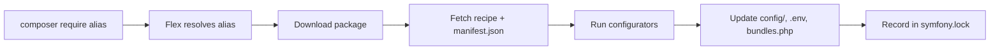

# Symfony Flex

!!! tip "In a nutshell"
    Symfony Flex est un plugin Composer qui transforme `composer require` en
    fonctionnalité entièrement configurée en appliquant des **recipes** et en
    résolvant des **alias**. À retenir en priorité : il agit uniquement au moment
    de Composer (aucun rôle au runtime), et `symfony.lock` suit les recipes — pas
    les versions des packages, qui relèvent de `composer.lock`.

!!! example "Real-world analogy"
    Flex, c'est comme **les notices de montage IKEA**. `composer require` livre le
    paquet plat (le package) ; la **recipe** est le dépliant illustré qui indique à
    Flex exactement quelle vis va où — créer les fichiers de config, enregistrer le
    bundle dans `config/bundles.php`, ajouter des variables au `.env`.
    `symfony.lock` est le ticket de caisse qui note quelle version du dépliant vous
    avez suivie, afin que chaque collègue puisse assembler automatiquement un
    résultat identique.

!!! abstract "Learning objectives"
    À la fin de ce chapitre, vous saurez :

    - [ ] Expliquer ce qu'est Flex et comment il se greffe sur Composer.
    - [ ] Décrire les recipes, les alias et le rôle de `symfony.lock`.
    - [ ] Retracer ce que fait une recipe lorsque vous exécutez `composer require` sur un package.
    - [ ] Savoir comment Flex enregistre automatiquement les bundles via `config/bundles.php`.

    **Syllabus:** `Symfony Architecture → Symfony Flex` ·
    **Level:** Advanced ·
    **Est. time:** 25 min ·
    **Prerequisites:** [Code Organization](code-organization.md)

---

## Pour les nuls

### L'idée en une phrase
Flex transforme `composer require` en une fonctionnalité déjà configurée, au lieu de te laisser tout brancher toi-même à la main.

### Imagine dans la vraie vie
C'est la notice de montage illustrée d'un meuble en kit : le colis livré (le paquet Composer) contient les planches, mais la notice (la recette Flex) te dit exactement où va chaque vis — créer les fichiers de config, enregistrer le bundle, ajouter les variables `.env`. `symfony.lock` est le reçu qui note quelle version de notice tu as suivie.

### Dans Symfony
Un simple `composer require orm` déclenche Flex, qui télécharge la bibliothèque **et** applique automatiquement sa configuration — sans ça, il faudrait créer chaque fichier de config à la main.

### Exemple simple
```console
$ composer require orm
# Flex ajoute automatiquement config/packages/doctrine.yaml, met à jour .env, etc.
```

### Comment le mémoriser 🧠
Flex agit **seulement au moment de `composer require`** — jamais pendant qu'une requête HTTP est traitée. C'est un ouvrier de chantier, pas un employé du magasin ouvert au public.


## Theory

**Symfony Flex** est un **plugin Composer** qui automatise les tâches fastidieuses
de l'installation de packages : il fait correspondre des **alias** conviviaux aux
vrais noms de packages et applique des **recipes** qui créent des fichiers de
config, enregistrent des bundles, définissent des variables d'environnement et
plus encore. Il transforme `composer require orm` en fonctionnalité entièrement
câblée plutôt qu'en simple téléchargement de bibliothèque.

## Deep Dive — how it works internally

!!! question "Predict first"
    Vous exécutez `composer require orm`. Quels fichiers peuvent changer sur le
    disque, et cela affecte-t-il d'une quelconque manière le traitement d'une
    request au runtime ?

??? note "Reveal"
    Une recipe peut modifier `config/bundles.php`, ajouter des fichiers sous
    `config/packages/`, compléter le `.env` et s'enregistrer dans `symfony.lock`.
    Rien de tout cela ne s'exécute au moment du traitement HTTP — Flex n'agit
    qu'au moment de l'install/update Composer.

### Flex is a Composer plugin

`symfony/flex` s'enregistre comme plugin Composer et s'abonne aux events Composer
(`post-install-cmd`, `post-update-cmd`, install/uninstall de package). Lorsqu'un
package est installé, Flex recherche une **recipe** correspondante et applique ses
**configurators**.

```json
{
    "require": {
        "symfony/flex": "^2"
    },
    "config": {
        "allow-plugins": {
            "symfony/flex": true
        }
    },
    "scripts": {
        "post-install-cmd": ["@auto-scripts"],
        "post-update-cmd": ["@auto-scripts"]
    }
}
```

### Aliases

Les alias sont des noms courts résolus auprès du serveur de recipes de Symfony.
`composer require orm` se résout en `doctrine/orm` (+ sa recipe) ;
`composer require logger` se résout en un package de logging. Les alias ne sont
qu'une commodité — c'est le vrai nom du package qui finit dans `composer.json`.

```console
$ composer require orm      # alias resolved to doctrine/orm (+ recipe)
$ composer require logger   # alias resolved to a logging package

# composer.json ends up with the real package names, not the aliases:
$ grep -E 'doctrine/orm|monolog' composer.json
    "doctrine/orm": "^3.3",
    "symfony/monolog-bundle": "^3.10",
```

### Recipes and the manifest

Une recipe est un petit dépôt de fichiers accompagné d'un `manifest.json`
décrivant les **configurators** à exécuter :

| Configurator | Effet |
|---|---|
| `bundles` | Ajoute le bundle à `config/bundles.php` (par environnement) |
| `copy-from-recipe` | Copie des fichiers de config dans `config/`, etc. |
| `env` | Ajoute des variables à `.env` / `.env.dist` |
| `makefile`, `gitignore`, `composer-scripts` | Échafaudage du projet |
| `container` | Définit des paramètres du container |

```json
{
    "bundles": {
        "Acme\\BlogBundle\\AcmeBlogBundle": ["all"]
    },
    "copy-from-recipe": {
        "config/": "%CONFIG_DIR%/"
    },
    "env": {
        "ACME_BLOG_TITLE": "My Blog"
    },
    "container": {
        "locale": "en"
    },
    "composer-scripts": {
        "cache:clear": "symfony-cmd"
    },
    "gitignore": [
        "/.env.local"
    ]
}
```

Les recipes proviennent de deux dépôts : `symfony/recipes`, sélectionné avec soin,
et `symfony/recipes-contrib`, alimenté par la communauté. Les recipes contrib
nécessitent une activation explicite.

### symfony.lock

Flex enregistre les recipes appliquées et leurs versions dans **`symfony.lock`**
(commité dans le VCS). Ce fichier permet à Flex de savoir quelles recipes sont
installées, de détecter les mises à jour (`composer recipes` /
`composer recipes:update`) et d'annuler proprement une recipe quand vous retirez
un package. Il complète `composer.lock` — il ne le remplace pas.

```console
$ composer recipes            # list recipes recorded in symfony.lock
$ composer recipes:update     # re-apply newer recipe versions

$ composer remove acme/blog-bundle
# Flex reads symfony.lock to reverse the recipe (config files, .env lines);
# composer.lock still tracks package versions — a separate concern
```



### How bundles get registered

Le configurator `bundles` de Flex écrit des entrées dans `config/bundles.php`,
un tableau associant classe de bundle → environnements :

```php
<?php
// config/bundles.php (managed by Flex)
return [
    Symfony\Bundle\FrameworkBundle\FrameworkBundle::class => ['all' => true],
    Symfony\Bundle\WebProfilerBundle\WebProfilerBundle::class => ['dev' => true, 'test' => true],
];
```

`Symfony\Component\HttpKernel\Kernel::registerBundles()` (via `MicroKernelTrait`)
lit ce fichier au boot, si bien qu'aucun câblage manuel de bundle n'est nécessaire.

!!! note "Source reference"
    Plugin Composer `symfony/flex` — [github.com/symfony/flex](https://github.com/symfony/flex) ;
    recipes — [github.com/symfony/recipes](https://github.com/symfony/recipes).

### Compilation vs runtime

Flex opère entièrement au **moment de Composer** (install/update). Il écrit des
fichiers ; il ne joue **aucun** rôle au runtime HTTP. Le kernel lit ensuite
`config/bundles.php` et `config/` au moment du boot/de la compilation.

!!! info "Expert note"
    `symfony.lock` et `composer.lock` sont indépendants : `composer.lock` fige les
    *versions* des packages, `symfony.lock` enregistre quelle *version de recipe*
    a été appliquée. Supprimer `symfony.lock` ne désinstalle rien, mais fait
    oublier à Flex quelles recipes ont été exécutées — il ne peut alors plus
    annuler proprement une recipe lors d'une suppression, ni détecter les mises à
    jour de recipes. Commitez les deux.

??? example "Debugging story"
    **Symptôme :** après un `composer require`, un bundle fonctionnait sur la
    machine d'un collègue mais levait « bundle not registered » en CI.
    **Diagnostic :** le collègue avait modifié `config/bundles.php` à la main, or
    le configurator `bundles` n'écrit cette entrée que lorsque la recipe est
    *appliquée* ; la CI avait extrait un état où l'entrée manquait.
    `composer recipes` montrait la recipe comme non entièrement appliquée.
    **Correctif :** exécuter `composer recipes:install <package> --force` pour
    réappliquer, puis committer le `config/bundles.php` régénéré et
    `symfony.lock`. **À éviter :** laissez la recipe gérer `bundles.php` — ne
    modifiez pas à la main les fichiers gérés par les recipes.

??? abstract "Source-code tour"
    - `Symfony\Flex\Flex` est le plugin Composer : il s'abonne aux events Composer
      et pilote l'application des recipes.
    - `Symfony\Flex\Downloader` récupère les recipes et leur `manifest.json` depuis
      le serveur de recipes.
    - `Symfony\Flex\Configurator` délègue chaque clé du manifest à un configurator
      (p. ex. `Symfony\Flex\Configurator\BundlesConfigurator`, `EnvConfigurator`).
    - `Symfony\Flex\Lock` lit et écrit `symfony.lock`.
    - Au boot, `Symfony\Bundle\FrameworkBundle\Kernel\MicroKernelTrait::registerBundles()`
      lit le `config/bundles.php` produit par le configurator `bundles`.

## Configuration & code

=== "Console"

    ```console
    $ composer require orm          # alias → doctrine/orm + recipe
    $ composer recipes              # list installed recipes & status
    $ composer recipes:update       # apply newer recipe versions
    ```

=== "symfony.lock (excerpt)"

    ```json
    {
      "symfony/framework-bundle": {
        "version": "8.0",
        "recipe": { "repo": "github.com/symfony/recipes", "ref": "…" }
      }
    }
    ```

=== "Enable contrib recipes"

    ```console
    $ composer config extra.symfony.allow-contrib true
    ```

## Best practices & anti-patterns

| ✅ Do | ❌ Avoid |
|---|---|
| Committer `symfony.lock` | Mettre `symfony.lock` dans le `.gitignore` |
| Relire les fichiers ajoutés par une recipe | Accepter aveuglément les recipes contrib |
| Utiliser `composer recipes:update` en cas de dérive de config | Modifier à la main les fichiers gérés par une recipe sans précaution |

## When (not) to use it / alternatives

Flex est le choix par défaut pour les applications Symfony et est de fait toujours
actif dans un skeleton. Vous ne vous en passeriez que dans un projet non-Symfony
consommant les components en standalone (voir [Components](components.md)), où
Composer seul suffit.

!!! danger "Certification traps"
    - Flex est un **plugin Composer**, pas un component de runtime — aucun effet sur le traitement des requests.
    - Les **alias** sont des raccourcis de noms ; les **recipes** sont l'automatisation.
    - `symfony.lock` suit les **recipes** ; `composer.lock` suit les **versions des packages** — deux fichiers différents.
    - Les recipes contrib (`symfony/recipes-contrib`) nécessitent une activation explicite.

!!! warning "Common mistakes"
    - Modifier `config/bundles.php` à la main puis s'étonner qu'une recipe le réécrive.
    - Supposer que retirer un package laisse la config en place — Flex annule la recipe.

## Exercises

1. **(Advanced)** Après un `composer require`, citez trois fichiers du projet
   qu'une recipe a pu modifier.
2. **(Expert)** Expliquez pourquoi `symfony.lock` doit être commité dans le
   gestionnaire de versions.

??? success "Solutions"

    **1.** `config/bundles.php` (enregistrement du bundle), un fichier sous
    `config/packages/` (config du bundle) et `.env` (nouvelles variables d'env).

    **2.** Pour que chaque développeur/CI applique les **mêmes versions de
    recipes**, que la config reste reproductible, et que Flex puisse détecter et
    annuler les changements de recipes de façon cohérente.

## Certification questions

??? question "Q1. What is Symfony Flex?"
    - [x] A. A Composer plugin that applies recipes and resolves aliases ✅
    - [ ] B. A runtime kernel event
    - [ ] C. A templating engine

    **Why:** Flex automatise la configuration des packages au moment de Composer. **Ref:**
    [Symfony Flex](https://symfony.com/doc/8.0/setup.html#symfony-flex).

??? question "Q2. What does `symfony.lock` track?"
    - [x] A. Which recipes are installed and their versions ✅
    - [ ] B. The compiled container
    - [ ] C. HTTP sessions

    **Why:** Il enregistre l'application des recipes, indépendamment de `composer.lock`. **Ref:**
    [Using Symfony Flex](https://symfony.com/doc/8.0/setup.html).

??? question "Q3. How are bundles auto-registered by a recipe?"
    - [x] A. Entries are written to `config/bundles.php` ✅
    - [ ] B. Via `#[AsBundle]`
    - [ ] C. In `services.yaml`

    **Why:** Le configurator `bundles` modifie `config/bundles.php`. **Ref:**
    [Bundles](https://symfony.com/doc/8.0/bundles.html).

## Key takeaways

- Flex est un plugin Composer : alias + recipes automatisent l'installation.
- Les recipes exécutent des configurators (bundles, config, env) via `manifest.json`.
- `symfony.lock` enregistre les recipes installées et se commite.
- Les bundles s'enregistrent via `config/bundles.php`, lu par le kernel au boot.

## Last-minute revision

!!! tip "Cheat sheet"
    - Alias → vrai package ; recipe → automatisation.
    - Sources des recipes : `symfony/recipes` (principale), `symfony/recipes-contrib` (opt-in).
    - `symfony.lock` = recipes ; `composer.lock` = versions.
    - `composer recipes` / `recipes:update`.

## Connections

- **Depends on:** [Code Organization](code-organization.md) — les recipes écrivent dans l'arborescence conventionnelle `config/`, `.env` et `config/bundles.php`.
- **Reused in:** [Dependency Injection](../dependency-injection/index.md) — les fichiers qu'une recipe dépose dans `config/packages/` alimentent la construction du container.
- **Confused with:** [Components](components.md) — Flex est une automatisation au moment de Composer, pas un component de runtime.

## Official References
- [Official docs — Setup & Flex](https://symfony.com/doc/8.0/setup.html)
- [Symfony Flex source](https://github.com/symfony/flex)
- [Symfony recipes](https://github.com/symfony/recipes)

## Video references

!!! tip "Watch & learn"
    Voici des chaînes vidéo officielles, mises à jour en continu — cherchez-y
    « Symfony architecture » pour consolider ce chapitre. Nous référençons des
    chaînes stables plutôt que des vidéos individuelles afin que les références ne
    deviennent jamais obsolètes.

    - [SymfonyCasts screencasts](https://symfonycasts.com/tracks/symfony) — tutoriels scénarisés à suivre en codant.
    - [Symfony official YouTube](https://www.youtube.com/@SymfonyOfficial) — conférences et keynotes SymfonyCon.
    - [Official docs for this topic](https://symfony.com/doc/8.0/setup.html#symfony-flex) — certaines pages de la doc Symfony intègrent un screencast.

## Confidence check

Je suis prêt(e) quand je peux :

- [ ] expliquer **pourquoi** les recipes transforment `composer require` en fonctionnalité configurée
- [ ] décrire ce qu'écrit une recipe et comment `composer recipes` l'inspecte
- [ ] déboguer un bundle « not registered » après une recipe incomplètement appliquée
- [ ] repérer que `symfony.lock` suit les recipes tandis que `composer.lock` suit les versions
- [ ] expliquer que Flex n'agit qu'au moment de Composer, jamais au runtime HTTP

---

<small>Related: [Code Organization](code-organization.md) · [Components](components.md) · [Framework Overloading](overloading.md)</small>
