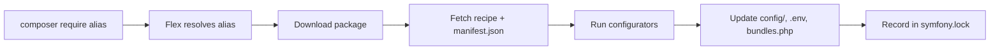

# Symfony Flex

!!! tip "In a nutshell"
    Symfony Flex is a Composer plugin that turns `composer require` into a fully
    configured feature by applying **recipes** and resolving **aliases**.
    Highest-yield: it runs at Composer time only (no runtime role), and
    `symfony.lock` tracks recipes — not package versions, which is `composer.lock`.

!!! example "Real-world analogy"
    Flex is like **IKEA's build instructions**. `composer require` delivers the flat
    pack (the package); the **recipe** is the illustrated leaflet that tells Flex
    exactly which screws go where — creating config files, registering the bundle in
    `config/bundles.php`, appending `.env` variables. `symfony.lock` is the receipt
    noting which leaflet version you followed, so any teammate can auto-assemble the
    identical result.

!!! abstract "Learning objectives"
    By the end of this chapter you can:

    - [ ] Explain what Flex is and how it hooks into Composer.
    - [ ] Describe recipes, aliases and the role of `symfony.lock`.
    - [ ] Trace what a recipe does when you `composer require` a package.
    - [ ] Know how Flex auto-registers bundles via `config/bundles.php`.

    **Syllabus:** `Symfony Architecture → Symfony Flex` ·
    **Level:** Advanced ·
    **Est. time:** 25 min ·
    **Prerequisites:** [Code Organization](code-organization.md)

    **Examen Symfony 8 :** OUI

---

## Pour les nuls

### L'idée en une phrase
Flex transforme `composer require` en une fonctionnalité déjà configurée, au lieu de te laisser tout brancher toi-même à la main.

### Imagine dans la vraie vie
C'est la notice de montage illustrée d'un meuble en kit : le colis livré (le paquet Composer) contient les planches, mais la notice (la recette Flex) te dit exactement où va chaque vis — créer les fichiers de config, enregistrer le bundle, ajouter les variables `.env`. `symfony.lock` est le reçu qui note quelle version de notice tu as suivie.

### Dans Symfony
Un simple `composer require orm` déclenche Flex, qui télécharge la bibliothèque **et** applique automatiquement sa configuration — sans ça, il faudrait créer chaque fichier de config à la main.

### Exemple simple
```console
$ composer require orm
# Flex ajoute automatiquement config/packages/doctrine.yaml, met à jour .env, etc.
```

### Comment le mémoriser 🧠
Flex agit **seulement au moment de `composer require`** — jamais pendant qu'une requête HTTP est traitée. C'est un ouvrier de chantier, pas un employé du magasin ouvert au public.

## Theory

**Symfony Flex** is a **Composer plugin** that automates the boring parts of
installing packages: it maps friendly **aliases** to real package names and applies
**recipes** that create config files, register bundles, set environment variables
and more. It turns `composer require orm` into a fully wired feature instead of a
bare library download.

## Deep Dive — how it works internally

!!! question "Predict first"
    You run `composer require orm`. Which files might change on disk, and does any
    of it affect how a request is handled at runtime?

??? note "Reveal"
    A recipe may edit `config/bundles.php`, add files under `config/packages/`,
    append to `.env`, and record itself in `symfony.lock`. None of it runs at HTTP
    time — Flex works only at Composer install/update time.

### Flex is a Composer plugin

`symfony/flex` registers as a Composer plugin and subscribes to Composer events
(`post-install-cmd`, `post-update-cmd`, package install/uninstall). When a package
is installed, Flex looks up a matching **recipe** and applies its **configurators**.

```json
{
    "require": {
        "symfony/flex": "^2"
    },
    "config": {
        "allow-plugins": {
            "symfony/flex": true
        }
    },
    "scripts": {
        "post-install-cmd": ["@auto-scripts"],
        "post-update-cmd": ["@auto-scripts"]
    }
}
```

### Aliases

Aliases are short names resolved against Symfony's recipe server. `composer require
orm` resolves to `doctrine/orm` (+ its recipe); `composer require logger` resolves
to a logging package. Aliases are a convenience only — the real package name is
what ends up in `composer.json`.

```console
$ composer require orm      # alias resolved to doctrine/orm (+ recipe)
$ composer require logger   # alias resolved to a logging package

# composer.json ends up with the real package names, not the aliases:
$ grep -E 'doctrine/orm|monolog' composer.json
    "doctrine/orm": "^3.3",
    "symfony/monolog-bundle": "^3.10",
```

### Recipes and the manifest

A recipe is a small repository of files plus a `manifest.json` describing
**configurators** to run:

| Configurator | Effect |
|---|---|
| `bundles` | Adds the bundle to `config/bundles.php` (per environment) |
| `copy-from-recipe` | Copies config files into `config/`, etc. |
| `env` | Appends variables to `.env` / `.env.dist` |
| `makefile`, `gitignore`, `composer-scripts` | Project scaffolding |
| `container` | Sets container parameters |

```json
{
    "bundles": {
        "Acme\\BlogBundle\\AcmeBlogBundle": ["all"]
    },
    "copy-from-recipe": {
        "config/": "%CONFIG_DIR%/"
    },
    "env": {
        "ACME_BLOG_TITLE": "My Blog"
    },
    "container": {
        "locale": "en"
    },
    "composer-scripts": {
        "cache:clear": "symfony-cmd"
    },
    "gitignore": [
        "/.env.local"
    ]
}
```

Recipes come from two repositories: the curated `symfony/recipes` and the
community `symfony/recipes-contrib`. Contrib recipes require opting in.

### symfony.lock

Flex records applied recipes and their versions in **`symfony.lock`** (committed to
VCS). It lets Flex know which recipes are installed, detect updates
(`composer recipes` / `composer recipes:update`) and cleanly reverse a recipe when
you remove a package. It complements — it does not replace — `composer.lock`.

```console
$ composer recipes            # list recipes recorded in symfony.lock
$ composer recipes:update     # re-apply newer recipe versions

$ composer remove acme/blog-bundle
# Flex reads symfony.lock to reverse the recipe (config files, .env lines);
# composer.lock still tracks package versions — a separate concern
```



### How bundles get registered

Flex's `bundles` configurator writes entries into `config/bundles.php`,
an array mapping bundle class → environments:

```php
<?php
// config/bundles.php (managed by Flex)
return [
    Symfony\Bundle\FrameworkBundle\FrameworkBundle::class => ['all' => true],
    Symfony\Bundle\WebProfilerBundle\WebProfilerBundle::class => ['dev' => true, 'test' => true],
];
```

`Symfony\Component\HttpKernel\Kernel::registerBundles()` (via `MicroKernelTrait`)
reads this file at boot, so no manual bundle wiring is needed.

!!! note "Source reference"
    `symfony/flex` Composer plugin — [github.com/symfony/flex](https://github.com/symfony/flex);
    recipes — [github.com/symfony/recipes](https://github.com/symfony/recipes). The
    kernel method Flex-managed bundles feed —
    `Symfony\Bundle\FrameworkBundle\Kernel\MicroKernelTrait::registerBundles()` —
    lives in
    [symfony/symfony `8.0`](https://github.com/symfony/symfony/blob/8.0/src/Symfony/Bundle/FrameworkBundle/Kernel/MicroKernelTrait.php).

### Compilation vs runtime

Flex operates entirely at **Composer time** (install/update). It writes files;
it plays **no** role at HTTP runtime. The kernel later reads `config/bundles.php`
and `config/` at boot/compile time.

!!! info "Expert note"
    `symfony.lock` and `composer.lock` are independent: `composer.lock` pins package
    *versions*, `symfony.lock` records which *recipe version* was applied. Deleting
    `symfony.lock` uninstalls nothing, but it makes Flex forget which recipes ran —
    so it can no longer cleanly reverse a recipe on removal or detect recipe updates.
    Commit both.

??? example "Debugging story"
    **Symptom:** after `composer require` a bundle worked on a teammate's machine but
    threw "bundle not registered" in CI. **Diagnosis:** the teammate had hand-edited
    `config/bundles.php`, but the `bundles` configurator only writes that entry when
    the recipe is *applied*; CI checked out a state where the entry was missing.
    `composer recipes` showed the recipe as not fully applied. **Fix:** run
    `composer recipes:install <package> --force` to re-apply, then commit the
    regenerated `config/bundles.php` and `symfony.lock`. **Avoid:** let the recipe
    manage `bundles.php` — don't hand-edit recipe-managed files.

??? abstract "Source-code tour"
    - `Symfony\Flex\Flex` is the Composer plugin: it subscribes to Composer events
      and drives recipe application.
    - `Symfony\Flex\Downloader` fetches recipes and their `manifest.json` from the
      recipe server.
    - `Symfony\Flex\Configurator` dispatches each manifest key to a configurator
      (e.g. `Symfony\Flex\Configurator\BundlesConfigurator`, `EnvConfigurator`).
    - `Symfony\Flex\Lock` reads and writes `symfony.lock`.
    - At boot, `Symfony\Bundle\FrameworkBundle\Kernel\MicroKernelTrait::registerBundles()`
      reads the `config/bundles.php` that the `bundles` configurator produced.

## Configuration & code

=== "Console"

    ```console
    $ composer require orm          # alias → doctrine/orm + recipe
    $ composer recipes              # list installed recipes & status
    $ composer recipes:update       # apply newer recipe versions
    ```

=== "symfony.lock (excerpt)"

    ```json
    {
      "symfony/framework-bundle": {
        "version": "8.0",
        "recipe": { "repo": "github.com/symfony/recipes", "ref": "…" }
      }
    }
    ```

=== "Enable contrib recipes"

    ```console
    $ composer config extra.symfony.allow-contrib true
    ```

## Best practices & anti-patterns

| ✅ Do | ❌ Avoid |
|---|---|
| Commit `symfony.lock` | Git-ignoring `symfony.lock` |
| Review files a recipe added | Blindly accepting contrib recipes |
| Use `composer recipes:update` for config drift | Hand-editing recipe-managed files without care |

## When (not) to use it / alternatives

Flex is the default for Symfony apps and is effectively always on in a skeleton.
You would only avoid it in a non-Symfony project consuming components standalone
(see [Components](components.md)), where Composer alone suffices.

!!! danger "Certification traps"
    - Flex is a **Composer plugin**, not a runtime component — no effect on request handling.
    - **Aliases** are name shortcuts; **recipes** are the automation.
    - `symfony.lock` tracks **recipes**; `composer.lock` tracks **package versions** — different files.
    - Contrib recipes (`symfony/recipes-contrib`) require explicit opt-in.

!!! warning "Common mistakes"
    - Editing `config/bundles.php` by hand and then being surprised when a recipe rewrites it.
    - Assuming removing a package leaves config behind — Flex reverses the recipe.

## Exercises

1. **(Advanced)** After `composer require`, list three project files a recipe may
   have changed.
2. **(Expert)** Explain why `symfony.lock` must be committed to version control.

??? success "Solutions"

    **1.** `config/bundles.php` (bundle registration), a file under
    `config/packages/` (bundle config), and `.env` (new env vars).

    **2.** So every developer/CI applies the **same recipe versions**, keeps config
    reproducible, and Flex can detect/rollback recipe changes consistently.

## Certification questions

*Question d'entraînement inspirée du syllabus — jamais une question officielle de l'examen.*

??? question "Q1. What is Symfony Flex?"
    - [x] A. A Composer plugin that applies recipes and resolves aliases ✅
    - [ ] B. A runtime kernel event
    - [ ] C. A templating engine

    **Why:** Flex automates package configuration at Composer time. **Ref:**
    [Symfony Flex](https://symfony.com/doc/8.0/setup.html#symfony-flex).

??? question "Q2. What does `symfony.lock` track?"
    - [x] A. Which recipes are installed and their versions ✅
    - [ ] B. The compiled container
    - [ ] C. HTTP sessions

    **Why:** It records recipe application, separate from `composer.lock`. **Ref:**
    [Using Symfony Flex](https://symfony.com/doc/8.0/setup.html).

??? question "Q3. How are bundles auto-registered by a recipe?"
    - [x] A. Entries are written to `config/bundles.php` ✅
    - [ ] B. Via `#[AsBundle]`
    - [ ] C. In `services.yaml`

    **Why:** The `bundles` configurator edits `config/bundles.php`. **Ref:**
    [Bundles](https://symfony.com/doc/8.0/bundles.html).

## Key takeaways

- Flex is a Composer plugin: aliases + recipes automate setup.
- Recipes run configurators (bundles, config, env) via `manifest.json`.
- `symfony.lock` records installed recipes and is committed.
- Bundles register through `config/bundles.php`, read by the kernel at boot.

## Last-minute revision

!!! tip "Cheat sheet"
    - Alias → real package; recipe → automation.
    - Recipe sources: `symfony/recipes` (main), `symfony/recipes-contrib` (opt-in).
    - `symfony.lock` = recipes; `composer.lock` = versions.
    - `composer recipes` / `recipes:update`.

## Connections

- **Depends on:** [Code Organization](code-organization.md) — recipes write into the conventional `config/`, `.env` and `config/bundles.php` layout.
- **Reused in:** [Dependency Injection](../dependency-injection/index.md) — the files a recipe drops in `config/packages/` feed the container build.
- **Confused with:** [Components](components.md) — Flex is Composer-time automation, not a runtime component.

## Official References
- [Official docs — Setup & Flex](https://symfony.com/doc/8.0/setup.html)
- [Symfony Flex source](https://github.com/symfony/flex)
- [Symfony recipes](https://github.com/symfony/recipes)

## Video references

!!! tip "Watch & learn"
    These are official, continuously-updated video channels — search them for
    "Symfony architecture" to reinforce this chapter. We link stable channels rather than
    individual videos so the references never rot.

    - [SymfonyCasts screencasts](https://symfonycasts.com/tracks/symfony) — scripted, code-along tutorials.
    - [Symfony official YouTube](https://www.youtube.com/@SymfonyOfficial) — SymfonyCon conference talks & keynotes.
    - [Official docs for this topic](https://symfony.com/doc/8.0/setup.html#symfony-flex) — some Symfony doc pages embed a screencast.

## Confidence check

I'm ready when I can:

- [ ] explain **why** recipes turn `composer require` into a configured feature
- [ ] describe what a recipe writes and how `composer recipes` inspects it
- [ ] debug a bundle "not registered" after a recipe wasn't fully applied
- [ ] spot that `symfony.lock` tracks recipes while `composer.lock` tracks versions
- [ ] explain that Flex runs at Composer time only, never at HTTP runtime

---

<small>Related: [Code Organization](code-organization.md) · [Components](components.md) · [Framework Overloading](overloading.md)</small>
