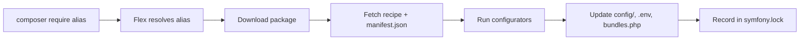

# Symfony Flex

!!! tip "In a nutshell"
    Symfony Flex is a Composer plugin that turns `composer require` into a fully
    configured feature by applying **recipes** and resolving **aliases**.
    Highest-yield: it runs at Composer time only (no runtime role), and
    `symfony.lock` tracks recipes — not package versions, which is `composer.lock`.

!!! abstract "Learning objectives"
    By the end of this chapter you can:

    - [ ] Explain what Flex is and how it hooks into Composer.
    - [ ] Describe recipes, aliases and the role of `symfony.lock`.
    - [ ] Trace what a recipe does when you `composer require` a package.
    - [ ] Know how Flex auto-registers bundles via `config/bundles.php`.

    **Syllabus:** `Symfony Architecture → Symfony Flex` ·
    **Level:** Advanced ·
    **Est. time:** 25 min ·
    **Prerequisites:** [Code Organization](code-organization.md)

---

## Theory

**Symfony Flex** is a **Composer plugin** that automates the boring parts of
installing packages: it maps friendly **aliases** to real package names and applies
**recipes** that create config files, register bundles, set environment variables
and more. It turns `composer require orm` into a fully wired feature instead of a
bare library download.

## Deep Dive — how it works internally

### Flex is a Composer plugin

`symfony/flex` registers as a Composer plugin and subscribes to Composer events
(`post-install-cmd`, `post-update-cmd`, package install/uninstall). When a package
is installed, Flex looks up a matching **recipe** and applies its **configurators**.

### Aliases

Aliases are short names resolved against Symfony's recipe server. `composer require
orm` resolves to `doctrine/orm` (+ its recipe); `composer require logger` resolves
to a logging package. Aliases are a convenience only — the real package name is
what ends up in `composer.json`.

### Recipes and the manifest

A recipe is a small repository of files plus a `manifest.json` describing
**configurators** to run:

| Configurator | Effect |
|---|---|
| `bundles` | Adds the bundle to `config/bundles.php` (per environment) |
| `copy-from-recipe` | Copies config files into `config/`, etc. |
| `env` | Appends variables to `.env` / `.env.dist` |
| `makefile`, `gitignore`, `composer-scripts` | Project scaffolding |
| `container` | Sets container parameters |

Recipes come from two repositories: the curated `symfony/recipes` and the
community `symfony/recipes-contrib`. Contrib recipes require opting in.

### symfony.lock

Flex records applied recipes and their versions in **`symfony.lock`** (committed to
VCS). It lets Flex know which recipes are installed, detect updates
(`composer recipes` / `composer recipes:update`) and cleanly reverse a recipe when
you remove a package. It complements — it does not replace — `composer.lock`.



### How bundles get registered

Flex's `bundles` configurator writes entries into `config/bundles.php`,
an array mapping bundle class → environments:

```php
<?php
// config/bundles.php (managed by Flex)
return [
    Symfony\Bundle\FrameworkBundle\FrameworkBundle::class => ['all' => true],
    Symfony\Bundle\WebProfilerBundle\WebProfilerBundle::class => ['dev' => true, 'test' => true],
];
```

`Symfony\Component\HttpKernel\Kernel::registerBundles()` (via `MicroKernelTrait`)
reads this file at boot, so no manual bundle wiring is needed.

!!! note "Source reference"
    `symfony/flex` Composer plugin — [github.com/symfony/flex](https://github.com/symfony/flex);
    recipes — [github.com/symfony/recipes](https://github.com/symfony/recipes).

### Compilation vs runtime

Flex operates entirely at **Composer time** (install/update). It writes files;
it plays **no** role at HTTP runtime. The kernel later reads `config/bundles.php`
and `config/` at boot/compile time.

## Configuration & code

=== "Console"

    ```console
    $ composer require orm          # alias → doctrine/orm + recipe
    $ composer recipes              # list installed recipes & status
    $ composer recipes:update       # apply newer recipe versions
    ```

=== "symfony.lock (excerpt)"

    ```json
    {
      "symfony/framework-bundle": {
        "version": "8.0",
        "recipe": { "repo": "github.com/symfony/recipes", "ref": "…" }
      }
    }
    ```

=== "Enable contrib recipes"

    ```console
    $ composer config extra.symfony.allow-contrib true
    ```

## Best practices & anti-patterns

| ✅ Do | ❌ Avoid |
|---|---|
| Commit `symfony.lock` | Git-ignoring `symfony.lock` |
| Review files a recipe added | Blindly accepting contrib recipes |
| Use `composer recipes:update` for config drift | Hand-editing recipe-managed files without care |

## When (not) to use it / alternatives

Flex is the default for Symfony apps and is effectively always on in a skeleton.
You would only avoid it in a non-Symfony project consuming components standalone
(see [Components](components.md)), where Composer alone suffices.

!!! danger "Certification traps"
    - Flex is a **Composer plugin**, not a runtime component — no effect on request handling.
    - **Aliases** are name shortcuts; **recipes** are the automation.
    - `symfony.lock` tracks **recipes**; `composer.lock` tracks **package versions** — different files.
    - Contrib recipes (`symfony/recipes-contrib`) require explicit opt-in.

!!! warning "Common mistakes"
    - Editing `config/bundles.php` by hand and then being surprised when a recipe rewrites it.
    - Assuming removing a package leaves config behind — Flex reverses the recipe.

## Exercises

1. **(Advanced)** After `composer require`, list three project files a recipe may
   have changed.
2. **(Expert)** Explain why `symfony.lock` must be committed to version control.

??? success "Solutions"

    **1.** `config/bundles.php` (bundle registration), a file under
    `config/packages/` (bundle config), and `.env` (new env vars).

    **2.** So every developer/CI applies the **same recipe versions**, keeps config
    reproducible, and Flex can detect/rollback recipe changes consistently.

## Certification questions

??? question "Q1. What is Symfony Flex?"
    - [x] A. A Composer plugin that applies recipes and resolves aliases ✅
    - [ ] B. A runtime kernel event
    - [ ] C. A templating engine

    **Why:** Flex automates package configuration at Composer time. **Ref:**
    [Symfony Flex](https://symfony.com/doc/current/setup.html#symfony-flex).

??? question "Q2. What does `symfony.lock` track?"
    - [x] A. Which recipes are installed and their versions ✅
    - [ ] B. The compiled container
    - [ ] C. HTTP sessions

    **Why:** It records recipe application, separate from `composer.lock`. **Ref:**
    [Using Symfony Flex](https://symfony.com/doc/current/setup.html).

??? question "Q3. How are bundles auto-registered by a recipe?"
    - [x] A. Entries are written to `config/bundles.php` ✅
    - [ ] B. Via `#[AsBundle]`
    - [ ] C. In `services.yaml`

    **Why:** The `bundles` configurator edits `config/bundles.php`. **Ref:**
    [Bundles](https://symfony.com/doc/current/bundles.html).

## Key takeaways

- Flex is a Composer plugin: aliases + recipes automate setup.
- Recipes run configurators (bundles, config, env) via `manifest.json`.
- `symfony.lock` records installed recipes and is committed.
- Bundles register through `config/bundles.php`, read by the kernel at boot.

## Last-minute revision

!!! tip "Cheat sheet"
    - Alias → real package; recipe → automation.
    - Recipe sources: `symfony/recipes` (main), `symfony/recipes-contrib` (opt-in).
    - `symfony.lock` = recipes; `composer.lock` = versions.
    - `composer recipes` / `recipes:update`.

## Official References
- [Official docs — Setup & Flex](https://symfony.com/doc/current/setup.html)
- [Symfony Flex source](https://github.com/symfony/flex)
- [Symfony recipes](https://github.com/symfony/recipes)

---

<small>Related: [Code Organization](code-organization.md) · [Components](components.md) · [Framework Overloading](overloading.md)</small>
