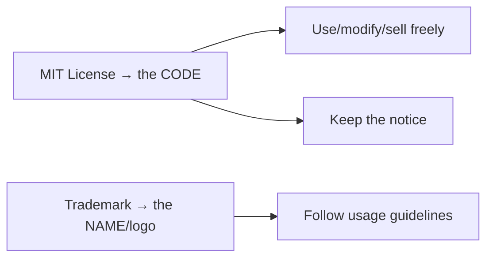

# License & Trademark

!!! tip "In a nutshell"
    Le code de Symfony est sous **licence MIT** (permissive, non copyleft) : vous
    pouvez donc l'utiliser même dans des produits closed-source. À retenir en
    priorité : la seule obligation est de conserver la notice de copyright et de
    permission, et le **nom/logo « Symfony » relève d'une marque déposée
    distincte**.

!!! example "Real-world analogy"
    Pensez à une recette publiée gratuitement dans un livre de cuisine
    communautaire. Chacun peut la cuisiner, l'adapter, et même vendre le plat fini
    dans son propre restaurant sans rien dévoiler — la seule règle est de garder la
    petite mention « recette de… » attachée (la notice MIT). Le *nom et le logo*
    déposés du restaurant, en revanche, sont une affaire totalement distincte :
    vous pouvez dire en toute honnêteté que votre plat est « préparé d'après la
    recette de Grand-mère », mais vous ne pouvez pas ouvrir un restaurant appelé
    « Chez Grand-mère » ni réutiliser son logo sans autorisation. La licence de la
    recette et la marque de l'enseigne sont deux instruments juridiques différents.

!!! abstract "Learning objectives"
    À la fin de ce chapitre, vous saurez :

    - [ ] Indiquer quelle licence Symfony utilise et ce qu'elle permet.
    - [ ] Distinguer la **licence MIT** de la **marque Symfony**.
    - [ ] Expliquer vos obligations lors de la redistribution du code de Symfony.

    **Syllabus:** `Symfony Architecture → License` ·
    **Level:** Advanced ·
    **Est. time:** 10 min ·
    **Prerequisites:** [Components](components.md)

---

## Theory

Symfony (le framework et ses components) est publié sous la **licence MIT** — une
licence open source courte et permissive. Par ailleurs, **« Symfony » est une
marque déposée de Symfony SAS**. Licence et marque sont des instruments juridiques
*différents* : la licence MIT régit le **code** ; la marque régit le **nom et le
logo**.

## Deep Dive — how it works internally

!!! question "Predict first"
    Une entreprise commercialise un SaaS closed-source bâti sur Symfony et le nomme
    « SymfonyCloud ». Quelle partie est autorisée par MIT, et laquelle est risquée ?

??? note "Reveal"
    Construire le SaaS et *ne pas* l'open-sourcer ne pose aucun problème — MIT est
    permissive et non copyleft. Le nommer « SymfonyCloud » risque de contrefaire la
    **marque**, régie séparément par la politique de marque de Symfony SAS, et non
    par la licence du code.

### What the MIT license grants

MIT est une licence **permissive**. Elle permet à quiconque, gratuitement :

- d'**utiliser** le logiciel pour n'importe quel usage (y compris commercial),
- de **copier, modifier, fusionner, publier, distribuer, sous-licencier et vendre**
  des copies,
- avec pour l'essentiel **une seule condition** : la notice de copyright et la
  notice de permission doivent figurer dans toutes les copies ou portions
  substantielles.

Elle exclut également toute garantie et responsabilité (« AS IS »). N'étant pas une
licence copyleft (contrairement à la GPL), elle vous autorise à inclure Symfony
dans des produits **closed-source** et propriétaires sans publier votre propre
code source.



### The one obligation, precisely

Vous devez conserver le texte de la licence et la notice de copyright. Vous
n'avez **pas** à open-sourcer vos modifications, à payer des royalties ni à
demander une autorisation. Cette unique exigence d'attribution résume toute la
conformité côté code.

### Trademark — what MIT does *not* cover

La licence MIT ne dit rien des noms ni des logos. Utiliser le **nom/logo
« Symfony »** pour marquer votre produit, suggérer une approbation officielle ou
nommer un projet concurrent relève de la **politique de marque** de Symfony SAS,
et non de la licence du code. Vous pouvez construire sur Symfony et dire que votre
produit « is built with Symfony », mais vous ne pouvez pas appeler votre produit
« Symfony X » ni utiliser le logo comme s'il était officiel sans suivre les
directives.

!!! note "Source reference"
    Symfony fournit un fichier `LICENSE` (MIT) dans chaque package —
    [symfony/symfony `8.0` LICENSE](https://github.com/symfony/symfony/blob/8.0/LICENSE).

### This project

Cette plateforme de préparation à la certification est elle-même sous licence MIT
et constitue un **projet communautaire indépendant, non affilié à Symfony SAS**,
raison pour laquelle son pied de page mentionne la marque. C'est une illustration
d'une bonne hygiène en matière de marque.

## Configuration & code

=== "Attribution notice you keep"

    ```text
    Copyright (c) <year> Fabien Potencier
    Permission is hereby granted, free of charge, ... (full MIT text)
    ```

=== "composer.json license field"

    ```json
    {
      "license": "MIT"
    }
    ```

## Best practices & anti-patterns

| ✅ Do | ❌ Avoid |
|---|---|
| Conserver la notice MIT lors de la redistribution | Supprimer la notice de copyright/permission |
| Dire « built with Symfony » | Marquer votre produit « Symfony … » |
| Suivre la politique de marque pour le nom/logo | Utiliser le logo pour suggérer une approbation officielle |

## When (not) to use it / alternatives

MIT s'applique automatiquement au code de Symfony — il n'y a rien à « activer ».
La seule vraie décision porte sur **votre** travail distribué : conservez la
notice, et faites attention à la marque dans votre marketing.

!!! danger "Certification traps"
    - Symfony est sous **MIT**, pas GPL — pas de copyleft, l'usage closed-source est autorisé.
    - La **seule** condition de MIT est de conserver la notice.
    - La **marque** (nom/logo) est distincte de la licence du code.

!!! warning "Common mistakes"
    - Croire que MIT vous oblige à open-sourcer votre application — ce n'est pas le cas.
    - Croire que la licence du code vous autorise à utiliser librement le nom/logo Symfony — ce n'est pas le cas.

## Exercises

1. **(Advanced)** Citez l'unique obligation que MIT impose lors de la redistribution.
2. **(Expert)** Une startup commercialise un SaaS closed-source sur Symfony et veut
   l'appeler « SymfonyCloud ». Quelle partie est autorisée, laquelle est risquée ?

??? success "Solutions"

    **1.** Inclure la notice de copyright et la notice de permission MIT dans
    toutes les copies ou portions substantielles.

    **2.** Construire un SaaS closed-source sur Symfony est autorisé par MIT. Le
    nommer « SymfonyCloud » risque de contrefaire la **marque** — cela relève de la
    politique de marque de Symfony SAS, pas de la licence MIT.

## Certification questions

??? question "Q1. Under which license is Symfony released?"
    - [x] A. MIT ✅
    - [ ] B. GPLv3
    - [ ] C. Apache 2.0

    **Why:** Les components Symfony sont publiés sous la licence permissive MIT. **Ref:**
    [Symfony LICENSE](https://github.com/symfony/symfony/blob/8.0/LICENSE).

??? question "Q2. What is MIT's core obligation?"
    - [x] A. Retain the copyright and permission notice ✅
    - [ ] B. Publish your source code
    - [ ] C. Pay a royalty

    **Why:** MIT exige uniquement de conserver la notice. **Ref:**
    [MIT text](https://opensource.org/license/mit).

??? question "Q3. Does the MIT license grant rights to the Symfony name/logo?"
    - [ ] A. Yes
    - [x] B. No — that is governed by the trademark ✅
    - [ ] C. Only in dev

    **Why:** La licence du code et la marque sont distinctes. **Ref:**
    [Symfony trademark](https://symfony.com/trademark).

## Key takeaways

- Symfony est sous licence MIT : utilisation/modification/vente libres, même en closed-source.
- L'unique condition est de conserver la notice de copyright + permission.
- Le nom/logo « Symfony » est une marque, régie séparément du code.

## Last-minute revision

!!! tip "Cheat sheet"
    - Licence = **MIT** (permissive, non copyleft).
    - Obligation = conserver la notice.
    - Marque ≠ licence — nom/logo relèvent de la politique de marque.

## Connections

- **Depends on:** [Components](components.md) — chaque component embarque son propre fichier `LICENSE` MIT.
- **Reused in:** [Release Management](release-management.md) — la licence reste MIT pour chaque release ; [Best Practices](best-practices.md) aborde la conservation des notices lors de la redistribution.
- **Confused with:** [BC Promise](bc-promise.md) — une garantie *juridique* sur la licence du code, pas une garantie *technique* sur la stabilité de l'API.

## Official References
- [Symfony documentation — Contributing: Backwards Compatibility & licensing](https://symfony.com/doc/8.0/contributing/code/bc.html)
- [Symfony source — LICENSE (MIT)](https://github.com/symfony/symfony/blob/8.0/LICENSE)
- [MIT License text](https://opensource.org/license/mit)
- [Symfony trademark policy](https://symfony.com/trademark)

## Video references

!!! tip "Watch & learn"
    Voici des chaînes vidéo officielles, mises à jour en continu — cherchez-y
    « Symfony architecture » pour consolider ce chapitre. Nous référençons des
    chaînes stables plutôt que des vidéos individuelles afin que les références ne
    deviennent jamais obsolètes.

    - [SymfonyCasts screencasts](https://symfonycasts.com/tracks/symfony) — tutoriels scénarisés à suivre en codant.
    - [Symfony official YouTube](https://www.youtube.com/@SymfonyOfficial) — conférences et keynotes SymfonyCon.
    - [Official docs for this topic](https://symfony.com/doc/8.0/contributing/code/bc.html) — certaines pages de la doc Symfony intègrent un screencast.

## Confidence check

Je suis prêt(e) quand je peux :

- [ ] expliquer **pourquoi** MIT permet l'usage closed-source et commercial
- [ ] énoncer l'unique obligation que MIT impose lors de la redistribution
- [ ] déboguer un défaut de conformité où la notice de copyright/permission a été supprimée
- [ ] repérer que le nom/logo Symfony est une marque, non couverte par MIT
- [ ] expliquer la différence entre « built with Symfony » et marquer un produit « Symfony X »

---

<small>Related: [Components](components.md) · [Release Management](release-management.md) · [Best Practices](best-practices.md)</small>
