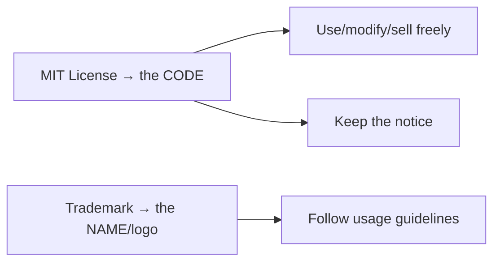

# License & Trademark

!!! tip "In a nutshell"
    Symfony's code is **MIT-licensed** (permissive, non-copyleft), so you can use it
    even in closed-source products. Highest-yield: the only obligation is keeping the
    copyright/permission notice, and the **"Symfony" name/logo is a separate
    trademark**.

!!! abstract "Learning objectives"
    By the end of this chapter you can:

    - [ ] State which license Symfony uses and what it permits.
    - [ ] Distinguish the **MIT license** from the **Symfony trademark**.
    - [ ] Explain your obligations when redistributing Symfony code.

    **Syllabus:** `Symfony Architecture → License` ·
    **Level:** Advanced ·
    **Est. time:** 10 min ·
    **Prerequisites:** [Components](components.md)

---

## Theory

Symfony (the framework and its components) is released under the **MIT License** —
a short, permissive open-source license. Separately, **"Symfony" is a registered
trademark of Symfony SAS**. License and trademark are *different* legal instruments:
the MIT license governs the **code**; the trademark governs the **name and logo**.

## Deep Dive — how it works internally

!!! question "Predict first"
    A company ships a closed-source SaaS built on Symfony and names it
    "SymfonyCloud". Which part is fine under MIT, and which part is risky?

??? note "Reveal"
    Building and *not* open-sourcing the SaaS is fine — MIT is permissive and
    non-copyleft. Naming it "SymfonyCloud" risks **trademark** infringement, governed
    separately by Symfony SAS's trademark policy, not the code license.

### What the MIT license grants

MIT is a **permissive** license. It lets anyone, free of charge:

- **use** the software for any purpose (including commercial),
- **copy, modify, merge, publish, distribute, sublicense and sell** copies,
- with essentially **one condition**: the copyright notice and permission notice
  must be included in all copies or substantial portions.

It also disclaims warranty and liability ("AS IS"). Because it is not a copyleft
license (unlike the GPL), you may include Symfony in **closed-source** and
proprietary products without releasing your own source.



### The one obligation, precisely

You must retain the license text and copyright notice. You do **not** have to
open-source your changes, pay royalties, or ask permission. That single attribution
requirement is the whole compliance story for the code.

### Trademark — what MIT does *not* cover

The MIT license says nothing about names or logos. Using the **"Symfony" name/logo**
to brand your product, imply endorsement, or name a conflicting project is governed
by Symfony SAS's **trademark policy**, not the code license. You can build on
Symfony and say your product "is built with Symfony", but you cannot call your
product "Symfony X" or use the logo as if official without following the guidelines.

!!! note "Source reference"
    Symfony ships a `LICENSE` (MIT) in each package —
    [symfony/symfony `8.0` LICENSE](https://github.com/symfony/symfony/blob/8.0/LICENSE).

### This project

This certification-prep platform is itself MIT-licensed and is an **independent
community project not affiliated with Symfony SAS**, which is why its footer notes
the trademark. That mirrors correct trademark hygiene.

## Configuration & code

=== "Attribution notice you keep"

    ```text
    Copyright (c) <year> Fabien Potencier
    Permission is hereby granted, free of charge, ... (full MIT text)
    ```

=== "composer.json license field"

    ```json
    {
      "license": "MIT"
    }
    ```

## Best practices & anti-patterns

| ✅ Do | ❌ Avoid |
|---|---|
| Keep the MIT notice when redistributing | Stripping the copyright/permission notice |
| Say "built with Symfony" | Branding your product as "Symfony …" |
| Follow the trademark policy for name/logo | Using the logo to imply official endorsement |

## When (not) to use it / alternatives

MIT applies to Symfony code automatically — there is nothing to "opt into". The only
real decision is on **your** distributed work: keep the notice, and mind the
trademark when marketing.

!!! danger "Certification traps"
    - Symfony is **MIT**, not GPL — no copyleft, closed-source use is allowed.
    - The **only** MIT condition is retaining the notice.
    - The **trademark** (name/logo) is separate from the code license.

!!! warning "Common mistakes"
    - Assuming MIT forces you to open-source your app — it does not.
    - Assuming the code license lets you use the Symfony name/logo freely — it doesn't.

## Exercises

1. **(Advanced)** List the single obligation MIT imposes on redistribution.
2. **(Expert)** A startup ships a closed-source SaaS on Symfony and wants to call it
   "SymfonyCloud". Which part is fine, which is risky?

??? success "Solutions"

    **1.** Include the copyright notice and the MIT permission notice in all copies
    or substantial portions.

    **2.** Building a closed-source SaaS on Symfony is fine under MIT. Naming it
    "SymfonyCloud" risks **trademark** infringement — that is governed by Symfony
    SAS's trademark policy, not the MIT license.

## Certification questions

??? question "Q1. Under which license is Symfony released?"
    - [x] A. MIT ✅
    - [ ] B. GPLv3
    - [ ] C. Apache 2.0

    **Why:** Symfony components ship under the permissive MIT license. **Ref:**
    [Symfony LICENSE](https://github.com/symfony/symfony/blob/8.0/LICENSE).

??? question "Q2. What is MIT's core obligation?"
    - [x] A. Retain the copyright and permission notice ✅
    - [ ] B. Publish your source code
    - [ ] C. Pay a royalty

    **Why:** MIT only requires keeping the notice. **Ref:**
    [MIT text](https://opensource.org/license/mit).

??? question "Q3. Does the MIT license grant rights to the Symfony name/logo?"
    - [ ] A. Yes
    - [x] B. No — that is governed by the trademark ✅
    - [ ] C. Only in dev

    **Why:** Code license and trademark are separate. **Ref:**
    [Symfony trademark](https://symfony.com/trademark).

## Key takeaways

- Symfony is MIT-licensed: use/modify/sell freely, even closed-source.
- The sole condition is keeping the copyright + permission notice.
- "Symfony" name/logo is a trademark, governed separately from the code.

## Last-minute revision

!!! tip "Cheat sheet"
    - License = **MIT** (permissive, non-copyleft).
    - Obligation = keep the notice.
    - Trademark ≠ license — name/logo need the trademark policy.

## Connections

- **Depends on:** [Components](components.md) — each component ships its own MIT `LICENSE` file.
- **Reused in:** [Release Management](release-management.md) — the licence stays MIT across every release; [Best Practices](best-practices.md) touches keeping notices when redistributing.
- **Confused with:** [BC Promise](bc-promise.md) — a *legal* guarantee about the code licence, not a *technical* guarantee about API stability.

## Official References
- [Symfony documentation — Contributing: Backwards Compatibility & licensing](https://symfony.com/doc/current/contributing/code/bc.html)
- [Symfony source — LICENSE (MIT)](https://github.com/symfony/symfony/blob/8.0/LICENSE)
- [MIT License text](https://opensource.org/license/mit)
- [Symfony trademark policy](https://symfony.com/trademark)

## Confidence check

I'm ready when I can:

- [ ] explain **why** MIT permits closed-source and commercial use
- [ ] state the single obligation MIT imposes when redistributing
- [ ] debug a compliance gap where the copyright/permission notice was stripped
- [ ] spot that the Symfony name/logo is a trademark, not covered by MIT
- [ ] explain how "built with Symfony" differs from branding a product "Symfony X"

---

<small>Related: [Components](components.md) · [Release Management](release-management.md) · [Best Practices](best-practices.md)</small>
