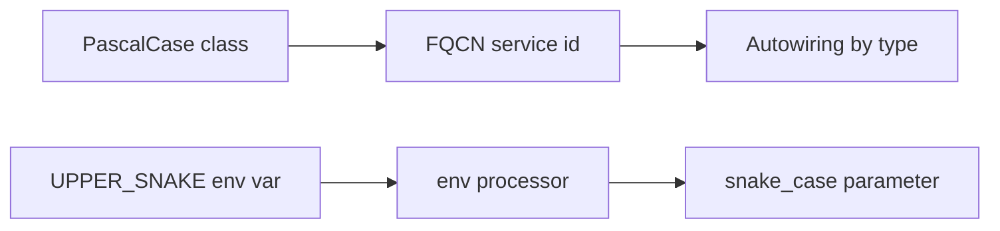

# Naming Conventions

!!! tip "In a nutshell"
    Des noms cohérents sont fonctionnels, pas cosmétiques — ils permettent à
    l'autowiring, à l'autoconfiguration et au router de fonctionner
    automatiquement. À retenir en priorité : **suffixes** `Interface` et `Trait`,
    **préfixe** `Abstract`, id de service = **FQCN**, routes en **snake_case**,
    variables d'environnement en **UPPER_SNAKE** (préfixées `APP_`).

!!! example "Real-world analogy"
    Imaginez un hôpital où chaque membre du personnel porte un uniforme et un badge
    codés par rôle. Une blouse verte marquée « Chirurgien » (le suffixe
    `Interface`, le badge FQCN) permet au système de triage d'orienter
    automatiquement un cas vers la bonne personne, sans que personne ne s'arrête
    pour demander qui fait quoi. Une infirmière en chemise unie sans étiquette (un
    id de service arbitraire avec des points) peut toujours travailler, mais le
    répartiteur automatique ne peut plus l'associer à la tâche par son type. Le
    code vestimentaire n'est pas cosmétique — c'est précisément ce qui fait
    fonctionner le routage et le câblage automatiques.

!!! abstract "Learning objectives"
    À la fin de ce chapitre, vous saurez :

    - [ ] Appliquer les règles de nommage de Symfony aux classes, interfaces, traits et exceptions.
    - [ ] Nommer correctement les services, paramètres, routes, clés de config et variables d'environnement.
    - [ ] Reconnaître les violations de convention que l'examen glisse dans ses questions.

    **Syllabus:** `Symfony Architecture → Naming Conventions` ·
    **Level:** Advanced ·
    **Est. time:** 20 min ·
    **Prerequisites:** [Code Organization](code-organization.md)

---

## Theory

Des noms cohérents rendent le code Symfony prévisible et permettent à
l'autowiring, à l'autoconfiguration et au router de « simplement fonctionner ».
Symfony documente des conventions pour les **identifiants PHP**, les
**services/paramètres**, les **routes** et les **variables d'environnement**.
Elles s'alignent sur PSR-1/PSR-12 et ajoutent quelques règles propres à Symfony.

## Deep Dive — how it works internally

!!! question "Predict first"
    Vous enregistrez un service sous un id personnalisé avec des points,
    `app.importer`, et vous type-hintez `App\Service\Importer` dans un controller.
    L'autowiring l'injecte-t-il ?

??? note "Reveal"
    Pas via ce type-hint. L'autowiring fait correspondre **type = id de service
    FQCN**. Un id personnalisé avec des points n'est pas retrouvé par le type-hint
    de la classe, sauf si vous ajoutez un alias depuis le FQCN. Le Symfony
    idiomatique utilise le FQCN comme id.

### PHP identifiers

| Élément | Convention | Exemple |
|---|---|---|
| Classe | `StudlyCaps` (PascalCase) | `InvoiceGenerator` |
| Interface | suffixe `Interface` | `ArgumentResolverInterface` |
| Trait | suffixe `Trait` | `MicroKernelTrait` |
| Classe abstraite | préfixe `Abstract` | `AbstractController` |
| Exception | suffixe `Exception` | `NotFoundHttpException` |
| Méthode / propriété | `camelCase` | `getStatusCode()`, `$statusCode` |
| Constante | `UPPER_SNAKE_CASE` | `MAIN_REQUEST` |
| Cas d'enum | `PascalCase` | `Status::Active` |

Rien de cosmétique là-dedans : l'autoconfiguration fonde son comportement sur les
interfaces (p. ex. implémenter `EventSubscriberInterface` tague automatiquement le
service), si bien que le suffixe `Interface` fait partie d'un contrat fonctionnel.

```php
use Symfony\Component\EventDispatcher\EventSubscriberInterface;

// The "Interface" suffix is a working contract: implementing
// EventSubscriberInterface is what triggers the automatic tagging.
final class RequestLogger implements EventSubscriberInterface
{
    public static function getSubscribedEvents(): array
    {
        return ['kernel.request' => 'onRequest'];
    }

    public function onRequest(): void
    {
        // ...
    }
}
```

### Service and parameter names

- **IDs de service** : le **FQCN** est l'id (`App\Service\Importer`).
  L'autowiring résout les type-hints vers ces ids. Les ids historiques avec des
  points (`app.importer`) fonctionnent encore, mais le FQCN est idiomatique.
- **Paramètres** : minuscules, séparés par des points ou des underscores, souvent
  préfixés d'un espace de noms (`app.page_size`). Les paramètres du framework
  utilisent le préfixe `kernel.` (`kernel.project_dir`, `kernel.debug`).
- **Tags** : minuscules, séparés par des points (`kernel.event_listener`, `controller.service_arguments`).

```yaml
# config/services.yaml
parameters:
    app.page_size: 25                           # snake_case, "app." namespaced
    app.debug_banner: '%kernel.debug%'          # framework params use "kernel."
    app.import_dir: '%kernel.project_dir%/var'  # e.g. kernel.project_dir

services:
    App\Service\Importer: ~                     # service id = the FQCN
    app.importer:                               # legacy dotted id → alias the FQCN
        alias: App\Service\Importer

    App\EventListener\RequestListener:
        tags: ['kernel.event_listener']         # lowercase dotted tag
    App\Controller\ImportController:
        tags: ['controller.service_arguments']  # lowercase dotted tag
```

### Route names

Les routes utilisent le **snake_case** en minuscules, typiquement `entity_action` :
`blog_show`, `invoice_list`, `app_login`. Les noms générés automatiquement par
`make:controller` suivent `app_<controller>_<action>`. Gardez-les stables — ils
sont référencés par `generateUrl()`/`path()`.

```php
// snake_case route names, typically entity_action:
// blog_show, invoice_list, app_login
// (make:controller generates names like app_blog_index)
#[Route('/blog/{slug}', name: 'blog_show')]
public function show(string $slug): Response
{
    // referenced by name in PHP via generateUrl():
    $url = $this->generateUrl('blog_show', ['slug' => $slug]);
    // and in Twig via path(): {{ path('blog_show', {slug: post.slug}) }}
    // ...
}
```

### Config keys

La config des bundles utilise des clés en **snake_case** sous l'**alias** du
bundle (l'alias de l'extension, p. ex. `framework`, `twig`, `security`). Les clés
imbriquées restent en snake_case : `framework.http_method_override`.

```yaml
# config/packages/framework.yaml — snake_case keys under the "framework" alias
framework:
    http_method_override: false

# config/packages/twig.yaml — the "twig" alias
twig:
    strict_variables: true

# config/packages/security.yaml — the "security" alias
security:
    firewalls:
        main: { lazy: true }
```

### Environment variables

Les variables d'environnement sont en **UPPER_SNAKE_CASE**, conventionnellement
préfixées **`APP_`** pour les variables applicatives (`APP_ENV`, `APP_DEBUG`,
`APP_SECRET`). Dans la config, elles sont lues via des processors :
`%env(APP_ENV)%`, `%env(int:APP_PAGE_SIZE)%`, `%env(bool:APP_FEATURE_X)%`.

```yaml
# .env: APP_ENV=dev  APP_DEBUG=1  APP_SECRET=s3cr3t  (UPPER_SNAKE, APP_-prefixed)

# config/services.yaml — read env vars through processors
parameters:
    app.env: '%env(APP_ENV)%'                   # raw string
    app.page_size: '%env(int:APP_PAGE_SIZE)%'   # int processor
    app.feature_x: '%env(bool:APP_FEATURE_X)%'  # bool processor
```



!!! note "Source reference"
    Les conventions sont codifiées dans la documentation de contribution et
    appliquées dans tout
    [symfony/symfony `8.0`](https://github.com/symfony/symfony/tree/8.0/src/Symfony).

### Compilation vs runtime

Les ids de service et les paramètres sont résolus à la **compilation** dans le
container dumpé ; les **processors** de variables d'environnement peuvent se
résoudre à la compilation ou au runtime selon le processor, ce qui explique qu'une
config basée sur l'environnement puisse changer sans recompilation.

## Configuration & code

=== "PHP identifiers"

    ```php
    <?php
    declare(strict_types=1);

    namespace App\Report;

    interface ReportBuilderInterface
    {
        public function build(): string;
    }

    final class PdfReportBuilder implements ReportBuilderInterface
    {
        public const int DEFAULT_DPI = 150;

        public function build(): string
        {
            return 'pdf';
        }
    }
    ```

=== "Route + service names (YAML)"

    ```yaml
    # config/services.yaml
    parameters:
        app.report.dpi: '%env(int:APP_REPORT_DPI)%'

    services:
        App\Report\PdfReportBuilder: ~   # id = FQCN
    ```

=== "Route attribute"

    ```php
    <?php
    declare(strict_types=1);

    use Symfony\Component\Routing\Attribute\Route;

    #[Route('/reports/{id}', name: 'report_show')] // snake_case route name
    final class ReportController {}
    ```

## Best practices & anti-patterns

| ✅ Do | ❌ Avoid |
|---|---|
| Ids de service en FQCN | Ids arbitraires avec des points pour les services applicatifs |
| Affixes `Interface`/`Trait`/`Abstract` | Noms nus qui masquent le rôle |
| Routes en snake_case (`entity_action`) | Noms de routes en CamelCase ou avec des espaces |
| Variables d'env UPPER_SNAKE préfixées `APP_` | Variables d'env en casse mixte |
| Clés de config en snake_case sous l'alias du bundle | Clés de config en camelCase |

## When (not) to use it / alternatives

Les conventions sont quasi obligatoires pour l'intégration au framework
(l'autoconfiguration repose sur les suffixes ; le router repose sur les noms de
routes). Ne vous en écartez que lorsqu'un terme métier est plus clair, et jamais
d'une manière qui casse l'autowiring.

!!! danger "Certification traps"
    - Suffixe d'interface `Interface`, suffixe de trait `Trait`, **préfixe** abstrait `Abstract`.
    - Les constantes sont en `UPPER_SNAKE_CASE` (p. ex. `HttpKernelInterface::MAIN_REQUEST`).
    - Id de service = **FQCN** dans le Symfony moderne ; l'autowiring fait correspondre le **type**, pas la chaîne de l'id.
    - Les variables d'env sont en UPPER_SNAKE, généralement préfixées `APP_` ; les paramètres sont en snake_case.

!!! warning "Common mistakes"
    - Nommer une route en CamelCase et casser les appels `path()`/`generateUrl()` ailleurs.
    - Attendre de l'autowiring qu'il retrouve un service via un id personnalisé avec des points.

## Exercises

1. **(Advanced)** Corrigez ceci : `httpClientInterface`, `Abstract_Controller`,
   `blogShow` (route), `app-page-size` (paramètre), `app_env` (variable d'env).
2. **(Expert)** Expliquez comment le suffixe `Interface` interagit avec
   l'autoconfiguration.

??? success "Solutions"

    **1.** `HttpClientInterface`, `AbstractController`, `blog_show`,
    `app.page_size`, `APP_ENV`.

    **2.** L'autoconfiguration inspecte les **interfaces** implémentées (p. ex.
    `EventSubscriberInterface`) pour taguer automatiquement les services ; c'est
    le nommage et l'implémentation corrects de l'interface qui déclenchent le
    tagging/câblage automatique.

## Certification questions

??? question "Q1. How are service IDs written for app services in modern Symfony?"
    - [x] A. The fully-qualified class name (FQCN) ✅
    - [ ] B. Lowercase dotted strings only
    - [ ] C. Random UUIDs

    **Why:** Le FQCN est l'id ; l'autowiring fait correspondre le type. **Ref:**
    [Service container](https://symfony.com/doc/current/service_container.html).

??? question "Q2. What case are environment variables?"
    - [x] A. UPPER_SNAKE_CASE, usually `APP_`-prefixed ✅
    - [ ] B. camelCase
    - [ ] C. kebab-case

    **Why:** Les variables d'environnement utilisent l'upper snake case. **Ref:**
    [Configuration — env vars](https://symfony.com/doc/current/configuration.html#configuration-based-on-environment-variables).

??? question "Q3. Which is a correctly named route?"
    - [x] A. `invoice_show` ✅
    - [ ] B. `InvoiceShow`
    - [ ] C. `invoice show`

    **Why:** Les routes utilisent le snake_case, typiquement `entity_action`. **Ref:**
    [Routing](https://symfony.com/doc/current/routing.html).

## Key takeaways

- Classes en PascalCase ; suffixes `Interface`/`Trait` ; préfixe `Abstract` ; suffixe `Exception`.
- Id de service = FQCN ; paramètres/clés de config en snake_case ; tags en minuscules avec des points.
- Routes en snake_case (`entity_action`) ; variables d'env en UPPER_SNAKE, préfixées `APP_`.
- Le nommage alimente l'autoconfiguration et le router — il est fonctionnel, pas cosmétique.

## Last-minute revision

!!! tip "Cheat sheet"
    - Interface→`Interface`, Trait→`Trait`, Abstract→`Abstract…`, Exception→`Exception`.
    - Constantes UPPER_SNAKE ; cas d'enum PascalCase.
    - Id de service = FQCN ; paramètres snake_case ; routes snake_case.
    - Variables d'env : `APP_*` UPPER_SNAKE ; lues via `%env(...)%`.

## Connections

- **Depends on:** [Code Organization](code-organization.md) — c'est le mapping PSR-4 `App\` → `src/` qui fait fonctionner les ids de service en FQCN.
- **Reused in:** [Dependency Injection](../dependency-injection/index.md) — autowiring/autoconfiguration reposent sur les suffixes d'interface et les ids FQCN ; [Controllers](../controllers/index.md) s'appuient sur des noms de routes en snake_case.
- **Confused with:** [Best Practices](best-practices.md) — le nommage est l'ensemble de règles mécaniques ; les best practices expliquent les choix de conception.

## Official References
- [Official docs — Coding standards](https://symfony.com/doc/current/contributing/code/standards.html)
- [Official docs — Configuration](https://symfony.com/doc/current/configuration.html)
- [Official docs — Routing](https://symfony.com/doc/current/routing.html)

## Video references

!!! tip "Watch & learn"
    Voici des chaînes vidéo officielles, mises à jour en continu — cherchez-y
    « Symfony architecture » pour consolider ce chapitre. Nous référençons des
    chaînes stables plutôt que des vidéos individuelles afin que les références ne
    deviennent jamais obsolètes.

    - [SymfonyCasts screencasts](https://symfonycasts.com/tracks/symfony) — tutoriels scénarisés à suivre en codant.
    - [Symfony official YouTube](https://www.youtube.com/@SymfonyOfficial) — conférences et keynotes SymfonyCon.
    - [Official docs for this topic](https://symfony.com/doc/current/service_container.html) — certaines pages de la doc Symfony intègrent un screencast.

## Confidence check

Je suis prêt(e) quand je peux :

- [ ] expliquer **pourquoi** le nommage est fonctionnel (autoconfiguration, routing), pas cosmétique
- [ ] appliquer les règles d'affixes aux classes, interfaces, traits, classes abstraites et exceptions
- [ ] nommer correctement les services, paramètres, routes, clés de config et variables d'env
- [ ] déboguer un autowiring qui échoue parce qu'un service utilise un id personnalisé avec des points
- [ ] expliquer comment le suffixe `Interface` interagit avec l'autoconfiguration

---

<small>Related: [Code Organization](code-organization.md) · [Best Practices](best-practices.md) · [Dependency Injection](../dependency-injection/index.md)</small>
