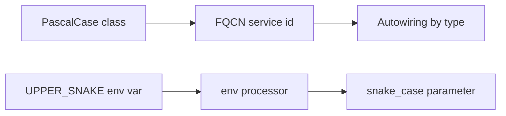

# Naming Conventions

!!! abstract "Learning objectives"
    By the end of this chapter you can:

    - [ ] Apply Symfony's naming rules to classes, interfaces, traits and exceptions.
    - [ ] Name services, parameters, routes, config keys and env vars correctly.
    - [ ] Recognise convention violations that the exam plants.

    **Syllabus:** `Symfony Architecture → Naming Conventions` ·
    **Level:** Advanced ·
    **Est. time:** 20 min ·
    **Prerequisites:** [Code Organization](code-organization.md)

---

## Theory

Consistent names make Symfony code predictable and let autowiring, autoconfiguration
and the router "just work". Symfony documents conventions for **PHP identifiers**,
**services/parameters**, **routes** and **environment variables**. They align with
PSR-1/PSR-12 and add a few Symfony-specific rules.

## Deep Dive — how it works internally

### PHP identifiers

| Element | Convention | Example |
|---|---|---|
| Class | `StudlyCaps` (PascalCase) | `InvoiceGenerator` |
| Interface | suffix `Interface` | `ArgumentResolverInterface` |
| Trait | suffix `Trait` | `MicroKernelTrait` |
| Abstract class | prefix `Abstract` | `AbstractController` |
| Exception | suffix `Exception` | `NotFoundHttpException` |
| Method / property | `camelCase` | `getStatusCode()`, `$statusCode` |
| Constant | `UPPER_SNAKE_CASE` | `MAIN_REQUEST` |
| Enum case | `PascalCase` | `Status::Active` |

These are not cosmetic: autoconfiguration keys behaviour off interfaces (e.g.
implementing `EventSubscriberInterface` auto-tags the service), so the `Interface`
suffix is part of a working contract.

### Service and parameter names

- **Service IDs**: the **FQCN** is the id (`App\Service\Importer`). Autowiring
  resolves type-hints to these ids. Legacy dotted ids
  (`app.importer`) still work but the FQCN is idiomatic.
- **Parameters**: lowercase, dot- or snake-separated, often namespaced
  (`app.page_size`). Framework parameters use the `kernel.` prefix
  (`kernel.project_dir`, `kernel.debug`).
- **Tags**: lowercase, dot-separated (`kernel.event_listener`, `controller.service_arguments`).

### Route names

Routes use lowercase **snake_case**, typically `entity_action`:
`blog_show`, `invoice_list`, `app_login`. The auto-generated names from
`make:controller` follow `app_<controller>_<action>`. Keep them stable — they are
referenced by `generateUrl()`/`path()`.

### Config keys

Bundle config uses **snake_case** keys under the bundle **alias** (the extension's
alias, e.g. `framework`, `twig`, `security`). Nested keys stay snake_case:
`framework.http_method_override`.

### Environment variables

Env vars are **UPPER_SNAKE_CASE**, conventionally prefixed **`APP_`** for
application vars (`APP_ENV`, `APP_DEBUG`, `APP_SECRET`). In config they are read via
processors: `%env(APP_ENV)%`, `%env(int:APP_PAGE_SIZE)%`,
`%env(bool:APP_FEATURE_X)%`.



!!! note "Source reference"
    Conventions are codified in the contribution docs and applied across
    [symfony/symfony `8.0`](https://github.com/symfony/symfony/tree/8.0/src/Symfony).

### Compilation vs runtime

Service ids and parameters are resolved at **compile time** into the dumped
container; env var **processors** may resolve at compile or runtime depending on the
processor, which is why env-based config can change without recompiling.

## Configuration & code

=== "PHP identifiers"

    ```php
    <?php
    declare(strict_types=1);

    namespace App\Report;

    interface ReportBuilderInterface
    {
        public function build(): string;
    }

    final class PdfReportBuilder implements ReportBuilderInterface
    {
        public const int DEFAULT_DPI = 150;

        public function build(): string
        {
            return 'pdf';
        }
    }
    ```

=== "Route + service names (YAML)"

    ```yaml
    # config/services.yaml
    parameters:
        app.report.dpi: '%env(int:APP_REPORT_DPI)%'

    services:
        App\Report\PdfReportBuilder: ~   # id = FQCN
    ```

=== "Route attribute"

    ```php
    <?php
    declare(strict_types=1);

    use Symfony\Component\Routing\Attribute\Route;

    #[Route('/reports/{id}', name: 'report_show')] // snake_case route name
    final class ReportController {}
    ```

## Best practices & anti-patterns

| ✅ Do | ❌ Avoid |
|---|---|
| FQCN service ids | Random dotted ids for app services |
| `Interface`/`Trait`/`Abstract` affixes | Bare names that hide the role |
| snake_case routes (`entity_action`) | CamelCase or spaced route names |
| `APP_`-prefixed UPPER_SNAKE env vars | Mixed-case env vars |
| snake_case config keys under the bundle alias | camelCase config keys |

## When (not) to use it / alternatives

Conventions are near-mandatory for framework integration (autoconfiguration relies
on suffixes; the router relies on route names). Deviate only where a domain term is
clearer, and never in a way that breaks autowiring.

!!! danger "Certification traps"
    - Interface suffix `Interface`, trait suffix `Trait`, abstract **prefix** `Abstract`.
    - Constants are `UPPER_SNAKE_CASE` (e.g. `HttpKernelInterface::MAIN_REQUEST`).
    - Service id = **FQCN** in modern Symfony; autowiring matches by **type**, not id string.
    - Env vars are UPPER_SNAKE, usually `APP_`-prefixed; parameters are snake_case.

!!! warning "Common mistakes"
    - Naming a route in CamelCase and breaking `path()`/`generateUrl()` calls elsewhere.
    - Expecting autowiring to match a service by a custom dotted id.

## Exercises

1. **(Advanced)** Correct these: `httpClientInterface`, `Abstract_Controller`,
   `blogShow` (route), `app-page-size` (parameter), `app_env` (env var).
2. **(Expert)** Explain how the `Interface` suffix interacts with autoconfiguration.

??? success "Solutions"

    **1.** `HttpClientInterface`, `AbstractController`, `blog_show`,
    `app.page_size`, `APP_ENV`.

    **2.** Autoconfiguration inspects implemented **interfaces** (e.g.
    `EventSubscriberInterface`) to auto-tag services; correct interface naming and
    implementation is what triggers the automatic tagging/wiring.

## Certification questions

??? question "Q1. How are service IDs written for app services in modern Symfony?"
    - [x] A. The fully-qualified class name (FQCN) ✅
    - [ ] B. Lowercase dotted strings only
    - [ ] C. Random UUIDs

    **Why:** The FQCN is the id; autowiring matches by type. **Ref:**
    [Service container](https://symfony.com/doc/current/service_container.html).

??? question "Q2. What case are environment variables?"
    - [x] A. UPPER_SNAKE_CASE, usually `APP_`-prefixed ✅
    - [ ] B. camelCase
    - [ ] C. kebab-case

    **Why:** Env vars use upper snake case. **Ref:**
    [Configuration — env vars](https://symfony.com/doc/current/configuration.html#configuration-based-on-environment-variables).

??? question "Q3. Which is a correctly named route?"
    - [x] A. `invoice_show` ✅
    - [ ] B. `InvoiceShow`
    - [ ] C. `invoice show`

    **Why:** Routes use snake_case, typically `entity_action`. **Ref:**
    [Routing](https://symfony.com/doc/current/routing.html).

## Key takeaways

- Classes PascalCase; `Interface`/`Trait` suffixes; `Abstract` prefix; `Exception` suffix.
- Service id = FQCN; parameters/config keys snake_case; tags dotted lowercase.
- Routes snake_case (`entity_action`); env vars UPPER_SNAKE, `APP_`-prefixed.
- Naming feeds autoconfiguration and the router — it is functional, not cosmetic.

## Last-minute revision

!!! tip "Cheat sheet"
    - Interface→`Interface`, Trait→`Trait`, Abstract→`Abstract…`, Exception→`Exception`.
    - Constants UPPER_SNAKE; enum cases PascalCase.
    - Service id = FQCN; params snake_case; routes snake_case.
    - Env vars: `APP_*` UPPER_SNAKE; read via `%env(...)%`.

## Official References
- [Official docs — Coding standards](https://symfony.com/doc/current/contributing/code/standards.html)
- [Official docs — Configuration](https://symfony.com/doc/current/configuration.html)
- [Official docs — Routing](https://symfony.com/doc/current/routing.html)

---

<small>Related: [Code Organization](code-organization.md) · [Best Practices](best-practices.md) · [Dependency Injection](../dependency-injection/index.md)</small>
