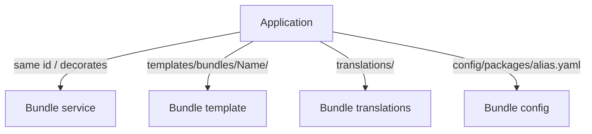

# Framework Overloading

!!! tip "In a nutshell"
    « Overloading » signifie modifier ce que fournit un bundle tiers sans toucher à
    `vendor/`. À retenir en priorité : les services via **décoration/redéfinition**, les
    templates via `templates/bundles/<BundleName>/`, la config via `config/packages/` —
    et l'héritage de bundle (`getParent()`) a **disparu**.

!!! example "Real-world analogy"
    L'overloading, c'est comme personnaliser un appartement meublé en location. Vous
    n'arrachez jamais les installations du propriétaire (cela reviendrait à éditer
    `vendor/`) ; à la place, vous glissez une housse sur son canapé pour en changer le
    comportement (la décoration), vous accrochez vos propres rideaux sur la tringle que
    le bail leur réserve (`templates/bundles/<Name>/`), et vous réglez le chauffage
    depuis son panneau mural dédié (`config/packages/`). Chaque modification a son
    emplacement officiel — accrochez les rideaux sur la mauvaise tringle et rien ne se
    passe. Et l'ancienne option consistant à percer le mur vers l'appartement voisin
    (l'héritage de bundle via `getParent()`) a été définitivement murée.

!!! abstract "Learning objectives"
    À la fin de ce chapitre, vous saurez :

    - [ ] Surcharger le **service**, le **template**, la **translation** et la **config** d'un bundle.
    - [ ] Choisir le bon mécanisme de surcharge selon le type de ressource.
    - [ ] Expliquer pourquoi l'**héritage** de bundle a été supprimé et ce qui l'a remplacé.

    **Syllabus:** `Symfony Architecture → Framework Overloading` ·
    **Level:** Expert ·
    **Est. time:** 25 min ·
    **Prerequisites:** [Code Organization](code-organization.md), [Dependency Injection](../dependency-injection/index.md)

---

## Pour les nuls

### L'idée en une phrase
Surcharger un bundle, c'est changer son comportement sans jamais toucher à ses fichiers dans `vendor/` — chaque type de ressource a son propre "bon endroit" pour être remplacé.

### Imagine dans la vraie vie
Personnaliser un appartement meublé en location : tu n'arraches jamais les meubles du propriétaire (modifier `vendor/`) ; tu glisses une housse sur son canapé pour changer son aspect (décoration de service), tu accroches tes propres rideaux sur la tringle prévue à cet effet (`templates/bundles/<Nom>/`), et tu règles le chauffage depuis son panneau mural dédié (`config/packages/`).

### Dans Symfony
Pour changer l'apparence d'une page d'erreur fournie par un bundle tiers, tu crées un template au même chemin sous `templates/bundles/<NomDuBundle>/` — Symfony le préfère automatiquement à celui du bundle, sans toucher au code du bundle.

### Exemple simple
```
templates/bundles/TwigBundle/Exception/error404.html.twig
```
Ce fichier remplace automatiquement la page 404 par défaut du bundle, sans modifier `vendor/`.

### Comment le mémoriser 🧠
Chaque changement a **un seul emplacement prévu** — mettre les rideaux sur la mauvaise tringle ne fait tout simplement rien. Et l'héritage de bundle (`getParent()`) a été **définitivement muré** — il n'existe plus.


## Theory

« Overloading » signifie modifier ce que fournit un **bundle tiers** sans éditer son
code dans `vendor/`. Symfony propose un mécanisme dédié par type de ressource : les
services via **décoration/redéfinition**, les templates et les translations via des
**chemins conventionnels**, et la configuration via **`config/packages/`**.

## Deep Dive — how it works internally

!!! question "Predict first"
    Vous placez votre surcharge dans `templates/AcmeBlog/post/show.html.twig` et ne
    constatez aucun changement. Où doit-elle aller, et pourquoi Twig a-t-il ignoré la
    vôtre ?

??? note "Reveal"
    Les surcharges de templates de bundle doivent se trouver sous
    `templates/bundles/<BundleName>/…`
    (par exemple `templates/bundles/AcmeBlogBundle/post/show.html.twig`). Seul ce chemin
    prend le pas sur les templates du bundle lui-même — un simple `templates/AcmeBlog/…`
    n'est pas résolu comme une surcharge.

### Overriding services

Trois outils, par précision chirurgicale croissante :

1. **Redéfinir le service** — déclarez un service avec le **même id** dans
   `config/services.yaml` ; la définition la plus tardive l'emporte.
2. **Décorer** — enveloppez l'original avec la clé `decorates:` (ou `#[AsDecorator]`) ;
   l'original est renommé et injecté sous forme de service `.inner`. Idéal quand vous
   voulez *enrichir* le comportement.
3. **Compiler pass** — pour des modifications profondes (arguments, tags), une
   `CompilerPass` manipule le `ContainerBuilder` au moment de la compilation. Voir
   [Compiler Passes](../dependency-injection/compiler-passes.md).

```php
// 1. Redefine: declare the same id in config/services.yaml — the later wins.
// 2. Decorate: #[AsDecorator] (or the "decorates:" YAML key); the original
//    is renamed and injected back as the ".inner" service:
#[AsDecorator(decorates: 'acme.mailer')]
final class TracingMailer
{
    public function __construct(#[AutowireDecorated] private object $inner) {}
}

// 3. Compiler pass: deep changes on the ContainerBuilder at compile time
final class MailerPass implements CompilerPassInterface
{
    public function process(ContainerBuilder $container): void
    {
        $container->getDefinition('acme.mailer')->addTag('app.traced');
    }
}
```

### Overriding templates

Twig résout les templates via des **chemins avec namespace**. Pour surcharger un
template de bundle `@AcmeBlog/post/show.html.twig`, placez votre version dans
`templates/bundles/AcmeBlogBundle/post/show.html.twig`. Le répertoire
`templates/bundles/<BundleName>/` prend le pas sur le répertoire `templates/` du bundle
lui-même. C'est exactement ainsi que vous surchargez les
[error pages](exception-handling.md).

```twig
{# templates/bundles/AcmeBlogBundle/post/show.html.twig #}
{# takes precedence over @AcmeBlog/post/show.html.twig from the bundle #}


My custom title
```

### Overriding translations

Le répertoire `translations/` de l'application a une **priorité plus élevée** que les
translations d'un bundle. Fournissez un catalogue avec le même domaine et la même locale
(par exemple `translations/messages.en.yaml`) et vos chaînes l'emportent sur celles du
bundle.

```yaml
# translations/messages.en.yaml — the app translations/ dir outranks the bundle's
# (same "messages" domain + same "en" locale → your strings win)
post.title: 'My custom post title'
post.author: 'Written by %name%'
```

### Overriding configuration

Chaque bundle expose un arbre de configuration (son extension). Surchargez les valeurs
par défaut en écrivant `config/packages/<alias>.yaml` (par exemple
`config/packages/twig.yaml`). Les surcharges par environnement vont sous
`config/packages/<env>/`. Les valeurs que vous définissez remplacent ou fusionnent avec
les valeurs par défaut du bundle selon la définition de la config.

```yaml
# config/packages/twig.yaml — <alias>.yaml overrides the bundle's defaults
twig:
    strict_variables: true

# per-environment override lives under config/packages/<env>/,
# e.g. config/packages/prod/twig.yaml
```



### Bundle inheritance is gone

Les anciennes versions de Symfony permettaient à un bundle de déclarer `getParent()` et
de surcharger les ressources d'un autre bundle par héritage. Cette fonctionnalité a été
**dépréciée en 4.4 et supprimée en 5.0**. Dans Symfony 8, il n'y a **pas** de
`getParent()` ; utilisez la surcharge par ressource décrite ci-dessus. Les bundles ne
reposent plus non plus sur l'ancien dossier `Resources/` — l'organisation moderne
utilise `config/`, `templates/`, `translations/` à la racine (voir
[Code Organization](code-organization.md)).

```php
// REMOVED — Symfony 8 bundles have no getParent() (gone since 5.0):
// public function getParent(): string { return 'AcmeBlogBundle'; }

// Modern bundle layout (no legacy Resources/ folder):
//   acme-blog-bundle/
//   ├── config/          # service definitions
//   ├── templates/       # bundle templates
//   ├── translations/    # bundle catalogues
//   └── src/AcmeBlogBundle.php
```

!!! note "Source reference"
    La mécanique de surcharge est répartie entre FrameworkBundle/TwigBundle et le
    compilateur de DI —
    [symfony/symfony `8.0`](https://github.com/symfony/symfony/tree/8.0/src/Symfony/Bundle).

### Compilation vs runtime

Les surcharges de services et de config sont résolues à la **compilation** dans le
container dumpé. Les surcharges de templates et de translations sont résolues au
**runtime** via le loader Twig / le translator, mais les *chemins* sont enregistrés à
la compilation.

## Configuration & code

=== "Decorate a bundle service"

    ```php
    <?php
    declare(strict_types=1);

    namespace App\Mailer;

    use Symfony\Component\DependencyInjection\Attribute\AsDecorator;
    use Symfony\Component\DependencyInjection\Attribute\AutowireDecorated;

    #[AsDecorator(decorates: 'acme.mailer')]
    final class TracingMailer
    {
        public function __construct(
            #[AutowireDecorated] private readonly object $inner,
        ) {}

        public function send(string $to, string $body): void
        {
            // ... trace, then delegate
            $this->inner->send($to, $body);
        }
    }
    ```

=== "Override a template"

    ```twig
    {# templates/bundles/AcmeBlogBundle/post/show.html.twig #}
    
    Custom title
    ```

=== "Override config"

    ```yaml
    # config/packages/twig.yaml
    twig:
        strict_variables: true
    ```

## Best practices & anti-patterns

| ✅ Do | ❌ Avoid |
|---|---|
| Décorer pour enrichir un comportement | Éditer des fichiers dans `vendor/` |
| Utiliser `templates/bundles/<Name>/` pour les templates | Forker un bundle pour changer un seul template |
| Surcharger la config dans `config/packages/` | Copier-coller toute la config d'un bundle |
| Utiliser des compiler passes pour les changements de DI profonds | Rendre tout public pour pouvoir le surcharger |

## When (not) to use it / alternatives

Surchargez quand vous devez ajuster un bundle qui ne vous appartient pas. Si vous vous
retrouvez à *tout* surcharger, envisagez de ne pas utiliser le bundle, ou de contribuer
une option de config en amont. Pour **votre propre** code, modifiez-le directement —
l'overloading est réservé aux ressources tierces.

!!! danger "Certification traps"
    - L'**héritage** de bundle (`getParent()`) est **supprimé** — ne le mentionnez pas comme actuel.
    - Les surcharges de templates vont dans **`templates/bundles/<BundleName>/`**, pas dans `templates/`.
    - Le répertoire **`translations/`** de l'application prime sur les translations des bundles.
    - La décoration renomme l'original en service `.inner` ; injectez-le, ne le recréez pas.

!!! warning "Common mistakes"
    - Surcharger un service en le rendant `public` et en le récupérant — redéfinissez ou décorez à la place.
    - Placer le template de surcharge dans le mauvais répertoire et ne voir aucun effet.

## Exercises

1. **(Advanced)** Surchargez le `list.html.twig` d'un bundle et modifiez uniquement son block de titre.
2. **(Expert)** Ajoutez du logging autour d'un service de bundle sans modifier le bundle.

??? success "Solutions"

    **1.** Créez `templates/bundles/<BundleName>/.../list.html.twig` ; remplacez-le
    entièrement ou utilisez `` et surchargez le block
    `title`.

    **2.** Décorez le service avec `#[AsDecorator(decorates: 'the.service.id')]`,
    injectez l'original via `#[AutowireDecorated]`, loggez, puis déléguez.

## Certification questions

??? question "Q1. Where do you place an overriding bundle template?"
    - [x] A. `templates/bundles/<BundleName>/path.html.twig` ✅
    - [ ] B. `templates/override/...`
    - [ ] C. Inside `vendor/`

    **Why:** Twig résout les surcharges depuis `templates/bundles/<BundleName>/`. **Ref:**
    [Overriding bundle templates](https://symfony.com/doc/8.0/bundles/override.html).

??? question "Q2. Which is the current way to change a bundle's inherited resources?"
    - [x] A. Per-resource overriding (templates/services/config) ✅
    - [ ] B. `getParent()` bundle inheritance
    - [ ] C. Editing the bundle in `vendor/`

    **Why:** L'héritage de bundle a été supprimé dans Symfony 5. **Ref:**
    [Overriding bundles](https://symfony.com/doc/8.0/bundles/override.html).

??? question "Q3. How do you augment a bundle service without replacing it?"
    - [x] A. Decorate it (`#[AsDecorator]` / `decorates:`) ✅
    - [ ] B. Make it public
    - [ ] C. Use `getParent()`

    **Why:** La décoration enveloppe l'original et l'injecte sous forme de `.inner`. **Ref:**
    [Service decoration](https://symfony.com/doc/8.0/service_container/service_decoration.html).

## Key takeaways

- Services : redéfinir, décorer, ou utiliser un compiler pass.
- Templates : `templates/bundles/<BundleName>/` ; translations : le `translations/` de l'application l'emporte.
- Config : `config/packages/<alias>.yaml` (+ `<env>/`).
- L'héritage de bundle (`getParent()`) est supprimé — utilisez la surcharge par ressource.

## Last-minute revision

!!! tip "Cheat sheet"
    - Chemin de surcharge des templates : `templates/bundles/<BundleName>/…`.
    - Décorer : `#[AsDecorator(decorates: id)]` + `#[AutowireDecorated]` → `.inner`.
    - Surcharge de config : `config/packages/<alias>.yaml`.
    - Pas de `getParent()` dans Symfony 8.

## Connections

- **Depends on:** [Code Organization](code-organization.md) — les surcharges vivent dans les répertoires conventionnels de l'application `templates/`, `translations/`, `config/` ; la [Dependency Injection](../dependency-injection/index.md) fournit la décoration et les compiler passes.
- **Reused in:** [Exception Handling](exception-handling.md) — surcharger les templates d'erreur, c'est exactement ce mécanisme.
- **Confused with:** [Bridges](bridges.md) — l'overloading personnalise un bundle existant ; un bridge relie un component à une bibliothèque tierce.

## Official References
- [Official docs — Overriding bundles](https://symfony.com/doc/8.0/bundles/override.html)
- [Service decoration](https://symfony.com/doc/8.0/service_container/service_decoration.html)
- [Symfony source — bundles](https://github.com/symfony/symfony/tree/8.0/src/Symfony/Bundle)

## Video references

!!! tip "Watch & learn"
    Voici des chaînes vidéo officielles, mises à jour en continu — recherchez-y
    « Symfony architecture » pour consolider ce chapitre. Nous référençons des chaînes
    stables plutôt que des vidéos individuelles afin que les références ne périment
    jamais.

    - [SymfonyCasts screencasts](https://symfonycasts.com/tracks/symfony) — tutoriels scénarisés à suivre en codant.
    - [Symfony official YouTube](https://www.youtube.com/@SymfonyOfficial) — conférences et keynotes SymfonyCon.
    - [Official docs for this topic](https://symfony.com/doc/8.0/bundles/override.html) — certaines pages de la doc Symfony intègrent un screencast.

## Confidence check

Je suis prêt(e) quand je peux :

- [ ] expliquer **pourquoi** la surcharge vaut mieux que d'éditer `vendor/`
- [ ] surcharger le service, le template, la translation et la config d'un bundle
- [ ] déboguer un template de surcharge sans effet (mauvais répertoire)
- [ ] repérer que l'héritage de bundle (`getParent()`) est supprimé dans Symfony moderne
- [ ] expliquer quand redéfinir vs décorer vs utiliser un compiler pass

---

<small>Related: [Code Organization](code-organization.md) · [Bridges](bridges.md) · [Dependency Injection](../dependency-injection/index.md)</small>
