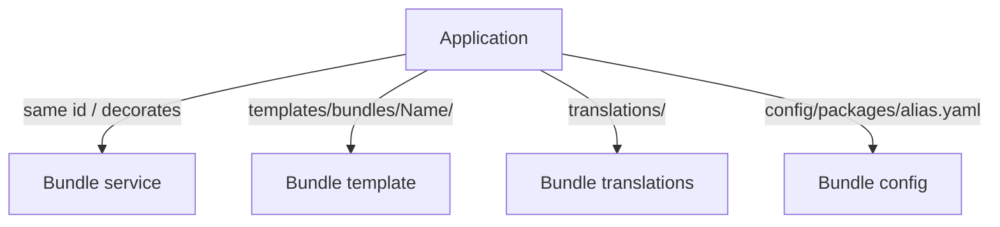

# Framework Overloading

!!! tip "In a nutshell"
    "Overloading" means changing what a third-party bundle provides without touching
    `vendor/`. Highest-yield: services via **decoration/redefinition**, templates via
    `templates/bundles/<BundleName>/`, config via `config/packages/` — and bundle
    inheritance (`getParent()`) is **gone**.

!!! example "Real-world analogy"
    Overloading is like personalising a furnished rental flat. You never rip out the
    landlord's fittings (that's editing `vendor/`); instead you slip a cover over their
    sofa to change its behaviour (decoration), hang your own curtains on the rail the
    lease designates for them (`templates/bundles/<Name>/`), and adjust the heating from
    its proper wall panel (`config/packages/`). Each change has one sanctioned spot — put
    the curtains on the wrong rail and nothing happens. And the old option of knocking
    through into the neighbouring flat (`getParent()` bundle inheritance) has been
    permanently bricked up.

!!! abstract "Learning objectives"
    By the end of this chapter you can:

    - [ ] Override a bundle's **service**, **template**, **translation** and **config**.
    - [ ] Choose the right override mechanism per resource type.
    - [ ] Explain why bundle **inheritance** was removed and what replaced it.

    **Syllabus:** `Symfony Architecture → Framework Overloading` ·
    **Level:** Expert ·
    **Est. time:** 25 min ·
    **Prerequisites:** [Code Organization](code-organization.md), [Dependency Injection](../dependency-injection/index.md)

---

## Theory

"Overloading" means changing what a **third-party bundle** provides without editing
its code in `vendor/`. Symfony gives a dedicated mechanism per resource type:
services via **decoration/redefinition**, templates and translations via
**convention-based paths**, and configuration via **`config/packages/`**.

## Deep Dive — how it works internally

!!! question "Predict first"
    You place your override at `templates/AcmeBlog/post/show.html.twig` and see no
    change. Where should it go, and why did Twig ignore yours?

??? note "Reveal"
    Bundle template overrides must live under `templates/bundles/<BundleName>/…`
    (e.g. `templates/bundles/AcmeBlogBundle/post/show.html.twig`). Only that path
    takes precedence over the bundle's own templates — a bare `templates/AcmeBlog/…`
    is not resolved as an override.

### Overriding services

Three tools, in increasing surgical precision:

1. **Redefine the service** — declare a service with the **same id** in
   `config/services.yaml`; the later definition wins.
2. **Decorate** — wrap the original with the `decorates:` key (or `#[AsDecorator]`);
   the original is renamed and injected as `.inner`. Best when you want to *augment*.
3. **Compiler pass** — for deep changes (arguments, tags), a `CompilerPass`
   manipulates the `ContainerBuilder` at compile time. See
   [Compiler Passes](../dependency-injection/compiler-passes.md).

### Overriding templates

Twig resolves templates through **namespaced paths**. To override a bundle template
`@AcmeBlog/post/show.html.twig`, place your version at
`templates/bundles/AcmeBlogBundle/post/show.html.twig`. The `templates/bundles/<BundleName>/`
directory takes precedence over the bundle's own `templates/`. This is exactly how
you override [error pages](exception-handling.md).

### Overriding translations

The application `translations/` directory has **higher priority** than a bundle's
translations. Provide a catalogue with the same domain/locale (e.g.
`translations/messages.en.yaml`) and your strings win over the bundle's.

### Overriding configuration

Each bundle exposes a config tree (its extension). Override defaults by writing
`config/packages/<alias>.yaml` (e.g. `config/packages/twig.yaml`). Environment
overrides go under `config/packages/<env>/`. Values you set replace or merge with the
bundle's defaults according to the config definition.



### Bundle inheritance is gone

Older Symfony allowed a bundle to declare `getParent()` and override another
bundle's resources by inheritance. This was **deprecated in 4.4 and removed in 5.0**.
In Symfony 8 there is **no** `getParent()`; use the per-resource overriding above.
Bundles also no longer rely on the legacy `Resources/` folder — the modern layout
uses top-level `config/`, `templates/`, `translations/` (see
[Code Organization](code-organization.md)).

!!! note "Source reference"
    Overriding mechanics live across FrameworkBundle/TwigBundle and the DI compiler —
    [symfony/symfony `8.0`](https://github.com/symfony/symfony/tree/8.0/src/Symfony/Bundle).

### Compilation vs runtime

Service and config overrides resolve at **compile time** into the dumped container.
Template and translation overrides resolve at **runtime** through the Twig loader /
translator, but the *paths* are registered at compile time.

## Configuration & code

=== "Decorate a bundle service"

    ```php
    <?php
    declare(strict_types=1);

    namespace App\Mailer;

    use Symfony\Component\DependencyInjection\Attribute\AsDecorator;
    use Symfony\Component\DependencyInjection\Attribute\AutowireDecorated;

    #[AsDecorator(decorates: 'acme.mailer')]
    final class TracingMailer
    {
        public function __construct(
            #[AutowireDecorated] private readonly object $inner,
        ) {}

        public function send(string $to, string $body): void
        {
            // ... trace, then delegate
            $this->inner->send($to, $body);
        }
    }
    ```

=== "Override a template"

    ```twig
    {# templates/bundles/AcmeBlogBundle/post/show.html.twig #}
    
    Custom title
    ```

=== "Override config"

    ```yaml
    # config/packages/twig.yaml
    twig:
        strict_variables: true
    ```

## Best practices & anti-patterns

| ✅ Do | ❌ Avoid |
|---|---|
| Decorate to augment behaviour | Editing files in `vendor/` |
| Use `templates/bundles/<Name>/` for templates | Forking a bundle to change one template |
| Override config in `config/packages/` | Copy-pasting a bundle's whole config |
| Use compiler passes for deep DI changes | Making everything public to override it |

## When (not) to use it / alternatives

Overload when you need to tweak a bundle you don't own. If you find yourself
overriding *everything*, consider not using the bundle, or contributing a config
option upstream. For your **own** code, just change it — overloading is for
third-party resources.

!!! danger "Certification traps"
    - Bundle **inheritance** (`getParent()`) is **removed** — do not mention it as current.
    - Template overrides go in **`templates/bundles/<BundleName>/`**, not `templates/`.
    - App **`translations/`** outrank bundle translations.
    - Decoration renames the original to a `.inner` service; inject it, don't re-create it.

!!! warning "Common mistakes"
    - Overriding a service by making it `public` and fetching it — redefine or decorate instead.
    - Putting the override template in the wrong directory and seeing no effect.

## Exercises

1. **(Advanced)** Override a bundle's `list.html.twig` and change only its title block.
2. **(Expert)** Add logging around a bundle service without altering the bundle.

??? success "Solutions"

    **1.** Create `templates/bundles/<BundleName>/.../list.html.twig`; either replace
    it fully or `` and override the `title` block.

    **2.** Decorate the service with `#[AsDecorator(decorates: 'the.service.id')]`,
    inject the original via `#[AutowireDecorated]`, log, then delegate.

## Certification questions

??? question "Q1. Where do you place an overriding bundle template?"
    - [x] A. `templates/bundles/<BundleName>/path.html.twig` ✅
    - [ ] B. `templates/override/...`
    - [ ] C. Inside `vendor/`

    **Why:** Twig resolves overrides from `templates/bundles/<BundleName>/`. **Ref:**
    [Overriding bundle templates](https://symfony.com/doc/current/bundles/override.html).

??? question "Q2. Which is the current way to change a bundle's inherited resources?"
    - [x] A. Per-resource overriding (templates/services/config) ✅
    - [ ] B. `getParent()` bundle inheritance
    - [ ] C. Editing the bundle in `vendor/`

    **Why:** Bundle inheritance was removed in Symfony 5. **Ref:**
    [Overriding bundles](https://symfony.com/doc/current/bundles/override.html).

??? question "Q3. How do you augment a bundle service without replacing it?"
    - [x] A. Decorate it (`#[AsDecorator]` / `decorates:`) ✅
    - [ ] B. Make it public
    - [ ] C. Use `getParent()`

    **Why:** Decoration wraps the original and injects it as `.inner`. **Ref:**
    [Service decoration](https://symfony.com/doc/current/service_container/service_decoration.html).

## Key takeaways

- Services: redefine, decorate, or use a compiler pass.
- Templates: `templates/bundles/<BundleName>/`; translations: app `translations/` win.
- Config: `config/packages/<alias>.yaml` (+ `<env>/`).
- Bundle inheritance (`getParent()`) is removed — use per-resource overriding.

## Last-minute revision

!!! tip "Cheat sheet"
    - Template override path: `templates/bundles/<BundleName>/…`.
    - Decorate: `#[AsDecorator(decorates: id)]` + `#[AutowireDecorated]` → `.inner`.
    - Config override: `config/packages/<alias>.yaml`.
    - No `getParent()` in Symfony 8.

## Connections

- **Depends on:** [Code Organization](code-organization.md) — overrides live in the app's conventional `templates/`, `translations/`, `config/`; [Dependency Injection](../dependency-injection/index.md) provides decoration and compiler passes.
- **Reused in:** [Exception Handling](exception-handling.md) — overriding error templates is exactly this mechanism.
- **Confused with:** [Bridges](bridges.md) — overloading customises an existing bundle; a bridge glues a component to a third-party library.

## Official References
- [Official docs — Overriding bundles](https://symfony.com/doc/current/bundles/override.html)
- [Service decoration](https://symfony.com/doc/current/service_container/service_decoration.html)
- [Symfony source — bundles](https://github.com/symfony/symfony/tree/8.0/src/Symfony/Bundle)

## Confidence check

I'm ready when I can:

- [ ] explain **why** overriding beats editing `vendor/`
- [ ] override a bundle's service, template, translation and config
- [ ] debug an override template that has no effect (wrong directory)
- [ ] spot that bundle inheritance (`getParent()`) is removed in modern Symfony
- [ ] explain when to redefine vs decorate vs use a compiler pass

---

<small>Related: [Code Organization](code-organization.md) · [Bridges](bridges.md) · [Dependency Injection](../dependency-injection/index.md)</small>
