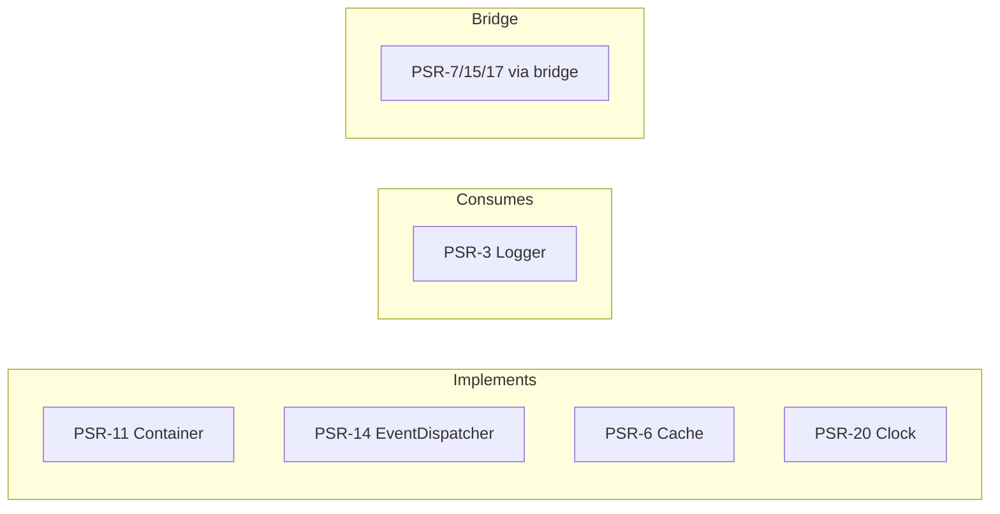

# Interoperability & PSRs

!!! tip "In a nutshell"
    Les PSR sont des standards du PHP-FIG qui permettent à des bibliothèques
    indépendantes d'interopérer ; Symfony en **implémente** certains et en **consomme**
    d'autres. À retenir en priorité : il implémente PSR-6/11/14/16/20 et consomme
    PSR-3, et **HttpFoundation n'est pas PSR-7** (un bridge assure la conversion entre
    les deux).

!!! example "Real-world analogy"
    Les PSR sont comme les conteneurs maritimes standardisés. Parce que chaque port,
    navire et camion s'accorde sur les mêmes pièces de coin et les mêmes dimensions (un
    PSR), une caisse de n'importe quel fabricant s'adapte aux grues partout dans le
    monde. Symfony construit certaines de ses propres caisses selon cette norme pour que
    n'importe quel port puisse les soulever (il *implémente* PSR-6/11/14/16/20), et il
    accepte aussi volontiers toute caisse conforme que vous lui confiez (il *consomme*
    PSR-3). Sa propre caisse `Request`, en revanche, a été conçue avant le standard et
    n'a pas la forme réglementaire — un dispositif de transbordement spécial (le bridge
    psr-http-message) la reconditionne donc chaque fois qu'un port PSR-7 exige le
    format standard.

!!! abstract "Learning objectives"
    À la fin de ce chapitre, vous saurez :

    - [ ] Nommer les PSR pertinents pour Symfony et ce que chacun standardise.
    - [ ] Dire quel component Symfony **implémente** ou **consomme** chaque PSR.
    - [ ] Expliquer comment les bridges PSR (par exemple PSR-7) s'intègrent, sans les traiter comme des tutoriels d'utilisation.

    **Syllabus:** `Symfony Architecture → Interoperability & PSRs` ·
    **Level:** Expert ·
    **Est. time:** 25 min ·
    **Prerequisites:** [Components](components.md)

---

## Theory

Les **PHP Standards Recommendations (PSR)**, publiées par le PHP-FIG, permettent à des
bibliothèques indépendantes d'interopérer. Symfony **implémente** plusieurs interfaces
PSR (ses components sont donc directement utilisables par les consommateurs de PSR) et
en **consomme** d'autres (vous pouvez donc brancher n'importe quelle implémentation
conforme). Connaître cette correspondance est une matière d'examen de premier ordre.

## Deep Dive — how it works internally

!!! question "Predict first"
    Une bibliothèque tierce exige une `ServerRequestInterface` PSR-7. Pouvez-vous lui
    passer directement la `Request` de `HttpFoundation` de Symfony ?

??? note "Reveal"
    Non — `HttpFoundation` n'est **pas** PSR-7. Convertissez-la avec la
    `PsrHttpFactory` du bridge psr-http-message (et `HttpFoundationFactory` pour le
    sens inverse). Les middlewares PSR-15 s'intègrent via le même bridge.

### The PSR map for Symfony

| PSR | Standard | Symfony relationship |
|---|---|---|
| **PSR-1/PSR-12** | Style de code | Le style de code propre à Symfony s'aligne sur eux |
| **PSR-3** | Interface de logger | Les components **consomment** `Psr\Log\LoggerInterface` |
| **PSR-4** | Autoloading | Le code Symfony + votre `App\` utilisent PSR-4 (Composer) |
| **PSR-6** | Pool de cache | Le component Cache **implémente** `CacheItemPoolInterface` |
| **PSR-11** | Container | Le `Container` **implémente** `Psr\Container\ContainerInterface` |
| **PSR-14** | Event dispatcher | L'`EventDispatcher` **implémente** l'interface PSR-14 |
| **PSR-16** | Simple cache | Cache fournit l'adaptateur `Psr16Cache` |
| **PSR-7 / 17 / 15** | Messages HTTP / factories / middleware | via le **bridge psr-http-message** |
| **PSR-20** | Clock | Le component Clock **implémente** `Psr\Clock\ClockInterface` |

### Implements vs consumes

- **Implémente** — Symfony *est* un objet PSR valide : le `Container` est un container
  PSR-11 ; l'`EventDispatcher` est un dispatcher PSR-14 ; un pool de Cache est PSR-6 ;
  `Symfony\Component\Clock\Clock` est PSR-20. Vous pouvez les confier à n'importe
  quelle bibliothèque attendant le PSR.
- **Consomme** — Symfony type-hinte le PSR pour que vous puissiez injecter *n'importe
  quelle* implémentation : le cas classique est **PSR-3** — les components dépendent de
  `Psr\Log\LoggerInterface`, donc tout logger PSR-3 fonctionne (la bibliothèque de
  logging concrète est hors de notre propos ici).

```php
use Psr\Log\LoggerInterface;
use Symfony\Component\Clock\Clock;
use Symfony\Component\DependencyInjection\Container;
use Symfony\Component\EventDispatcher\EventDispatcher;

// Implements — these Symfony objects ARE valid PSR instances:
$container = new Container();        // Psr\Container\ContainerInterface (PSR-11)
$dispatcher = new EventDispatcher(); // Psr\EventDispatcher\EventDispatcherInterface (PSR-14)
$clock = new Clock();                // Psr\Clock\ClockInterface (PSR-20)

// Consumes — Symfony type-hints the PSR, so ANY PSR-3 logger fits:
final class Importer
{
    public function __construct(private readonly LoggerInterface $logger) {}
}
```

### HttpFoundation is not PSR-7

Les `Request`/`Response` de Symfony (`HttpFoundation`) ne sont **pas** des objets
PSR-7 — ils sont antérieurs au modèle de messages immuables de PSR-7 et en diffèrent.
Quand une bibliothèque a besoin de PSR-7, le **bridge psr-http-message** convertit
entre HttpFoundation et PSR-7 (`HttpFoundationFactory` / `PsrHttpFactory`). Les
middlewares PSR-15 s'intègrent de même via ce bridge. Considérez le bridge comme un
*adaptateur d'interopérabilité*, pas comme un remplaçant de HttpFoundation.

```php
use Symfony\Bridge\PsrHttpMessage\Factory\HttpFoundationFactory;
use Symfony\Bridge\PsrHttpMessage\Factory\PsrHttpFactory;

// HttpFoundation Request -> PSR-7 ServerRequestInterface
$psrRequest = $psrHttpFactory->createRequest($request);   // PsrHttpFactory

// ...hand $psrRequest to any PSR-7 / PSR-15 library...

// PSR-7 response -> back to an HttpFoundation Response
$response = $httpFoundationFactory->createResponse($psrResponse); // HttpFoundationFactory
```



!!! note "Source reference"
    Par exemple, `Symfony\Component\DependencyInjection\ContainerInterface` étend
    `Psr\Container\ContainerInterface` ; `Symfony\Component\Clock\Clock` implémente
    `Psr\Clock\ClockInterface` —
    [symfony/symfony `8.0`](https://github.com/symfony/symfony/tree/8.0/src/Symfony/Component).

### Compilation vs runtime

Les **contrats** PSR comptent au moment de la conception (ce que vous type-hintez). Au
runtime, le container injecte des implémentations PSR concrètes ; les lookups PSR-11 et
le dispatch PSR-14 s'exécutent sur le chemin critique comme n'importe quel appel de
service.

## Configuration & code

=== "Consuming PSR-3 in a service"

    ```php
    <?php
    declare(strict_types=1);

    namespace App\Service;

    use Psr\Log\LoggerInterface;

    final class Importer
    {
        public function __construct(private readonly LoggerInterface $logger) {}

        public function run(): void
        {
            $this->logger->info('Import started'); // any PSR-3 logger
        }
    }
    ```

=== "PSR-20 Clock"

    ```php
    <?php
    declare(strict_types=1);

    namespace App\Service;

    use Psr\Clock\ClockInterface;

    final class TokenFactory
    {
        public function __construct(private readonly ClockInterface $clock) {}

        public function expiry(): \DateTimeImmutable
        {
            return $this->clock->now()->modify('+1 hour');
        }
    }
    ```

=== "Console"

    ```console
    $ composer why psr/container
    ```

## Best practices & anti-patterns

| ✅ Do | ❌ Avoid |
|---|---|
| Type-hinter les interfaces PSR pour la portabilité | Type-hinter des implémentations concrètes |
| N'utiliser le bridge que lorsque PSR-7 est exigé | Réécrire inutilement les controllers autour de PSR-7 |
| Injecter `ClockInterface` pour un temps testable | Appeler `new \DateTime()` directement |

## When (not) to use it / alternatives

Préférez les interfaces PSR là où l'interopérabilité compte (logging, cache, clock,
container). Là où Symfony fournit un contrat plus riche (par exemple sa propre
`HttpClientInterface`), utilisez-le au sein des applications Symfony ; ne recourez au
PSR qu'en franchissant les frontières entre bibliothèques.

!!! danger "Certification traps"
    - `HttpFoundation` n'est **pas** PSR-7 — la conversion passe par le bridge psr-http-message.
    - PSR-3 est **consommé** (vous injectez un logger) ; PSR-11/14/6/20 sont **implémentés** par Symfony.
    - L'ordre de dispatch PSR-14 suit le PSR — l'objet event d'abord.
    - PSR-4 régit l'autoloading ; le namespace `App\` correspond à `src/`.

!!! warning "Common mistakes"
    - Croire que la `Request` de Symfony implémente PSR-7.
    - Confondre PSR-6 (pool/items) et PSR-16 (get/set simple).

## Exercises

1. **(Advanced)** Quel PSR chacun implémente-t-il ou consomme-t-il : logger, pool de
   cache, container, event dispatcher, clock ?
2. **(Expert)** Une bibliothèque exige une `ServerRequestInterface` PSR-7. Comment lui
   fournissez-vous la request courante de Symfony ?

??? success "Solutions"

    **1.** Logger → **consomme** PSR-3 ; pool de cache → **implémente** PSR-6 ;
    container → **implémente** PSR-11 ; event dispatcher → **implémente** PSR-14 ;
    clock → **implémente** PSR-20.

    **2.** Utilisez la `PsrHttpFactory` du bridge psr-http-message pour convertir la
    `Request` HttpFoundation en `ServerRequestInterface` PSR-7.

## Certification questions

??? question "Q1. Which PSR does Symfony's EventDispatcher implement?"
    - [x] A. PSR-14 ✅
    - [ ] B. PSR-7
    - [ ] C. PSR-3

    **Why:** `EventDispatcherInterface` étend l'interface PSR-14. **Ref:**
    [EventDispatcher](https://symfony.com/doc/8.0/components/event_dispatcher.html).

??? question "Q2. Is HttpFoundation's Request a PSR-7 message?"
    - [ ] A. Yes
    - [x] B. No — a bridge converts between them ✅
    - [ ] C. Only in prod

    **Why:** HttpFoundation est antérieur à PSR-7 et en diffère ; utilisez le bridge. **Ref:**
    [PSR-7 bridge](https://symfony.com/doc/8.0/components/psr7.html).

??? question "Q3. Which interface standardises the service container?"
    - [x] A. PSR-11 `Psr\Container\ContainerInterface` ✅
    - [ ] B. PSR-6
    - [ ] C. PSR-16

    **Why:** Le container de Symfony implémente PSR-11. **Ref:**
    [Container](https://symfony.com/doc/8.0/service_container.html).

## Key takeaways

- Symfony implémente PSR-6, PSR-11, PSR-14, PSR-16, PSR-20 ; consomme PSR-3 ; suit PSR-4/12.
- HttpFoundation ≠ PSR-7 ; le bridge psr-http-message assure la conversion (PSR-7/15/17).
- Type-hintez les interfaces PSR pour la portabilité entre bibliothèques.

## Last-minute revision

!!! tip "Cheat sheet"
    - Implémente : PSR-6 (Cache), PSR-11 (Container), PSR-14 (EventDispatcher), PSR-16, PSR-20 (Clock).
    - Consomme : PSR-3 (Logger). Autoload : PSR-4.
    - PSR-7/15/17 → via le **bridge** psr-http-message.

## Connections

- **Depends on:** [Components](components.md) — chaque PSR est implémenté ou consommé par un component précis.
- **Reused in:** [Events](events.md) — l'EventDispatcher implémente PSR-14 ; [Dependency Injection](../dependency-injection/index.md) implémente PSR-11 ; [HTTP](../http/request.md) est l'endroit où l'écart avec PSR-7 se fait sentir.
- **Confused with:** [Bridges](bridges.md) — le support de PSR-7/15/17 passe par le *bridge* psr-http-message, ce n'est pas un PSR que Symfony implémente nativement.

## Official References
- [PHP-FIG PSRs](https://www.php-fig.org/psr/)
- [PSR-7 bridge](https://symfony.com/doc/8.0/components/psr7.html)
- [Clock component](https://symfony.com/doc/8.0/components/clock.html)

## Video references

!!! tip "Watch & learn"
    Voici des chaînes vidéo officielles, mises à jour en continu — recherchez-y
    « Symfony architecture » pour consolider ce chapitre. Nous référençons des chaînes
    stables plutôt que des vidéos individuelles afin que les références ne périment
    jamais.

    - [SymfonyCasts screencasts](https://symfonycasts.com/tracks/symfony) — tutoriels scénarisés à suivre en codant.
    - [Symfony official YouTube](https://www.youtube.com/@SymfonyOfficial) — conférences et keynotes SymfonyCon.
    - [Official docs for this topic](https://symfony.com/doc/8.0/components/event_dispatcher.html) — certaines pages de la doc Symfony intègrent un screencast.

## Confidence check

Je suis prêt(e) quand je peux :

- [ ] expliquer **pourquoi** les PSR permettent l'interopérabilité entre bibliothèques
- [ ] associer chaque PSR au component qui l'implémente ou le consomme
- [ ] convertir une request HttpFoundation en PSR-7 via le bridge
- [ ] repérer que `HttpFoundation` n'est pas PSR-7 et que PSR-3 est consommé, pas implémenté
- [ ] distinguer le cache PSR-6 (pool/items) du cache PSR-16 (get/set simple)

---

<small>Related: [Components](components.md) · [Bridges](bridges.md) · [Events](events.md)</small>
