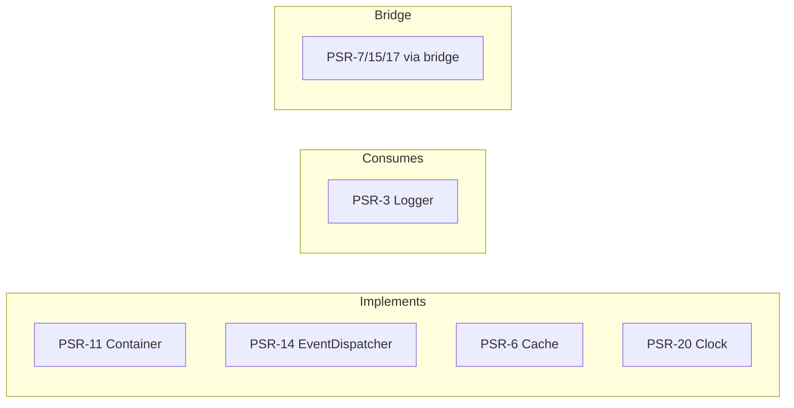

# Interoperability & PSRs

!!! tip "In a nutshell"
    PSRs are PHP-FIG standards that let independent libraries interoperate; Symfony
    **implements** some and **consumes** others. Highest-yield: it implements
    PSR-6/11/14/16/20 and consumes PSR-3, and **HttpFoundation is not PSR-7** (a
    bridge converts between them).

!!! example "Real-world analogy"
    PSRs are like standardised shipping containers. Because every port, ship and truck
    agrees on the same corner-fittings and dimensions (a PSR), a box from any
    manufacturer just fits the cranes everywhere. Symfony builds some of its own boxes to
    that spec so any port can lift them (it *implements* PSR-6/11/14/16/20), and it also
    happily accepts any spec-compliant box you hand it (it *consumes* PSR-3). Its own
    `Request` crate, though, was designed before the standard and isn't the regulation
    shape — so a special transfer rig (the psr-http-message bridge) repacks it whenever a
    PSR-7 port insists on the standard fitting.

!!! abstract "Learning objectives"
    By the end of this chapter you can:

    - [ ] Name the PSRs relevant to Symfony and what each standardises.
    - [ ] Say which Symfony component **implements** or **consumes** each PSR.
    - [ ] Explain how PSR bridges (e.g. PSR-7) fit without treating them as usage tutorials.

    **Syllabus:** `Symfony Architecture → Interoperability & PSRs` ·
    **Level:** Expert ·
    **Est. time:** 25 min ·
    **Prerequisites:** [Components](components.md)

---

## Theory

**PHP Standards Recommendations (PSRs)**, published by the PHP-FIG, let independent
libraries interoperate. Symfony **implements** several PSR interfaces (so its
components are drop-in for PSR consumers) and **consumes** others (so you can plug
any compliant implementation in). Knowing the mapping is prime exam material.

## Deep Dive — how it works internally

!!! question "Predict first"
    A third-party library requires a PSR-7 `ServerRequestInterface`. Can you pass
    Symfony's `HttpFoundation` `Request` straight in?

??? note "Reveal"
    No — `HttpFoundation` is **not** PSR-7. Convert it with the psr-http-message
    bridge's `PsrHttpFactory` (and `HttpFoundationFactory` to go back). PSR-15
    middleware integrates through the same bridge.

### The PSR map for Symfony

| PSR | Standard | Symfony relationship |
|---|---|---|
| **PSR-1/PSR-12** | Coding style | Symfony's own code style aligns with them |
| **PSR-3** | Logger interface | Components **consume** `Psr\Log\LoggerInterface` |
| **PSR-4** | Autoloading | Symfony code + your `App\` use PSR-4 (Composer) |
| **PSR-6** | Caching pool | Cache component **implements** `CacheItemPoolInterface` |
| **PSR-11** | Container | `Container` **implements** `Psr\Container\ContainerInterface` |
| **PSR-14** | Event dispatcher | `EventDispatcher` **implements** the PSR-14 interface |
| **PSR-16** | Simple cache | Cache provides `Psr16Cache` adapter |
| **PSR-7 / 17 / 15** | HTTP messages / factories / middleware | via the **psr-http-message bridge** |
| **PSR-20** | Clock | Clock component **implements** `Psr\Clock\ClockInterface` |

### Implements vs consumes

- **Implements** — Symfony *is* a valid PSR object: `Container` is a PSR-11
  container; `EventDispatcher` is a PSR-14 dispatcher; a Cache pool is PSR-6;
  `Symfony\Component\Clock\Clock` is PSR-20. You can hand these to any library
  expecting the PSR.
- **Consumes** — Symfony type-hints the PSR so you can inject *any* implementation:
  the classic case is **PSR-3** — components depend on `Psr\Log\LoggerInterface`, so
  any PSR-3 logger works (the concrete logging library is out of scope here).

```php
use Psr\Log\LoggerInterface;
use Symfony\Component\Clock\Clock;
use Symfony\Component\DependencyInjection\Container;
use Symfony\Component\EventDispatcher\EventDispatcher;

// Implements — these Symfony objects ARE valid PSR instances:
$container = new Container();        // Psr\Container\ContainerInterface (PSR-11)
$dispatcher = new EventDispatcher(); // Psr\EventDispatcher\EventDispatcherInterface (PSR-14)
$clock = new Clock();                // Psr\Clock\ClockInterface (PSR-20)

// Consumes — Symfony type-hints the PSR, so ANY PSR-3 logger fits:
final class Importer
{
    public function __construct(private readonly LoggerInterface $logger) {}
}
```

### HttpFoundation is not PSR-7

Symfony's `Request`/`Response` (`HttpFoundation`) are **not** PSR-7 objects — they
predate and differ from PSR-7's immutable message model. When a library needs PSR-7,
the **psr-http-message bridge** converts between HttpFoundation and PSR-7
(`HttpFoundationFactory` / `PsrHttpFactory`). PSR-15 middleware likewise integrates
through that bridge. Treat the bridge as an *interop adapter*, not a replacement for
HttpFoundation.

```php
use Symfony\Bridge\PsrHttpMessage\Factory\HttpFoundationFactory;
use Symfony\Bridge\PsrHttpMessage\Factory\PsrHttpFactory;

// HttpFoundation Request -> PSR-7 ServerRequestInterface
$psrRequest = $psrHttpFactory->createRequest($request);   // PsrHttpFactory

// ...hand $psrRequest to any PSR-7 / PSR-15 library...

// PSR-7 response -> back to an HttpFoundation Response
$response = $httpFoundationFactory->createResponse($psrResponse); // HttpFoundationFactory
```



!!! note "Source reference"
    e.g. `Symfony\Component\DependencyInjection\ContainerInterface` extends
    `Psr\Container\ContainerInterface`; `Symfony\Component\Clock\Clock` implements
    `Psr\Clock\ClockInterface` —
    [symfony/symfony `8.0`](https://github.com/symfony/symfony/tree/8.0/src/Symfony/Component).

### Compilation vs runtime

PSR **contracts** matter at design time (what you type-hint). At runtime the
container injects concrete PSR implementations; PSR-11 lookups and PSR-14 dispatch
happen on the hot path just like any service call.

## Configuration & code

=== "Consuming PSR-3 in a service"

    ```php
    <?php
    declare(strict_types=1);

    namespace App\Service;

    use Psr\Log\LoggerInterface;

    final class Importer
    {
        public function __construct(private readonly LoggerInterface $logger) {}

        public function run(): void
        {
            $this->logger->info('Import started'); // any PSR-3 logger
        }
    }
    ```

=== "PSR-20 Clock"

    ```php
    <?php
    declare(strict_types=1);

    namespace App\Service;

    use Psr\Clock\ClockInterface;

    final class TokenFactory
    {
        public function __construct(private readonly ClockInterface $clock) {}

        public function expiry(): \DateTimeImmutable
        {
            return $this->clock->now()->modify('+1 hour');
        }
    }
    ```

=== "Console"

    ```console
    $ composer why psr/container
    ```

## Best practices & anti-patterns

| ✅ Do | ❌ Avoid |
|---|---|
| Type-hint PSR interfaces for portability | Type-hinting concrete implementations |
| Use the bridge only when PSR-7 is required | Rewriting controllers around PSR-7 needlessly |
| Inject `ClockInterface` for testable time | Calling `new \DateTime()` directly |

## When (not) to use it / alternatives

Prefer PSR interfaces where interoperability matters (logging, cache, clock,
container). Where Symfony provides a richer contract (e.g. its own
`HttpClientInterface`), use that inside Symfony apps; reach for the PSR only when
crossing library boundaries.

!!! danger "Certification traps"
    - `HttpFoundation` is **not** PSR-7 — conversion needs the psr-http-message bridge.
    - PSR-3 is **consumed** (you inject a logger); PSR-11/14/6/20 are **implemented** by Symfony.
    - PSR-14 dispatch order matches PSR — event object first.
    - PSR-4 governs autoloading; the `App\` namespace maps to `src/`.

!!! warning "Common mistakes"
    - Thinking Symfony's `Request` implements PSR-7.
    - Confusing PSR-6 (pool/items) with PSR-16 (simple get/set).

## Exercises

1. **(Advanced)** Which PSR does each implement/consume: logger, cache pool,
   container, event dispatcher, clock?
2. **(Expert)** A library requires a PSR-7 `ServerRequestInterface`. How do you feed
   it Symfony's current request?

??? success "Solutions"

    **1.** Logger → **consumes** PSR-3; cache pool → **implements** PSR-6; container
    → **implements** PSR-11; event dispatcher → **implements** PSR-14; clock →
    **implements** PSR-20.

    **2.** Use the psr-http-message bridge's `PsrHttpFactory` to convert the
    HttpFoundation `Request` into a PSR-7 `ServerRequestInterface`.

## Certification questions

??? question "Q1. Which PSR does Symfony's EventDispatcher implement?"
    - [x] A. PSR-14 ✅
    - [ ] B. PSR-7
    - [ ] C. PSR-3

    **Why:** `EventDispatcherInterface` extends the PSR-14 interface. **Ref:**
    [EventDispatcher](https://symfony.com/doc/8.0/components/event_dispatcher.html).

??? question "Q2. Is HttpFoundation's Request a PSR-7 message?"
    - [ ] A. Yes
    - [x] B. No — a bridge converts between them ✅
    - [ ] C. Only in prod

    **Why:** HttpFoundation predates/differs from PSR-7; use the bridge. **Ref:**
    [PSR-7 bridge](https://symfony.com/doc/8.0/components/psr7.html).

??? question "Q3. Which interface standardises the service container?"
    - [x] A. PSR-11 `Psr\Container\ContainerInterface` ✅
    - [ ] B. PSR-6
    - [ ] C. PSR-16

    **Why:** Symfony's container implements PSR-11. **Ref:**
    [Container](https://symfony.com/doc/8.0/service_container.html).

## Key takeaways

- Symfony implements PSR-6, PSR-11, PSR-14, PSR-16, PSR-20; consumes PSR-3; follows PSR-4/12.
- HttpFoundation ≠ PSR-7; the psr-http-message bridge converts (PSR-7/15/17).
- Type-hint PSR interfaces for cross-library portability.

## Last-minute revision

!!! tip "Cheat sheet"
    - Implements: PSR-6 (Cache), PSR-11 (Container), PSR-14 (EventDispatcher), PSR-16, PSR-20 (Clock).
    - Consumes: PSR-3 (Logger). Autoload: PSR-4.
    - PSR-7/15/17 → via psr-http-message **bridge**.

## Connections

- **Depends on:** [Components](components.md) — each PSR is implemented or consumed by a specific component.
- **Reused in:** [Events](events.md) — the EventDispatcher implements PSR-14; [Dependency Injection](../dependency-injection/index.md) implements PSR-11; [HTTP](../http/request.md) is where the PSR-7 gap bites.
- **Confused with:** [Bridges](bridges.md) — PSR-7/15/17 support comes via the psr-http-message *bridge*, not a PSR Symfony implements natively.

## Official References
- [PHP-FIG PSRs](https://www.php-fig.org/psr/)
- [PSR-7 bridge](https://symfony.com/doc/8.0/components/psr7.html)
- [Clock component](https://symfony.com/doc/8.0/components/clock.html)

## Video references

!!! tip "Watch & learn"
    These are official, continuously-updated video channels — search them for
    "Symfony architecture" to reinforce this chapter. We link stable channels rather than
    individual videos so the references never rot.

    - [SymfonyCasts screencasts](https://symfonycasts.com/tracks/symfony) — scripted, code-along tutorials.
    - [Symfony official YouTube](https://www.youtube.com/@SymfonyOfficial) — SymfonyCon conference talks & keynotes.
    - [Official docs for this topic](https://symfony.com/doc/8.0/components/event_dispatcher.html) — some Symfony doc pages embed a screencast.

## Confidence check

I'm ready when I can:

- [ ] explain **why** PSRs enable cross-library interoperability
- [ ] map each PSR to the component that implements or consumes it
- [ ] convert an HttpFoundation request to PSR-7 via the bridge
- [ ] spot that `HttpFoundation` is not PSR-7 and PSR-3 is consumed, not implemented
- [ ] distinguish PSR-6 (pool/items) from PSR-16 (simple get/set) caching

---

<small>Related: [Components](components.md) · [Bridges](bridges.md) · [Events](events.md)</small>
