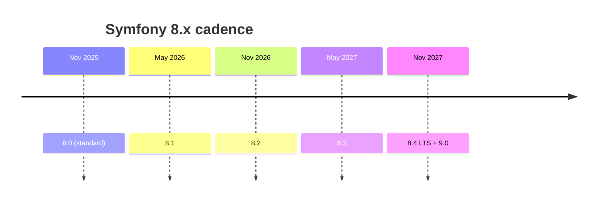

# Release Management

!!! tip "In a nutshell"
    Symfony applique le Semantic Versioning sur un calendrier à dates fixes : des
    versions mineures en mai/novembre, une majeure tous les deux ans. À retenir en
    priorité : les mineures ne **cassent jamais la BC** (seules les majeures le font,
    en supprimant le code déprécié), et `8.4` est la **LTS** de la branche 8.x.

!!! example "Real-world analogy"
    Pensez à un service ferroviaire circulant selon un horaire fixe et imprimé. Les
    trains locaux (les versions mineures) partent à l'heure chaque mai et novembre, et
    ils ne changent jamais les quais qui fonctionnent déjà — ils ne font qu'ajouter de
    nouvelles voitures (les fonctionnalités) et afficher des avis « cette porte sera
    supprimée » (les dépréciations). Seule la grande refonte de l'horaire tous les deux
    ans (une majeure) supprime réellement les portes signalées. Un service longue
    distance spécial à chaque cycle (la LTS `X.4`) continue de rouler pendant des
    années, au service des passagers qui ne peuvent pas se permettre de replanifier
    leur trajet tous les six mois.

!!! abstract "Learning objectives"
    À la fin de ce chapitre, vous saurez :

    - [ ] Expliquer le schéma SemVer de Symfony et la cadence mai/novembre.
    - [ ] Distinguer les versions **standard** des versions **LTS** et leurs fenêtres de maintenance.
    - [ ] Dire ce qui peut changer dans une version patch, mineure et majeure.
    - [ ] Identifier quelle version de Symfony 8.x est la LTS.

    **Syllabus:** `Symfony Architecture → Release Management` ·
    **Level:** Advanced ·
    **Est. time:** 20 min ·
    **Prerequisites:** [Components](components.md)

---

## Theory

Symfony suit le **Semantic Versioning** (`MAJOR.MINOR.PATCH`) selon un calendrier **à
dates fixes** : une nouvelle version **mineure** tous les six mois (**mai** et
**novembre**), et une nouvelle **majeure** tous les deux ans. Cette prévisibilité
permet aux équipes de planifier leurs montées de version. Elle va de pair avec la
[Backward Compatibility promise](bc-promise.md) et la
[deprecation policy](deprecations.md).

## Deep Dive — how it works internally

!!! question "Predict first"
    Vous êtes en 8.0 et voulez de nouvelles fonctionnalités sans risquer de casse.
    Est-il sûr de passer en 8.3, et où un changement cassant serait-il autorisé pour
    la première fois ?

??? note "Reveal"
    Oui — les mineures (`8.0 → 8.3`) ne cassent jamais la BC ; elles n'ajoutent que
    des fonctionnalités et des dépréciations. Les changements cassants ne sont
    autorisés que dans la prochaine **majeure** (`9.0`), et uniquement pour du code
    déprécié pendant la branche 8.x.

### What each release level may change

| Level | Example | May contain |
|---|---|---|
| **PATCH** (`8.0.x`) | 8.0.1 → 8.0.2 | Corrections de bugs uniquement ; pas de nouvelles fonctionnalités, pas de cassure de BC |
| **MINOR** (`8.x`) | 8.0 → 8.1 | Nouvelles fonctionnalités + **dépréciations** ; **aucune cassure de BC** |
| **MAJOR** (`x.0`) | 8.0 → 9.0 | Suppression du code déprécié ; cassures de BC autorisées |

Comme les mineures ne cassent jamais la BC, monter de version au sein d'une même
majeure (`8.0 → 8.4`) devrait être sûr si vous avez résolu les dépréciations. Le
**seul** endroit où les cassures de BC sont permises est une version majeure, et
encore, uniquement pour du code **déprécié** dans la branche majeure précédente.

### Standard vs LTS maintenance windows

| Type | Which version | Bug fixes | Security fixes |
|---|---|---|---|
| **Standard** | toute mineure sauf `X.4` | 8 mois | 14 mois |
| **LTS** | la dernière mineure d'une majeure (`X.4`) | 3 ans | 4 ans |

Ainsi, `8.0`, `8.1`, `8.2`, `8.3` sont des versions standard ; **`8.4` est la LTS**.
Une nouvelle LTS paraît tous les deux ans, en même temps que la majeure suivante
(`8.4` et `9.0` sortent ensemble).



### How it maps to development branches

Symfony se développe sur la branche mineure courante (par exemple `8.1`) ; la branche
maintenue la plus ancienne ne reçoit que des correctifs de bugs et de sécurité. Les
correctifs sont fusionnés **vers le haut**, de la branche supportée la plus ancienne
vers les plus récentes : un patch sur `8.0` atterrit donc aussi dans `8.1`, etc. Ce
modèle de merge-up garde un comportement cohérent entre les branches maintenues.

```console
# A fix lands on the oldest maintained branch first (e.g. 8.0)...
$ git switch 8.0
$ git commit -m "[HttpKernel] Fix ..."

# ...then maintainers merge it UP into the newer branches (8.1, 8.2, ...)
$ git switch 8.1
$ git merge 8.0
```

!!! note "Source reference"
    Le processus de release est documenté sur
    [symfony.com/releases](https://symfony.com/releases) et appliqué sur les
    [branches de symfony/symfony](https://github.com/symfony/symfony/branches).

### Why time-based releases

Des dates fixes découplent « la fonctionnalité est-elle prête ? » de « quand
publie-t-on ? » : les fonctionnalités atterrissent dans la mineure ouverte au moment
de leur merge, et tout le monde connaît le calendrier de montée de version à l'avance.
Cela borne aussi la durée pendant laquelle vous pouvez différer une montée de version
majeure avant de perdre le support de sécurité.

## Configuration & code

=== "composer.json constraints"

    ```json
    {
      "require": {
        "symfony/framework-bundle": "^8.0",
        "symfony/http-kernel": "^8.0"
      }
    }
    ```

=== "Console"

    ```console
    $ composer outdated 'symfony/*' --direct
    $ php bin/console about        # shows Symfony version & end-of-life dates
    ```

## Best practices & anti-patterns

| ✅ Do | ❌ Avoid |
|---|---|
| Suivre la LTS pour les applications qui évoluent lentement | Rester sur une mineure en fin de vie (EOL) |
| Corriger les dépréciations à chaque mineure | Reporter toutes les montées de version à la prochaine majeure |
| Utiliser des contraintes caret `^8.0` | Épingler des versions patch exactes sur le long terme |
| Monter les mineures régulièrement (elles sont BC) | Sauter directement une majeure sans préparation |

## When (not) to use it / alternatives

Choisissez la **LTS** (`X.4`) quand vous privilégiez de longues fenêtres de support
sur les fonctionnalités les plus récentes ; choisissez la **dernière mineure
standard** quand vous voulez les fonctionnalités tôt et pouvez monter de version tous
les ~6 mois. Tout projet sous Symfony hérite de ce schéma — il n'existe pas de cadence
alternative à laquelle souscrire.

!!! danger "Certification traps"
    - Les mineures sortent en **mai et novembre** ; les majeures tous les **2 ans**.
    - **`X.4` est toujours la LTS** et sort **avec** `(X+1).0`.
    - Standard : **8 mois** de bugs + **14 mois** de sécurité. LTS : **3 ans** de bugs +
      **4 ans** de sécurité.
    - Les versions mineures **ajoutent** des fonctionnalités et des dépréciations mais **ne cassent jamais la BC**.

!!! warning "Common mistakes"
    - Croire qu'une montée de version mineure peut casser votre application — seules les majeures le peuvent (via les dépréciations supprimées).
    - Confondre patch (bugs uniquement) et mineure (fonctionnalités).

## Exercises

1. **(Advanced)** Quelle version de Symfony 8 est la LTS, et qu'est-ce qui sort en même temps ?
2. **(Expert)** Vous êtes en 8.0 et voyez des dépréciations. Quand le code déprécié
   sera-t-il réellement supprimé, et que devez-vous faire d'ici là ?

??? success "Solutions"

    **1.** `8.4` est la LTS ; elle sort en même temps que `9.0` (novembre 2027).

    **2.** Le code déprécié est supprimé dans la prochaine **majeure** (`9.0`).
    Résolvez les dépréciations tant que vous êtes encore sur la branche 8.x afin que le
    saut `8.x → 9.0` soit propre.

## Certification questions

??? question "Q1. How often does a new Symfony minor release ship?"
    - [x] A. Every 6 months (May and November) ✅
    - [ ] B. Every month
    - [ ] C. Every 2 years

    **Why:** Les mineures suivent une cadence fixe de 6 mois. **Ref:**
    [Symfony releases](https://symfony.com/releases).

??? question "Q2. Which 8.x version is the LTS?"
    - [x] A. 8.4 ✅
    - [ ] B. 8.0
    - [ ] C. 8.2

    **Why:** La dernière mineure d'une majeure (`X.4`) est la LTS. **Ref:**
    [Long Term Support](https://symfony.com/doc/8.0/contributing/community/releases.html).

??? question "Q3. What may a minor release NOT do?"
    - [x] A. Break backward compatibility ✅
    - [ ] B. Add new features
    - [ ] C. Add deprecations

    **Why:** Les mineures ajoutent des fonctionnalités et des dépréciations mais ne cassent jamais la BC. **Ref:**
    [BC promise](https://symfony.com/doc/8.0/contributing/code/bc.html).

## Key takeaways

- SemVer + dates fixes : mineures en mai/novembre, majeures tous les 2 ans.
- Standard : 8 mois de bugs / 14 mois de sécurité. LTS (`X.4`) : 3 ans / 4 ans.
- `8.4` est la LTS de Symfony 8 et sort avec `9.0`.
- Les mineures ajoutent fonctionnalités + dépréciations ; seules les majeures cassent la BC.

## Last-minute revision

!!! tip "Cheat sheet"
    - Mineure = mai & nov · Majeure = tous les 2 ans.
    - LTS = `X.4` (3 ans bugs + 4 ans sécurité) · Standard = 8 mois bugs + 14 mois sécurité.
    - Patch : bugs uniquement · Mineure : fonctionnalités+dépréciations, BC garantie · Majeure : suppressions.

## Connections

- **Depends on:** [BC Promise](bc-promise.md) — c'est cette promesse qui garantit que les mineures restent sûres côté BC.
- **Reused in:** [Roadmap & Schedule](roadmap-schedule.md) — les mêmes règles deviennent un calendrier 8.x concret ; les [Deprecations](deprecations.md) se résolvent entre les mineures pour garder un saut de majeure propre.
- **Confused with:** patch vs mineure — un patch ne contient que des corrections de bugs ; une mineure ajoute des fonctionnalités et des dépréciations.

## Official References
- [Symfony releases](https://symfony.com/releases)
- [Release process](https://symfony.com/doc/8.0/contributing/community/releases.html)
- [Backward compatibility promise](https://symfony.com/doc/8.0/contributing/code/bc.html)

## Video references

!!! tip "Watch & learn"
    Voici des chaînes vidéo officielles, mises à jour en continu — recherchez-y
    « Symfony architecture » pour consolider ce chapitre. Nous référençons des chaînes
    stables plutôt que des vidéos individuelles afin que les références ne périment
    jamais.

    - [SymfonyCasts screencasts](https://symfonycasts.com/tracks/symfony) — tutoriels scénarisés à suivre en codant.
    - [Symfony official YouTube](https://www.youtube.com/@SymfonyOfficial) — conférences et keynotes SymfonyCon.
    - [Official docs for this topic](https://symfony.com/doc/8.0/contributing/community/releases.html) — certaines pages de la doc Symfony intègrent un screencast.

## Confidence check

Je suis prêt(e) quand je peux :

- [ ] expliquer **pourquoi** une cadence SemVer à dates fixes rend les montées de version prévisibles
- [ ] énoncer ce qu'un patch, une mineure et une majeure peuvent chacun changer
- [ ] planifier une montée de version selon les fenêtres de maintenance standard vs LTS
- [ ] repérer que `8.4` est la LTS et sort avec `9.0`
- [ ] expliquer le modèle de merge-up entre les branches maintenues

---

<small>Related: [Roadmap & Schedule](roadmap-schedule.md) · [BC Promise](bc-promise.md) · [Deprecations](deprecations.md)</small>
