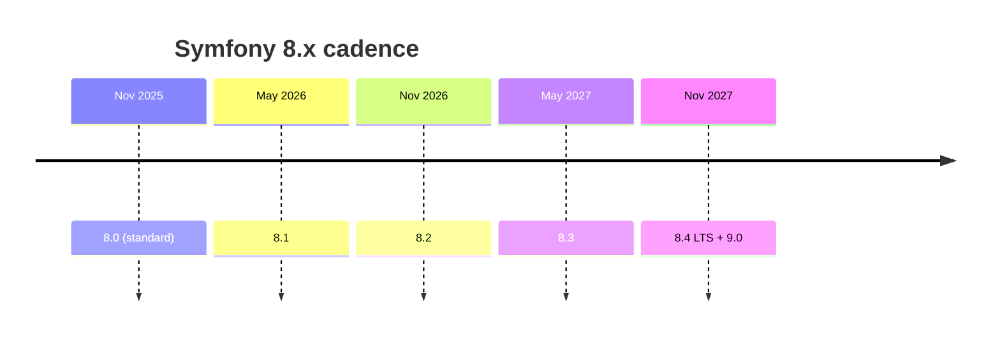

# Release Management

!!! tip "In a nutshell"
    Symfony uses Semantic Versioning on a time-based schedule: minors in
    May/November, majors every two years. Highest-yield: minors **never break BC**
    (only majors do, by removing deprecated code), and `8.4` is the 8.x **LTS**.

!!! example "Real-world analogy"
    Think of a train service running to a fixed, printed timetable. Local trains (minor
    releases) depart on schedule every May and November, and they never change the
    platforms that already work — they only add new carriages (features) and post "this
    door will be removed" notices (deprecations). Only the big timetable overhaul every
    two years (a major) actually removes those flagged doors. One special long-distance
    service each cycle (the `X.4` LTS) keeps running for years, serving passengers who
    cannot afford to re-plan their journey every six months.

!!! abstract "Learning objectives"
    By the end of this chapter you can:

    - [ ] Explain Symfony's SemVer scheme and the May/November cadence.
    - [ ] Distinguish **standard** from **LTS** releases and their maintenance windows.
    - [ ] Say what may change in a patch, minor and major release.
    - [ ] Identify which Symfony 8.x version is the LTS.

    **Syllabus:** `Symfony Architecture → Release Management` ·
    **Level:** Advanced ·
    **Est. time:** 20 min ·
    **Prerequisites:** [Components](components.md)

    **Examen Symfony 8 :** OUI

---

## Pour les nuls

### L'idée en une phrase
Symfony sort une nouvelle version mineure tous les six mois pile, à date fixe — et une mineure ne casse jamais ton code existant.

### Imagine dans la vraie vie
Un train qui roule sur un horaire imprimé et fixe : les trains locaux (versions mineures) partent chaque mai et novembre sans jamais changer les quais qui fonctionnent déjà — ils ajoutent seulement de nouveaux wagons (fonctionnalités) et affichent "cette porte sera retirée" (dépréciations). Seul le grand chantier tous les deux ans (une version majeure) retire réellement ces portes signalées.

### Dans Symfony
Passer de Symfony 8.0 à 8.3 devrait toujours être sûr si tu as corrigé tes dépréciations en cours de route — c'est la garantie même du versionnage sémantique appliqué par Symfony.

### Exemple simple
```json
{ "require": { "symfony/framework-bundle": "^8.0" } }
```
Le `^8.0` accepte automatiquement toutes les futures versions mineures (8.1, 8.2...) sans jamais risquer une rupture.

### Comment le mémoriser 🧠
`X.4` est **toujours** la version LTS (support long) et sort **en même temps** que la prochaine version majeure (`8.4` sort avec `9.0`).

## Theory

Symfony follows **Semantic Versioning** (`MAJOR.MINOR.PATCH`) on a **time-based**
schedule: a new **minor** every six months (**May** and **November**), and a new
**major** every two years. This predictability lets teams plan upgrades. It pairs
tightly with the [Backward Compatibility promise](bc-promise.md) and the
[deprecation policy](deprecations.md).

## Deep Dive — how it works internally

!!! question "Predict first"
    You are on 8.0 and want new features without risking a breakage. Is it safe to
    upgrade to 8.3, and where would a breaking change first be allowed?

??? note "Reveal"
    Yes — minors (`8.0 → 8.3`) never break BC; they only add features and
    deprecations. Breaking changes are allowed only in the next **major** (`9.0`),
    and only for code deprecated during the 8.x line.

### What each release level may change

| Level | Example | May contain |
|---|---|---|
| **PATCH** (`8.0.x`) | 8.0.1 → 8.0.2 | Bug fixes only; no new features, no BC breaks |
| **MINOR** (`8.x`) | 8.0 → 8.1 | New features + **deprecations**; **no BC breaks** |
| **MAJOR** (`x.0`) | 8.0 → 9.0 | Removal of deprecated code; allowed BC breaks |

Because minors never break BC, upgrading within a major (`8.0 → 8.4`) should be
safe if you have resolved deprecations. The **only** place BC breaks are permitted
is a major release, and even then only for code that was **deprecated** in the
previous major line.

### Standard vs LTS maintenance windows

| Type | Which version | Bug fixes | Security fixes |
|---|---|---|---|
| **Standard** | any minor except `X.4` | 8 months | 14 months |
| **LTS** | the last minor of a major (`X.4`) | 3 years | 4 years |

So `8.0`, `8.1`, `8.2`, `8.3` are standard releases; **`8.4` is the LTS**. A new LTS
appears every two years, alongside the next major (`8.4` and `9.0` ship together).



### How it maps to development branches

Symfony develops on the current minor branch (e.g. `8.1`); the lowest maintained
branch receives only bug/security fixes. Fixes are merged **up** from the oldest
supported branch to newer ones, so a patch to `8.0` also lands in `8.1`, etc. This
merge-up model keeps behaviour consistent across maintained branches.

```console
# A fix lands on the oldest maintained branch first (e.g. 8.0)...
$ git switch 8.0
$ git commit -m "[HttpKernel] Fix ..."

# ...then maintainers merge it UP into the newer branches (8.1, 8.2, ...)
$ git switch 8.1
$ git merge 8.0
```

!!! note "Source reference"
    Release process is documented at
    [symfony.com/releases](https://symfony.com/releases) and enforced across
    [symfony/symfony branches](https://github.com/symfony/symfony/branches) —
    the 8.0 branch itself is browsable at
    [github.com/symfony/symfony/tree/8.0](https://github.com/symfony/symfony/tree/8.0),
    and its `CHANGELOG.md` records exactly which release each change shipped in.

### Why time-based releases

Fixed dates decouple "is a feature ready?" from "when do we ship?": features land
in whichever minor is open when they are merged, and everyone knows the upgrade
calendar in advance. It also bounds how long you can defer a major upgrade before
losing security support.

## Configuration & code

=== "composer.json constraints"

    ```json
    {
      "require": {
        "symfony/framework-bundle": "^8.0",
        "symfony/http-kernel": "^8.0"
      }
    }
    ```

=== "Console"

    ```console
    $ composer outdated 'symfony/*' --direct
    $ php bin/console about        # shows Symfony version & end-of-life dates
    ```

## Best practices & anti-patterns

| ✅ Do | ❌ Avoid |
|---|---|
| Track LTS for slow-moving apps | Staying on an EOL minor |
| Fix deprecations each minor | Deferring all upgrades to the next major |
| Use `^8.0` caret constraints | Pinning exact patch versions long-term |
| Upgrade minors regularly (they're BC) | Skipping straight across a major without prep |

## When (not) to use it / alternatives

Choose **LTS** (`X.4`) when you value long support windows over the newest
features; choose the **latest standard** minor when you want features early and can
upgrade every ~6 months. Every project on Symfony inherits this scheme — there is no
alternative cadence to opt into.

!!! danger "Certification traps"
    - Minors ship **May and November**; majors every **2 years**.
    - **`X.4` is always the LTS** and ships **with** `(X+1).0`.
    - Standard: **8 months** bug + **14 months** security. LTS: **3 years** bug +
      **4 years** security.
    - Minor releases **add** features and deprecations but **never break BC**.

!!! warning "Common mistakes"
    - Thinking a minor upgrade can break your app — only majors may (via removed deprecations).
    - Confusing patch (bug-only) with minor (features).

## Exercises

1. **(Advanced)** Which Symfony 8 version is the LTS, and what ships alongside it?
2. **(Expert)** You are on 8.0 and see deprecations. When will the deprecated code
   actually be removed, and what should you do before then?

??? success "Solutions"

    **1.** `8.4` is the LTS; it ships at the same time as `9.0` (Nov 2027).

    **2.** Deprecated code is removed in the next **major** (`9.0`). Resolve the
    deprecations while still on the 8.x line so the `8.x → 9.0` jump is clean.

## Certification questions

*Question d'entraînement inspirée du syllabus — jamais une question officielle de l'examen.*

??? question "Q1. How often does a new Symfony minor release ship?"
    - [x] A. Every 6 months (May and November) ✅
    - [ ] B. Every month
    - [ ] C. Every 2 years

    **Why:** Minors follow a fixed 6-month cadence. **Ref:**
    [Symfony releases](https://symfony.com/releases).

??? question "Q2. Which 8.x version is the LTS?"
    - [x] A. 8.4 ✅
    - [ ] B. 8.0
    - [ ] C. 8.2

    **Why:** The last minor of a major (`X.4`) is the LTS. **Ref:**
    [Long Term Support](https://symfony.com/doc/8.0/contributing/community/releases.html).

??? question "Q3. What may a minor release NOT do?"
    - [x] A. Break backward compatibility ✅
    - [ ] B. Add new features
    - [ ] C. Add deprecations

    **Why:** Minors add features/deprecations but never break BC. **Ref:**
    [BC promise](https://symfony.com/doc/8.0/contributing/code/bc.html).

## Key takeaways

- SemVer + time-based: minors in May/Nov, majors every 2 years.
- Standard: 8 months bug / 14 months security. LTS (`X.4`): 3 years / 4 years.
- `8.4` is the Symfony 8 LTS and ships with `9.0`.
- Minors add features + deprecations; only majors break BC.

## Last-minute revision

!!! tip "Cheat sheet"
    - Minor = May & Nov · Major = every 2 yr.
    - LTS = `X.4` (3 yr bug + 4 yr sec) · Standard = 8 mo bug + 14 mo sec.
    - Patch: bugs only · Minor: features+deprecations, BC-safe · Major: removals.

## Connections

- **Depends on:** [BC Promise](bc-promise.md) — the promise is what guarantees minors stay BC-safe.
- **Reused in:** [Roadmap & Schedule](roadmap-schedule.md) — the same rules become a concrete 8.x calendar; [Deprecations](deprecations.md) are cleared between minors to keep the major jump clean.
- **Confused with:** patch vs minor — a patch is bug-fix-only; a minor adds features and deprecations.

## Official References
- [Symfony releases](https://symfony.com/releases)
- [Release process](https://symfony.com/doc/8.0/contributing/community/releases.html)
- [Backward compatibility promise](https://symfony.com/doc/8.0/contributing/code/bc.html)

## Video references

!!! tip "Watch & learn"
    These are official, continuously-updated video channels — search them for
    "Symfony architecture" to reinforce this chapter. We link stable channels rather than
    individual videos so the references never rot.

    - [SymfonyCasts screencasts](https://symfonycasts.com/tracks/symfony) — scripted, code-along tutorials.
    - [Symfony official YouTube](https://www.youtube.com/@SymfonyOfficial) — SymfonyCon conference talks & keynotes.
    - [Official docs for this topic](https://symfony.com/doc/8.0/contributing/community/releases.html) — some Symfony doc pages embed a screencast.

## Confidence check

I'm ready when I can:

- [ ] explain **why** a time-based SemVer cadence makes upgrades predictable
- [ ] state what a patch, minor and major may each change
- [ ] plan an upgrade using the standard vs LTS maintenance windows
- [ ] spot that `8.4` is the LTS and ships with `9.0`
- [ ] explain the merge-up model across maintained branches

---

<small>Related: [Roadmap & Schedule](roadmap-schedule.md) · [BC Promise](bc-promise.md) · [Deprecations](deprecations.md)</small>
