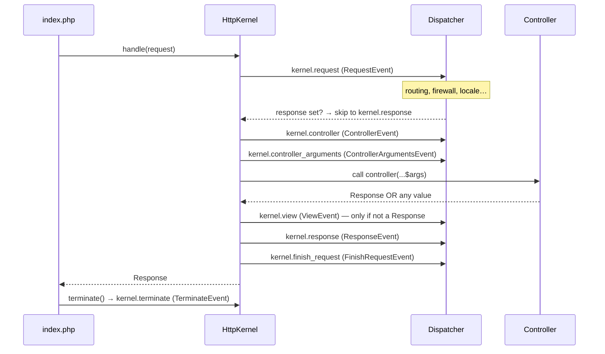
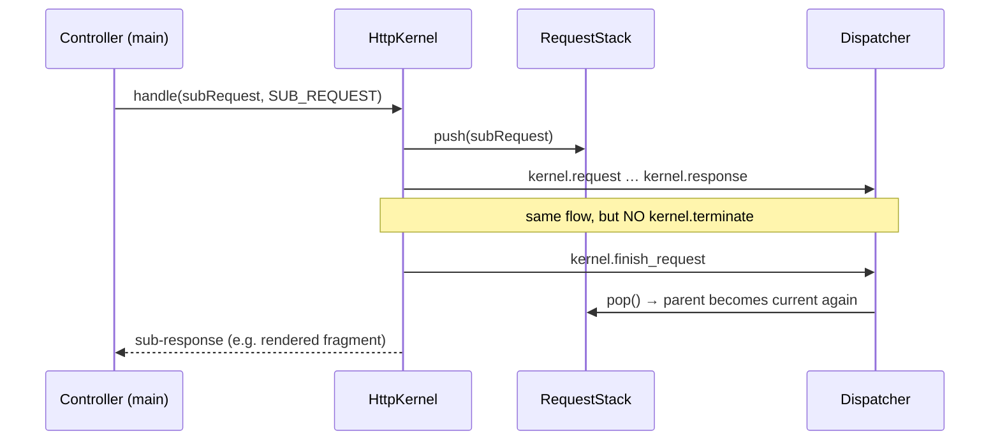

# Request Handling (HttpKernel)

!!! tip "In a nutshell"
    Chaque request devient une `Response` via une seule méthode — `HttpKernel::handle()` —
    qui déclenche les kernel events autour de votre controller. Le plus rentable : mémorisez
    l'ordre **request → controller → controller_arguments → view → response →
    finish_request → terminate** (plus `exception`, hors flux, en cas d'erreur).

!!! example "Real-world analogy"
    Imaginez une request comme un **colis qui traverse un centre de tri**.
    `HttpKernel::handle()` est le tapis roulant, et chaque kernel event est un
    **point de contrôle** : le routing scanne l'étiquette d'expédition (`kernel.request`),
    le controller est l'ouvrier qui remplit la boîte, `kernel.view` emballe un article
    nu dans un vrai paquet, et `kernel.response` est le contrôle qualité final avant
    l'expédition. `kernel.terminate` est la paperasse classée *après* que le camion a
    déjà quitté le quai.

!!! abstract "Learning objectives"
    À la fin de ce chapitre, vous saurez :

    - [ ] Suivre une request de `public/index.php` jusqu'à une `Response` à travers `HttpKernel::handle()`.
    - [ ] Nommer les **huit** `KernelEvents` et les placer dans le bon ordre.
    - [ ] Expliquer les rôles de `ControllerResolverInterface` et `ArgumentResolverInterface`.
    - [ ] Distinguer les requests principales des sub-requests et savoir où intervient `terminate()`.

    **Syllabus:** `Symfony Architecture → Request Handling` ·
    **Level:** Expert ·
    **Est. time:** 40 min ·
    **Prerequisites:** [HTTP Request/Response](../http/request.md), [Events](events.md)

---

## Pour les nuls

### L'idée en une phrase
Chaque requête traverse une chaîne d'étapes fixes et prévisibles avant de devenir une réponse — comme un colis qui passe par plusieurs postes de contrôle dans un centre de tri.

### Imagine dans la vraie vie
Un colis avance sur un tapis roulant dans un centre de tri. Chaque poste de contrôle est un événement kernel : le scan de l'étiquette d'expédition (`kernel.request`), l'ouvrier qui remplit le carton (le contrôleur), l'emballage final avant expédition (`kernel.response`). La paperasse classée *après* que le camion a déjà quitté le quai, c'est `kernel.terminate`.

### Dans Symfony
Un listener enregistré sur `kernel.request` peut court-circuiter tout le reste — par exemple rediriger un visiteur non connecté avant même que le contrôleur ne s'exécute.

### Exemple simple
```php
public function onKernelRequest(RequestEvent $event): void
{
    if (!$this->security->isGranted('ROLE_USER')) {
        $event->setResponse(new RedirectResponse('/login')); // court-circuite le reste
    }
}
```

### Comment le mémoriser 🧠
Retiens l'ordre par une phrase : "**R**equest arrive, **C**ontrôleur est choisi, ses **A**rguments sont résolus, la **V**ue devient réponse, la **R**éponse part, puis on **F**init, et enfin on **T**ermine" — Request → Controller → Arguments → View → Response → Finish → Terminate.


## Theory

Chaque request HTTP Symfony est transformée en response par un unique contrat :

```php
Symfony\Component\HttpKernel\HttpKernelInterface::handle(
    Request $request,
    int $type = self::MAIN_REQUEST,
    bool $catch = true
): Response
```

Le front controller (`public/index.php`) démarre le `Kernel`, construit une `Request`
à partir des superglobales PHP, appelle `handle()`, envoie la `Response` retournée,
puis appelle `terminate()`. Entre `handle()` et `terminate()`, `HttpKernel` orchestre
une séquence d'**events** qui permettent aux listeners d'observer ou de court-circuiter
le flux. Ce cœur piloté par les events est ce qui rend Symfony extensible sans avoir à
patcher le framework.

```php
// What public/index.php does, spelled out (the Runtime automates this):
$kernel = new Kernel($_SERVER['APP_ENV'], (bool) $_SERVER['APP_DEBUG']); // boot the Kernel
$request = Request::createFromGlobals();  // Request built from PHP superglobals
$response = $kernel->handle($request);    // handle(): HttpKernel dispatches the events here
$response->send();                        // stream the Response to the client
$kernel->terminate($request, $response);  // terminate(): after-send work
```

`self::MAIN_REQUEST` (valeur `1`) et `self::SUB_REQUEST` (valeur `2`) sont les deux
types de request ; l'ancienne constante `MASTER_REQUEST` a été supprimée.

```php
use Symfony\Component\HttpKernel\HttpKernelInterface;

HttpKernelInterface::MAIN_REQUEST; // int 1 — the top-level HTTP request
HttpKernelInterface::SUB_REQUEST;  // int 2 — nested requests (fragments)
// HttpKernelInterface::MASTER_REQUEST — removed; use MAIN_REQUEST instead
```

## Deep Dive — how it works internally

!!! question "Predict first"
    Un listener sur `kernel.request` appelle `$event->setResponse(...)`. Votre
    controller s'exécute-t-il encore, et lesquels des huit events sont sautés ?

??? note "Reveal"
    Le controller ne s'exécute jamais. `kernel.controller`, `kernel.controller_arguments`
    et `kernel.view` sont sautés eux aussi — le kernel saute directement à
    `kernel.response`, donc votre response passe quand même par les listeners de
    headers/cookies avant d'être retournée.

### The front controller and Runtime

`public/index.php` est volontairement minuscule. Le composant `symfony/runtime`
l'enveloppe : la closure retournée reçoit des arguments autowirés (comme
`array $context` issu de l'environnement serveur) et le `Runtime` gère pour vous
`Request::createFromGlobals()`, `$response->send()` et `$kernel->terminate()`.

```php
<?php
// public/index.php
use App\Kernel;

require_once dirname(__DIR__).'/vendor/autoload_runtime.php';

return function (array $context): Kernel {
    return new Kernel($context['APP_ENV'], (bool) $context['APP_DEBUG']);
};
```

### The classes in play

| Rôle | FQCN |
|---|---|
| Kernel | `Symfony\Component\HttpKernel\Kernel` (app : `App\Kernel`) |
| Contrat du kernel | `Symfony\Component\HttpKernel\HttpKernelInterface` |
| Moteur | `Symfony\Component\HttpKernel\HttpKernel` |
| Résolution du controller | `Symfony\Component\HttpKernel\Controller\ControllerResolverInterface` |
| Résolution des arguments | `Symfony\Component\HttpKernel\Controller\ArgumentResolverInterface` |
| Dispatcher | `Symfony\Contracts\EventDispatcher\EventDispatcherInterface` |
| Noms des events | `Symfony\Component\HttpKernel\KernelEvents` |

`Kernel::handle()` démarre le container (une seule fois) et délègue au service
`http_kernel` — une instance de `HttpKernel`. Le vrai travail se trouve dans la
méthode privée `HttpKernel::handleRaw()`.

```php
// Simplified: Kernel::handle() boots the container, then delegates
public function handle(Request $request, int $type = HttpKernelInterface::MAIN_REQUEST, bool $catch = true): Response
{
    $this->boot();
    // getHttpKernel() returns the 'http_kernel' service — an HttpKernel instance;
    // HttpKernel::handle() itself just wraps the private handleRaw()
    return $this->getHttpKernel()->handle($request, $type, $catch);
}
```

### The eight kernel events, in execution order



1. **`kernel.request`** — `RequestEvent`. S'exécute *avant* que le routing ne
   décide quoi que ce soit dont le controller a besoin. Le `RouterListener` fait
   correspondre la route ici (priorité `32`) ; le firewall de sécurité authentifie
   ici aussi. **Si un listener appelle `$event->setResponse()`, le kernel saute
   directement à `kernel.response`** — le controller n'est jamais invoqué.
2. **`kernel.controller`** — `ControllerEvent`. Le `ControllerResolverInterface`
   a résolu le `_controller` ; les listeners peuvent le remplacer avec
   `$event->setController()`.
3. **`kernel.controller_arguments`** — `ControllerArgumentsEvent`. Après que
   `ArgumentResolverInterface::getArguments()` a construit le tableau d'arguments,
   les listeners peuvent le modifier (`$event->setArguments()`).
4. *(le controller est appelé)* — le controller retourne une `Response` **ou
   n'importe quelle autre valeur**.
5. **`kernel.view`** — `ViewEvent`. **Dispatché uniquement quand le controller n'a
   pas retourné de `Response`.** Un listener doit transformer la valeur retournée en
   `Response` (p. ex. sérialiser en JSON). Si aucun ne le fait, une exception est levée.
6. **`kernel.response`** — `ResponseEvent`. Chaque response passe par ici ; les
   listeners ajustent les headers, injectent la web-debug-toolbar, posent des
   cookies, etc.
7. **`kernel.finish_request`** — `FinishRequestEvent`. Déclenché après chaque
   request (la principale **et** chaque sub-request) pour que les listeners
   réinitialisent l'état lié à la request, p. ex. restaurer la locale de la request
   parente dans le `RequestStack`.
8. **`kernel.terminate`** — `TerminateEvent`. Déclenché par `terminate()` *après*
   que la response a été envoyée au client. Idéal pour les traitements lourds que
   l'utilisateur ne doit pas attendre (envoi d'e-mails, dispatch de messages via
   `kernel.terminate`).

La huitième constante de `KernelEvents`, **`kernel.exception`** (`ExceptionEvent`),
est dispatchée *hors flux* — elle ne fait pas partie du déroulé linéaire ci-dessus
mais se déclenche dès qu'une exception s'échappe pendant `handleRaw()` (et que
`$catch` vaut `true`). Elle est couverte dans [Exception Handling](exception-handling.md).

!!! note "Source reference"
    `Symfony\Component\HttpKernel\HttpKernel::handleRaw()` et
    `Symfony\Component\HttpKernel\KernelEvents` —
    [symfony/symfony `8.0`](https://github.com/symfony/symfony/blob/8.0/src/Symfony/Component/HttpKernel/HttpKernel.php).

### Controller and argument resolution

`ControllerResolverInterface::getController(Request): callable|false` lit
l'attribut de request `_controller` (posé par le router) et retourne un callable
PHP. `ArgumentResolverInterface::getArguments(Request, callable, ?ReflectionFunctionAbstract): array`
construit ensuite la liste ordonnée des arguments en exécutant une chaîne de
resolvers `ValueResolverInterface` (attributs de request, l'objet `Request`,
`#[MapRequestPayload]`, `#[MapQueryString]`, services, variadiques, valeurs par
défaut…). Voir [Argument Value Resolvers](../controllers/value-resolvers.md).

```php
// Inside handleRaw(), simplified:
$controller = $this->resolver->getController($request);   // ControllerResolverInterface
// ...which reads the '_controller' attribute set by the router:
$request->attributes->get('_controller');                 // e.g. "App\Controller\PostController::show"
$arguments = $this->argumentResolver->getArguments($request, $controller); // ArgumentResolverInterface
$response = $controller(...$arguments);

// The chain behind getArguments() is made of ValueResolverInterface implementations;
// attributes select specific resolvers in your controllers:
public function search(#[MapQueryString] SearchQuery $query): Response { /* ... */ }
public function store(#[MapRequestPayload] PostPayload $payload): Response { /* ... */ }
```

### Sub-requests

Un controller (ou un listener) peut rendre un fragment en appelant à nouveau
`handle()` avec `HttpKernelInterface::SUB_REQUEST`. Les sub-requests suivent le
**même** flux d'events (`kernel.request` … `kernel.finish_request`) mais **pas**
`kernel.terminate`. Le `RequestStack` suit l'imbrication afin que
`getCurrentRequest()` et `getMainRequest()` restent corrects ;
`kernel.finish_request` restaure l'état parent.

```php
// Render a fragment through a sub-request (same events, no kernel.terminate)
$subRequest = Request::create('/_fragment/sidebar');
$response = $httpKernel->handle($subRequest, HttpKernelInterface::SUB_REQUEST);

// RequestStack keeps the nesting straight while the sub-request runs:
$requestStack->getCurrentRequest(); // the sub-request during handle()
$requestStack->getMainRequest();    // still the top-level request
// kernel.finish_request then restores the parent request's state
```



`handleRaw()` pousse la sub-request sur le `RequestStack` avant `kernel.request`
et la retire juste après `kernel.finish_request`, ce qui explique comment la
locale/le contexte de la request parente est restauré.

### Compilation vs runtime

`Kernel::boot()` charge le container **compilé** depuis
`var/cache/<env>/…Container.php`. Le dispatcher, les resolvers et les listeners
sont tous des services câblés à la **compilation** (voir
[Dependency Injection](../dependency-injection/index.md)). Au **runtime**,
`handle()` ne fait que *lire* ce container — aucune analyse de configuration —
c'est pourquoi le chemin critique est rapide. En mode `debug`, le `ConfigCache`
vérifie la fraîcheur et reconstruit quand la configuration source change.

### Performance & memory

- La boucle de dispatch des events est le principal surcoût par request ; gardez
  les listeners légers et utilisez les **priorités** plutôt que de réordonner
  l'enregistrement.
- Préférez `kernel.terminate` pour le travail post-response afin de raccourcir le
  time-to-first-byte.
- Les sub-requests sont des cycles de request complets — mettez les fragments en
  cache (ESI/`render_esi`) plutôt que de rendre de nombreuses sub-requests
  synchrones.

### Null behavior

Un controller peut faire `return null;` — ou retourner toute valeur autre qu'une
`Response`. Le kernel ne traite pas cela comme une erreur immédiatement. Après
l'exécution du controller, `handleRaw()` vérifie `$response instanceof Response` ;
si ce n'est pas le cas, il dispatch **`kernel.view`** (`ViewEvent`) porteur de la
valeur retournée afin qu'un listener puisse en construire une `Response`. Il
appelle ensuite `$event->hasResponse()`. Si **toujours** aucune response n'a été
définie, le kernel lève `ControllerDoesNotReturnResponseException` (une
`LogicException`) :
*"The controller must return a "Symfony\Component\HttpFoundation\Response" object
but it returned null. Did you forget to add a return statement somewhere in your
controller?"* Corrigez en retournant une vraie `Response`, ou en enregistrant un
listener `kernel.view` qui appelle `$event->setResponse()` (p. ex. en sérialisant
la valeur en `JsonResponse`).

```php
// Simplified handleRaw() logic after the controller returned $response:
if (!$response instanceof Response) {
    $event = new ViewEvent($this, $request, $type, $response);
    $this->dispatcher->dispatch($event, KernelEvents::VIEW);   // kernel.view
    if (!$event->hasResponse()) {
        // a LogicException: "The controller must return a ... Response object..."
        throw new ControllerDoesNotReturnResponseException(/* ... */);
    }
    $response = $event->getResponse(); // e.g. a JsonResponse a listener passed to $event->setResponse()
}
```

!!! note "Null in real life"
    Un controller qui retourne `null` est un **colis arrivé à la station
    d'emballage sans boîte** : `kernel.view` est l'ouvrier qui le met en boîte, et
    si personne ne le fait, le paquet est refusé au quai — l'erreur « controller
    must return a Response ».

!!! info "Expert note"
    `handle()` n'est qu'une fine enveloppe publique ; la véritable orchestration
    vit dans la méthode **privée** `HttpKernel::handleRaw()`, raison pour laquelle
    vous ne pouvez pas hériter de la classe pour intercepter une étape isolée —
    vous vous branchez sur les **events** à la place. Et `terminate()` ne s'exécute
    que si le runtime l'appelle : les runtimes longue durée (mode worker
    FrankenPHP/RoadRunner) réutilisent un seul kernel sur de nombreuses requests,
    donc le travail fait dans `kernel.terminate` ne doit jamais supposer un
    processus PHP frais.

??? example "Debugging story"
    **Symptôme :** une route d'API retournait par intermittence la page HTML du
    profiler au lieu de JSON. **Diagnostic :** un listener `kernel.view`
    sérialisait les *tableaux* en JSON, mais un chemin de code retournait `null`
    sur un cache miss. Sans `Response` et sans rien à construire pour le view
    listener, le kernel levait `ControllerDoesNotReturnResponseException`, que la
    page d'erreur de dev rendait en HTML.
    `php bin/console debug:event-dispatcher kernel.view` a confirmé que le listener
    ne se déclenchait que pour les tableaux. **Correction :** retourner un
    `new JsonResponse(null, 204)` explicite sur le miss. **À éviter :** ne laissez
    jamais un controller retomber sur un `null` implicite.

??? abstract "Source-code tour"
    - `Symfony\Component\HttpKernel\HttpKernel::handle()` enveloppe `handleRaw()`
      dans un `try/catch` et constitue l'unique point d'entrée public.
    - `HttpKernel::handleRaw()` dispatch chaque kernel event dans l'ordre et
      pousse/retire le `Symfony\Component\HttpKernel\RequestStack`.
    - `Symfony\Component\HttpKernel\Controller\ControllerResolverInterface`
      transforme l'attribut `_controller` en callable ; `ArgumentResolverInterface`
      construit ses arguments à partir d'une chaîne de `ValueResolverInterface`.
    - `Symfony\Component\EventDispatcher\EventDispatcher` invoque les listeners
      câblés par `RegisterListenersPass`.
    - `Symfony\Component\HttpKernel\KernelEvents` contient les constantes des noms
      d'events ; chaque objet event étend `Symfony\Component\HttpKernel\Event\KernelEvent`.

## Configuration & code

=== "PHP Attributes"

    ```php
    <?php
    declare(strict_types=1);

    namespace App\EventListener;

    use Symfony\Component\HttpKernel\Event\ResponseEvent;
    use Symfony\Component\EventDispatcher\Attribute\AsEventListener;
    use Symfony\Component\HttpKernel\KernelEvents;

    #[AsEventListener(event: KernelEvents::RESPONSE, priority: -10)]
    final class SecurityHeadersListener
    {
        public function __invoke(ResponseEvent $event): void
        {
            // Runs for every response passing through kernel.response.
            $event->getResponse()->headers->set('X-Frame-Options', 'DENY');
        }
    }
    ```

=== "YAML"

    ```yaml
    # config/services.yaml
    services:
        App\EventListener\SecurityHeadersListener:
            tags:
                - { name: kernel.event_listener, event: kernel.response, priority: -10 }
    ```

=== "Console"

    ```console
    $ php bin/console debug:event-dispatcher kernel.request
    ```

## Best practices & anti-patterns

| ✅ Do | ❌ Avoid |
|---|---|
| Court-circuiter avec `setResponse()` sur `kernel.request` pour la maintenance/les redirections | Faire du travail de routing dans le controller |
| Utiliser `kernel.terminate` pour les tâches lentes post-response | Bloquer `kernel.response` avec de lourdes I/O |
| Convertir les valeurs de retour non-Response dans un listener `kernel.view` | Retourner des tableaux en espérant que « ça marche » sans view listener |
| Utiliser `debug:event-dispatcher` pour inspecter l'ordre réel | Deviner les priorités des listeners |

## When (not) to use it / alternatives

Vous n'appelez presque jamais `HttpKernel::handle()` vous-même dans le code
applicatif — le Runtime s'en charge. En revanche, vous vous branchez bel et bien
sur les events. Optez pour un **kernel event listener** quand un comportement doit
s'appliquer à de nombreux controllers (headers, authentification, locale). Pour
des besoins propres à un controller, préférez un argument resolver de controller
ou le controller lui-même.

!!! danger "Certification traps"
    - L'ordre est **request → controller → controller_arguments → view →
      response → finish_request → terminate**, avec **exception** injecté en cas
      d'erreur. Mémorisez-le.
    - `kernel.view` ne se déclenche **que** lorsque le controller retourne autre chose qu'une `Response`.
    - `kernel.terminate` se déclenche **après** l'envoi de la response, et **pas** pour les sub-requests.
    - `MASTER_REQUEST` n'existe plus — c'est `MAIN_REQUEST`.
    - Définir une response sur `kernel.request` saute le controller **et**
      `kernel.controller`/`kernel.view`, mais atteint quand même `kernel.response`.

!!! warning "Common mistakes"
    - Confondre `kernel.finish_request` (par request, avant le retour) avec
      `kernel.terminate` (une fois, après l'envoi).
    - Supposer que `kernel.controller_arguments` s'exécute avant la résolution des
      arguments — il s'exécute *après*, donc vous modifiez un tableau déjà construit.

## Exercises

1. **(Expert)** Écrivez un listener qui retourne une response `503` de maintenance
   pour toutes les requests lorsqu'un flag d'environnement est activé, sans
   invoquer aucun controller.
2. **(Expert)** Expliquez, dans l'ordre, quels events se déclenchent quand un
   controller retourne un simple tableau et qu'un listener `kernel.view` le
   sérialise en JSON.

??? success "Solutions"

    **1.** Écoutez `KernelEvents::REQUEST` avec une priorité **positive** (pour
    passer avant le router) et appelez `$event->setResponse(new Response('...', 503))`.
    Le kernel saute directement à `kernel.response`.

    ```php
    <?php
    declare(strict_types=1);

    namespace App\EventListener;

    use Symfony\Component\HttpFoundation\Response;
    use Symfony\Component\EventDispatcher\Attribute\AsEventListener;
    use Symfony\Component\HttpKernel\Event\RequestEvent;
    use Symfony\Component\HttpKernel\KernelEvents;

    #[AsEventListener(event: KernelEvents::REQUEST, priority: 100)]
    final class MaintenanceListener
    {
        public function __construct(private readonly bool $maintenance) {}

        public function __invoke(RequestEvent $event): void
        {
            if ($this->maintenance && $event->isMainRequest()) {
                $event->setResponse(new Response('Down for maintenance', 503));
            }
        }
    }
    ```

    **2.** `kernel.request` → `kernel.controller` → `kernel.controller_arguments`
    → le controller retourne un `array` → `kernel.view` (le listener construit une
    `JsonResponse`) → `kernel.response` → `kernel.finish_request` ; puis après
    l'envoi, `kernel.terminate`.

## Certification questions

??? question "Q1. In what order do these fire for a controller returning a Response?"
    - [ ] A. request → view → controller → response
    - [x] B. request → controller → controller_arguments → response ✅
    - [ ] C. controller → request → response → terminate

    **Why:** `kernel.view` est sauté car une `Response` a été retournée ; les
    autres suivent l'ordre canonique. **Ref:** [HttpKernel component](https://symfony.com/doc/8.0/components/http_kernel.html#the-workflow-of-a-request).

??? question "Q2. When is `kernel.terminate` dispatched?"
    - [x] A. After the response is sent to the client, for the main request only ✅
    - [ ] B. Before `kernel.response`
    - [ ] C. Once per sub-request

    **Why:** `terminate()` s'exécute après l'envoi et n'est pas appelé pour les
    sub-requests. **Ref:** [kernel.terminate](https://symfony.com/doc/8.0/reference/events.html#kernel-terminate).

??? question "Q3. A listener calls `setResponse()` on `kernel.request`. What happens?"
    - [ ] A. The controller still runs
    - [x] B. The controller is skipped; flow continues at `kernel.response` ✅
    - [ ] C. A `kernel.view` event is required

    **Why:** Une response sur `kernel.request` court-circuite la résolution du
    controller. **Ref:** [kernel.request](https://symfony.com/doc/8.0/reference/events.html#kernel-request).

## Key takeaways

- Un seul point d'entrée : `HttpKernel::handle()` ; la logique est dans `handleRaw()`.
- Huit events : request, controller, controller_arguments, view, response,
  finish_request, terminate (+ exception en cas d'erreur).
- `kernel.view` seulement pour les retours non-`Response` ; `kernel.terminate` après l'envoi.
- La résolution du controller et des arguments utilise `ControllerResolverInterface` /
  `ArgumentResolverInterface`.

## Last-minute revision

!!! tip "Cheat sheet"
    - `handle(Request, MAIN_REQUEST|SUB_REQUEST, catch=true): Response`
    - Ordre : **REQUEST → CONTROLLER → CONTROLLER_ARGUMENTS → VIEW → RESPONSE →
      FINISH_REQUEST → TERMINATE** ; EXCEPTION en cas d'erreur.
    - `MAIN_REQUEST=1`, `SUB_REQUEST=2` ; pas de `MASTER_REQUEST`.
    - Constantes de `KernelEvents` = chaînes des noms d'events (`kernel.request`, …).

## Connections

- **Depends on:** [HTTP Request/Response](../http/request.md) — une `Request` en entrée et une `Response` en sortie, c'est tout le contrat ; et [Dependency Injection](../dependency-injection/index.md), qui compile le kernel, le dispatcher et les resolvers comme services.
- **Reused in:** [Controllers](../controllers/index.md) — le controller résolu et ses [arguments résolus par les value resolvers](../controllers/value-resolvers.md) sortent de ce flux.
- **Confused with:** [Events](events.md) — `HttpKernel` *orchestre* le flux ; l'`EventDispatcher` ne fait que *livrer* chaque event aux listeners.

## Official References
- [Official docs — HttpKernel workflow](https://symfony.com/doc/8.0/components/http_kernel.html)
- [Official docs — Built-in events](https://symfony.com/doc/8.0/reference/events.html)
- [Symfony source — HttpKernel](https://github.com/symfony/symfony/blob/8.0/src/Symfony/Component/HttpKernel/HttpKernel.php)
- [Symfony source — KernelEvents](https://github.com/symfony/symfony/blob/8.0/src/Symfony/Component/HttpKernel/KernelEvents.php)

## Video references

!!! tip "Watch & learn"
    Voici des chaînes vidéo officielles, mises à jour en continu — cherchez-y
    « Symfony architecture » pour renforcer ce chapitre. Nous lions des chaînes
    stables plutôt que des vidéos individuelles afin que les références ne
    périment jamais.

    - [SymfonyCasts screencasts](https://symfonycasts.com/tracks/symfony) — tutoriels scénarisés à suivre en codant.
    - [Symfony official YouTube](https://www.youtube.com/@SymfonyOfficial) — conférences et keynotes SymfonyCon.
    - [Official docs for this topic](https://symfony.com/doc/8.0/components/http_kernel.html#the-workflow-of-a-request) — certaines pages de la doc Symfony intègrent un screencast.

## Confidence check

Je suis prêt quand je sais :

- [ ] expliquer **pourquoi** un unique point d'entrée `handle()` plus des events rend Symfony extensible sans patcher le cœur
- [ ] implémenter un listener `kernel.request` qui court-circuite avec `setResponse()`
- [ ] déboguer une erreur « controller must return a Response » et nommer les events déclenchés
- [ ] repérer le piège : `kernel.terminate` ne s'exécute **pas** pour les sub-requests
- [ ] expliquer comment `handleRaw()` pilote les huit events et le `RequestStack`

---

<small>Related: [Events](events.md) · [Exception Handling](exception-handling.md) · [Components](components.md) · [Value Resolvers](../controllers/value-resolvers.md)</small>
