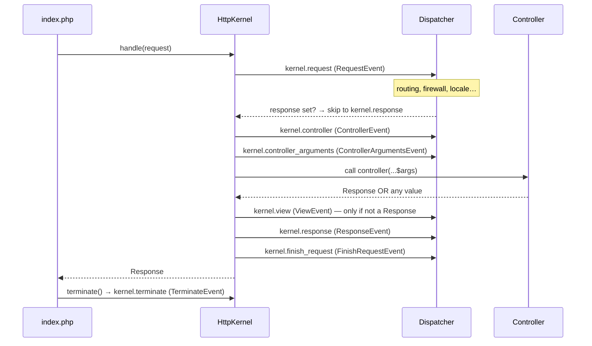
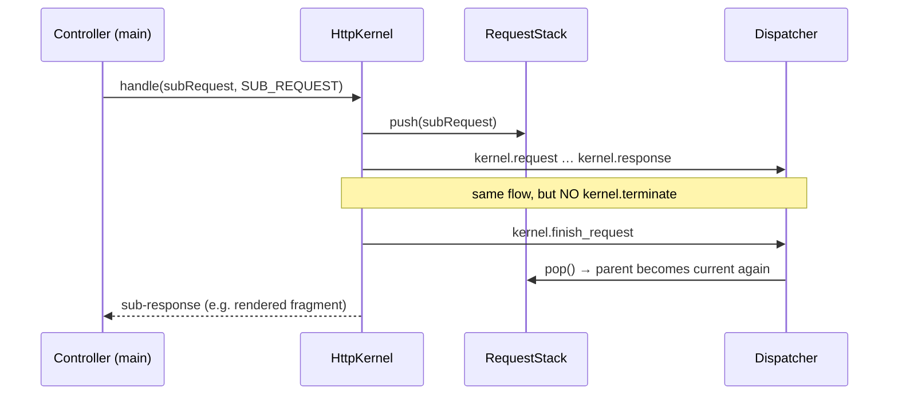

# Request Handling (HttpKernel)

!!! tip "In a nutshell"
    Every request becomes a `Response` through one method — `HttpKernel::handle()` —
    which fires kernel events around your controller. Highest-yield: memorise the
    order **request → controller → controller_arguments → view → response →
    finish_request → terminate** (plus `exception`, out of band, on error).

!!! example "Real-world analogy"
    Picture a request as a **package moving through a sorting facility**.
    `HttpKernel::handle()` is the conveyor belt, and each kernel event is a
    **checkpoint**: routing scans the shipping label (`kernel.request`), the
    controller is the worker who fills the box, `kernel.view` wraps a bare item into
    a proper parcel, and `kernel.response` is the final quality check before it
    ships. `kernel.terminate` is the paperwork filed *after* the truck has already
    left the dock.

!!! abstract "Learning objectives"
    By the end of this chapter you can:

    - [ ] Trace a request from `public/index.php` to a `Response` through `HttpKernel::handle()`.
    - [ ] Name the **eight** `KernelEvents` and place them in the correct order.
    - [ ] Explain the roles of `ControllerResolverInterface` and `ArgumentResolverInterface`.
    - [ ] Distinguish main requests from sub-requests and know how `terminate()` fits in.

    **Syllabus:** `Symfony Architecture → Request Handling` ·
    **Level:** Expert ·
    **Est. time:** 40 min ·
    **Prerequisites:** [HTTP Request/Response](../http/request.md), [Events](events.md)

---

## Theory

Every Symfony HTTP request is turned into a response by a single contract:

```php
Symfony\Component\HttpKernel\HttpKernelInterface::handle(
    Request $request,
    int $type = self::MAIN_REQUEST,
    bool $catch = true
): Response
```

The front controller (`public/index.php`) boots the `Kernel`, builds a `Request`
from PHP superglobals, calls `handle()`, sends the returned `Response`, then calls
`terminate()`. Between `handle()` and `terminate()`, `HttpKernel` orchestrates a
sequence of **events** that let listeners observe or short-circuit the flow. This
event-driven core is what makes Symfony extensible without patching.

```php
// What public/index.php does, spelled out (the Runtime automates this):
$kernel = new Kernel($_SERVER['APP_ENV'], (bool) $_SERVER['APP_DEBUG']); // boot the Kernel
$request = Request::createFromGlobals();  // Request built from PHP superglobals
$response = $kernel->handle($request);    // handle(): HttpKernel dispatches the events here
$response->send();                        // stream the Response to the client
$kernel->terminate($request, $response);  // terminate(): after-send work
```

`self::MAIN_REQUEST` (value `1`) and `self::SUB_REQUEST` (value `2`) are the two
request types; the old `MASTER_REQUEST` constant was removed.

```php
use Symfony\Component\HttpKernel\HttpKernelInterface;

HttpKernelInterface::MAIN_REQUEST; // int 1 — the top-level HTTP request
HttpKernelInterface::SUB_REQUEST;  // int 2 — nested requests (fragments)
// HttpKernelInterface::MASTER_REQUEST — removed; use MAIN_REQUEST instead
```

## Deep Dive — how it works internally

!!! question "Predict first"
    A listener on `kernel.request` calls `$event->setResponse(...)`. Does your
    controller still run, and which of the eight events get skipped?

??? note "Reveal"
    The controller never runs. `kernel.controller`, `kernel.controller_arguments`
    and `kernel.view` are skipped too — the kernel jumps straight to
    `kernel.response`, so your response still passes header/cookie listeners before
    being returned.

### The front controller and Runtime

`public/index.php` is intentionally tiny. The `symfony/runtime` component wraps it:
the returned callable receives autowired arguments (like `array $context` from the
server environment) and the `Runtime` handles `Request::createFromGlobals()`,
`$response->send()` and `$kernel->terminate()` for you.

```php
<?php
// public/index.php
use App\Kernel;

require_once dirname(__DIR__).'/vendor/autoload_runtime.php';

return function (array $context): Kernel {
    return new Kernel($context['APP_ENV'], (bool) $context['APP_DEBUG']);
};
```

### The classes in play

| Role | FQCN |
|---|---|
| Kernel | `Symfony\Component\HttpKernel\Kernel` (app: `App\Kernel`) |
| Kernel contract | `Symfony\Component\HttpKernel\HttpKernelInterface` |
| Engine | `Symfony\Component\HttpKernel\HttpKernel` |
| Controller resolution | `Symfony\Component\HttpKernel\Controller\ControllerResolverInterface` |
| Argument resolution | `Symfony\Component\HttpKernel\Controller\ArgumentResolverInterface` |
| Dispatcher | `Symfony\Contracts\EventDispatcher\EventDispatcherInterface` |
| Event names | `Symfony\Component\HttpKernel\KernelEvents` |

`Kernel::handle()` boots the container (once) and delegates to the
`http_kernel` service — an instance of `HttpKernel`. The real work lives in the
private `HttpKernel::handleRaw()`.

```php
// Simplified: Kernel::handle() boots the container, then delegates
public function handle(Request $request, int $type = HttpKernelInterface::MAIN_REQUEST, bool $catch = true): Response
{
    $this->boot();
    // getHttpKernel() returns the 'http_kernel' service — an HttpKernel instance;
    // HttpKernel::handle() itself just wraps the private handleRaw()
    return $this->getHttpKernel()->handle($request, $type, $catch);
}
```

### The eight kernel events, in execution order



1. **`kernel.request`** — `RequestEvent`. Runs *before* routing decides anything
   the controller needs. `RouterListener` matches the route here (priority `32`);
   the security firewall authenticates here too. **If a listener calls
   `$event->setResponse()`, the kernel jumps straight to `kernel.response`** —
   the controller is never invoked.
2. **`kernel.controller`** — `ControllerEvent`. The `ControllerResolverInterface`
   has resolved the `_controller`; listeners may swap it with
   `$event->setController()`.
3. **`kernel.controller_arguments`** — `ControllerArgumentsEvent`. After
   `ArgumentResolverInterface::getArguments()` has built the argument array,
   listeners may alter it (`$event->setArguments()`).
4. *(controller is called)* — the controller returns a `Response` **or any other
   value**.
5. **`kernel.view`** — `ViewEvent`. **Only dispatched when the controller did not
   return a `Response`.** A listener must turn the returned value into a `Response`
   (e.g. serialize to JSON). If none does, an exception is thrown.
6. **`kernel.response`** — `ResponseEvent`. Every response passes through here;
   listeners tweak headers, inject the web-debug-toolbar, set cookies, etc.
7. **`kernel.finish_request`** — `FinishRequestEvent`. Fired after each request
   (main **and** every sub-request) so listeners can reset request-scoped state,
   e.g. restore the parent request's locale in the `RequestStack`.
8. **`kernel.terminate`** — `TerminateEvent`. Fired by `terminate()` *after* the
   response has been sent to the client. Ideal for heavy work you don't want the
   user to wait on (sending emails, dispatching messages via `kernel.terminate`).

The eighth `KernelEvents` constant, **`kernel.exception`** (`ExceptionEvent`), is
dispatched *out of band* — it is not part of the linear flow above but fires
whenever any exception escapes during `handleRaw()` (and `$catch` is `true`).
It is covered in [Exception Handling](exception-handling.md).

!!! note "Source reference"
    `Symfony\Component\HttpKernel\HttpKernel::handleRaw()` and
    `Symfony\Component\HttpKernel\KernelEvents` —
    [symfony/symfony `8.0`](https://github.com/symfony/symfony/blob/8.0/src/Symfony/Component/HttpKernel/HttpKernel.php).

### Controller and argument resolution

`ControllerResolverInterface::getController(Request): callable|false` reads the
`_controller` request attribute (set by the router) and returns a PHP callable.
`ArgumentResolverInterface::getArguments(Request, callable, ?ReflectionFunctionAbstract): array`
then builds the ordered argument list by running a chain of
`ValueResolverInterface` resolvers (request attributes, the `Request` object,
`#[MapRequestPayload]`, `#[MapQueryString]`, services, variadics, defaults…). See
[Argument Value Resolvers](../controllers/value-resolvers.md).

```php
// Inside handleRaw(), simplified:
$controller = $this->resolver->getController($request);   // ControllerResolverInterface
// ...which reads the '_controller' attribute set by the router:
$request->attributes->get('_controller');                 // e.g. "App\Controller\PostController::show"
$arguments = $this->argumentResolver->getArguments($request, $controller); // ArgumentResolverInterface
$response = $controller(...$arguments);

// The chain behind getArguments() is made of ValueResolverInterface implementations;
// attributes select specific resolvers in your controllers:
public function search(#[MapQueryString] SearchQuery $query): Response { /* ... */ }
public function store(#[MapRequestPayload] PostPayload $payload): Response { /* ... */ }
```

### Sub-requests

A controller (or listener) can render a fragment by calling `handle()` again with
`HttpKernelInterface::SUB_REQUEST`. Sub-requests run the **same** event flow
(`kernel.request` … `kernel.finish_request`) but **not** `kernel.terminate`.
`RequestStack` tracks the nesting so `getCurrentRequest()` and
`getMainRequest()` stay correct; `kernel.finish_request` restores parent state.

```php
// Render a fragment through a sub-request (same events, no kernel.terminate)
$subRequest = Request::create('/_fragment/sidebar');
$response = $httpKernel->handle($subRequest, HttpKernelInterface::SUB_REQUEST);

// RequestStack keeps the nesting straight while the sub-request runs:
$requestStack->getCurrentRequest(); // the sub-request during handle()
$requestStack->getMainRequest();    // still the top-level request
// kernel.finish_request then restores the parent request's state
```



`handleRaw()` pushes the sub-request onto the `RequestStack` before
`kernel.request` and pops it right after `kernel.finish_request`, which is how the
parent locale/request context is restored.

### Compilation vs runtime

`Kernel::boot()` loads the **compiled** container from
`var/cache/<env>/…Container.php`. The dispatcher, resolvers and listeners are all
services wired at **compile time** (see [Dependency Injection](../dependency-injection/index.md)).
At **runtime** `handle()` only *reads* that container — no configuration parsing —
which is why the hot path is fast. In `debug` mode the `ConfigCache` checks
freshness and rebuilds when source config changes.

### Performance & memory

- The event dispatch loop is the main per-request overhead; keep listeners cheap
  and use **priorities** rather than re-ordering registration.
- Prefer `kernel.terminate` for post-response work to shorten time-to-first-byte.
- Sub-requests are full request cycles — cache fragments (ESI/`render_esi`) rather
  than rendering many synchronous sub-requests.

### Null behavior

A controller may `return null;` — or any non-`Response` value. The kernel does not
treat that as an error straight away. After the controller runs, `handleRaw()`
checks `$response instanceof Response`; if it isn't, it dispatches **`kernel.view`**
(`ViewEvent`) carrying the returned value so a listener can build a `Response` from
it. It then calls `$event->hasResponse()`. If **still** no response was set, the
kernel throws `ControllerDoesNotReturnResponseException` (a `LogicException`):
*"The controller must return a "Symfony\Component\HttpFoundation\Response" object
but it returned null. Did you forget to add a return statement somewhere in your
controller?"* Handle it by returning a real `Response`, or by registering a
`kernel.view` listener that calls `$event->setResponse()` (e.g. serializing the
value to a `JsonResponse`).

```php
// Simplified handleRaw() logic after the controller returned $response:
if (!$response instanceof Response) {
    $event = new ViewEvent($this, $request, $type, $response);
    $this->dispatcher->dispatch($event, KernelEvents::VIEW);   // kernel.view
    if (!$event->hasResponse()) {
        // a LogicException: "The controller must return a ... Response object..."
        throw new ControllerDoesNotReturnResponseException(/* ... */);
    }
    $response = $event->getResponse(); // e.g. a JsonResponse a listener passed to $event->setResponse()
}
```

!!! note "Null in real life"
    A controller returning `null` is a **parcel that reached the wrapping station
    with no box**: `kernel.view` is the worker who boxes it, and if nobody does the
    package is rejected at the dock — the "controller must return a Response" error.

!!! info "Expert note"
    `handle()` is only a thin public wrapper; the real orchestration lives in the
    **private** `HttpKernel::handleRaw()`, which is why you cannot subclass to
    intercept a single step — you hook the **events** instead. And `terminate()`
    only runs if the runtime calls it: long-lived runtimes (FrankenPHP/RoadRunner
    worker mode) reuse one kernel across many requests, so `kernel.terminate` work
    must never assume a fresh PHP process.

??? example "Debugging story"
    **Symptom:** an API route intermittently returned the HTML profiler page
    instead of JSON. **Diagnosis:** a `kernel.view` listener serialized *arrays* to
    JSON, but one code path `return`ed `null` on a cache miss. With no `Response`
    and nothing for the view listener to build, the kernel threw
    `ControllerDoesNotReturnResponseException`, which the dev error page rendered as
    HTML. `php bin/console debug:event-dispatcher kernel.view` confirmed the listener
    only fired for arrays. **Fix:** return an explicit `new JsonResponse(null, 204)`
    on the miss. **Avoid:** never let a controller fall through to an implicit `null`.

??? abstract "Source-code tour"
    - `Symfony\Component\HttpKernel\HttpKernel::handle()` wraps `handleRaw()` in a
      `try/catch` and is the single public entry point.
    - `HttpKernel::handleRaw()` dispatches every kernel event in order and
      pushes/pops the `Symfony\Component\HttpKernel\RequestStack`.
    - `Symfony\Component\HttpKernel\Controller\ControllerResolverInterface` turns the
      `_controller` attribute into a callable; `ArgumentResolverInterface` builds its
      arguments from a chain of `ValueResolverInterface`.
    - `Symfony\Component\EventDispatcher\EventDispatcher` invokes the listeners wired
      by `RegisterListenersPass`.
    - `Symfony\Component\HttpKernel\KernelEvents` holds the event-name constants; each
      event object extends `Symfony\Component\HttpKernel\Event\KernelEvent`.

## Configuration & code

=== "PHP Attributes"

    ```php
    <?php
    declare(strict_types=1);

    namespace App\EventListener;

    use Symfony\Component\HttpKernel\Event\ResponseEvent;
    use Symfony\Component\EventDispatcher\Attribute\AsEventListener;
    use Symfony\Component\HttpKernel\KernelEvents;

    #[AsEventListener(event: KernelEvents::RESPONSE, priority: -10)]
    final class SecurityHeadersListener
    {
        public function __invoke(ResponseEvent $event): void
        {
            // Runs for every response passing through kernel.response.
            $event->getResponse()->headers->set('X-Frame-Options', 'DENY');
        }
    }
    ```

=== "YAML"

    ```yaml
    # config/services.yaml
    services:
        App\EventListener\SecurityHeadersListener:
            tags:
                - { name: kernel.event_listener, event: kernel.response, priority: -10 }
    ```

=== "Console"

    ```console
    $ php bin/console debug:event-dispatcher kernel.request
    ```

## Best practices & anti-patterns

| ✅ Do | ❌ Avoid |
|---|---|
| Short-circuit with `setResponse()` on `kernel.request` for maintenance/redirects | Doing routing work in the controller |
| Use `kernel.terminate` for slow after-response tasks | Blocking `kernel.response` with heavy I/O |
| Convert non-Response return values in a `kernel.view` listener | Returning arrays and hoping "it works" without a view listener |
| Use `debug:event-dispatcher` to inspect real order | Guessing listener priorities |

## When (not) to use it / alternatives

You almost never call `HttpKernel::handle()` yourself in application code — the
Runtime does it. You *do* hook the events. Reach for a **kernel event listener**
when behaviour must apply across many controllers (headers, auth, locale). For
per-controller concerns, prefer a controller argument resolver or the controller
itself.

!!! danger "Certification traps"
    - The order is **request → controller → controller_arguments → view →
      response → finish_request → terminate**, with **exception** injected on error.
      Memorise it.
    - `kernel.view` fires **only** when the controller returns a non-`Response`.
    - `kernel.terminate` fires **after** the response is sent, and **not** for sub-requests.
    - `MASTER_REQUEST` no longer exists — it is `MAIN_REQUEST`.
    - Setting a response on `kernel.request` skips the controller **and**
      `kernel.controller`/`kernel.view`, but still reaches `kernel.response`.

!!! warning "Common mistakes"
    - Confusing `kernel.finish_request` (per request, before returning) with
      `kernel.terminate` (once, after sending).
    - Assuming `kernel.controller_arguments` runs before argument resolution — it
      runs *after*, so you edit an already-built array.

## Exercises

1. **(Expert)** Write a listener that returns a `503` maintenance response for all
   requests when an env flag is set, without invoking any controller.
2. **(Expert)** Explain, in order, which events fire when a controller returns a
   plain array and a `kernel.view` listener serializes it to JSON.

??? success "Solutions"

    **1.** Listen on `KernelEvents::REQUEST` with a **positive** priority (so it
    runs before the router) and call `$event->setResponse(new Response('...', 503))`.
    The kernel skips straight to `kernel.response`.

    ```php
    <?php
    declare(strict_types=1);

    namespace App\EventListener;

    use Symfony\Component\HttpFoundation\Response;
    use Symfony\Component\EventDispatcher\Attribute\AsEventListener;
    use Symfony\Component\HttpKernel\Event\RequestEvent;
    use Symfony\Component\HttpKernel\KernelEvents;

    #[AsEventListener(event: KernelEvents::REQUEST, priority: 100)]
    final class MaintenanceListener
    {
        public function __construct(private readonly bool $maintenance) {}

        public function __invoke(RequestEvent $event): void
        {
            if ($this->maintenance && $event->isMainRequest()) {
                $event->setResponse(new Response('Down for maintenance', 503));
            }
        }
    }
    ```

    **2.** `kernel.request` → `kernel.controller` → `kernel.controller_arguments`
    → controller returns `array` → `kernel.view` (listener builds a `JsonResponse`)
    → `kernel.response` → `kernel.finish_request`; then after send, `kernel.terminate`.

## Certification questions

??? question "Q1. In what order do these fire for a controller returning a Response?"
    - [ ] A. request → view → controller → response
    - [x] B. request → controller → controller_arguments → response ✅
    - [ ] C. controller → request → response → terminate

    **Why:** `kernel.view` is skipped because a `Response` was returned; the rest
    follow the canonical order. **Ref:** [HttpKernel component](https://symfony.com/doc/current/components/http_kernel.html#the-workflow-of-a-request).

??? question "Q2. When is `kernel.terminate` dispatched?"
    - [x] A. After the response is sent to the client, for the main request only ✅
    - [ ] B. Before `kernel.response`
    - [ ] C. Once per sub-request

    **Why:** `terminate()` runs post-send and is not called for sub-requests.
    **Ref:** [kernel.terminate](https://symfony.com/doc/current/reference/events.html#kernel-terminate).

??? question "Q3. A listener calls `setResponse()` on `kernel.request`. What happens?"
    - [ ] A. The controller still runs
    - [x] B. The controller is skipped; flow continues at `kernel.response` ✅
    - [ ] C. A `kernel.view` event is required

    **Why:** A response on `kernel.request` short-circuits controller resolution.
    **Ref:** [kernel.request](https://symfony.com/doc/current/reference/events.html#kernel-request).

## Key takeaways

- One entry point: `HttpKernel::handle()`; the logic is in `handleRaw()`.
- Eight events: request, controller, controller_arguments, view, response,
  finish_request, terminate (+ exception on error).
- `kernel.view` only for non-`Response` returns; `kernel.terminate` after send.
- Controller and argument resolution use `ControllerResolverInterface` /
  `ArgumentResolverInterface`.

## Last-minute revision

!!! tip "Cheat sheet"
    - `handle(Request, MAIN_REQUEST|SUB_REQUEST, catch=true): Response`
    - Order: **REQUEST → CONTROLLER → CONTROLLER_ARGUMENTS → VIEW → RESPONSE →
      FINISH_REQUEST → TERMINATE**; EXCEPTION on error.
    - `MAIN_REQUEST=1`, `SUB_REQUEST=2`; no `MASTER_REQUEST`.
    - `KernelEvents` constants = event-name strings (`kernel.request`, …).

## Connections

- **Depends on:** [HTTP Request/Response](../http/request.md) — a `Request` in and a `Response` out is the whole contract; and [Dependency Injection](../dependency-injection/index.md), which compiles the kernel, dispatcher and resolvers as services.
- **Reused in:** [Controllers](../controllers/index.md) — the resolved controller and its [value-resolved arguments](../controllers/value-resolvers.md) come out of this flow.
- **Confused with:** [Events](events.md) — `HttpKernel` *orchestrates* the flow; the `EventDispatcher` only *delivers* each event to listeners.

## Official References
- [Official docs — HttpKernel workflow](https://symfony.com/doc/current/components/http_kernel.html)
- [Official docs — Built-in events](https://symfony.com/doc/current/reference/events.html)
- [Symfony source — HttpKernel](https://github.com/symfony/symfony/blob/8.0/src/Symfony/Component/HttpKernel/HttpKernel.php)
- [Symfony source — KernelEvents](https://github.com/symfony/symfony/blob/8.0/src/Symfony/Component/HttpKernel/KernelEvents.php)

## Video references

!!! tip "Watch & learn"
    These are official, continuously-updated video channels — search them for
    "Symfony architecture" to reinforce this chapter. We link stable channels rather than
    individual videos so the references never rot.

    - [SymfonyCasts screencasts](https://symfonycasts.com/tracks/symfony) — scripted, code-along tutorials.
    - [Symfony official YouTube](https://www.youtube.com/@SymfonyOfficial) — SymfonyCon conference talks & keynotes.
    - [Official docs for this topic](https://symfony.com/doc/current/components/http_kernel.html#the-workflow-of-a-request) — some Symfony doc pages embed a screencast.

## Confidence check

I'm ready when I can:

- [ ] explain **why** one `handle()` entry point plus events makes Symfony extensible without patching core
- [ ] implement a `kernel.request` listener that short-circuits with `setResponse()`
- [ ] debug a "controller must return a Response" error and name which events fired
- [ ] spot the trap that `kernel.terminate` does **not** run for sub-requests
- [ ] explain how `handleRaw()` drives the eight events and the `RequestStack`

---

<small>Related: [Events](events.md) · [Exception Handling](exception-handling.md) · [Components](components.md) · [Value Resolvers](../controllers/value-resolvers.md)</small>
