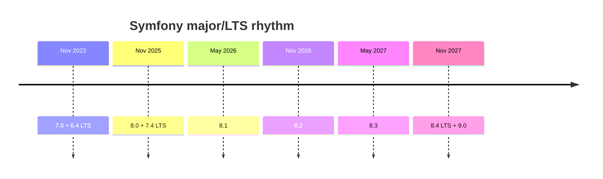

# Roadmap & Schedule

!!! tip "In a nutshell"
    Le calendrier de Symfony est fixe et public : une mineure chaque **mai et
    novembre**, une majeure accompagnée de sa LTS tous les **deux ans**. Le plus
    rentable pour 8.x : `8.4` est la **LTS** et sort en même temps que `9.0` en
    **novembre 2027**.

!!! example "Real-world analogy"
    La roadmap de Symfony fonctionne comme un calendrier scolaire publié des années à
    l'avance. Tout le monde sait déjà que les trimestres commencent à dates fixes (les
    mineures de mai et novembre) et qu'un nouveau programme, accompagné d'une promotion
    bénéficiant d'un long suivi, arrive tous les deux ans (la LTS `8.4` livrée avec
    `9.0`). Les dates étant fixées si loin en avance, les familles peuvent planifier les
    inscriptions, budgéter le changement, et savoir précisément quand un cours donné
    cesse d'être proposé (fin de maintenance) — pas de panique face à une échéance
    surgie de nulle part.

!!! abstract "Learning objectives"
    À la fin de ce chapitre, vous saurez :

    - [ ] Restituer la cadence fixe des mineures (mai/novembre) et celle des majeures (2 ans).
    - [ ] Dérouler le calendrier Symfony 8.x, LTS comprise.
    - [ ] Combiner le calendrier avec les fenêtres de maintenance pour planifier les montées de version.

    **Syllabus:** `Symfony Architecture → Roadmap & Schedule` ·
    **Level:** Advanced ·
    **Est. time:** 15 min ·
    **Prerequisites:** [Release Management](release-management.md)

---

## Pour les nuls

### L'idée en une phrase
Le calendrier de sortie de Symfony est public et fixé des années à l'avance — pas de surprise, pas de date annoncée à la dernière minute.

### Imagine dans la vraie vie
Un calendrier scolaire publié des années en avance : tout le monde sait déjà que les rentrées ont lieu à dates fixes (les mineures de mai et novembre), et qu'une nouvelle promotion "longue durée" arrive tous les deux ans (la LTS `X.4` avec la nouvelle version majeure). Comme les dates sont fixées si loin à l'avance, chacun peut planifier son inscription sans être pris de court.

### Dans Symfony
Une équipe technique peut planifier sa migration Symfony 9 dès aujourd'hui, car la date de sortie (novembre 2027, avec la LTS 8.4) est connue publiquement des années à l'avance.

### Exemple simple
```console
$ php bin/console about
# Affiche la version Symfony actuelle et sa date de fin de vie
```

### Comment le mémoriser 🧠
Le calendrier ne change jamais de rythme : **mai + novembre** pour les mineures, **tous les deux ans** pour les majeures — retiens-le comme une horloge qui ne s'arrête jamais.


## Theory

La roadmap de Symfony est **pilotée par le calendrier et publique** : vous
connaissez toujours les dates de sortie des années à l'avance. Une **mineure**
chaque **mai et novembre**, une **majeure** et sa **LTS** associée tous les
**deux ans**. Ce chapitre transforme les
[règles de release management](release-management.md) en un calendrier 8.x concret.

## Deep Dive — how it works internally

!!! question "Predict first"
    Un produit doit tourner plus de 3 ans sans montée de version majeure. Quelle
    version 8.x visez-vous, et quand arrive la majeure suivante ?

??? note "Reveal"
    Visez **8.4 (LTS)** — 3 ans de corrections de bugs, 4 ans de correctifs de
    sécurité. Elle sort en novembre 2027, **en même temps** que la majeure
    suivante, `9.0`.

### The 8.x timeline

| Version | Sortie | Type |
|---|---|---|
| 8.0 | Nov 2025 | Standard (première de la majeure) |
| 8.1 | Mai 2026 | Standard |
| 8.2 | Nov 2026 | Standard |
| 8.3 | Mai 2027 | Standard |
| 8.4 | Nov 2027 | **LTS** (dernière de la majeure) |
| 9.0 | Nov 2027 | Majeure suivante (sort avec 8.4) |

Le schéma se répète pour chaque majeure : `X.0` ouvre le cycle, quatre autres
mineures sortent tous les six mois, et `X.4` (la LTS) arrive en même temps que
`(X+1).0`.



### Reading the schedule with maintenance windows

Combinez les dates avec les fenêtres décrites dans
[Release Management](release-management.md) :

- Une mineure **standard** reçoit **8 mois** de corrections de bugs et **14 mois**
  de correctifs de sécurité — elle est donc pleinement maintenue à peu près
  jusqu'à la release qui suit la suivante.
- La **LTS** (`8.4`) reçoit **3 ans** de corrections de bugs et **4 ans** de
  correctifs de sécurité, ce qui en fait la cible des applications à longue durée
  de vie.

Comme les mineures respectent la compatibilité ascendante, le conseil pratique
est : **restez à jour** sur la ligne 8.x (en corrigeant les
[deprecations](deprecations.md) au fil de l'eau), ou **figez-vous sur la LTS** et
franchissez les majeures de manière délibérée.

!!! note "Source reference"
    Dates en direct et barres de fin de vie —
    [symfony.com/releases](https://symfony.com/releases).

### Why publish so far ahead

Des dates prévisibles permettent aux équipes de planifier les montées de version,
d'organiser le nettoyage des dépréciations et de budgéter les migrations
majeures. Cela plafonne aussi le risque : vous savez toujours combien de temps
votre version actuelle reste supportée avant de devoir bouger.

## Configuration & code

=== "Console"

    ```console
    $ php bin/console about
    # Prints the running Symfony version plus its
    # "End of maintenance" and "End of life" dates.
    ```

=== "Constraint targeting the LTS"

    ```json
    {
      "require": {
        "symfony/framework-bundle": "8.4.*"
      }
    }
    ```

## Best practices & anti-patterns

| ✅ Do | ❌ Avoid |
|---|---|
| Planifier les montées de version autour du calendrier mai/nov | Découvrir la fin de vie après coup |
| Viser la LTS pour les produits à longue durée de vie | Rester sur une mineure standard non maintenue |
| Purger les dépréciations avant chaque majeure | Précipiter le saut `8.x → 9.0` sans tests |

## When (not) to use it / alternatives

Tout utilisateur de Symfony suit ce calendrier. Le seul choix est *quelle*
branche suivre : la dernière standard (fonctionnalités en avance) ou la LTS
(stabilité). Il n'existe pas de canal « lent » distinct au-delà de la LTS.

!!! danger "Certification traps"
    - Mineures : **mai et novembre**. Majeures + LTS : **tous les 2 ans**.
    - `8.4` est la LTS et sort **en même temps** que `9.0` (nov 2027).
    - La LTS précédente à la sortie de 8.0 est `7.4` ; `6.4` la précédait.

!!! warning "Common mistakes"
    - Croire que la LTS arrive *avant* la majeure suivante — elle sort **en même temps** qu'elle.
    - Supposer que `8.0` bénéficie d'un support long terme — la LTS est `8.4`.

## Exercises

1. **(Advanced)** Listez les versions Symfony 8.x avec leur mois de sortie.
2. **(Expert)** Votre produit doit tourner plus de 3 ans sans montée de version
   majeure. Quelle version visez-vous et pourquoi ?

??? success "Solutions"

    **1.** 8.0 (nov 2025), 8.1 (mai 2026), 8.2 (nov 2026), 8.3 (mai 2027),
    8.4 LTS (nov 2027).

    **2.** Visez **8.4 (LTS)** : elle offre 3 ans de corrections de bugs et 4 ans
    de correctifs de sécurité, la plus longue fenêtre de support de la ligne 8.x.

## Certification questions

??? question "Q1. In which months do Symfony minors ship?"
    - [x] A. May and November ✅
    - [ ] B. January and July
    - [ ] C. March and September

    **Why:** La cadence est fixée à mai/novembre. **Ref:**
    [Symfony releases](https://symfony.com/releases).

??? question "Q2. When does 8.4 (LTS) release relative to 9.0?"
    - [x] A. At the same time (both Nov 2027) ✅
    - [ ] B. One year before 9.0
    - [ ] C. After 9.0

    **Why:** `X.4` et `(X+1).0` sortent ensemble. **Ref:**
    [Release process](https://symfony.com/doc/8.0/contributing/community/releases.html).

??? question "Q3. How often is a new major/LTS released?"
    - [x] A. Every 2 years ✅
    - [ ] B. Every 6 months
    - [ ] C. Every year

    **Why:** Les majeures (et leur LTS) arrivent tous les deux ans. **Ref:**
    [Symfony releases](https://symfony.com/releases).

## Key takeaways

- Mineures : mai et novembre ; majeures + LTS : tous les 2 ans.
- 8.x : 8.0 → 8.4, avec 8.4 la LTS sortant en même temps que 9.0 (nov 2027).
- Combinez les dates avec les fenêtres de maintenance pour planifier les montées de version.

## Last-minute revision

!!! tip "Cheat sheet"
    - 8.0 nov 25 · 8.1 mai 26 · 8.2 nov 26 · 8.3 mai 27 · 8.4 LTS nov 27 (+9.0).
    - LTS = `X.4`, sort avec `(X+1).0`.
    - `php bin/console about` affiche les dates de fin de vie.

## Connections

- **Depends on:** [Release Management](release-management.md) — ce chapitre transforme ces règles SemVer/maintenance en un calendrier daté.
- **Reused in:** [Deprecations](deprecations.md) — planifiez le nettoyage des dépréciations autour de la frontière de majeure ; [BC Promise](bc-promise.md) explique pourquoi le saut vers la LTS est sûr une fois les dépréciations purgées.
- **Confused with:** le timing de la LTS — la LTS sort *avec* la majeure suivante, pas avant.

## Official References
- [Symfony releases & schedule](https://symfony.com/releases)
- [Release process](https://symfony.com/doc/8.0/contributing/community/releases.html)

## Video references

!!! tip "Watch & learn"
    Voici des chaînes vidéo officielles, mises à jour en continu — cherchez-y
    « Symfony architecture » pour renforcer ce chapitre. Nous lions des chaînes
    stables plutôt que des vidéos individuelles afin que les références ne
    périment jamais.

    - [SymfonyCasts screencasts](https://symfonycasts.com/tracks/symfony) — tutoriels scénarisés à suivre en codant.
    - [Symfony official YouTube](https://www.youtube.com/@SymfonyOfficial) — conférences et keynotes SymfonyCon.
    - [Official docs for this topic](https://symfony.com/doc/8.0/contributing/community/releases.html) — certaines pages de la doc Symfony intègrent un screencast.

## Confidence check

Je suis prêt quand je sais :

- [ ] expliquer **pourquoi** publier les dates des années à l'avance aide les équipes à planifier les montées de version
- [ ] dérouler le calendrier Symfony 8.x complet, LTS comprise
- [ ] combiner dates de sortie et fenêtres de maintenance pour choisir une version
- [ ] repérer que la LTS `8.4` sort en même temps que `9.0` (nov 2027), pas avant
- [ ] lire les dates de fin de vie avec `php bin/console about`

---

<small>Related: [Release Management](release-management.md) · [BC Promise](bc-promise.md) · [Deprecations](deprecations.md)</small>
