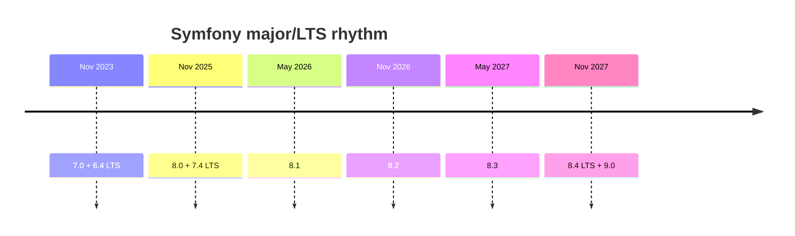

# Roadmap & Schedule

!!! abstract "Learning objectives"
    By the end of this chapter you can:

    - [ ] Recall the fixed May/November minor cadence and 2-year major cadence.
    - [ ] Lay out the Symfony 8.x timeline including the LTS.
    - [ ] Combine the schedule with maintenance windows to plan upgrades.

    **Syllabus:** `Symfony Architecture → Roadmap & Schedule` ·
    **Level:** Advanced ·
    **Est. time:** 15 min ·
    **Prerequisites:** [Release Management](release-management.md)

---

## Theory

Symfony's roadmap is **calendar-driven and public**: you always know the release
dates years ahead. A **minor** every **May and November**, a **major** and its
matching **LTS** every **two years**. This chapter turns the
[release-management rules](release-management.md) into a concrete 8.x timeline.

## Deep Dive — how it works internally

### The 8.x timeline

| Version | Released | Type |
|---|---|---|
| 8.0 | Nov 2025 | Standard (first of the major) |
| 8.1 | May 2026 | Standard |
| 8.2 | Nov 2026 | Standard |
| 8.3 | May 2027 | Standard |
| 8.4 | Nov 2027 | **LTS** (last of the major) |
| 9.0 | Nov 2027 | Next major (ships with 8.4) |

The pattern repeats for every major: `X.0` opens the cycle, four more minors ship
every six months, and `X.4` (the LTS) lands alongside `(X+1).0`.



### Reading the schedule with maintenance windows

Combine dates with the windows from [Release Management](release-management.md):

- A **standard** minor gets **8 months** of bug fixes and **14 months** of security
  fixes — so it is fully maintained until roughly the release *after* next.
- The **LTS** (`8.4`) gets **3 years** of bug fixes and **4 years** of security
  fixes, making it the target for long-lived apps.

Because minors are BC-safe, the practical upgrade advice is: **stay current** on the
8.x line (fixing [deprecations](deprecations.md) as they appear), or **pin to the
LTS** and jump majors deliberately.

!!! note "Source reference"
    Live dates and end-of-life bars —
    [symfony.com/releases](https://symfony.com/releases).

### Why publish so far ahead

Predictable dates let teams schedule upgrades, plan deprecation cleanup, and budget
for major migrations. It also caps risk: you always know how long your current
version stays supported before you must move.

## Configuration & code

=== "Console"

    ```console
    $ php bin/console about
    # Prints the running Symfony version plus its
    # "End of maintenance" and "End of life" dates.
    ```

=== "Constraint targeting the LTS"

    ```json
    {
      "require": {
        "symfony/framework-bundle": "8.4.*"
      }
    }
    ```

## Best practices & anti-patterns

| ✅ Do | ❌ Avoid |
|---|---|
| Plan upgrades around the May/Nov calendar | Discovering EOL after it happens |
| Target LTS for long-lived products | Sitting on an unmaintained standard minor |
| Clear deprecations before each major | Rushing the `8.x → 9.0` jump untested |

## When (not) to use it / alternatives

Everyone on Symfony is on this calendar. The only choice is *which* branch to
follow: latest standard (features early) vs LTS (stability). There is no separate
"slow" channel beyond the LTS.

!!! danger "Certification traps"
    - Minors: **May and November**. Majors + LTS: **every 2 years**.
    - `8.4` is the LTS and releases **at the same time** as `9.0` (Nov 2027).
    - The previous LTS at 8.0's release is `7.4`; `6.4` preceded it.

!!! warning "Common mistakes"
    - Thinking the LTS comes *before* the next major — it ships **together** with it.
    - Assuming `8.0` is long-term supported — the LTS is `8.4`.

## Exercises

1. **(Advanced)** List the Symfony 8.x versions with their release months.
2. **(Expert)** Your product must run 3+ years without a major upgrade. Which
   version do you target and why?

??? success "Solutions"

    **1.** 8.0 (Nov 2025), 8.1 (May 2026), 8.2 (Nov 2026), 8.3 (May 2027),
    8.4 LTS (Nov 2027).

    **2.** Target **8.4 (LTS)**: it provides 3 years of bug fixes and 4 years of
    security fixes, the longest support window in the 8.x line.

## Certification questions

??? question "Q1. In which months do Symfony minors ship?"
    - [x] A. May and November ✅
    - [ ] B. January and July
    - [ ] C. March and September

    **Why:** The cadence is fixed at May/November. **Ref:**
    [Symfony releases](https://symfony.com/releases).

??? question "Q2. When does 8.4 (LTS) release relative to 9.0?"
    - [x] A. At the same time (both Nov 2027) ✅
    - [ ] B. One year before 9.0
    - [ ] C. After 9.0

    **Why:** `X.4` and `(X+1).0` ship together. **Ref:**
    [Release process](https://symfony.com/doc/current/contributing/community/releases.html).

??? question "Q3. How often is a new major/LTS released?"
    - [x] A. Every 2 years ✅
    - [ ] B. Every 6 months
    - [ ] C. Every year

    **Why:** Majors (and their LTS) come every two years. **Ref:**
    [Symfony releases](https://symfony.com/releases).

## Key takeaways

- Minors: May & November; majors + LTS: every 2 years.
- 8.x: 8.0 → 8.4, with 8.4 the LTS shipping alongside 9.0 (Nov 2027).
- Combine dates with maintenance windows to plan upgrades.

## Last-minute revision

!!! tip "Cheat sheet"
    - 8.0 Nov'25 · 8.1 May'26 · 8.2 Nov'26 · 8.3 May'27 · 8.4 LTS Nov'27 (+9.0).
    - LTS = `X.4`, ships with `(X+1).0`.
    - `php bin/console about` shows EOL dates.

## Official References
- [Symfony releases & schedule](https://symfony.com/releases)
- [Release process](https://symfony.com/doc/current/contributing/community/releases.html)

---

<small>Related: [Release Management](release-management.md) · [BC Promise](bc-promise.md) · [Deprecations](deprecations.md)</small>
