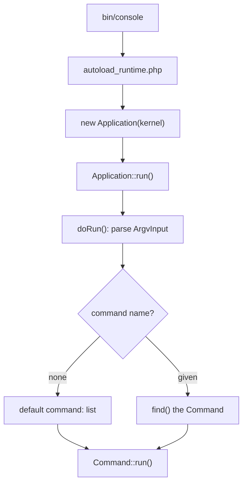

# Built-in Commands & the Application

!!! tip "In a nutshell"
    Chaque application Symfony embarque des commandes que vous n'avez jamais écrites :
    `list` (la commande par défaut), `help`, `about`, `completion`, plus `cache:clear`
    du FrameworkBundle et la famille `debug:*`. À retenir pour l'examen : la commande
    par défaut est `list` (pas `help`), et `make:*` vient du MakerBundle optionnel —
    pas du core.

!!! example "Real-world analogy"
    Un smartphone tout neuf exécute déjà des applications que vous n'avez jamais
    installées : le composeur, l'appareil photo et les réglages sont livrés avec le
    système d'exploitation lui-même, exactement comme `list`, `help`, `about` et la
    complétion existent dans chaque `Application` Console. D'autres applications
    préinstallées viennent de l'opérateur ou d'un ajout du constructeur — comme
    `cache:clear` et la famille `debug:*` qui arrivent avec le FrameworkBundle. Et un
    téléchargement depuis un app store, tel qu'un lecteur de codes-barres, est
    optionnel, exactement comme `make:*` du MakerBundle, qui ne fait pas du tout
    partie du téléphone de base.

!!! abstract "Learning objectives"
    À la fin de ce chapitre, vous saurez :

    - [ ] Utiliser les commandes toujours présentes : `list`, `help`, `about`, la complétion
    - [ ] Nommer les commandes du framework `cache:clear` et la famille `debug:*`
    - [ ] Expliquer comment `bin/console` démarre l'`Application` via le Runtime
    - [ ] Décrire comment les commandes sont découvertes et quelle est la commande par défaut

    **Syllabus:** `Console → Built-in commands` ·
    **Level:** Advanced ·
    **Est. time:** 20 min ·
    **Prerequisites:** [Dependency Injection](../dependency-injection/index.md)

---

## Pour les nuls

### L'idée en une phrase
Toute application Symfony vient déjà avec des commandes que tu n'as jamais écrites — `list`, `help`, `about`, et toute la famille `debug:*`.

### Imagine dans la vraie vie
Un smartphone tout neuf fait déjà tourner des applications que tu n'as jamais installées : le composeur, l'appareil photo et les réglages sont livrés avec le système d'exploitation lui-même, tout comme `list`, `help`, `about` existent dans chaque `Application` Console.

### Dans Symfony
`php bin/console` sans aucun argument affiche automatiquement la liste de toutes les commandes disponibles — c'est la commande `list`, exécutée par défaut, pas `help`.

### Exemple simple
```console
$ php bin/console about   # infos sur l'environnement, sans écrire de code
```

### Comment le mémoriser 🧠
`make:*` vient du **MakerBundle optionnel** — pas du cœur de Symfony. Ne jamais présumer qu'une commande `make:*` existe sur un projet sans ce bundle installé.

---


## Theory

Une **Application** est le conteneur qui détient et exécute les commandes. Le
composant Console fournit une poignée de commandes qui existent dans *chaque*
application :

| Commande | Rôle |
|---|---|
| `list` | Lister les commandes disponibles (la commande **par défaut**) |
| `help` | Afficher l'usage d'une commande |
| `about` | Afficher un résumé framework/PHP/environnement |
| `completion` | Émettre le script d'auto-complétion du shell |

Exécuter `php bin/console` **sans aucun argument** lance `list`. Exécuter
`php bin/console help cache:clear` lance `help` pour cette commande ; `--help`/`-h`
sur n'importe quelle commande fait la même chose.

```console
$ php bin/console                     # no arguments -> runs "list"
$ php bin/console help cache:clear    # runs "help" for cache:clear
$ php bin/console cache:clear --help  # same result via --help
$ php bin/console cache:clear -h      # same via the -h shortcut
```

Le **FrameworkBundle** ajoute des commandes applicatives. Celles qui comptent pour
l'examen :

| Commande | Rôle |
|---|---|
| `cache:clear` | Reconstruire le container/le cache dans `var/cache/<env>` |
| `cache:warmup` | Préchauffer les caches sans les vider |
| `debug:container` | Inspecter les services et paramètres |
| `debug:router` | Lister/inspecter les routes |
| `debug:autowiring` | Afficher les types autowirables |
| `debug:config` | Afficher la configuration fusionnée des bundles |
| `debug:event-dispatcher` | Lister les listeners par event |

!!! info "`make:*` is a bundle, not core"
    Les générateurs `make:controller`, `make:command`, … viennent du **MakerBundle**
    optionnel (`symfony/maker-bundle`), une dépendance de dev — ils ne font **pas**
    partie du composant Console ni du framework core. Ne les confondez pas avec les
    commandes built-in.

!!! question "Predict first"
    Vous exécutez `php bin/console` sans aucun argument. Quelle commande s'exécute —
    `help` ou `list` ?

??? note "Reveal"
    `list`. C'est la **commande par défaut** enregistrée de l'Application, donc un
    simple `bin/console` affiche les commandes disponibles. `help` ne s'exécute que
    quand vous le demandez (`help <cmd>` ou `<cmd> --help`).

## Deep Dive — how it works internally

`bin/console` est un point d'entrée minimal construit sur le composant **Runtime**.
Il requiert `vendor/autoload_runtime.php` et retourne une closure qui construit le
kernel et l'`Application` console. Le Runtime exécute cette closure et appelle
`Application::run()`.

```php
// bin/console (excerpt): the Runtime requires the autoloader, executes
// the returned closure, then calls Application::run() on the result
require_once dirname(__DIR__).'/vendor/autoload_runtime.php';

return static function (array $context): Application {
    // Build the kernel from the runtime context, then wrap it
    $kernel = new Kernel(
        $context['APP_ENV'],
        (bool) $context['APP_DEBUG'],
    );

    return new Application($kernel);
};
```

`Symfony\Bundle\FrameworkBundle\Console\Application` étend
`Symfony\Component\Console\Application`. Son constructeur prend le `KernelInterface` ;
à la première exécution, il **démarre le kernel**, puis enregistre chaque service
taggé `console.command` (voir les [custom commands](custom-commands.md)) ainsi que
les commandes propres à chaque bundle.

```php
use Symfony\Bundle\FrameworkBundle\Console\Application;

// The framework Application takes the KernelInterface in its constructor
$application = new Application($kernel);

// run() boots the kernel on first use, then registers every service
// tagged "console.command" plus each bundle's own commands
$exitCode = $application->run();
```

`Application::run()` enveloppe `doRun()` :



`find()` résout un nom (en acceptant les **abréviations non ambiguës**, p. ex.
`ca:cl` → `cache:clear`) via `Symfony\Component\Console\CommandLoader\CommandLoaderInterface`.
Enregistrer les commandes en lazy signifie que seule la commande *choisie* est
instanciée.

```php
// find() resolves full names and unambiguous abbreviations
$command = $application->find('ca:cl');   // -> the cache:clear Command
echo $command->getName();                  // "cache:clear"

// Lazy registration: a CommandLoaderInterface maps names to factories,
// so only the chosen command is instantiated
$application->setCommandLoader(new FactoryCommandLoader([
    'app:report' => static fn () => new ReportCommand(),
]));
```

!!! note "Source reference"
    `Symfony\Component\Console\Application::doRun()` gère les options globales
    (`--help`, `--version`, `-q`, `-v`) et la commande par défaut —
    [symfony/symfony `8.0`](https://github.com/symfony/symfony/blob/8.0/src/Symfony/Component/Console/Application.php).

### Global options every command inherits

`--help`/`-h`, `--quiet`/`-q`, `--verbose`/`-v|-vv|-vvv`, `--version`/`-V`,
`--ansi`/`--no-ansi`, `--no-interaction`/`-n`, et (côté framework) `--env`/`-e`
`--no-debug`. Elles vivent dans l'`InputDefinition` de l'Application, fusionnée dans
chaque commande — voir la [verbosity](verbosity.md).

```console
$ php bin/console cache:clear -h            # --help / -h
$ php bin/console list --quiet              # --quiet / -q
$ php bin/console app:sync -vv              # --verbose (-v | -vv | -vvv)
$ php bin/console --version                 # --version / -V
$ php bin/console app:sync --no-ansi -n     # disable colors + --no-interaction
$ php bin/console cache:clear --env=prod --no-debug   # framework-only options
```

## Configuration & code

=== "Console"

    ```console
    $ php bin/console                # runs "list" (default)
    $ php bin/console list debug     # list commands in the "debug" namespace
    $ php bin/console about
    $ php bin/console help cache:clear
    $ php bin/console cache:clear --env=prod
    $ php bin/console debug:router
    $ php bin/console ca:cl          # abbreviation -> cache:clear
    ```

=== "bin/console (PHP)"

    ```php
    #!/usr/bin/env php
    <?php

    declare(strict_types=1);

    use App\Kernel;
    use Symfony\Bundle\FrameworkBundle\Console\Application;

    require_once dirname(__DIR__).'/vendor/autoload_runtime.php';

    return static function (array $context): Application {
        $kernel = new Kernel($context['APP_ENV'], (bool) $context['APP_DEBUG']);

        return new Application($kernel);
    };
    ```

## Best practices & anti-patterns

| ✅ À faire | ❌ À éviter |
|---|---|
| Utiliser `debug:*` pour inspecter le container/les routes | Deviner les ids de services à la main |
| Vider le cache avec `cache:clear` (reconstruit le container) | Supprimer `var/cache` manuellement en prod |
| S'appuyer sur le `bin/console` basé sur le Runtime | Réécrire à la main le démarrage du kernel dans le script |
| Utiliser `about` pour confirmer env/version sur une machine | Supposer la version de Symfony déployée |

## When (not) to use it / alternatives

Les commandes built-in servent à *l'inspection et la maintenance*. Pour de la logique
applicative, écrivez une [custom command](custom-commands.md). N'appelez jamais
`cache:clear` depuis une request web — c'est une étape CLI/de déploiement.

!!! danger "Certification traps"
    - La commande **par défaut** est `list`, pas `help`.
    - `make:*` c'est le **MakerBundle**, pas le core — une question piège classique.
    - `debug:container` (inspecter) est distinct de `cache:clear` (reconstruire).
    - `bin/console` démarre via le composant **Runtime** et retourne une *closure*.

!!! warning "Common mistakes"
    - S'attendre à ce que `about` soit une commande du FrameworkBundle — c'est une
      commande **core** du composant Console.
    - Penser que les abréviations fonctionnent toujours — elles échouent si elles sont
      **ambiguës**.

## Exercises

1. **(Basic)** Listez toutes les commandes du namespace `debug`, puis affichez l'aide
   de `debug:router`.
2. **(Intermediate)** Expliquez, en partant de `bin/console`, la séquence exacte qui
   mène à l'appel de `Application::run()`.

??? success "Solutions"

    **1.**

    ```console
    $ php bin/console list debug
    $ php bin/console help debug:router   # or: debug:router --help
    ```

    **2.** `bin/console` requiert `vendor/autoload_runtime.php` ; le Runtime lit
    `$context` (APP_ENV/APP_DEBUG depuis l'environnement), invoque la closure
    retournée pour construire le `Kernel` et l'`Application`, puis appelle
    `Application::run()`, qui parse `ArgvInput` et délègue à une commande.

## Certification questions

??? question "Q1. Which command runs when you type `php bin/console` with no arguments?"
    - [ ] A. `help`
    - [x] B. `list` ✅
    - [ ] C. `about`
    - [ ] D. `debug:container`

    **Why:** `list` est la commande par défaut de l'Application. **Ref:**
    [Console](https://symfony.com/doc/8.0/console.html).

??? question "Q2. Which of these is NOT part of Symfony core / FrameworkBundle?"
    - [ ] A. `cache:clear`
    - [ ] B. `debug:router`
    - [x] C. `make:command` ✅
    - [ ] D. `about`

    **Why:** les commandes `make:*` viennent du MakerBundle optionnel. **Ref:**
    [MakerBundle](https://symfony.com/doc/8.0/bundles.html).

??? question "Q3. How does `bin/console` obtain the `Application` in Symfony 8?"
    - [ ] A. It calls `Application::create()` statically
    - [x] B. It returns a closure that the Runtime component executes ✅
    - [ ] C. It reads `services.yaml` directly
    - [ ] D. The web front controller instantiates it

    **Why:** le composant Runtime exécute la closure retournée par `bin/console`.
    **Ref:** [Runtime](https://symfony.com/doc/8.0/components/runtime.html).

??? question "Q4. What does `php bin/console ca:cl` do when unambiguous?"
    - [x] A. Runs `cache:clear` via name abbreviation ✅
    - [ ] B. Fails — abbreviations are unsupported
    - [ ] C. Lists commands starting with `ca`
    - [ ] D. Clears only the `cl` namespace

    **Why:** `find()` résout les abréviations non ambiguës. **Ref:**
    [Console](https://symfony.com/doc/8.0/console.html).

## Key takeaways

- `list` (par défaut), `help`, `about`, `completion` existent dans chaque application.
- Le FrameworkBundle ajoute `cache:clear`, `cache:warmup`, `debug:*`.
- `make:*` c'est le **MakerBundle**, pas le core.
- `bin/console` démarre le kernel et l'`Application` via le composant Runtime.

## Last-minute revision

!!! tip "Cheat sheet"
    - Commande par défaut = `list`. Aide = `help <cmd>` ou `<cmd> --help`.
    - Core : `list`, `help`, `about`, `completion`.
    - Framework : `cache:clear`, `cache:warmup`, `debug:container|router|autowiring|config|event-dispatcher`.
    - `Application` = `Symfony\Component\Console\Application` ; la sous-classe du framework démarre le kernel.

## Connections

- **Depends on:** [Dependency Injection](../dependency-injection/index.md) —
  l'Application démarre le kernel/container pour découvrir les services
  `console.command`.
- **Reused in:** [Custom commands](custom-commands.md) — vos commandes rejoignent
  cette même Application et `list`.
- **Confused with:** [Configuration](configuration.md) — inspecter les commandes
  existantes vs déclarer vos propres métadonnées.

## Official References
- [Official Symfony docs — Console](https://symfony.com/doc/8.0/console.html)
- [Official Symfony docs — Runtime](https://symfony.com/doc/8.0/components/runtime.html)
- [Symfony source — Application](https://github.com/symfony/symfony/blob/8.0/src/Symfony/Component/Console/Application.php)

## Video references

!!! tip "Watch & learn"
    Ce sont des chaînes vidéo officielles, mises à jour en continu — cherchez-y
    « Symfony console » pour consolider ce chapitre. Nous lions des chaînes stables
    plutôt que des vidéos individuelles pour que les références ne périment jamais.

    - [SymfonyCasts screencasts](https://symfonycasts.com/tracks/symfony) — tutoriels scénarisés à suivre en codant.
    - [Symfony official YouTube](https://www.youtube.com/@SymfonyOfficial) — conférences et keynotes SymfonyCon.
    - [Official docs for this topic](https://symfony.com/doc/8.0/console.html) — certaines pages de la doc Symfony intègrent un screencast.

## Confidence check

Je suis prêt quand je peux :

- [ ] expliquer **pourquoi** l'Application embarque des commandes core et ce que `list`/`about` résolvent
- [ ] utiliser `debug:*`, `cache:clear`, `help` et la complétion dans Symfony 8
- [ ] déboguer un nom de commande erroné/ambigu (résolution des abréviations)
- [ ] repérer le piège : `make:*` c'est le MakerBundle, pas le core, et la commande par défaut est `list`
- [ ] expliquer comment `bin/console` démarre l'Application via le composant Runtime

---

<small>Related: [Custom commands](custom-commands.md) · [Configuration](configuration.md) · [Verbosity](verbosity.md)</small>
