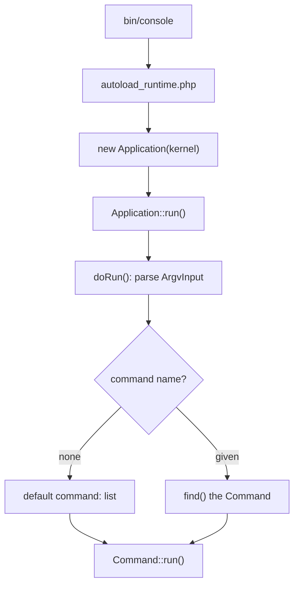

# Built-in Commands & the Application

!!! tip "In a nutshell"
    Every Symfony app ships commands you never wrote: `list` (the default), `help`,
    `about`, `completion`, plus FrameworkBundle's `cache:clear` and the `debug:*`
    family. Remember for the exam: the default command is `list` (not `help`), and
    `make:*` comes from the optional MakerBundle — not core.

!!! example "Real-world analogy"
    A brand-new smartphone already runs apps you never installed: the dialer, camera and
    settings ship with the operating system itself, just as `list`, `help`, `about` and
    completion exist in every Console `Application`. Other pre-loaded apps come from the
    carrier or manufacturer add-on — like `cache:clear` and the `debug:*` family arriving
    with FrameworkBundle. And an app-store download such as a barcode scanner is optional,
    exactly like `make:*` from MakerBundle, which isn't part of the core phone at all.

!!! abstract "Learning objectives"
    By the end of this chapter you can:

    - [ ] Use the always-present commands: `list`, `help`, `about`, completion
    - [ ] Name the framework commands `cache:clear` and the `debug:*` family
    - [ ] Explain how `bin/console` boots the `Application` via the Runtime
    - [ ] Describe how commands are discovered and the default command

    **Syllabus:** `Console → Built-in commands` ·
    **Level:** Advanced ·
    **Est. time:** 20 min ·
    **Prerequisites:** [Dependency Injection](../dependency-injection/index.md)

---

## Theory

An **Application** is the container that holds and runs commands. The Console
component ships a handful of commands that exist in *every* application:

| Command | Purpose |
|---|---|
| `list` | List available commands (the **default** command) |
| `help` | Show usage for one command |
| `about` | Show framework/PHP/environment summary |
| `completion` | Emit shell auto-completion script |

Running `php bin/console` with **no arguments** runs `list`. Running
`php bin/console help cache:clear` runs `help` for that command; `--help`/`-h` on
any command does the same.

The **FrameworkBundle** adds application commands. The exam-relevant ones:

| Command | Purpose |
|---|---|
| `cache:clear` | Rebuild the container/cache in `var/cache/<env>` |
| `cache:warmup` | Warm caches without clearing |
| `debug:container` | Inspect services and parameters |
| `debug:router` | List/inspect routes |
| `debug:autowiring` | Show autowirable types |
| `debug:config` | Dump merged bundle configuration |
| `debug:event-dispatcher` | List listeners per event |

!!! info "`make:*` is a bundle, not core"
    The `make:controller`, `make:command`, … generators come from the optional
    **MakerBundle** (`symfony/maker-bundle`), a dev dependency — they are **not**
    part of the Console component or the core framework. Do not confuse them with
    built-in commands.

!!! question "Predict first"
    You run `php bin/console` with no arguments at all. Which command executes —
    `help` or `list`?

??? note "Reveal"
    `list`. It is the Application's registered **default command**, so a bare
    `bin/console` prints the available commands. `help` only runs when you ask for
    it (`help <cmd>` or `<cmd> --help`).

## Deep Dive — how it works internally

`bin/console` is a thin entry point built on the **Runtime** component. It requires
`vendor/autoload_runtime.php` and returns a closure that builds the kernel and the
console `Application`. The Runtime executes that closure and calls
`Application::run()`.

`Symfony\Bundle\FrameworkBundle\Console\Application` extends
`Symfony\Component\Console\Application`. Its constructor takes the `KernelInterface`;
on the first run it **boots the kernel**, then registers every service tagged
`console.command` (see [custom commands](custom-commands.md)) plus each bundle's
own commands.

`Application::run()` wraps `doRun()`:



`find()` resolves a name (supporting **unambiguous abbreviations**, e.g.
`ca:cl` → `cache:clear`) using `Symfony\Component\Console\CommandLoader\CommandLoaderInterface`.
Registering commands lazily means only the *chosen* command is instantiated.

!!! note "Source reference"
    `Symfony\Component\Console\Application::doRun()` handles global options
    (`--help`, `--version`, `-q`, `-v`) and default command —
    [symfony/symfony `8.0`](https://github.com/symfony/symfony/blob/8.0/src/Symfony/Component/Console/Application.php).

### Global options every command inherits

`--help`/`-h`, `--quiet`/`-q`, `--verbose`/`-v|-vv|-vvv`, `--version`/`-V`,
`--ansi`/`--no-ansi`, `--no-interaction`/`-n`, and (framework) `--env`/`-e`
`--no-debug`. They live in the Application's `InputDefinition`, merged into every
command — see [verbosity](verbosity.md).

## Configuration & code

=== "Console"

    ```console
    $ php bin/console                # runs "list" (default)
    $ php bin/console list debug     # list commands in the "debug" namespace
    $ php bin/console about
    $ php bin/console help cache:clear
    $ php bin/console cache:clear --env=prod
    $ php bin/console debug:router
    $ php bin/console ca:cl          # abbreviation -> cache:clear
    ```

=== "bin/console (PHP)"

    ```php
    #!/usr/bin/env php
    <?php

    declare(strict_types=1);

    use App\Kernel;
    use Symfony\Bundle\FrameworkBundle\Console\Application;

    require_once dirname(__DIR__).'/vendor/autoload_runtime.php';

    return static function (array $context): Application {
        $kernel = new Kernel($context['APP_ENV'], (bool) $context['APP_DEBUG']);

        return new Application($kernel);
    };
    ```

## Best practices & anti-patterns

| ✅ Do | ❌ Avoid |
|---|---|
| Use `debug:*` to inspect the container/routes | Guessing service ids by hand |
| Clear cache with `cache:clear` (rebuilds container) | Deleting `var/cache` manually in prod |
| Rely on the Runtime-based `bin/console` | Hand-rolling kernel boot in the script |
| Use `about` to confirm env/version on a box | Assuming the deployed Symfony version |

## When (not) to use it / alternatives

Built-in commands are for *inspection and maintenance*. For application logic write
a [custom command](custom-commands.md). Never call `cache:clear` from within a web
request — it is a CLI/deploy step.

!!! danger "Certification traps"
    - The **default** command is `list`, not `help`.
    - `make:*` is **MakerBundle**, not core — a classic trick question.
    - `debug:container` (inspect) is distinct from `cache:clear` (rebuild).
    - `bin/console` boots via the **Runtime** component and returns a *closure*.

!!! warning "Common mistakes"
    - Expecting `about` to be a FrameworkBundle command — it is a **core** Console
      command.
    - Thinking abbreviations always work — they fail if **ambiguous**.

## Exercises

1. **(Basic)** List every command in the `debug` namespace, then show help for
   `debug:router`.
2. **(Intermediate)** Explain, from `bin/console`, the exact sequence that leads to
   `Application::run()` being called.

??? success "Solutions"

    **1.**

    ```console
    $ php bin/console list debug
    $ php bin/console help debug:router   # or: debug:router --help
    ```

    **2.** `bin/console` requires `vendor/autoload_runtime.php`; the Runtime
    reads `$context` (APP_ENV/APP_DEBUG from the environment), invokes the returned
    closure to build the `Kernel` and `Application`, then calls
    `Application::run()`, which parses `ArgvInput` and dispatches to a command.

## Certification questions

??? question "Q1. Which command runs when you type `php bin/console` with no arguments?"
    - [ ] A. `help`
    - [x] B. `list` ✅
    - [ ] C. `about`
    - [ ] D. `debug:container`

    **Why:** `list` is the Application's default command. **Ref:**
    [Console](https://symfony.com/doc/current/console.html).

??? question "Q2. Which of these is NOT part of Symfony core / FrameworkBundle?"
    - [ ] A. `cache:clear`
    - [ ] B. `debug:router`
    - [x] C. `make:command` ✅
    - [ ] D. `about`

    **Why:** `make:*` commands come from the optional MakerBundle. **Ref:**
    [MakerBundle](https://symfony.com/doc/current/bundles/SymfonyMakerBundle/index.html).

??? question "Q3. How does `bin/console` obtain the `Application` in Symfony 8?"
    - [ ] A. It calls `Application::create()` statically
    - [x] B. It returns a closure that the Runtime component executes ✅
    - [ ] C. It reads `services.yaml` directly
    - [ ] D. The web front controller instantiates it

    **Why:** the Runtime component runs the closure returned by `bin/console`.
    **Ref:** [Runtime](https://symfony.com/doc/current/components/runtime.html).

??? question "Q4. What does `php bin/console ca:cl` do when unambiguous?"
    - [x] A. Runs `cache:clear` via name abbreviation ✅
    - [ ] B. Fails — abbreviations are unsupported
    - [ ] C. Lists commands starting with `ca`
    - [ ] D. Clears only the `cl` namespace

    **Why:** `find()` resolves unambiguous abbreviations. **Ref:**
    [Console](https://symfony.com/doc/current/console.html).

## Key takeaways

- `list` (default), `help`, `about`, `completion` exist in every application.
- FrameworkBundle adds `cache:clear`, `cache:warmup`, `debug:*`.
- `make:*` is the **MakerBundle**, not core.
- `bin/console` boots the kernel and `Application` through the Runtime component.

## Last-minute revision

!!! tip "Cheat sheet"
    - Default command = `list`. Help = `help <cmd>` or `<cmd> --help`.
    - Core: `list`, `help`, `about`, `completion`.
    - Framework: `cache:clear`, `cache:warmup`, `debug:container|router|autowiring|config|event-dispatcher`.
    - `Application` = `Symfony\Component\Console\Application`; framework subclass boots the kernel.

## Connections

- **Depends on:** [Dependency Injection](../dependency-injection/index.md) — the
  Application boots the kernel/container to discover `console.command` services.
- **Reused in:** [Custom commands](custom-commands.md) — your commands join this same
  Application and `list`.
- **Confused with:** [Configuration](configuration.md) — inspecting existing commands
  vs. declaring your own metadata.

## Official References
- [Official Symfony docs — Console](https://symfony.com/doc/current/console.html)
- [Official Symfony docs — Runtime](https://symfony.com/doc/current/components/runtime.html)
- [Symfony source — Application](https://github.com/symfony/symfony/blob/8.0/src/Symfony/Component/Console/Application.php)

## Confidence check

I'm ready when I can:

- [ ] explain **why** the Application ships core commands and what `list`/`about` solve
- [ ] use `debug:*`, `cache:clear`, `help` and completion in Symfony 8
- [ ] debug a wrong/ambiguous command name (abbreviation resolution)
- [ ] spot the trick that `make:*` is MakerBundle, not core, and the default is `list`
- [ ] explain how `bin/console` boots the Application via the Runtime component

---

<small>Related: [Custom commands](custom-commands.md) · [Configuration](configuration.md) · [Verbosity](verbosity.md)</small>
