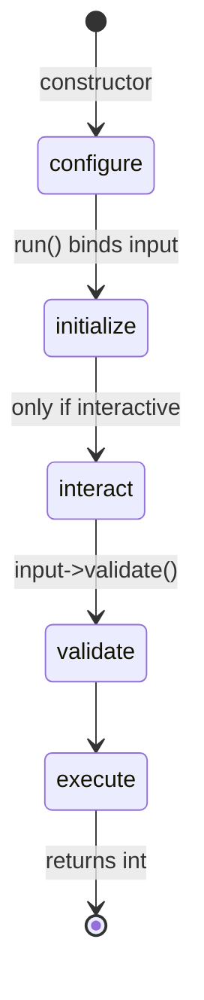

# Command Configuration

!!! tip "In a nutshell"
    Les métadonnées d'une commande (nom, description, alias, hidden, aide) se
    déclarent avec l'attribut `#[AsCommand]` ou la méthode `configure()`. À retenir
    pour l'examen : le cycle de vie s'exécute configure → initialize → interact →
    execute, et le nom doit figurer dans l'attribut pour que les commandes se
    chargent en lazy.

!!! example "Real-world analogy"
    Pensez à la fiche de catalogue d'un livre en bibliothèque : elle enregistre le
    titre (nom), un court résumé (description), les titres alternatifs sous lesquels
    il est aussi classé (alias), un synopsis détaillé (aide), et si le livre est en
    libre accès ou conservé en réserve (hidden) — le tout sans toucher au livre
    lui-même. Comme la fiche porte le titre en évidence, le bibliothécaire peut
    trouver et référencer le livre sans jamais le sortir du rayon, ce qui est
    exactement la façon dont un nom déclaré par attribut permet à une commande de se
    charger en lazy.

!!! abstract "Learning objectives"
    À la fin de ce chapitre, vous saurez :

    - [ ] Définir le nom, la description, l'aide, les alias et l'état hidden d'une commande
    - [ ] Choisir entre l'attribut `#[AsCommand]` et `configure()`
    - [ ] Expliquer le cycle de vie complet d'une commande et son ordre
    - [ ] Décrire pourquoi les noms déclarés par attribut permettent le chargement lazy

    **Syllabus:** `Console → Configuration` ·
    **Level:** Advanced ·
    **Est. time:** 25 min ·
    **Prerequisites:** [Custom commands](custom-commands.md)

---

## Theory

Les *métadonnées* d'une commande sont ce que l'Application utilise pour la lister,
la trouver et la documenter :

| Propriété | Définie via | Rôle |
|---|---|---|
| `name` | `#[AsCommand(name:)]` | Identifiant unique, p. ex. `app:report` |
| `description` | attribut / `setDescription()` | Résumé d'une ligne dans `list` |
| `help` | attribut / `setHelp()` | Texte long dans `help <cmd>` |
| `aliases` | attribut / `setAliases()` | Noms alternatifs |
| `hidden` | attribut / `setHidden()` | Masquer de `list` (toujours exécutable) |

Deux endroits peuvent configurer une commande :

- **L'attribut `#[AsCommand]`** — déclaratif ; peut définir le nom, la description,
  les alias, hidden et l'aide. Lu à la compilation.
- **La méthode `configure()`** (style classique) — impérative ; le seul endroit où
  ajouter des **arguments et options** dans le style classique, et où vous pouvez
  appeler `setHelp()`, `setAliases()`, etc.

```php
#[AsCommand(name: 'app:report', description: 'Generates the report')] // declarative, compile time
final class ReportCommand extends Command
{
    protected function configure(): void            // imperative, classic style
    {
        $this
            ->addArgument('period', InputArgument::REQUIRED)  // args/options: classic style only
            ->setHelp('Shown by "help app:report".')          // setHelp()
            ->setAliases(['app:rep']);                        // setAliases()
    }
}
```

!!! question "Predict first"
    Dans quel ordre `configure()`, `initialize()`, `interact()` et `execute()`
    s'exécutent-elles — et laquelle a déjà eu lieu avant que le moindre input
    n'existe ?

??? note "Reveal"
    Ordre : **configure → initialize → interact → execute** (avec `input->validate()`
    entre les deux dernières). `configure()` s'exécute dans le **constructeur**,
    avant que l'input ne soit lié : elle ne peut donc que déclarer la structure —
    jamais lire les arguments.

## Deep Dive — how it works internally

`configure()` est appelée depuis le **constructeur** de `Command`, elle s'exécute
donc dès qu'une commande est instanciée — *avant* que le moindre input n'existe.
C'est pourquoi elle ne peut que déclarer la *structure* (nom, définition, aide),
jamais toucher l'input/output.

```php
// configure() is invoked by the Command constructor - no input exists yet
protected function configure(): void
{
    $this->setDescription('Structure only: name, definition, help');
    // Never read input here: $input->getArgument() is impossible, nothing is bound
}
```

Le chemin d'exécution est le **cycle de vie de la commande**, orchestré par
`Symfony\Component\Console\Command\Command::run()` :



Ordre des méthodes que vous pouvez surcharger :

1. **`configure()`** — dans le constructeur ; déclarer nom/définition/aide.
2. **`initialize(InputInterface, OutputInterface)`** — après la liaison de l'input ;
   mettre en place l'état partagé (services, valeurs par défaut). S'exécute *avant*
   l'interaction.
3. **`interact(InputInterface, OutputInterface)`** — uniquement quand l'input
   `isInteractive()` ; demander les valeurs manquantes.
4. **validation** — `$input->validate()` vérifie que les arguments requis sont
   présents.
5. **`execute(InputInterface, OutputInterface): int`** — le vrai travail.

```php
protected function initialize(InputInterface $input, OutputInterface $output): void
{
    $this->io = new SymfonyStyle($input, $output);   // shared setup, input is bound
}

protected function interact(InputInterface $input, OutputInterface $output): void
{
    // runs only when $input->isInteractive() (skipped with -n)
    if (null === $input->getArgument('name')) {
        $input->setArgument('name', $this->io->ask('Name?'));
    }
}

protected function execute(InputInterface $input, OutputInterface $output): int
{
    // $input->validate() has already checked required arguments
    return Command::SUCCESS;
}
```

### Lazy loading

Parce que `#[AsCommand]` expose le **nom (et les alias) sans instancier** la classe,
le `ContainerCommandLoader` peut enregistrer simplement `name → service id`. L'objet
de la commande n'est créé que lorsque ce nom est invoqué. Définir le nom *uniquement*
dans `configure()` (via `setName()`) casserait le chargement lazy, car l'Application
devrait instancier chaque commande pour connaître son nom. En Symfony 8, vous placez
donc le **nom dans l'attribut**.

```php
// The attribute exposes the name without instantiating the class
#[AsCommand(name: 'app:report')]
final class ReportCommand extends Command { /* ... */ }

// The ContainerCommandLoader maps "name => service id"; instantiation is on demand
$application->setCommandLoader(
    new ContainerCommandLoader($container, ['app:report' => ReportCommand::class])
);

// Anti-pattern: setName() inside configure() forces instantiating every command
```

!!! note "Source reference"
    `Command::run()` ordonne `initialize → interact → validate → execute` —
    [symfony/symfony `8.0`](https://github.com/symfony/symfony/blob/8.0/src/Symfony/Component/Console/Command/Command.php).

## Configuration & code

=== "Attribute (preferred)"

    ```php
    <?php
    declare(strict_types=1);

    namespace App\Command;

    use Symfony\Component\Console\Attribute\AsCommand;
    use Symfony\Component\Console\Command\Command;
    use Symfony\Component\Console\Style\SymfonyStyle;

    #[AsCommand(
        name: 'app:report:generate',
        description: 'Generates the nightly report',
        aliases: ['app:report'],
        hidden: false,
        help: 'Builds the report and stores it in var/reports.',
    )]
    final class GenerateReportCommand
    {
        public function __invoke(SymfonyStyle $io): int
        {
            $io->success('Report generated.');

            return Command::SUCCESS;
        }
    }
    ```

=== "configure() (classic)"

    ```php
    <?php
    declare(strict_types=1);

    namespace App\Command;

    use Symfony\Component\Console\Attribute\AsCommand;
    use Symfony\Component\Console\Command\Command;
    use Symfony\Component\Console\Input\InputInterface;
    use Symfony\Component\Console\Output\OutputInterface;

    #[AsCommand(name: 'app:report:generate')]
    final class GenerateReportCommand extends Command
    {
        protected function configure(): void
        {
            $this
                ->setDescription('Generates the nightly report')
                ->setHelp('Builds the report and stores it in var/reports.')
                ->setAliases(['app:report'])
                ->setHidden(false);
        }

        protected function execute(InputInterface $input, OutputInterface $output): int
        {
            return Command::SUCCESS;
        }
    }
    ```

=== "Console"

    ```console
    $ php bin/console app:report          # alias works
    $ php bin/console help app:report:generate
    $ php bin/console list                # hidden:true commands are omitted here
    ```

## Best practices & anti-patterns

| ✅ À faire | ❌ À éviter |
|---|---|
| Mettre le **nom** dans `#[AsCommand]` | `setName()` uniquement dans `configure()` |
| Utiliser `initialize()` pour le setup partagé | Lire l'input dans `configure()` |
| Réserver `interact()` aux seules questions | Faire le vrai travail dans `interact()` |
| Donner une `description` claire pour `list` | Descriptions vides/dupliquées |

## When (not) to use it / alternatives

Utilisez `configure()` quand vous avez besoin d'arguments/options dans le style
classique ou d'une aide dynamique. Pour tout ce qui relève des métadonnées en
Symfony 8, préférez l'attribut — il garde les noms découvrables pour le chargement
lazy. `initialize()` est optionnelle ; sautez-la s'il n'y a rien à partager entre
`interact()` et `execute()`.

!!! danger "Certification traps"
    - L'ordre du cycle de vie est **configure → initialize → interact → execute**
      (avec la validation entre interact et execute).
    - `interact()` ne s'exécute **que** si l'input est interactif
      (`-n`/`--no-interaction` la saute).
    - `configure()` s'exécute dans le **constructeur**, avant que l'input n'existe.
    - Définir le nom uniquement dans `configure()` casse le **chargement lazy**.

!!! warning "Common mistakes"
    - Essayer de lire les arguments dans `configure()` — ils ne sont pas encore liés.
    - Supposer que les commandes `hidden` ne peuvent pas être exécutées — elles le
      peuvent, elles ne sont simplement pas listées.

## Exercises

1. **(Basic)** Donnez deux alias à une commande et marquez-la hidden ; vérifiez
   qu'elle est absente de `list` mais toujours exécutable via un alias.
2. **(Intermediate)** Ajoutez une `initialize()` qui charge un service dans une
   propriété et une `interact()` qui demande un argument manquant.

??? success "Solutions"

    **1.** Utilisez `#[AsCommand(name: 'app:x', aliases: ['a:x', 'x'], hidden: true)]`.
    `php bin/console list` l'omet ; `php bin/console x` l'exécute toujours.

    **2.**

    ```php
    protected function initialize(InputInterface $input, OutputInterface $output): void
    {
        $this->io = new SymfonyStyle($input, $output);
    }

    protected function interact(InputInterface $input, OutputInterface $output): void
    {
        if (null === $input->getArgument('name')) {
            $input->setArgument('name', $this->io->ask('Name?'));
        }
    }
    ```

## Certification questions

??? question "Q1. What is the correct command lifecycle order?"
    - [ ] A. initialize → configure → execute → interact
    - [x] B. configure → initialize → interact → execute ✅
    - [ ] C. configure → interact → initialize → execute
    - [ ] D. execute → configure → initialize → interact

    **Why:** `configure()` s'exécute dans le constructeur ; puis `run()` appelle
    `initialize`, `interact` et `execute`. **Ref:**
    [Console](https://symfony.com/doc/current/console.html).

??? question "Q2. When is `interact()` called?"
    - [x] A. Only when the input is interactive ✅
    - [ ] B. Always, before `initialize()`
    - [ ] C. Only when `--no-interaction` is passed
    - [ ] D. After `execute()`

    **Why:** elle est sautée pour un input non interactif (`-n`). **Ref:**
    [Console](https://symfony.com/doc/current/console.html).

??? question "Q3. Why put the command name in `#[AsCommand]` rather than `configure()`?"
    - [x] A. It lets the loader know the name without instantiating (lazy loading) ✅
    - [ ] B. `configure()` cannot set a name at all
    - [ ] C. Attributes run faster at runtime
    - [ ] D. It is required for `execute()` to run

    **Why:** l'attribut expose le nom à la compilation pour le
    `ContainerCommandLoader`. **Ref:**
    [Commands as services](https://symfony.com/doc/current/console/commands_as_services.html).

??? question "Q4. A command marked `hidden: true`…"
    - [x] A. Does not appear in `list` but can still be executed ✅
    - [ ] B. Cannot be executed at all
    - [ ] C. Is removed from the container
    - [ ] D. Only runs in the `dev` environment

    **Why:** `hidden` n'affecte que le listing. **Ref:**
    [Console](https://symfony.com/doc/current/console.html).

## Key takeaways

- Métadonnées : nom, description, aide, alias, hidden — définies via attribut ou
  setters.
- Cycle de vie : **configure → initialize → interact → execute** (validation entre
  les deux dernières).
- `configure()` s'exécute dans le constructeur — pas encore d'input.
- Le nom doit vivre dans `#[AsCommand]` pour garder le chargement lazy.

## Last-minute revision

!!! tip "Cheat sheet"
    - `configure()` = structure au moment du constructeur, rien d'autre.
    - `initialize()` = setup partagé après la liaison de l'input.
    - `interact()` = demander les valeurs manquantes, en interactif uniquement.
    - `execute()` = retourne un `int`.
    - `hidden` masque de `list`, toujours exécutable.

## Connections

- **Depends on:** [Custom commands](custom-commands.md) — la commande que vous
  configurez y est enregistrée.
- **Reused in:** [Events](events.md) — les events console enveloppent le même cycle
  de vie que vous exploitez via `initialize`/`interact`/`execute`.
- **Confused with:** [Arguments & options](options-arguments.md) — `configure()` les
  déclare aussi, mais les métadonnées (nom/aide) ne sont pas la définition de
  l'input.

## Official References
- [Official Symfony docs — Console](https://symfony.com/doc/current/console.html)
- [Official Symfony docs — Commands as services (lazy)](https://symfony.com/doc/current/console/commands_as_services.html)
- [Symfony source — Command](https://github.com/symfony/symfony/blob/8.0/src/Symfony/Component/Console/Command/Command.php)

## Video references

!!! tip "Watch & learn"
    Ce sont des chaînes vidéo officielles, mises à jour en continu — cherchez-y
    « Symfony console » pour consolider ce chapitre. Nous lions des chaînes stables
    plutôt que des vidéos individuelles pour que les références ne périment jamais.

    - [SymfonyCasts screencasts](https://symfonycasts.com/tracks/symfony) — tutoriels scénarisés à suivre en codant.
    - [Symfony official YouTube](https://www.youtube.com/@SymfonyOfficial) — conférences et keynotes SymfonyCon.
    - [Official docs for this topic](https://symfony.com/doc/current/console.html) — certaines pages de la doc Symfony intègrent un screencast.

## Confidence check

Je suis prêt quand je peux :

- [ ] expliquer **pourquoi** le nom vit dans `#[AsCommand]` (chargement lazy) et ce que cela résout
- [ ] définir name/description/help/aliases/hidden via attribut ou `configure()` dans Symfony 8
- [ ] déboguer une commande dont les arguments semblent « manquants » dans `configure()`
- [ ] repérer le piège sur l'ordre du cycle de vie et quand `interact()` est sautée (`-n`)
- [ ] expliquer pourquoi `configure()` s'exécute dans le constructeur, avant la liaison de l'input

---

<small>Related: [Custom commands](custom-commands.md) · [Arguments & options](options-arguments.md) · [Events](events.md)</small>
