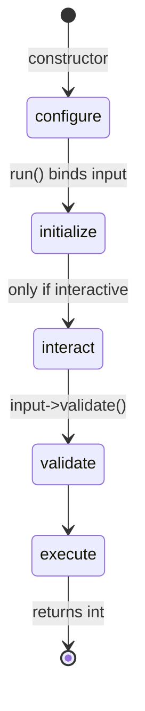

# Command Configuration

!!! tip "In a nutshell"
    A command's metadata (name, description, aliases, hidden, help) is declared with
    the `#[AsCommand]` attribute or the `configure()` method. Remember for the exam:
    the lifecycle runs configure → initialize → interact → execute, and the name
    belongs in the attribute so commands load lazily.

!!! example "Real-world analogy"
    Think of a library's catalogue card for a book: it records the title (name), a short
    blurb (description), alternate titles it's also shelved under (aliases), a long
    synopsis (help), and whether the book is on open display or kept in the closed stacks
    (hidden) — all without touching the book itself. Because the card carries the title up
    front, the librarian can find and list the book without ever pulling it off the shelf,
    which is exactly how an attribute-declared name lets a command load lazily.

!!! abstract "Learning objectives"
    By the end of this chapter you can:

    - [ ] Set name, description, help, aliases and hidden state on a command
    - [ ] Choose between the `#[AsCommand]` attribute and `configure()`
    - [ ] Explain the full command lifecycle and its ordering
    - [ ] Describe why attribute-based names enable lazy loading

    **Syllabus:** `Console → Configuration` ·
    **Level:** Advanced ·
    **Est. time:** 25 min ·
    **Prerequisites:** [Custom commands](custom-commands.md)

---

## Theory

A command's *metadata* is what the Application uses to list, find and document it:

| Property | Set via | Purpose |
|---|---|---|
| `name` | `#[AsCommand(name:)]` | Unique id, e.g. `app:report` |
| `description` | attribute / `setDescription()` | One-line summary in `list` |
| `help` | attribute / `setHelp()` | Long text in `help <cmd>` |
| `aliases` | attribute / `setAliases()` | Alternative names |
| `hidden` | attribute / `setHidden()` | Hide from `list` (still runnable) |

Two places can configure a command:

- **`#[AsCommand]` attribute** — declarative; can set name, description, aliases,
  hidden and help. Read at compile time.
- **`configure()` method** (classic style) — imperative; the only place to add
  **arguments and options** in the classic style, and where you can call
  `setHelp()`, `setAliases()`, etc.

```php
// Declarative metadata, read at compile time
#[AsCommand(name: 'app:report', description: 'Generates the report')]
final class ReportCommand extends Command
{
    protected function configure(): void            // imperative, classic style
    {
        $this
            // args/options can only be added in classic style
            ->addArgument('period', InputArgument::REQUIRED)
            ->setHelp('Shown by "help app:report".')
            ->setAliases(['app:rep']);
    }
}
```

!!! question "Predict first"
    In what order do `configure()`, `initialize()`, `interact()` and `execute()`
    run — and which one has already happened before any input exists?

??? note "Reveal"
    Order: **configure → initialize → interact → execute** (with `input->validate()`
    between the last two). `configure()` runs in the **constructor**, before input is
    bound, so it may only declare structure — never read arguments.

## Deep Dive — how it works internally

`configure()` is called from the `Command` **constructor**, so it runs the moment a
command is instantiated — *before* any input exists. That is why it may only
declare *structure* (name, definition, help), never touch input/output.

```php
// configure() is invoked by the Command constructor - no input exists yet
protected function configure(): void
{
    $this->setDescription('Structure only: name, definition, help');
    // Never read input here: nothing is bound yet, so
    // $input->getArgument() is impossible
}
```

The runtime path is the **command lifecycle**, executed by
`Symfony\Component\Console\Command\Command::run()`:



Order of methods you can override:

1. **`configure()`** — in the constructor; declare name/definition/help.
2. **`initialize(InputInterface, OutputInterface)`** — after input is bound; set up
   shared state (services, defaults). Runs *before* interaction.
3. **`interact(InputInterface, OutputInterface)`** — only when input
   `isInteractive()`; prompt for missing values.
4. **validation** — `$input->validate()` checks required arguments are present.
5. **`execute(InputInterface, OutputInterface): int`** — the actual work.

```php
protected function initialize(
    InputInterface $input,
    OutputInterface $output,
): void {
    // Shared setup: input is already bound at this point
    $this->io = new SymfonyStyle($input, $output);
}

protected function interact(
    InputInterface $input,
    OutputInterface $output,
): void {
    // runs only when $input->isInteractive() (skipped with -n)
    if (null === $input->getArgument('name')) {
        $input->setArgument('name', $this->io->ask('Name?'));
    }
}

protected function execute(InputInterface $input, OutputInterface $output): int
{
    // $input->validate() has already checked required arguments
    return Command::SUCCESS;
}
```

### Lazy loading

Because `#[AsCommand]` exposes the **name (and aliases) without instantiating** the
class, the `ContainerCommandLoader` can register just `name → service id`. The
command object is created only when that name is invoked. Defining the name *only*
inside `configure()` (via `setName()`) would defeat lazy loading, because the
Application would have to instantiate every command to learn its name. In Symfony 8
you therefore put the **name in the attribute**.

```php
// The attribute exposes the name without instantiating the class
#[AsCommand(name: 'app:report')]
final class ReportCommand extends Command { /* ... */ }

// ContainerCommandLoader maps "name => service id";
// the command object is instantiated on demand
$application->setCommandLoader(new ContainerCommandLoader(
    $container,
    ['app:report' => ReportCommand::class],
));

// Anti-pattern: setName() inside configure() forces instantiating every command
```

!!! note "Source reference"
    `Command::run()` orders `initialize → interact → validate → execute` —
    [symfony/symfony `8.0`](https://github.com/symfony/symfony/blob/8.0/src/Symfony/Component/Console/Command/Command.php).

## Configuration & code

=== "Attribute (preferred)"

    ```php
    <?php
    declare(strict_types=1);

    namespace App\Command;

    use Symfony\Component\Console\Attribute\AsCommand;
    use Symfony\Component\Console\Command\Command;
    use Symfony\Component\Console\Style\SymfonyStyle;

    #[AsCommand(
        name: 'app:report:generate',
        description: 'Generates the nightly report',
        aliases: ['app:report'],
        hidden: false,
        help: 'Builds the report and stores it in var/reports.',
    )]
    final class GenerateReportCommand
    {
        public function __invoke(SymfonyStyle $io): int
        {
            $io->success('Report generated.');

            return Command::SUCCESS;
        }
    }
    ```

=== "configure() (classic)"

    ```php
    <?php
    declare(strict_types=1);

    namespace App\Command;

    use Symfony\Component\Console\Attribute\AsCommand;
    use Symfony\Component\Console\Command\Command;
    use Symfony\Component\Console\Input\InputInterface;
    use Symfony\Component\Console\Output\OutputInterface;

    #[AsCommand(name: 'app:report:generate')]
    final class GenerateReportCommand extends Command
    {
        protected function configure(): void
        {
            $this
                ->setDescription('Generates the nightly report')
                ->setHelp('Builds the report and stores it in var/reports.')
                ->setAliases(['app:report'])
                ->setHidden(false);
        }

        protected function execute(
            InputInterface $input,
            OutputInterface $output,
        ): int {
            // Metadata was set in configure(); nothing else to do
            return Command::SUCCESS;
        }
    }
    ```

=== "Console"

    ```console
    $ php bin/console app:report          # alias works
    $ php bin/console help app:report:generate
    $ php bin/console list                # hidden:true commands are omitted here
    ```

## Best practices & anti-patterns

| ✅ Do | ❌ Avoid |
|---|---|
| Put the **name** in `#[AsCommand]` | `setName()` only inside `configure()` |
| Use `initialize()` for shared setup | Reading input inside `configure()` |
| Keep `interact()` for prompting only | Doing the real work in `interact()` |
| Give a clear `description` for `list` | Empty/duplicated descriptions |

## When (not) to use it / alternatives

Use `configure()` when you need arguments/options in the classic style or dynamic
help. For everything metadata-related in Symfony 8, prefer the attribute — it keeps
names discoverable for lazy loading. `initialize()` is optional; skip it if there is
nothing to share between `interact()` and `execute()`.

!!! danger "Certification traps"
    - Lifecycle order is **configure → initialize → interact → execute** (with
      validation between interact and execute).
    - `interact()` runs **only** when input is interactive (`-n`/`--no-interaction`
      skips it).
    - `configure()` runs in the **constructor**, before input exists.
    - Defining the name only in `configure()` breaks **lazy loading**.

!!! warning "Common mistakes"
    - Trying to read arguments in `configure()` — they are not bound yet.
    - Assuming `hidden` commands cannot be run — they can, they are just not listed.

## Exercises

1. **(Basic)** Give a command two aliases and mark it hidden; verify it is missing
   from `list` but still runnable by alias.
2. **(Intermediate)** Add an `initialize()` that loads a service into a property and
   an `interact()` that asks for a missing argument.

??? success "Solutions"

    **1.** Use `#[AsCommand(name: 'app:x', aliases: ['a:x', 'x'], hidden: true)]`.
    `php bin/console list` omits it; `php bin/console x` still runs it.

    **2.**

    ```php
    protected function initialize(
        InputInterface $input,
        OutputInterface $output,
    ): void {
        // Store shared helpers once input/output are bound
        $this->io = new SymfonyStyle($input, $output);
    }

    protected function interact(
        InputInterface $input,
        OutputInterface $output,
    ): void {
        if (null === $input->getArgument('name')) {
            $input->setArgument('name', $this->io->ask('Name?'));
        }
    }
    ```

## Certification questions

??? question "Q1. What is the correct command lifecycle order?"
    - [ ] A. initialize → configure → execute → interact
    - [x] B. configure → initialize → interact → execute ✅
    - [ ] C. configure → interact → initialize → execute
    - [ ] D. execute → configure → initialize → interact

    **Why:** `configure()` runs in the constructor; then `run()` calls
    `initialize`, `interact`, and `execute`. **Ref:**
    [Console](https://symfony.com/doc/current/console.html).

??? question "Q2. When is `interact()` called?"
    - [x] A. Only when the input is interactive ✅
    - [ ] B. Always, before `initialize()`
    - [ ] C. Only when `--no-interaction` is passed
    - [ ] D. After `execute()`

    **Why:** it is skipped for non-interactive input (`-n`). **Ref:**
    [Console](https://symfony.com/doc/current/console.html).

??? question "Q3. Why put the command name in `#[AsCommand]` rather than `configure()`?"
    - [x] A. It lets the loader know the name without instantiating (lazy loading) ✅
    - [ ] B. `configure()` cannot set a name at all
    - [ ] C. Attributes run faster at runtime
    - [ ] D. It is required for `execute()` to run

    **Why:** the attribute exposes the name at compile time for the
    `ContainerCommandLoader`. **Ref:**
    [Commands as services](https://symfony.com/doc/current/console/commands_as_services.html).

??? question "Q4. A command marked `hidden: true`…"
    - [x] A. Does not appear in `list` but can still be executed ✅
    - [ ] B. Cannot be executed at all
    - [ ] C. Is removed from the container
    - [ ] D. Only runs in the `dev` environment

    **Why:** `hidden` affects listing only. **Ref:**
    [Console](https://symfony.com/doc/current/console.html).

## Key takeaways

- Metadata: name, description, help, aliases, hidden — set via attribute or setters.
- Lifecycle: **configure → initialize → interact → execute** (validate between the
  last two).
- `configure()` runs in the constructor — no input yet.
- The name belongs in `#[AsCommand]` to keep loading lazy.

## Last-minute revision

!!! tip "Cheat sheet"
    - `configure()` = constructor-time structure only.
    - `initialize()` = shared setup after binding.
    - `interact()` = prompt for missing values, interactive only.
    - `execute()` = returns `int`.
    - `hidden` hides from `list`, still runnable.

## Connections

- **Depends on:** [Custom commands](custom-commands.md) — the command you configure
  is registered there.
- **Reused in:** [Events](events.md) — the console events wrap the same lifecycle you
  hook via `initialize`/`interact`/`execute`.
- **Confused with:** [Arguments & options](options-arguments.md) — `configure()` also
  declares those, but metadata (name/help) is not the input definition.

## Official References
- [Official Symfony docs — Console](https://symfony.com/doc/current/console.html)
- [Official Symfony docs — Commands as services (lazy)](https://symfony.com/doc/current/console/commands_as_services.html)
- [Symfony source — Command](https://github.com/symfony/symfony/blob/8.0/src/Symfony/Component/Console/Command/Command.php)

## Video references

!!! tip "Watch & learn"
    These are official, continuously-updated video channels — search them for
    "Symfony console" to reinforce this chapter. We link stable channels rather than
    individual videos so the references never rot.

    - [SymfonyCasts screencasts](https://symfonycasts.com/tracks/symfony) — scripted, code-along tutorials.
    - [Symfony official YouTube](https://www.youtube.com/@SymfonyOfficial) — SymfonyCon conference talks & keynotes.
    - [Official docs for this topic](https://symfony.com/doc/current/console.html) — some Symfony doc pages embed a screencast.

## Confidence check

I'm ready when I can:

- [ ] explain **why** the name lives in `#[AsCommand]` (lazy loading) and what it solves
- [ ] set name/description/help/aliases/hidden via attribute or `configure()` in Symfony 8
- [ ] debug a command whose arguments seem "missing" inside `configure()`
- [ ] spot the trick on lifecycle order and when `interact()` is skipped (`-n`)
- [ ] explain why `configure()` runs in the constructor, before input is bound

---

<small>Related: [Custom commands](custom-commands.md) · [Arguments & options](options-arguments.md) · [Events](events.md)</small>
