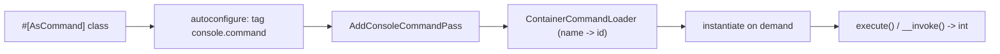
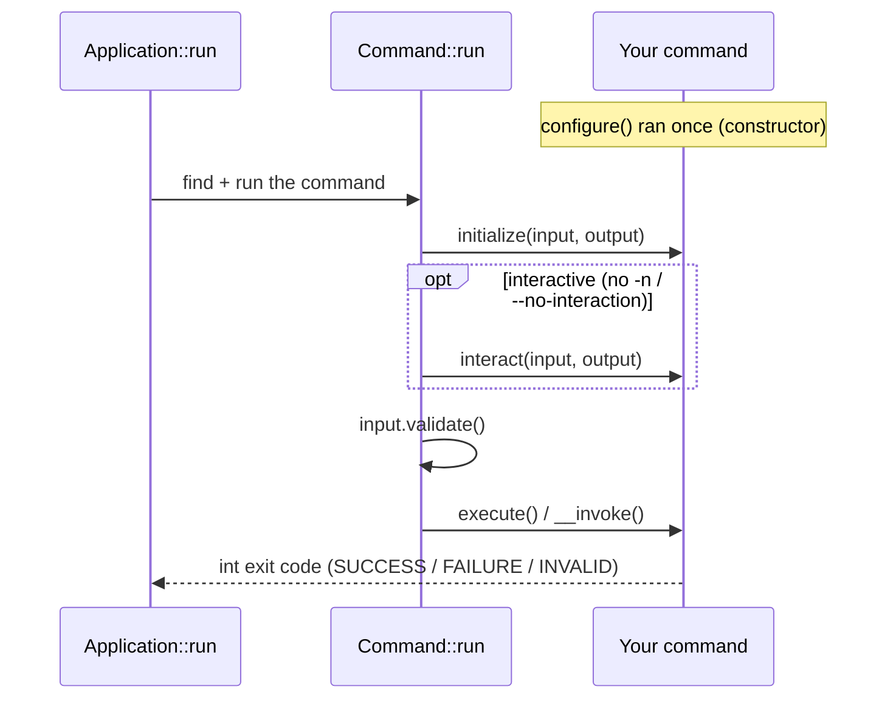

# Commandes personnalisées

!!! tip "In a nutshell"
    Une commande personnalisée est une classe marquée `#[AsCommand]` ; le style moderne
    est invokable — une méthode `__invoke()` avec des paramètres `#[Argument]`/`#[Option]`
    qui n'étend rien. À retenir pour l'examen : retournez `Command::SUCCESS` (0),
    `FAILURE` (1) ou `INVALID` (2), jamais un entier brut.

!!! example "Real-world analogy"
    Une commande personnalisée est comme un appareil de cuisine à usage unique : un
    grille-pain fait un seul travail, et vous le démarrez en abaissant l'unique levier
    (`__invoke()`) plutôt qu'en assemblant une machine à partir de pièces détachées.
    Quand il termine, il rapporte un statut clair — le toast remonte correctement
    (`SUCCESS`), il fait sauter le disjoncteur (`FAILURE`), ou il refuse parce que vous
    avez essayé de griller quelque chose qu'il ne peut pas accepter (`INVALID`). Ces
    trois signaux définis comptent bien plus qu'un nombre arbitraire sur un cadran, tout
    comme les constantes nommées valent mieux qu'un entier brut.

!!! abstract "Learning objectives"
    À la fin de ce chapitre, vous saurez :

    - [ ] Enregistrer une commande avec `#[AsCommand]` (styles invokable et classique)
    - [ ] Retourner `Command::SUCCESS`, `FAILURE` et `INVALID` correctement
    - [ ] Écrire une commande invokable moderne avec `#[Argument]` / `#[Option]`
    - [ ] Expliquer comment l'autoconfiguration enregistre les commandes en mode lazy

    **Syllabus:** `Console → Custom commands` ·
    **Level:** Advanced ·
    **Est. time:** 30 min ·
    **Prerequisites:** [Built-in commands](built-in-commands.md)

---

## Theory

Une commande est une classe qui encapsule une action CLI. Symfony 8 propose deux
styles, tous deux pilotés par l'attribut **`#[AsCommand]`** :

1. **Commande invokable** (recommandée, Symfony 7.3+) : une classe simple avec une
   méthode `__invoke()`. Les arguments et options sont déclarés comme paramètres de
   méthode avec `#[Argument]` / `#[Option]`. Elle n'a **pas** besoin d'étendre quoi
   que ce soit.
2. **Commande classique** : une classe étendant
   `Symfony\Component\Console\Command\Command`, implémentant `execute()` et
   (optionnellement) `configure()`.

Quel que soit le style, la méthode retourne un **code de sortie `int`**. Utilisez
les constantes :

| Constante | Valeur | Signification |
|---|---|---|
| `Command::SUCCESS` | `0` | La commande a réussi |
| `Command::FAILURE` | `1` | La commande a échoué |
| `Command::INVALID` | `2` | Entrée/usage invalide |

Ne faites jamais littéralement `return 0;` — utilisez les constantes pour la clarté
et la compatibilité future.

!!! question "Predict first"
    Vous marquez une classe simple (elle n'étend rien) avec `#[AsCommand]` et lui
    donnez une méthode `__invoke(): int`. Symfony va-t-il l'enregistrer et
    l'exécuter, ou doit-elle étendre `Command` ?

??? note "Reveal"
    Elle s'exécute. L'autoconfiguration tague toute classe `#[AsCommand]` (ou
    sous-classe de `Command`) avec `console.command` ; un adaptateur interne
    `InvokableCommand` transforme `__invoke()` en `execute()`. Vous n'étendez
    **pas** `Command` — mais vous retournez tout de même ses constantes
    (`Command::SUCCESS`/`FAILURE`/`INVALID`).

## Deep Dive — how it works internally

`Symfony\Component\Console\Attribute\AsCommand` porte le `name` de la commande, sa
`description`, ses `aliases`, le drapeau `hidden` et le `help`. Il est lu au moment
de la **compilation du container**, si bien que le framework connaît le nom d'une
commande *sans instancier la classe* — la base du [lazy loading](configuration.md).

L'enregistrement est automatique via l'**autoconfiguration** : tout service qui
étend `Command` **ou** porte `#[AsCommand]` est tagué `console.command`. La
`Symfony\Component\Console\DependencyInjection\AddConsoleCommandPass`
collecte ces tags et construit un
`Symfony\Component\Console\CommandLoader\ContainerCommandLoader`, associant chaque
nom à son id de service. La commande n'est instanciée que lorsqu'elle est
réellement invoquée.

Pour les commandes **invokables**, un adaptateur interne
(`Symfony\Component\Console\Command\Command` enveloppant l'invokable via
`InvokableCommand`) transforme `__invoke()` en `execute()`, en mappant les
paramètres typés :

- `InputInterface` / `OutputInterface` / `SymfonyStyle` sont injectés par type.
- Les paramètres `#[Argument]` deviennent des `InputArgument` (requis s'ils n'ont
  pas de valeur par défaut).
- Les paramètres `#[Option]` deviennent des `InputOption` (un `bool` devient un
  drapeau `VALUE_NONE` ; un tableau devient `VALUE_IS_ARRAY`).



Une fois la commande instanciée, l'**ordre d'exécution** est piloté par
`Command::run()`. Le cycle de vie complet (avec les hooks redéfinissables) est
détaillé dans [Configuration](configuration.md) ; voici l'ordre d'appel compact,
montrant que `configure()` s'est déjà exécutée une fois dans le constructeur :



!!! note "Source reference"
    `Symfony\Component\Console\Command\Command::SUCCESS|FAILURE|INVALID` et
    l'adaptateur invokable —
    [symfony/symfony `8.0`](https://github.com/symfony/symfony/blob/8.0/src/Symfony/Component/Console/Command/Command.php).

## Configuration & code

=== "Invokable (Symfony 8)"

    ```php
    <?php
    declare(strict_types=1);

    namespace App\Command;

    use Symfony\Component\Console\Attribute\Argument;
    use Symfony\Component\Console\Attribute\AsCommand;
    use Symfony\Component\Console\Attribute\Option;
    use Symfony\Component\Console\Command\Command;
    use Symfony\Component\Console\Style\SymfonyStyle;

    #[AsCommand(name: 'app:create-user', description: 'Creates a user')]
    final class CreateUserCommand
    {
        public function __invoke(
            SymfonyStyle $io,
            #[Argument(description: 'The username')]
            string $username,
            #[Option(description: 'Grant admin rights')]
            bool $admin = false,
        ): int {
            if ('' === $username) {
                $io->error('Username cannot be empty.');

                return Command::INVALID;
            }

            $io->success(sprintf('Created %s%s', $username, $admin ? ' (admin)' : ''));

            return Command::SUCCESS;
        }
    }
    ```

=== "Classic (extends Command)"

    ```php
    <?php
    declare(strict_types=1);

    namespace App\Command;

    use Symfony\Component\Console\Attribute\AsCommand;
    use Symfony\Component\Console\Command\Command;
    use Symfony\Component\Console\Input\InputArgument;
    use Symfony\Component\Console\Input\InputInterface;
    use Symfony\Component\Console\Output\OutputInterface;
    use Symfony\Component\Console\Style\SymfonyStyle;

    #[AsCommand(name: 'app:create-user', description: 'Creates a user')]
    final class CreateUserCommand extends Command
    {
        protected function configure(): void
        {
            $this->addArgument('username', InputArgument::REQUIRED, 'The username');
        }

        protected function execute(InputInterface $input, OutputInterface $output): int
        {
            $io = new SymfonyStyle($input, $output);
            $io->success('Created '.$input->getArgument('username'));

            return Command::SUCCESS;
        }
    }
    ```

=== "YAML (manual, rarely needed)"

    ```yaml
    # config/services.yaml
    services:
        App\Command\CreateUserCommand:
            tags:
                - { name: console.command }
    ```

Avec le `services.yaml` par défaut (autowiring/autoconfiguration), le tag YAML est
**inutile** — l'attribut suffit.

## Best practices & anti-patterns

| ✅ À faire | ❌ À éviter |
|---|---|
| Retourner `Command::SUCCESS` / `FAILURE` | `return 0;` / `return true;` |
| Préférer les commandes invokables pour le nouveau code | Le boilerplate `execute()` quand il est superflu |
| Injecter les dépendances via le constructeur | Faire des `new` de services dans la commande |
| Laisser l'autoconfiguration taguer la commande | Les tags `console.command` manuels |

## When (not) to use it / alternatives

Écrivez une commande pour les tâches déclenchées par la CLI, cron ou un worker. Pour
la logique pilotée par la request, utilisez un [controller](../controllers/index.md) ;
pour le traitement de messages en arrière-plan, utilisez Messenger. Une commande doit
être un adaptateur mince autour d'un service que vous pouvez aussi appeler depuis
HTTP.

!!! danger "Certification traps"
    - `Command::INVALID` vaut **2**, `FAILURE` vaut **1**, `SUCCESS` vaut **0**.
    - Les commandes invokables n'étendent **pas** `Command` ; vous utilisez tout de
      même ses constantes pour les codes de retour.
    - L'autoconfiguration tague les classes `#[AsCommand]` **ou** les sous-classes de
      `Command` — vous ne taguez pas manuellement.
    - `execute()` doit retourner un `int` ; retourner `null`/`void` est invalide en
      Symfony 8.

!!! warning "Common mistakes"
    - Oublier de retourner un int — la commande signale alors une erreur de type.
    - Mettre la logique métier dans la commande au lieu d'un service injecté.

## Exercises

1. **(Basic)** Écrivez une commande invokable `app:ping` qui affiche `pong` et
   retourne un succès.
2. **(Intermediate)** Ajoutez un argument `email` requis et retournez
   `Command::INVALID` s'il ne contient pas de `@`.

??? success "Solutions"

    **1.**

    ```php
    <?php
    declare(strict_types=1);

    namespace App\Command;

    use Symfony\Component\Console\Attribute\AsCommand;
    use Symfony\Component\Console\Command\Command;
    use Symfony\Component\Console\Style\SymfonyStyle;

    #[AsCommand(name: 'app:ping', description: 'Replies pong')]
    final class PingCommand
    {
        public function __invoke(SymfonyStyle $io): int
        {
            $io->writeln('pong');

            return Command::SUCCESS;
        }
    }
    ```

    **2.**

    ```php
    public function __invoke(
        SymfonyStyle $io,
        #[Argument(description: 'The email address')]
        string $email,
    ): int {
        if (!str_contains($email, '@')) {
            $io->error('Not an email.');

            return Command::INVALID;
        }

        $io->success($email);

        return Command::SUCCESS;
    }
    ```

## Certification questions

??? question "Q1. What integer value does `Command::INVALID` represent?"
    - [ ] A. 0
    - [ ] B. 1
    - [x] C. 2 ✅
    - [ ] D. 255

    **Why:** `SUCCESS=0`, `FAILURE=1`, `INVALID=2`. **Ref:**
    [Console](https://symfony.com/doc/current/console.html).

??? question "Q2. In Symfony 8, an invokable command class must…"
    - [ ] A. Extend `Command`
    - [ ] B. Implement `CommandInterface`
    - [x] C. Carry `#[AsCommand]` and define `__invoke()` returning `int` ✅
    - [ ] D. Be registered manually in `services.yaml`

    **Why:** les commandes invokables n'ont besoin que de l'attribut et d'une méthode
    `__invoke()`.
    **Ref:** [Console](https://symfony.com/doc/current/console.html).

??? question "Q3. How is a command normally registered in the service container?"
    - [x] A. Autoconfiguration tags `#[AsCommand]`/`Command` with `console.command` ✅
    - [ ] B. You call `Application::add()` in `bin/console`
    - [ ] C. You always add a `console.command` tag by hand
    - [ ] D. It is discovered by filename convention only

    **Why:** l'autoconfiguration applique le tag ; une compiler pass construit le loader.
    **Ref:** [Commands as Services](https://symfony.com/doc/current/console/commands_as_services.html).

??? question "Q4. What must `execute()` (or `__invoke()`) return?"
    - [x] A. An `int` exit code ✅
    - [ ] B. `void`
    - [ ] C. A `Response`
    - [ ] D. A `bool`

    **Why:** la valeur de retour devient le code de sortie du processus. **Ref:**
    [Console](https://symfony.com/doc/current/console.html).

## Key takeaways

- `#[AsCommand]` déclare name/description/aliases/hidden/help.
- Les commandes invokables (`__invoke`) sont le standard moderne ; le style classique
  `extends Command` fonctionne toujours.
- Retournez `Command::SUCCESS` (0), `FAILURE` (1) ou `INVALID` (2).
- L'autoconfiguration tague les commandes `console.command` ; le chargement est lazy.

## Last-minute revision

!!! tip "Cheat sheet"
    - `Symfony\Component\Console\Attribute\AsCommand`.
    - Attributs invokables : `#[Argument]`, `#[Option]` depuis `...Console\Attribute`.
    - `SUCCESS=0`, `FAILURE=1`, `INVALID=2`.
    - Le tag `console.command` est appliqué automatiquement.

## Connections

- **Depends on:** [Service tags](../dependency-injection/tags.md) — l'autoconfiguration
  applique le tag `console.command` qui enregistre la commande.
- **Reused in:** [Configuration](configuration.md) — les métadonnées et le cycle de vie
  de la commande que vous venez d'enregistrer.
- **Confused with:** [Built-in commands](built-in-commands.md) — celles-ci sont livrées
  avec le framework ; ici vous écrivez les vôtres.

## Official References
- [Official Symfony docs — Console commands](https://symfony.com/doc/current/console.html)
- [Official Symfony docs — Commands as services](https://symfony.com/doc/current/console/commands_as_services.html)
- [Symfony source — Command](https://github.com/symfony/symfony/blob/8.0/src/Symfony/Component/Console/Command/Command.php)

## Video references

!!! tip "Watch & learn"
    Ce sont des chaînes vidéo officielles, mises à jour en continu — cherchez-y
    "Symfony console" pour consolider ce chapitre. Nous lions des chaînes stables
    plutôt que des vidéos individuelles afin que les références ne périment jamais.

    - [SymfonyCasts screencasts](https://symfonycasts.com/tracks/symfony) — tutoriels scénarisés à suivre en codant.
    - [Symfony official YouTube](https://www.youtube.com/@SymfonyOfficial) — conférences et keynotes SymfonyCon.
    - [Official docs for this topic](https://symfony.com/doc/current/console.html) — certaines pages de la doc Symfony intègrent un screencast.

## Confidence check

Je suis prêt quand je peux :

- [ ] expliquer **pourquoi** une commande existe (un adaptateur CLI mince au-dessus d'un service réutilisable)
- [ ] implémenter une commande invokable `#[AsCommand]` avec `#[Argument]` / `#[Option]` en Symfony 8
- [ ] déboguer un échec « command not found » / commande non enregistrée
- [ ] repérer la mauvaise réponse sur les valeurs de retour `SUCCESS`/`FAILURE`/`INVALID`
- [ ] expliquer comment l'autoconfiguration + `AddConsoleCommandPass` chargent les commandes en mode lazy

---

<small>Related: [Configuration](configuration.md) · [Arguments & options](options-arguments.md) · [Input & output](input-output.md)</small>
