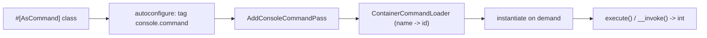
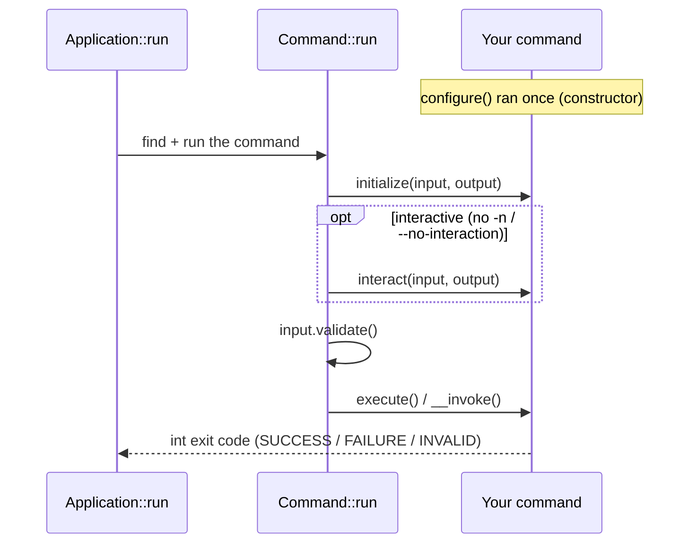

# Custom Commands

!!! tip "In a nutshell"
    A custom command is a class marked `#[AsCommand]`; the modern style is invokable
    — an `__invoke()` method with `#[Argument]`/`#[Option]` parameters that extends
    nothing. Remember for the exam: return `Command::SUCCESS` (0), `FAILURE` (1) or
    `INVALID` (2), never a bare integer.

!!! abstract "Learning objectives"
    By the end of this chapter you can:

    - [ ] Register a command with `#[AsCommand]` (invokable and class styles)
    - [ ] Return `Command::SUCCESS`, `FAILURE`, and `INVALID` correctly
    - [ ] Write a modern invokable command with `#[Argument]` / `#[Option]`
    - [ ] Explain how autoconfiguration registers commands lazily

    **Syllabus:** `Console → Custom commands` ·
    **Level:** Advanced ·
    **Est. time:** 30 min ·
    **Prerequisites:** [Built-in commands](built-in-commands.md)

---

## Theory

A command is a class that encapsulates one CLI action. Symfony 8 offers two styles,
both driven by the **`#[AsCommand]`** attribute:

1. **Invokable command** (recommended, Symfony 7.3+): a plain class with an
   `__invoke()` method. Arguments and options are declared as method parameters with
   `#[Argument]` / `#[Option]`. It does **not** need to extend anything.
2. **Classic command**: a class extending
   `Symfony\Component\Console\Command\Command`, implementing `execute()` and
   (optionally) `configure()`.

Whichever style, the method returns an **`int` exit code**. Use the constants:

| Constant | Value | Meaning |
|---|---|---|
| `Command::SUCCESS` | `0` | Command succeeded |
| `Command::FAILURE` | `1` | Command failed |
| `Command::INVALID` | `2` | Invalid input/usage |

Never `return 0;` literally — use the constants for clarity and forward
compatibility.

!!! question "Predict first"
    You mark a plain class (it extends nothing) with `#[AsCommand]` and give it an
    `__invoke(): int` method. Will Symfony register and run it, or must it extend
    `Command`?

??? note "Reveal"
    It runs. Autoconfiguration tags any `#[AsCommand]` class (or `Command`
    subclass) `console.command`; an internal `InvokableCommand` adapter turns
    `__invoke()` into `execute()`. You do **not** extend `Command` — but you still
    return its constants (`Command::SUCCESS`/`FAILURE`/`INVALID`).

## Deep Dive — how it works internally

`Symfony\Component\Console\Attribute\AsCommand` carries the command's `name`,
`description`, `aliases`, `hidden` flag and `help`. It is read at **container
compile time**, so the framework knows a command's name *without instantiating the
class* — the basis of [lazy loading](configuration.md).

Registration is automatic via **autoconfiguration**: any service that extends
`Command` **or** carries `#[AsCommand]` is tagged `console.command`. The
`Symfony\Component\Console\DependencyInjection\AddConsoleCommandPass`
collects those tags and builds a
`Symfony\Component\Console\CommandLoader\ContainerCommandLoader`, mapping each name
to its service id. The command is instantiated only when actually invoked.

For **invokable** commands, an internal adapter
(`Symfony\Component\Console\Command\Command` wrapping the invokable via
`InvokableCommand`) turns `__invoke()` into `execute()`, mapping typed parameters:

- `InputInterface` / `OutputInterface` / `SymfonyStyle` are injected by type.
- `#[Argument]` parameters become `InputArgument`s (required if no default).
- `#[Option]` parameters become `InputOption`s (a `bool` becomes a `VALUE_NONE`
  flag; an array becomes `VALUE_IS_ARRAY`).



Once instantiated, the **run-time order** is driven by `Command::run()`. The full
lifecycle (with the overridable hooks) is detailed in
[Configuration](configuration.md); here is the compact call order, showing that
`configure()` has already run once in the constructor:



!!! note "Source reference"
    `Symfony\Component\Console\Command\Command::SUCCESS|FAILURE|INVALID` and the
    invokable adapter —
    [symfony/symfony `8.0`](https://github.com/symfony/symfony/blob/8.0/src/Symfony/Component/Console/Command/Command.php).

## Configuration & code

=== "Invokable (Symfony 8)"

    ```php
    <?php
    declare(strict_types=1);

    namespace App\Command;

    use Symfony\Component\Console\Attribute\Argument;
    use Symfony\Component\Console\Attribute\AsCommand;
    use Symfony\Component\Console\Attribute\Option;
    use Symfony\Component\Console\Command\Command;
    use Symfony\Component\Console\Style\SymfonyStyle;

    #[AsCommand(name: 'app:create-user', description: 'Creates a user')]
    final class CreateUserCommand
    {
        public function __invoke(
            SymfonyStyle $io,
            #[Argument(description: 'The username')]
            string $username,
            #[Option(description: 'Grant admin rights')]
            bool $admin = false,
        ): int {
            if ('' === $username) {
                $io->error('Username cannot be empty.');

                return Command::INVALID;
            }

            $io->success(sprintf('Created %s%s', $username, $admin ? ' (admin)' : ''));

            return Command::SUCCESS;
        }
    }
    ```

=== "Classic (extends Command)"

    ```php
    <?php
    declare(strict_types=1);

    namespace App\Command;

    use Symfony\Component\Console\Attribute\AsCommand;
    use Symfony\Component\Console\Command\Command;
    use Symfony\Component\Console\Input\InputArgument;
    use Symfony\Component\Console\Input\InputInterface;
    use Symfony\Component\Console\Output\OutputInterface;
    use Symfony\Component\Console\Style\SymfonyStyle;

    #[AsCommand(name: 'app:create-user', description: 'Creates a user')]
    final class CreateUserCommand extends Command
    {
        protected function configure(): void
        {
            $this->addArgument('username', InputArgument::REQUIRED, 'The username');
        }

        protected function execute(InputInterface $input, OutputInterface $output): int
        {
            $io = new SymfonyStyle($input, $output);
            $io->success('Created '.$input->getArgument('username'));

            return Command::SUCCESS;
        }
    }
    ```

=== "YAML (manual, rarely needed)"

    ```yaml
    # config/services.yaml
    services:
        App\Command\CreateUserCommand:
            tags:
                - { name: console.command }
    ```

With the default `services.yaml` autowiring/autoconfiguration, the YAML tag is
**unnecessary** — the attribute is enough.

## Best practices & anti-patterns

| ✅ Do | ❌ Avoid |
|---|---|
| Return `Command::SUCCESS` / `FAILURE` | `return 0;` / `return true;` |
| Prefer invokable commands for new code | Boilerplate `execute()` when unneeded |
| Inject dependencies via the constructor | `new`-ing services inside the command |
| Let autoconfiguration tag the command | Manual `console.command` tags |

## When (not) to use it / alternatives

Write a command for tasks triggered by CLI, cron, or a worker. For request-driven
logic use a [controller](../controllers/index.md); for background message handling
use Messenger. A command should be a thin adapter around a service you can also
call from HTTP.

!!! danger "Certification traps"
    - `Command::INVALID` is **2**, `FAILURE` is **1**, `SUCCESS` is **0**.
    - Invokable commands do **not** extend `Command`; you still use its constants
      for return codes.
    - Autoconfiguration tags `#[AsCommand]` **or** `Command` subclasses — you do
      not tag manually.
    - `execute()` must return an `int`; returning `null`/`void` is invalid in
      Symfony 8.

!!! warning "Common mistakes"
    - Forgetting to return an int — the command then reports a type error.
    - Putting business logic in the command instead of an injected service.

## Exercises

1. **(Basic)** Write an invokable `app:ping` command that prints `pong` and returns
   success.
2. **(Intermediate)** Add a required `email` argument and return `Command::INVALID`
   when it lacks an `@`.

??? success "Solutions"

    **1.**

    ```php
    <?php
    declare(strict_types=1);

    namespace App\Command;

    use Symfony\Component\Console\Attribute\AsCommand;
    use Symfony\Component\Console\Command\Command;
    use Symfony\Component\Console\Style\SymfonyStyle;

    #[AsCommand(name: 'app:ping', description: 'Replies pong')]
    final class PingCommand
    {
        public function __invoke(SymfonyStyle $io): int
        {
            $io->writeln('pong');

            return Command::SUCCESS;
        }
    }
    ```

    **2.**

    ```php
    public function __invoke(
        SymfonyStyle $io,
        #[Argument(description: 'The email address')]
        string $email,
    ): int {
        if (!str_contains($email, '@')) {
            $io->error('Not an email.');

            return Command::INVALID;
        }

        $io->success($email);

        return Command::SUCCESS;
    }
    ```

## Certification questions

??? question "Q1. What integer value does `Command::INVALID` represent?"
    - [ ] A. 0
    - [ ] B. 1
    - [x] C. 2 ✅
    - [ ] D. 255

    **Why:** `SUCCESS=0`, `FAILURE=1`, `INVALID=2`. **Ref:**
    [Console](https://symfony.com/doc/current/console.html).

??? question "Q2. In Symfony 8, an invokable command class must…"
    - [ ] A. Extend `Command`
    - [ ] B. Implement `CommandInterface`
    - [x] C. Carry `#[AsCommand]` and define `__invoke()` returning `int` ✅
    - [ ] D. Be registered manually in `services.yaml`

    **Why:** invokable commands need only the attribute and an `__invoke()` method.
    **Ref:** [Console](https://symfony.com/doc/current/console.html).

??? question "Q3. How is a command normally registered in the service container?"
    - [x] A. Autoconfiguration tags `#[AsCommand]`/`Command` with `console.command` ✅
    - [ ] B. You call `Application::add()` in `bin/console`
    - [ ] C. You always add a `console.command` tag by hand
    - [ ] D. It is discovered by filename convention only

    **Why:** autoconfiguration applies the tag; a compiler pass builds the loader.
    **Ref:** [Commands as Services](https://symfony.com/doc/current/console/commands_as_services.html).

??? question "Q4. What must `execute()` (or `__invoke()`) return?"
    - [x] A. An `int` exit code ✅
    - [ ] B. `void`
    - [ ] C. A `Response`
    - [ ] D. A `bool`

    **Why:** the return value becomes the process exit code. **Ref:**
    [Console](https://symfony.com/doc/current/console.html).

## Key takeaways

- `#[AsCommand]` declares name/description/aliases/hidden/help.
- Invokable commands (`__invoke`) are the modern default; classic `extends Command`
  still works.
- Return `Command::SUCCESS` (0), `FAILURE` (1), or `INVALID` (2).
- Autoconfiguration tags commands `console.command`; loading is lazy.

## Last-minute revision

!!! tip "Cheat sheet"
    - `Symfony\Component\Console\Attribute\AsCommand`.
    - Invokable attrs: `#[Argument]`, `#[Option]` from `...Console\Attribute`.
    - `SUCCESS=0`, `FAILURE=1`, `INVALID=2`.
    - Tag `console.command` is applied automatically.

## Connections

- **Depends on:** [Service tags](../dependency-injection/tags.md) — autoconfiguration
  applies the `console.command` tag that registers the command.
- **Reused in:** [Configuration](configuration.md) — the metadata and lifecycle of the
  command you just registered.
- **Confused with:** [Built-in commands](built-in-commands.md) — those ship with the
  framework; here you write your own.

## Official References
- [Official Symfony docs — Console commands](https://symfony.com/doc/current/console.html)
- [Official Symfony docs — Commands as services](https://symfony.com/doc/current/console/commands_as_services.html)
- [Symfony source — Command](https://github.com/symfony/symfony/blob/8.0/src/Symfony/Component/Console/Command/Command.php)

## Confidence check

I'm ready when I can:

- [ ] explain **why** a command exists (a thin CLI adapter over a reusable service)
- [ ] implement an invokable `#[AsCommand]` with `#[Argument]` / `#[Option]` in Symfony 8
- [ ] debug a "command not found" / unregistered-command failure
- [ ] spot the wrong answer on `SUCCESS`/`FAILURE`/`INVALID` return values
- [ ] explain how autoconfiguration + `AddConsoleCommandPass` load commands lazily

---

<small>Related: [Configuration](configuration.md) · [Arguments & options](options-arguments.md) · [Input & output](input-output.md)</small>
