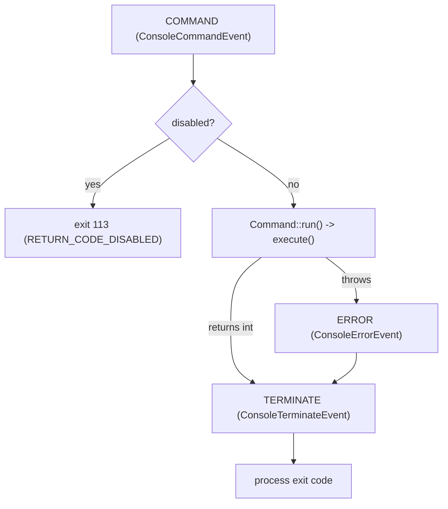

# Événements de la console

!!! tip "In a nutshell"
    Quand une commande s'exécute via le framework, l'Application déclenche quatre
    `ConsoleEvents` : COMMAND, SIGNAL, ERROR et TERMINATE. À retenir pour l'examen :
    l'ordre est COMMAND → (ERROR seulement si quelque chose lève) → TERMINATE, et
    TERMINATE s'exécute toujours — votre dernière chance de changer le code de
    sortie.

!!! example "Real-world analogy"
    Un vol commercial diffuse la même séquence fixe d'annonces. L'embarquement est
    annoncé avant que l'avion ne bouge (COMMAND, avant l'exécution de la commande),
    et en plein vol une alerte de turbulences soudaines peut interrompre à tout moment
    (SIGNAL). Si une panne moteur survient, l'équipage consigne un rapport d'incident
    — mais seulement si quelque chose a réellement mal tourné (ERROR). L'annonce
    « nous sommes arrivés à la porte, merci d'avoir volé avec nous » est toujours
    diffusée, que le voyage ait été calme ou dérouté (TERMINATE), et c'est le dernier
    moment pour consigner l'issue — votre dernière chance de définir le code de sortie.

!!! abstract "Learning objectives"
    À la fin de ce chapitre, vous saurez :

    - [ ] Nommer les quatre `ConsoleEvents` et leur ordre de déclenchement
    - [ ] Écouter avec `#[AsEventListener]` et changer le code de sortie
    - [ ] Gérer les signaux OS via `SignalableCommandInterface` ou l'event SIGNAL
    - [ ] Expliquer comment les codes de sortie se propagent via `TERMINATE`

    **Syllabus:** `Console → Events` ·
    **Level:** Advanced ·
    **Est. time:** 25 min ·
    **Prerequisites:** [Custom commands](custom-commands.md)

---

## Pour les nuls

### L'idée en une phrase
Une commande exécutée via le framework déclenche quatre événements dans un ordre fixe — et `TERMINATE` s'exécute **toujours**, même en cas d'erreur.

### Imagine dans la vraie vie
Un vol commercial diffuse la même séquence fixe d'annonces. L'embarquement est annoncé avant que l'avion ne bouge (COMMAND). Si un incident moteur survient, l'équipage note un rapport — mais seulement si quelque chose a vraiment mal tourné (ERROR). L'annonce "nous avons atteint la porte, merci d'avoir volé avec nous" passe toujours, que le vol ait été fluide ou détourné (TERMINATE).

### Dans Symfony
Un listener sur `ConsoleEvents::TERMINATE` peut forcer un code de sortie différent (par exemple, transformer un avertissement non bloquant en échec explicite pour le pipeline CI) — c'est la toute dernière chance de changer le résultat.

### Exemple simple
```php
#[AsEventListener(event: ConsoleEvents::TERMINATE)]
public function onTerminate(ConsoleTerminateEvent $event): void { $event->setExitCode(1); }
```

### Comment le mémoriser 🧠
L'ordre est **COMMAND → (ERROR seulement si quelque chose lève une exception) → TERMINATE** — `TERMINATE` s'exécute toujours, c'est ta dernière chance de changer le code de sortie.

---


## Theory

Quand les commandes s'exécutent au sein du framework, l'`Application` dispatche des
events sur l'event dispatcher. `Symfony\Component\Console\ConsoleEvents` en définit
quatre :

| Constante | Nom de l'event | Quand |
|---|---|---|
| `ConsoleEvents::COMMAND` | `console.command` | Avant l'exécution de la commande |
| `ConsoleEvents::SIGNAL` | `console.signal` | Un signal OS a été reçu |
| `ConsoleEvents::ERROR` | `console.error` | Une exception/erreur a été levée |
| `ConsoleEvents::TERMINATE` | `console.terminate` | Après la commande, toujours |

Chacun transporte un objet event dédié exposant la commande, l'input, l'output et —
pour error/terminate — le code de sortie.

```php
use Symfony\Component\Console\ConsoleEvents;

// The four constants the Application dispatches on the event dispatcher
ConsoleEvents::COMMAND;     // "console.command"   - before execution
ConsoleEvents::SIGNAL;      // "console.signal"    - an OS signal was received
ConsoleEvents::ERROR;       // "console.error"     - a Throwable was thrown
ConsoleEvents::TERMINATE;   // "console.terminate" - after the command, always
```

!!! question "Predict first"
    Une commande lève une exception au milieu d'`execute()`. Quels events console
    se déclenchent, dans quel ordre, et `TERMINATE` s'exécute-t-il quand même ?

??? note "Reveal"
    `COMMAND` s'est déclenché avant l'exécution ; la levée déclenche `ERROR` ; puis
    `TERMINATE` s'exécute **quoi qu'il arrive**. L'ordre est donc
    `COMMAND → ERROR → TERMINATE`. `TERMINATE` s'exécute toujours — c'est votre
    dernière chance de changer le code de sortie.

## Deep Dive — how it works internally

`Symfony\Bundle\FrameworkBundle\Console\Application` (via
`Symfony\Component\Console\Application::doRunCommand()`) orchestre le flux :



- **`ConsoleCommandEvent`** — inspecter/préparer ; `disableCommand()` saute
  l'exécution et fait retourner `ConsoleCommandEvent::RETURN_CODE_DISABLED`
  (**113**).
- **`ConsoleErrorEvent`** — déclenché sur tout `\Throwable` ; un listener peut
  remplacer le throwable ou définir un code de sortie personnalisé avec
  `setExitCode()`. Après lui, `TERMINATE` s'exécute quand même.
- **`ConsoleTerminateEvent`** — s'exécute toujours (succès ou échec) ;
  `getExitCode()` / `setExitCode()` offrent la **dernière chance** de changer le
  code de sortie du processus. Idéal pour le nettoyage/les métriques.
- **`ConsoleSignalEvent`** — déclenché quand un signal POSIX souscrit arrive ;
  expose `getHandlingSignal()` et permet `setExitCode()` / `abortExit()`.

```php
// ConsoleCommandEvent: skip execution -> run() returns 113
$commandEvent->disableCommand();   // ConsoleCommandEvent::RETURN_CODE_DISABLED

// ConsoleErrorEvent: replace the failure code (TERMINATE still runs after)
$errorEvent->setExitCode(3);

// ConsoleTerminateEvent: last chance to inspect/override the exit code
if (0 !== $terminateEvent->getExitCode()) {
    $terminateEvent->setExitCode(0);          // e.g. downgrade a known benign failure
}

// ConsoleSignalEvent: which signal arrived, then choose the outcome
$signal = $signalEvent->getHandlingSignal();  // e.g. \SIGTERM
$signalEvent->setExitCode(128 + $signal);     // exit with the signal convention
// ...or keep the command running instead of exiting:
$signalEvent->abortExit();
```

Les codes de sortie sont bornés à **0–255** (`$code % 256` en cas de dépassement) ;
un retour négatif ou `>255` est normalisé. Par convention, un processus terminé par
un signal sort avec `128 + signalNumber`.

```php
// Out-of-range exit codes are normalised into 0-255: $code % 256
return 300;   // the process actually exits with 300 % 256 = 44

// Signal convention: exit code = 128 + signalNumber
// SIGINT (2) -> 130, SIGTERM (15) -> 143
```

### Signal handling

Deux façons de réagir aux signaux (nécessite `ext-pcntl`) :

1. **`Symfony\Component\Console\Command\SignalableCommandInterface`** — implémentez
   `getSubscribedSignals(): array` (p. ex. `[\SIGINT, \SIGTERM]`) et
   `handleSignal(int $signal, int|false $previousExitCode = 0): int|false`.
   Retournez un int pour définir le code de sortie, ou `false` pour continuer.
2. **Listener `ConsoleEvents::SIGNAL`** — un hook global, utile pour les
   préoccupations transverses (vider les logs sur `SIGTERM`).

```php
// 1) Per-command: implement SignalableCommandInterface
public function getSubscribedSignals(): array
{
    return [\SIGINT, \SIGTERM];               // signals this command reacts to
}

public function handleSignal(int $signal, int|false $previousExitCode = 0): int|false
{
    return false;   // false = keep running; return an int to exit with that code
}

// 2) App-wide: listen to ConsoleEvents::SIGNAL (e.g. flush logs on SIGTERM)
#[AsEventListener(event: ConsoleEvents::SIGNAL)]
final class FlushLogsOnSignal { /* __invoke(ConsoleSignalEvent $event) */ }
```

!!! note "Source reference"
    `ConsoleEvents`, `ConsoleTerminateEvent`, `SignalableCommandInterface` —
    [symfony/symfony `8.0`](https://github.com/symfony/symfony/blob/8.0/src/Symfony/Component/Console/ConsoleEvents.php).

## Configuration & code

=== "Listener (#[AsEventListener])"

    ```php
    <?php
    declare(strict_types=1);

    namespace App\Console;

    use Symfony\Component\Console\ConsoleEvents;
    use Symfony\Component\Console\Event\ConsoleTerminateEvent;
    use Symfony\Component\EventDispatcher\Attribute\AsEventListener;

    #[AsEventListener(event: ConsoleEvents::TERMINATE)]
    final class ExitCodeAuditor
    {
        public function __invoke(ConsoleTerminateEvent $event): void
        {
            if (0 !== $event->getExitCode()) {
                // e.g. record the failure; could also setExitCode()
                $event->getOutput()->writeln(
                    sprintf('<comment>%s exited %d</comment>',
                        $event->getCommand()?->getName(),
                        $event->getExitCode(),
                    ),
                );
            }
        }
    }
    ```

=== "SignalableCommandInterface"

    ```php
    <?php
    declare(strict_types=1);

    namespace App\Command;

    use Symfony\Component\Console\Attribute\AsCommand;
    use Symfony\Component\Console\Command\Command;
    use Symfony\Component\Console\Command\SignalableCommandInterface;
    use Symfony\Component\Console\Input\InputInterface;
    use Symfony\Component\Console\Output\OutputInterface;

    #[AsCommand(name: 'app:worker')]
    final class WorkerCommand extends Command implements SignalableCommandInterface
    {
        private bool $stop = false;

        public function getSubscribedSignals(): array
        {
            return [\SIGINT, \SIGTERM];
        }

        public function handleSignal(int $signal, int|false $previousExitCode = 0): int|false
        {
            $this->stop = true;

            return 0; // graceful exit code
        }

        protected function execute(InputInterface $input, OutputInterface $output): int
        {
            while (!$this->stop) {
                // process one job
            }

            return Command::SUCCESS;
        }
    }
    ```

=== "Console"

    ```console
    $ php bin/console app:worker      # Ctrl-C sends SIGINT -> handleSignal()
    ```

## Best practices & anti-patterns

| ✅ À faire | ❌ À éviter |
|---|---|
| Utiliser `TERMINATE` pour le nettoyage/les métriques | Le nettoyage uniquement dans `execute()` (sauté en cas d'erreur) |
| Gérer `SIGTERM` pour l'arrêt gracieux d'un worker | Ignorer les signaux dans les boucles longue durée |
| Définir les codes de sortie via l'event si besoin | Appeler `exit()` directement dans un listener |
| Retourner `Command::FAILURE` pour les vrais échecs | Avaler les exceptions en silence |

## When (not) to use it / alternatives

Les events ne sont dispatchés que lors d'une exécution via l'**Application du
framework** (ils nécessitent un event dispatcher). Une application Console autonome
sans dispatcher ne les déclenchera pas. Préférez `SignalableCommandInterface` pour
la logique de signaux propre à une commande ; utilisez l'event `SIGNAL` pour les
préoccupations à l'échelle de l'application.

!!! danger "Certification traps"
    - Ordre de déclenchement : **COMMAND → (ERROR en cas de levée) → TERMINATE**.
      `TERMINATE` s'exécute **toujours**.
    - `disableCommand()` produit le code de sortie **113** (`RETURN_CODE_DISABLED`).
    - Les codes de sortie sont bornés à **0–255** ; `>255` boucle via `% 256`.
    - `ConsoleErrorEvent::setExitCode()` remplace le code d'échec, mais `TERMINATE`
      s'exécute quand même ensuite.
    - La gestion des signaux nécessite l'extension **pcntl**.

!!! warning "Common mistakes"
    - Supposer que les events se déclenchent avec le composant Console brut sans
      dispatcher.
    - Attendre `handleSignal()` sans que `ext-pcntl` soit installée.

## Exercises

1. **(Basic)** Écrivez un listener `TERMINATE` qui journalise le nom de la commande
   et le code de sortie.
2. **(Intermediate)** Faites en sorte qu'une commande longue durée s'arrête
   gracieusement sur `SIGTERM` en utilisant `SignalableCommandInterface`.

??? success "Solutions"

    **1.** Voyez le listener `ExitCodeAuditor` ci-dessus — attachez-le avec
    `#[AsEventListener(event: ConsoleEvents::TERMINATE)]`.

    **2.** Implémentez `getSubscribedSignals(): [\SIGTERM]` et positionnez un drapeau
    `$stop` dans `handleSignal()`, puis sortez de la boucle dans `execute()` (voir
    `WorkerCommand`).

## Certification questions

??? question "Q1. What is the correct dispatch order for a successful command?"
    - [x] A. `COMMAND` then `TERMINATE` ✅
    - [ ] B. `TERMINATE` then `COMMAND`
    - [ ] C. `ERROR` then `COMMAND`
    - [ ] D. `COMMAND` then `ERROR`

    **Why:** `ERROR` ne se déclenche que sur un throwable ; `TERMINATE` se déclenche
    toujours en dernier.
    **Ref:** [Console events](https://symfony.com/doc/8.0/components/console/events.html).

??? question "Q2. Which event lets you change the exit code no matter what happened?"
    - [ ] A. `ConsoleEvents::COMMAND`
    - [ ] B. `ConsoleEvents::SIGNAL`
    - [x] C. `ConsoleEvents::TERMINATE` ✅
    - [ ] D. It cannot be changed after execution

    **Why:** `ConsoleTerminateEvent::setExitCode()` est la dernière chance. **Ref:**
    [Console events](https://symfony.com/doc/8.0/components/console/events.html).

??? question "Q3. What exit code results from `ConsoleCommandEvent::disableCommand()`?"
    - [ ] A. 0
    - [ ] B. 1
    - [x] C. 113 ✅
    - [ ] D. 255

    **Why:** `RETURN_CODE_DISABLED` vaut 113. **Ref:**
    [Console events](https://symfony.com/doc/8.0/components/console/events.html).

??? question "Q4. Which interface lets a command react to `SIGTERM`?"
    - [x] A. `SignalableCommandInterface` ✅
    - [ ] B. `SignalHandlerInterface`
    - [ ] C. `TerminableInterface`
    - [ ] D. `EventSubscriberInterface`

    **Why:** implémentez `getSubscribedSignals()` et `handleSignal()`. **Ref:**
    [Console signals](https://symfony.com/doc/8.0/components/console/events.html#handling-command-signals).

## Key takeaways

- Quatre events : `COMMAND`, `SIGNAL`, `ERROR`, `TERMINATE`.
- Ordre : `COMMAND → [ERROR] → TERMINATE` ; `TERMINATE` s'exécute toujours.
- `disableCommand()` → sortie **113** ; les codes de sortie sont bornés à 0–255.
- Signaux via `SignalableCommandInterface` ou l'event `SIGNAL` (nécessite pcntl).

## Last-minute revision

!!! tip "Cheat sheet"
    - `ConsoleEvents::COMMAND|SIGNAL|ERROR|TERMINATE`.
    - Les events ne se déclenchent qu'avec un dispatcher (Application du framework).
    - `getSubscribedSignals()` + `handleSignal($sig, $prevExit)`.
    - Convention pour une fin par signal : sortie `128 + signal`.

## Connections

- **Depends on:** [Architecture — Events & the dispatcher](../architecture/events.md) —
  les events console empruntent le même `EventDispatcher` : pas de dispatcher, pas
  d'events.
- **Reused in:** [Custom commands](custom-commands.md) — les listeners observent les
  commandes que vous écrivez sans toucher à leur code.
- **Confused with:** [Configuration](configuration.md) — `initialize`/`interact`/`execute`
  sont des méthodes redéfinissables, pas des events dispatchés.

## Official References
- [Official Symfony docs — Console events](https://symfony.com/doc/8.0/components/console/events.html)
- [Official Symfony docs — Handling signals](https://symfony.com/doc/8.0/components/console/events.html#handling-command-signals)
- [Symfony source — ConsoleEvents](https://github.com/symfony/symfony/blob/8.0/src/Symfony/Component/Console/ConsoleEvents.php)

## Video references

!!! tip "Watch & learn"
    Ce sont des chaînes vidéo officielles, mises à jour en continu — cherchez-y
    "Symfony console" pour consolider ce chapitre. Nous lions des chaînes stables
    plutôt que des vidéos individuelles afin que les références ne périment jamais.

    - [SymfonyCasts screencasts](https://symfonycasts.com/tracks/symfony) — tutoriels scénarisés à suivre en codant.
    - [Symfony official YouTube](https://www.youtube.com/@SymfonyOfficial) — conférences et keynotes SymfonyCon.
    - [Official docs for this topic](https://symfony.com/doc/8.0/components/console/events.html) — certaines pages de la doc Symfony intègrent un screencast.

## Confidence check

Je suis prêt quand je peux :

- [ ] expliquer **pourquoi** les events console existent (des hooks transverses autour de n'importe quelle commande)
- [ ] écouter avec `#[AsEventListener]` et ajuster le code de sortie en Symfony 8
- [ ] déboguer un listener qui « ne se déclenche jamais » (pas de dispatcher / composant Console brut)
- [ ] repérer le piège sur l'ordre de déclenchement, le code 113 de désactivation et le bornage 0–255
- [ ] expliquer la gestion des signaux via `SignalableCommandInterface` vs l'event `SIGNAL`

---

<small>Related: [Custom commands](custom-commands.md) · [Verbosity](verbosity.md) · [Configuration](configuration.md)</small>
