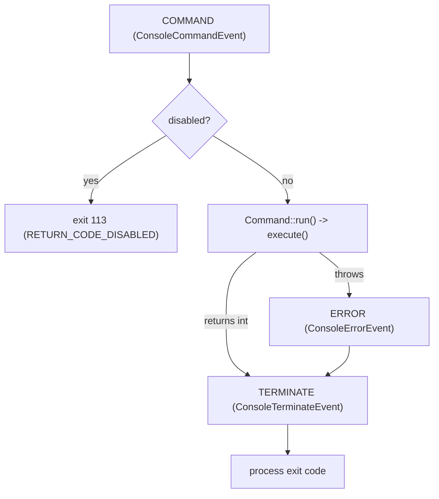

# Console Events

!!! tip "In a nutshell"
    When a command runs through the framework, the Application fires four
    `ConsoleEvents`: COMMAND, SIGNAL, ERROR and TERMINATE. Remember for the exam:
    the order is COMMAND → (ERROR only if something throws) → TERMINATE, and
    TERMINATE always runs — your last chance to change the exit code.

!!! example "Real-world analogy"
    A commercial flight fires the same fixed sequence of announcements. Boarding is called
    before the plane moves (COMMAND, before the command executes), and mid-flight a sudden
    turbulence alert may interrupt at any moment (SIGNAL). If an engine fault occurs, the
    crew logs an incident report — but only if something actually went wrong (ERROR). The
    "we've reached the gate, thank you for flying" announcement always plays whether the
    trip was smooth or diverted (TERMINATE), and it's the final moment to record the
    outcome — your last chance to set the exit code.

!!! abstract "Learning objectives"
    By the end of this chapter you can:

    - [ ] Name the four `ConsoleEvents` and their firing order
    - [ ] Listen with `#[AsEventListener]` and change the exit code
    - [ ] Handle OS signals via `SignalableCommandInterface` or the SIGNAL event
    - [ ] Explain how exit codes propagate through `TERMINATE`

    **Syllabus:** `Console → Events` ·
    **Level:** Advanced ·
    **Est. time:** 25 min ·
    **Prerequisites:** [Custom commands](custom-commands.md)

---

## Theory

When commands run inside the framework, the `Application` dispatches events on the
event dispatcher. `Symfony\Component\Console\ConsoleEvents` defines four:

| Constant | Event name | When |
|---|---|---|
| `ConsoleEvents::COMMAND` | `console.command` | Before the command executes |
| `ConsoleEvents::SIGNAL` | `console.signal` | An OS signal was received |
| `ConsoleEvents::ERROR` | `console.error` | An exception/error was thrown |
| `ConsoleEvents::TERMINATE` | `console.terminate` | After the command, always |

Each carries a dedicated event object exposing the command, input, output and — for
error/terminate — the exit code.

```php
use Symfony\Component\Console\ConsoleEvents;

// The four constants the Application dispatches on the event dispatcher
ConsoleEvents::COMMAND;     // "console.command"   - before execution
ConsoleEvents::SIGNAL;      // "console.signal"    - an OS signal was received
ConsoleEvents::ERROR;       // "console.error"     - a Throwable was thrown
ConsoleEvents::TERMINATE;   // "console.terminate" - after the command, always
```

!!! question "Predict first"
    A command throws halfway through `execute()`. Which console events fire, in
    which order, and does `TERMINATE` still run?

??? note "Reveal"
    `COMMAND` fired before execution; the throw triggers `ERROR`; then `TERMINATE`
    runs **regardless**. So the order is `COMMAND → ERROR → TERMINATE`. `TERMINATE`
    always runs — it is your last chance to change the exit code.

## Deep Dive — how it works internally

`Symfony\Bundle\FrameworkBundle\Console\Application` (via
`Symfony\Component\Console\Application::doRunCommand()`) orchestrates the flow:



- **`ConsoleCommandEvent`** — inspect/prepare; `disableCommand()` skips execution and
  makes the run return `ConsoleCommandEvent::RETURN_CODE_DISABLED` (**113**).
- **`ConsoleErrorEvent`** — fired on any `\Throwable`; a listener can replace the
  throwable or set a custom exit code with `setExitCode()`. After it, `TERMINATE`
  still runs.
- **`ConsoleTerminateEvent`** — always runs (success or failure); `getExitCode()` /
  `setExitCode()` give the **last chance** to change the process exit code. Ideal for
  cleanup/metrics.
- **`ConsoleSignalEvent`** — fired when a subscribed POSIX signal arrives; exposes
  `getHandlingSignal()` and can `setExitCode()` / `abortExit()`.

```php
// ConsoleCommandEvent: skip execution -> run() returns 113
$commandEvent->disableCommand();   // ConsoleCommandEvent::RETURN_CODE_DISABLED

// ConsoleErrorEvent: replace the failure code (TERMINATE still runs after)
$errorEvent->setExitCode(3);

// ConsoleTerminateEvent: last chance to inspect/override the exit code
if (0 !== $terminateEvent->getExitCode()) {
    $terminateEvent->setExitCode(0);          // e.g. downgrade a known benign failure
}

// ConsoleSignalEvent: which signal arrived, then choose the outcome
$signal = $signalEvent->getHandlingSignal();  // e.g. \SIGTERM
$signalEvent->setExitCode(128 + $signal);     // exit with the signal convention
// ...or keep the command running instead of exiting:
$signalEvent->abortExit();
```

Exit codes are clamped to **0–255** (`$code % 256` when out of range); a negative or
`>255` return is normalised. By convention a signal-terminated process exits with
`128 + signalNumber`.

```php
// Out-of-range exit codes are normalised into 0-255: $code % 256
return 300;   // the process actually exits with 300 % 256 = 44

// Signal convention: exit code = 128 + signalNumber
// SIGINT (2) -> 130, SIGTERM (15) -> 143
```

### Signal handling

Two ways to react to signals (needs `ext-pcntl`):

1. **`Symfony\Component\Console\Command\SignalableCommandInterface`** — implement
   `getSubscribedSignals(): array` (e.g. `[\SIGINT, \SIGTERM]`) and
   `handleSignal(int $signal, int|false $previousExitCode = 0): int|false`. Return an
   int to set the exit code, or `false` to continue.
2. **`ConsoleEvents::SIGNAL`** listener — a global hook, useful for cross-cutting
   concerns (flush logs on `SIGTERM`).

```php
// 1) Per-command: implement SignalableCommandInterface
public function getSubscribedSignals(): array
{
    return [\SIGINT, \SIGTERM];               // signals this command reacts to
}

public function handleSignal(int $signal, int|false $previousExitCode = 0): int|false
{
    return false;   // false = keep running; return an int to exit with that code
}

// 2) App-wide: listen to ConsoleEvents::SIGNAL (e.g. flush logs on SIGTERM)
#[AsEventListener(event: ConsoleEvents::SIGNAL)]
final class FlushLogsOnSignal { /* __invoke(ConsoleSignalEvent $event) */ }
```

!!! note "Source reference"
    `ConsoleEvents`, `ConsoleTerminateEvent`, `SignalableCommandInterface` —
    [symfony/symfony `8.0`](https://github.com/symfony/symfony/blob/8.0/src/Symfony/Component/Console/ConsoleEvents.php).

## Configuration & code

=== "Listener (#[AsEventListener])"

    ```php
    <?php
    declare(strict_types=1);

    namespace App\Console;

    use Symfony\Component\Console\ConsoleEvents;
    use Symfony\Component\Console\Event\ConsoleTerminateEvent;
    use Symfony\Component\EventDispatcher\Attribute\AsEventListener;

    #[AsEventListener(event: ConsoleEvents::TERMINATE)]
    final class ExitCodeAuditor
    {
        public function __invoke(ConsoleTerminateEvent $event): void
        {
            if (0 !== $event->getExitCode()) {
                // e.g. record the failure; could also setExitCode()
                $event->getOutput()->writeln(
                    sprintf('<comment>%s exited %d</comment>',
                        $event->getCommand()?->getName(),
                        $event->getExitCode(),
                    ),
                );
            }
        }
    }
    ```

=== "SignalableCommandInterface"

    ```php
    <?php
    declare(strict_types=1);

    namespace App\Command;

    use Symfony\Component\Console\Attribute\AsCommand;
    use Symfony\Component\Console\Command\Command;
    use Symfony\Component\Console\Command\SignalableCommandInterface;
    use Symfony\Component\Console\Input\InputInterface;
    use Symfony\Component\Console\Output\OutputInterface;

    #[AsCommand(name: 'app:worker')]
    final class WorkerCommand extends Command implements SignalableCommandInterface
    {
        private bool $stop = false;

        public function getSubscribedSignals(): array
        {
            return [\SIGINT, \SIGTERM];
        }

        public function handleSignal(int $signal, int|false $previousExitCode = 0): int|false
        {
            $this->stop = true;

            return 0; // graceful exit code
        }

        protected function execute(InputInterface $input, OutputInterface $output): int
        {
            while (!$this->stop) {
                // process one job
            }

            return Command::SUCCESS;
        }
    }
    ```

=== "Console"

    ```console
    $ php bin/console app:worker      # Ctrl-C sends SIGINT -> handleSignal()
    ```

## Best practices & anti-patterns

| ✅ Do | ❌ Avoid |
|---|---|
| Use `TERMINATE` for cleanup/metrics | Cleanup only inside `execute()` (skipped on error) |
| Handle `SIGTERM` for graceful worker shutdown | Ignoring signals in long-running loops |
| Set exit codes via the event when needed | Calling `exit()` directly in a listener |
| Return `Command::FAILURE` for real failures | Swallowing exceptions silently |

## When (not) to use it / alternatives

Events are only dispatched when running through the **framework Application** (they
require an event dispatcher). A standalone Console app without a dispatcher will not
fire them. Prefer `SignalableCommandInterface` for command-specific signal logic;
use the `SIGNAL` event for app-wide concerns.

!!! danger "Certification traps"
    - Firing order: **COMMAND → (ERROR on throw) → TERMINATE**. `TERMINATE` **always**
      runs.
    - `disableCommand()` yields exit code **113** (`RETURN_CODE_DISABLED`).
    - Exit codes are clamped to **0–255**; `>255` wraps via `% 256`.
    - `ConsoleErrorEvent::setExitCode()` overrides the failure code, but `TERMINATE`
      still runs afterwards.
    - Signal handling needs the **pcntl** extension.

!!! warning "Common mistakes"
    - Assuming events fire for the raw Console component without a dispatcher.
    - Expecting `handleSignal()` without `ext-pcntl` installed.

## Exercises

1. **(Basic)** Write a `TERMINATE` listener that logs the command name and exit code.
2. **(Intermediate)** Make a long-running command stop gracefully on `SIGTERM` using
   `SignalableCommandInterface`.

??? success "Solutions"

    **1.** See the `ExitCodeAuditor` listener above — attach it with
    `#[AsEventListener(event: ConsoleEvents::TERMINATE)]`.

    **2.** Implement `getSubscribedSignals(): [\SIGTERM]` and set a `$stop` flag in
    `handleSignal()`, then break the loop in `execute()` (see `WorkerCommand`).

## Certification questions

??? question "Q1. What is the correct dispatch order for a successful command?"
    - [x] A. `COMMAND` then `TERMINATE` ✅
    - [ ] B. `TERMINATE` then `COMMAND`
    - [ ] C. `ERROR` then `COMMAND`
    - [ ] D. `COMMAND` then `ERROR`

    **Why:** `ERROR` only fires on a throwable; `TERMINATE` always fires last.
    **Ref:** [Console events](https://symfony.com/doc/current/components/console/events.html).

??? question "Q2. Which event lets you change the exit code no matter what happened?"
    - [ ] A. `ConsoleEvents::COMMAND`
    - [ ] B. `ConsoleEvents::SIGNAL`
    - [x] C. `ConsoleEvents::TERMINATE` ✅
    - [ ] D. It cannot be changed after execution

    **Why:** `ConsoleTerminateEvent::setExitCode()` is the last chance. **Ref:**
    [Console events](https://symfony.com/doc/current/components/console/events.html).

??? question "Q3. What exit code results from `ConsoleCommandEvent::disableCommand()`?"
    - [ ] A. 0
    - [ ] B. 1
    - [x] C. 113 ✅
    - [ ] D. 255

    **Why:** `RETURN_CODE_DISABLED` is 113. **Ref:**
    [Console events](https://symfony.com/doc/current/components/console/events.html).

??? question "Q4. Which interface lets a command react to `SIGTERM`?"
    - [x] A. `SignalableCommandInterface` ✅
    - [ ] B. `SignalHandlerInterface`
    - [ ] C. `TerminableInterface`
    - [ ] D. `EventSubscriberInterface`

    **Why:** implement `getSubscribedSignals()` and `handleSignal()`. **Ref:**
    [Console signals](https://symfony.com/doc/current/components/console/events.html#handling-command-signals).

## Key takeaways

- Four events: `COMMAND`, `SIGNAL`, `ERROR`, `TERMINATE`.
- Order: `COMMAND → [ERROR] → TERMINATE`; `TERMINATE` always runs.
- `disableCommand()` → exit **113**; exit codes clamp to 0–255.
- Signals via `SignalableCommandInterface` or the `SIGNAL` event (needs pcntl).

## Last-minute revision

!!! tip "Cheat sheet"
    - `ConsoleEvents::COMMAND|SIGNAL|ERROR|TERMINATE`.
    - Events fire only with a dispatcher (framework Application).
    - `getSubscribedSignals()` + `handleSignal($sig, $prevExit)`.
    - Signal-terminated convention: exit `128 + signal`.

## Connections

- **Depends on:** [Architecture — Events & the dispatcher](../architecture/events.md) —
  console events ride the same `EventDispatcher`, so no dispatcher means no events.
- **Reused in:** [Custom commands](custom-commands.md) — listeners observe the commands
  you write without touching their code.
- **Confused with:** [Configuration](configuration.md) — `initialize`/`interact`/`execute`
  are overridable methods, not dispatched events.

## Official References
- [Official Symfony docs — Console events](https://symfony.com/doc/current/components/console/events.html)
- [Official Symfony docs — Handling signals](https://symfony.com/doc/current/components/console/events.html#handling-command-signals)
- [Symfony source — ConsoleEvents](https://github.com/symfony/symfony/blob/8.0/src/Symfony/Component/Console/ConsoleEvents.php)

## Video references

!!! tip "Watch & learn"
    These are official, continuously-updated video channels — search them for
    "Symfony console" to reinforce this chapter. We link stable channels rather than
    individual videos so the references never rot.

    - [SymfonyCasts screencasts](https://symfonycasts.com/tracks/symfony) — scripted, code-along tutorials.
    - [Symfony official YouTube](https://www.youtube.com/@SymfonyOfficial) — SymfonyCon conference talks & keynotes.
    - [Official docs for this topic](https://symfony.com/doc/current/components/console/events.html) — some Symfony doc pages embed a screencast.

## Confidence check

I'm ready when I can:

- [ ] explain **why** console events exist (cross-cutting hooks around any command)
- [ ] listen with `#[AsEventListener]` and adjust the exit code in Symfony 8
- [ ] debug a listener that "never fires" (no dispatcher / raw Console component)
- [ ] spot the trick on firing order, the `113` disabled code, and 0–255 clamping
- [ ] explain signal handling via `SignalableCommandInterface` vs the `SIGNAL` event

---

<small>Related: [Custom commands](custom-commands.md) · [Verbosity](verbosity.md) · [Configuration](configuration.md)</small>
