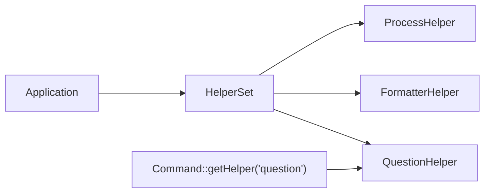

# Console Helpers

!!! tip "In a nutshell"
    Les helpers sont des widgets d'interface CLI réutilisables — prompts, barres de
    progression, tableaux — accessibles via le `HelperSet` de la commande. À retenir
    pour l'examen : une commande classique en récupère un par son nom avec
    `$this->getHelper('question')`, tandis que `SymfonyStyle` enveloppe la plupart des
    helpers, si bien que vous les récupérez rarement à la main.

!!! example "Real-world analogy"
    Les helpers sont comme l'armoire à outils partagée d'un atelier : le mètre ruban,
    l'étiqueteuse et le panneau perforé sont des outils réutilisables que tout le monde
    vient chercher, et vous obtenez un outil précis en le demandant par son nom
    (`$this->getHelper('question')`) à l'armoire (le `HelperSet`). Un `SymfonyStyle`,
    c'est le multi-outil accroché à votre ceinture — il regroupe déjà le mètre ruban et
    l'étiqueteuse, si bien que pour les tâches courantes vous n'avez presque jamais
    besoin d'aller ouvrir l'armoire.

!!! abstract "Learning objectives"
    À la fin de ce chapitre, vous saurez :

    - [ ] Interroger l'utilisateur avec le `QuestionHelper` (ask, hidden, confirm, choice)
    - [ ] Afficher une progression avec `ProgressBar` et des données avec `Table`
    - [ ] Formater du texte avec le `FormatterHelper` et déplacer le `Cursor`
    - [ ] Expliquer le `HelperSet` et comment une commande accède à ses helpers

    **Syllabus:** `Console → Helpers` ·
    **Level:** Advanced ·
    **Est. time:** 25 min ·
    **Prerequisites:** [Input & output](input-output.md)

---

## Pour les nuls

### L'idée en une phrase
Les helpers sont des widgets d'interface réutilisables (prompts, barres de progression, tableaux) accessibles via le `HelperSet` de la commande.

### Imagine dans la vraie vie
Les helpers sont l'armoire à outils partagée d'un atelier : le mètre ruban, l'étiqueteuse et le tableau perforé sont des outils réutilisables que tout le monde va chercher, en le demandant par nom (`$this->getHelper('question')`) depuis l'armoire (le `HelperSet`).

### Dans Symfony
Une invite de confirmation avant une opération destructive (`$io->confirm('Supprimer tout ?', false)`) utilise en coulisses `QuestionHelper`, mais `SymfonyStyle` te l'offre déjà tout enveloppé — tu n'as presque jamais besoin d'aller chercher le helper toi-même.

### Exemple simple
```php
$progress = $io->createProgressBar(100);
$progress->advance();
```

### Comment le mémoriser 🧠
`SymfonyStyle` est le "couteau suisse" qui enveloppe déjà la plupart des helpers courants — tu n'as besoin de `getHelper()` explicitement que pour un besoin vraiment sur mesure.

---


## Theory

Les helpers sont des utilitaires d'interface réutilisables, disponibles pour chaque
commande via le **`HelperSet`**. Ceux qui comptent pour l'examen :

| Helper (FQCN suffix) | Rôle |
|---|---|
| `Helper\QuestionHelper` | Prompts interactifs |
| `Helper\ProgressBar` | Retour de progression |
| `Helper\Table` | Rendu tabulaire |
| `Helper\FormatterHelper` | Blocs de texte, troncature |
| `Cursor` | Déplacer/masquer le curseur du terminal |

`SymfonyStyle` enveloppe la plupart d'entre eux, mais vous pouvez les utiliser
directement pour un contrôle plus fin.

```php
// SymfonyStyle wraps the widgets from the HelperSet behind one styled API
$name = $io->ask('Name?');                  // QuestionHelper under the hood
$io->progressStart(10);                     // ProgressBar under the hood
$io->progressFinish();
$io->table(['Id'], [[1], [2]]);             // Table under the hood
```

!!! question "Predict first"
    Dans un `Command::execute()` classique, comment obtenez-vous le
    `QuestionHelper` pour interroger l'utilisateur — et d'où vient-il ?

??? note "Reveal"
    Appelez `$this->getHelper('question')` ; les helpers sont récupérés **par leur nom
    (une chaîne)** depuis le `HelperSet` que l'Application remplit. Dans les commandes
    invokables, vous ne pouvez pas appeler `$this->getHelper()` — tournez-vous vers
    `SymfonyStyle`, qui enveloppe la plupart des helpers.

## Deep Dive — how it works internally

Une `Command` classique obtient ses helpers depuis
`Symfony\Component\Console\Helper\HelperSet`, rempli par l'`Application`. Dans
`execute()`, vous appelez `$this->getHelper('question')`, qui retourne le
`Symfony\Component\Console\Helper\QuestionHelper` enregistré. L'ensemble est indexé
par nom de helper (`question`, `formatter`, `process`, `debug_formatter`).

```php
// Inside a classic Command::execute(): fetch a helper by its string name
/** @var QuestionHelper $helper */
$helper = $this->getHelper('question');      // resolved from the HelperSet

// Other registered names: 'formatter', 'process', 'debug_formatter'
$formatter = $this->getHelper('formatter');
```

`QuestionHelper::ask(InputInterface, OutputInterface, Question)` lit depuis STDIN. Il
accepte :

- `Symfony\Component\Console\Question\Question` — texte libre (avec valeur par défaut,
  validator, normalizer, autocomplétion).
- `Symfony\Component\Console\Question\ConfirmationQuestion` — oui/non.
- `Symfony\Component\Console\Question\ChoiceQuestion` — choix dans une liste (sélection
  simple ou multiple).

La saisie masquée (`setHidden(true)`) empêche le terminal d'afficher les caractères —
pour les mots de passe.

```php
$q1 = new Question('Project name?', 'demo');            // free text with a default
$q2 = new ConfirmationQuestion('Continue?', true);      // yes/no
$q3 = new ChoiceQuestion('Env?', ['dev', 'prod'], 0);   // pick from a list

$secret = new Question('API token?');
$secret->setHidden(true);                               // no terminal echo (passwords)

// QuestionHelper::ask(InputInterface, OutputInterface, Question) reads STDIN
$name = $helper->ask($input, $output, $q1);
```

`Symfony\Component\Console\Helper\ProgressBar` suit un compteur d'étapes ; appelez
`start($max)`, `advance()`, `setProgress($n)`, `finish()`. Elle se redessine sur place
et son redessin peut être limité (`setRedrawFrequency()`), ce qui est important pour
des millions de petites étapes afin d'éviter la surcharge d'I/O.

```php
$bar = new ProgressBar($output);
$bar->setRedrawFrequency(100);   // redraw every 100 steps only (I/O throttle)
$bar->start(1_000_000);          // start($max): begin tracking the step count
$bar->advance();                 // +1 step
$bar->setProgress(500_000);      // jump to an absolute step
$bar->finish();                  // complete and render the final state
```

`Symfony\Component\Console\Cursor` émet des séquences d'échappement ANSI pour
déplacer, masquer/afficher le curseur ou effacer des lignes — la primitive derrière
les affichages mis à jour en direct.



!!! note "Source reference"
    `HelperSet`, `QuestionHelper`, `ProgressBar`, `Table` —
    [symfony/symfony `8.0`](https://github.com/symfony/symfony/tree/8.0/src/Symfony/Component/Console/Helper).

## Configuration & code

=== "QuestionHelper (SymfonyStyle)"

    ```php
    <?php
    declare(strict_types=1);

    namespace App\Command;

    use Symfony\Component\Console\Attribute\AsCommand;
    use Symfony\Component\Console\Command\Command;
    use Symfony\Component\Console\Style\SymfonyStyle;

    #[AsCommand(name: 'app:setup')]
    final class SetupCommand
    {
        public function __invoke(SymfonyStyle $io): int
        {
            $name = $io->ask('Project name?', 'demo');
            $pass = $io->askHidden('Database password?');
            $env  = $io->choice('Environment?', ['dev', 'prod'], 'dev');

            if (!$io->confirm(sprintf('Create %s in %s?', $name, $env))) {
                return Command::SUCCESS;
            }

            return Command::SUCCESS;
        }
    }
    ```

=== "QuestionHelper (raw)"

    ```php
    <?php
    declare(strict_types=1);

    namespace App\Command;

    use Symfony\Component\Console\Attribute\AsCommand;
    use Symfony\Component\Console\Command\Command;
    use Symfony\Component\Console\Helper\QuestionHelper;
    use Symfony\Component\Console\Input\InputInterface;
    use Symfony\Component\Console\Output\OutputInterface;
    use Symfony\Component\Console\Question\ChoiceQuestion;

    #[AsCommand(name: 'app:pick')]
    final class PickCommand extends Command
    {
        protected function execute(InputInterface $input, OutputInterface $output): int
        {
            /** @var QuestionHelper $helper */
            $helper = $this->getHelper('question');
            $question = new ChoiceQuestion('Color?', ['red', 'green', 'blue'], 0);
            $color = $helper->ask($input, $output, $question);
            $output->writeln('Chosen: '.$color);

            return Command::SUCCESS;
        }
    }
    ```

=== "ProgressBar & Table"

    ```php
    <?php
    declare(strict_types=1);

    use Symfony\Component\Console\Helper\ProgressBar;
    use Symfony\Component\Console\Helper\Table;
    use Symfony\Component\Console\Output\OutputInterface;

    function render(OutputInterface $output): void
    {
        $bar = new ProgressBar($output, 100);
        $bar->setRedrawFrequency(10);
        $bar->start();
        for ($i = 0; $i < 100; ++$i) {
            $bar->advance();
        }
        $bar->finish();

        (new Table($output))
            ->setHeaders(['Id', 'Name'])
            ->setRows([[1, 'Ada'], [2, 'Linus']])
            ->render();
    }
    ```

## Best practices & anti-patterns

| ✅ À faire | ❌ À éviter |
|---|---|
| Utiliser les raccourcis de prompt de `SymfonyStyle` | Câbler le `QuestionHelper` à la main sans nécessité |
| `askHidden()` pour les secrets | Afficher les mots de passe avec `ask()` |
| Limiter les redessins de la `ProgressBar` quand il y a beaucoup d'étapes | Redessiner à chaque micro-étape |
| Fournir une valeur par défaut dans les prompts | Bloquer indéfiniment sur une entrée non interactive |

## When (not) to use it / alternatives

Les prompts exigent un TTY **interactif** ; protégez-vous avec `isInteractive()` et
fournissez des valeurs par défaut pour que `--no-interaction` et la CI continuent de
fonctionner. Pour une sortie de données pure, préférez `Table` ; pour l'état
d'avancement, utilisez `ProgressBar` ou les output sections. `Cursor` est bas niveau —
n'y recourez que lorsque `SymfonyStyle`/les sections ne peuvent pas exprimer l'effet
voulu.

!!! danger "Certification traps"
    - `getHelper('question')` retourne un `QuestionHelper` ; le nom du helper est une
      clé de type **string** dans le `HelperSet`.
    - `ChoiceQuestion` prend en charge la sélection multiple via `setMultiselect(true)`.
    - Les commandes invokables ne peuvent pas appeler `$this->getHelper()` ;
      injectez/construisez le helper ou utilisez `SymfonyStyle`.
    - `ProgressBar::setRedrawFrequency()` est un réglage de **performance**, pas
      cosmétique.

!!! warning "Common mistakes"
    - Interroger l'utilisateur sous `--no-interaction` sans valeur par défaut →
      valeur vide/`null`.
    - Oublier d'appeler `finish()` sur une `ProgressBar`, laissant une barre
      incomplète.

## Exercises

1. **(Basic)** Demandez un nom d'utilisateur (par défaut `admin`) et un mot de passe
   masqué avec `SymfonyStyle`.
2. **(Intermediate)** Affichez une `ProgressBar` de 50 étapes avec une fréquence de
   redessin de 5, puis une `Table` de deux lignes.

??? success "Solutions"

    **1.**

    ```php
    $user = $io->ask('Username', 'admin');
    $pass = $io->askHidden('Password');
    ```

    **2.**

    ```php
    $bar = new ProgressBar($output, 50);
    $bar->setRedrawFrequency(5);
    $bar->start();
    for ($i = 0; $i < 50; ++$i) { $bar->advance(); }
    $bar->finish();

    (new Table($output))->setHeaders(['A', 'B'])->setRows([[1, 2], [3, 4]])->render();
    ```

## Certification questions

??? question "Q1. How does a classic command obtain the QuestionHelper?"
    - [x] A. `$this->getHelper('question')` ✅
    - [ ] B. `new QuestionHelper($input)`
    - [ ] C. `$this->getApplication()->question()`
    - [ ] D. `SymfonyStyle::helper()`

    **Why:** les helpers sont récupérés par leur nom depuis le `HelperSet`. **Ref:**
    [QuestionHelper](https://symfony.com/doc/8.0/components/console/helpers/questionhelper.html).

??? question "Q2. Which question type offers a fixed list of answers?"
    - [ ] A. `Question`
    - [ ] B. `ConfirmationQuestion`
    - [x] C. `ChoiceQuestion` ✅
    - [ ] D. `HiddenQuestion`

    **Why:** `ChoiceQuestion` présente des options sélectionnables. **Ref:**
    [QuestionHelper](https://symfony.com/doc/8.0/components/console/helpers/questionhelper.html).

??? question "Q3. What does `ProgressBar::setRedrawFrequency(100)` change?"
    - [x] A. It only redraws every 100 steps, reducing I/O ✅
    - [ ] B. It sets the total to 100
    - [ ] C. It caps the bar width to 100 chars
    - [ ] D. It sleeps 100 ms per step

    **Why:** limiter le redessin évite des I/O terminal à chaque petite étape. **Ref:**
    [ProgressBar](https://symfony.com/doc/8.0/components/console/helpers/progressbar.html).

??? question "Q4. Which helper hides/moves the terminal cursor?"
    - [ ] A. `FormatterHelper`
    - [ ] B. `Table`
    - [x] C. `Cursor` ✅
    - [ ] D. `ProgressBar`

    **Why:** `Symfony\Component\Console\Cursor` émet les codes ANSI du curseur. **Ref:**
    [Console helpers](https://symfony.com/doc/8.0/components/console/helpers/index.html).

## Key takeaways

- Les helpers proviennent du `HelperSet` ; récupérez-les par nom avec `getHelper()`.
- `QuestionHelper` : `Question`, `ConfirmationQuestion`, `ChoiceQuestion` ; saisie
  masquée pour les secrets.
- `ProgressBar` et `Table` affichent progression/données ; limitez les redessins à
  grande échelle.
- `Cursor` est la primitive bas niveau ; `SymfonyStyle` couvre la plupart des besoins.

## Last-minute revision

!!! tip "Cheat sheet"
    - `getHelper('question'|'formatter'|'process')`.
    - `ask`/`askHidden`/`confirm`/`choice` via `SymfonyStyle`.
    - `ProgressBar` : `start($max)`, `advance()`, `finish()`.
    - `Table` : `setHeaders()`, `setRows()`, `render()`.

## Connections

- **Depends on:** [Input & output](input-output.md) — les helpers affichent via
  `OutputInterface`, et `SymfonyStyle` enveloppe la plupart d'entre eux.
- **Reused in:** [Custom commands](custom-commands.md) — prompts, tableaux et barres de
  progression sont la façon dont ces commandes dialoguent avec l'utilisateur.
- **Confused with:** [Input & output](input-output.md) — `SymfonyStyle` *est* la façade
  stylée au-dessus de ces helpers, donc vous les récupérez rarement à la main.

## Official References
- [Official Symfony docs — Console helpers](https://symfony.com/doc/8.0/components/console/helpers/index.html)
- [Official Symfony docs — QuestionHelper](https://symfony.com/doc/8.0/components/console/helpers/questionhelper.html)
- [Symfony source — Console helpers](https://github.com/symfony/symfony/tree/8.0/src/Symfony/Component/Console/Helper)

## Video references

!!! tip "Watch & learn"
    Voici des chaînes vidéo officielles, mises à jour en continu — cherchez-y
    « Symfony console » pour consolider ce chapitre. Nous lions des chaînes stables
    plutôt que des vidéos individuelles afin que les références ne périment jamais.

    - [SymfonyCasts screencasts](https://symfonycasts.com/tracks/symfony) — tutoriels scénarisés à suivre en codant.
    - [Symfony official YouTube](https://www.youtube.com/@SymfonyOfficial) — conférences et keynotes SymfonyCon.
    - [Official docs for this topic](https://symfony.com/doc/8.0/components/console/helpers/questionhelper.html) — certaines pages de la doc Symfony intègrent un screencast.

## Confidence check

Je suis prêt quand je peux :

- [ ] expliquer **pourquoi** les helpers existent (widgets d'interface CLI réutilisables partagés entre commandes)
- [ ] interroger l'utilisateur, afficher une `Table` et une `ProgressBar` avec Symfony 8
- [ ] déboguer un prompt qui bloque ou retourne `null` sous `--no-interaction`
- [ ] repérer le piège : les commandes invokables ne peuvent pas appeler `$this->getHelper()`
- [ ] expliquer le `HelperSet` et comment `getHelper('question')` résout un helper

---

<small>Related: [Input & output](input-output.md) · [Custom commands](custom-commands.md) · [Verbosity](verbosity.md)</small>
