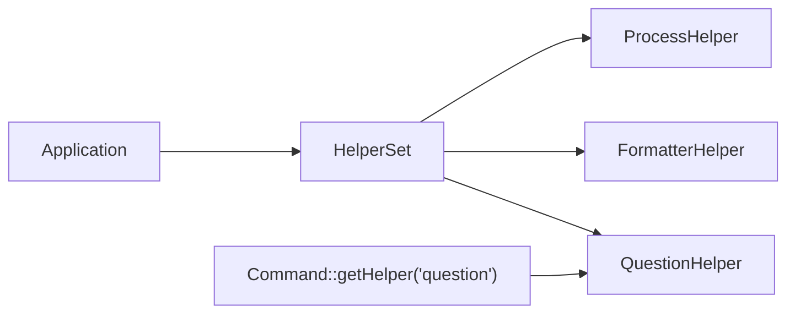

# Console Helpers

!!! tip "In a nutshell"
    Helpers are reusable CLI UI widgets — prompts, progress bars, tables — reached
    through the command's `HelperSet`. Remember for the exam: a classic command
    grabs one by name with `$this->getHelper('question')`, while `SymfonyStyle`
    wraps most helpers so you rarely fetch them by hand.

!!! example "Real-world analogy"
    Helpers are like the shared tool cabinet in a workshop: the tape measure, the label
    maker and the pegboard are reusable widgets everyone reaches for, and you fetch a
    specific one by asking for it by name (`$this->getHelper('question')`) from the
    cabinet (the `HelperSet`). A `SymfonyStyle` is the multi-tool clipped to your belt — it
    already bundles the tape measure and label maker together, so for everyday jobs you
    rarely need to walk over and open the cabinet at all.

!!! abstract "Learning objectives"
    By the end of this chapter you can:

    - [ ] Prompt with `QuestionHelper` (ask, hidden, confirm, choice)
    - [ ] Render progress with `ProgressBar` and data with `Table`
    - [ ] Format text with `FormatterHelper` and move the `Cursor`
    - [ ] Explain the `HelperSet` and how a command reaches its helpers

    **Syllabus:** `Console → Helpers` ·
    **Level:** Advanced ·
    **Est. time:** 25 min ·
    **Prerequisites:** [Input & output](input-output.md)

    **Examen Symfony 8 :** OUI

---

## Pour les nuls

### L'idée en une phrase
Les helpers sont des widgets d'interface réutilisables (prompts, barres de progression, tableaux) accessibles via le `HelperSet` de la commande.

### Imagine dans la vraie vie
Les helpers sont l'armoire à outils partagée d'un atelier : le mètre ruban, l'étiqueteuse et le tableau perforé sont des outils réutilisables que tout le monde va chercher, en le demandant par nom (`$this->getHelper('question')`) depuis l'armoire (le `HelperSet`).

### Dans Symfony
Une invite de confirmation avant une opération destructive (`$io->confirm('Supprimer tout ?', false)`) utilise en coulisses `QuestionHelper`, mais `SymfonyStyle` te l'offre déjà tout enveloppé — tu n'as presque jamais besoin d'aller chercher le helper toi-même.

### Exemple simple
```php
$progress = $io->createProgressBar(100);
$progress->advance();
```

### Comment le mémoriser 🧠
`SymfonyStyle` est le "couteau suisse" qui enveloppe déjà la plupart des helpers courants — tu n'as besoin de `getHelper()` explicitement que pour un besoin vraiment sur mesure.

---

## Theory

Helpers are reusable UI utilities available to every command through the
**`HelperSet`**. The exam-relevant ones:

| Helper (FQCN suffix) | Does |
|---|---|
| `Helper\QuestionHelper` | Interactive prompts |
| `Helper\ProgressBar` | Progress feedback |
| `Helper\Table` | Tabular rendering |
| `Helper\FormatterHelper` | Text blocks, truncation |
| `Cursor` | Move/hide the terminal cursor |

`SymfonyStyle` wraps most of these, but you can use them directly for finer control.

```php
// SymfonyStyle wraps the widgets from the HelperSet behind one styled API
$name = $io->ask('Name?');                  // QuestionHelper under the hood
$io->progressStart(10);                     // ProgressBar under the hood
$io->progressFinish();
$io->table(['Id'], [[1], [2]]);             // Table under the hood
```

!!! question "Predict first"
    Inside a classic `Command::execute()`, how do you get hold of the
    `QuestionHelper` to prompt the user — and where does it come from?

??? note "Reveal"
    Call `$this->getHelper('question')`; helpers are fetched **by string name** from
    the `HelperSet` the Application populates. In invokable commands you cannot call
    `$this->getHelper()` — reach for `SymfonyStyle`, which wraps most helpers.

## Deep Dive — how it works internally

A classic `Command` gets its helpers from
`Symfony\Component\Console\Helper\HelperSet`, populated by the `Application`. Inside
`execute()` you call `$this->getHelper('question')`, which returns the registered
`Symfony\Component\Console\Helper\QuestionHelper`. The set is keyed by helper name
(`question`, `formatter`, `process`, `debug_formatter`).

```php
// Inside a classic Command::execute(): fetch a helper by its string name
/** @var QuestionHelper $helper */
$helper = $this->getHelper('question');      // resolved from the HelperSet

// Other registered names: 'formatter', 'process', 'debug_formatter'
$formatter = $this->getHelper('formatter');
```

`QuestionHelper::ask(InputInterface, OutputInterface, Question)` reads from STDIN. It
accepts:

- `Symfony\Component\Console\Question\Question` — free text (with default, validator,
  normalizer, autocompletion).
- `Symfony\Component\Console\Question\ConfirmationQuestion` — yes/no.
- `Symfony\Component\Console\Question\ChoiceQuestion` — pick from a list (single or
  multi-select).

Hidden input (`setHidden(true)`) stops the terminal echoing — for passwords.

```php
$q1 = new Question('Project name?', 'demo');            // free text with a default
$q2 = new ConfirmationQuestion('Continue?', true);      // yes/no
$q3 = new ChoiceQuestion('Env?', ['dev', 'prod'], 0);   // pick from a list

$secret = new Question('API token?');
$secret->setHidden(true);                               // no terminal echo (passwords)

// QuestionHelper::ask(InputInterface, OutputInterface, Question) reads STDIN
$name = $helper->ask($input, $output, $q1);
```

`Symfony\Component\Console\Helper\ProgressBar` tracks a step count; call
`start($max)`, `advance()`, `setProgress($n)`, `finish()`. It redraws in place and
can be redraw-throttled (`setRedrawFrequency()`), important for millions of tiny
steps to avoid I/O overhead.

```php
$bar = new ProgressBar($output);
$bar->setRedrawFrequency(100);   // redraw every 100 steps only (I/O throttle)
$bar->start(1_000_000);          // start($max): begin tracking the step count
$bar->advance();                 // +1 step
$bar->setProgress(500_000);      // jump to an absolute step
$bar->finish();                  // complete and render the final state
```

`Symfony\Component\Console\Cursor` issues ANSI escapes to move, hide/show, or clear
lines — the primitive behind live-updating output.



!!! note "Source reference"
    `HelperSet`, `QuestionHelper`, `ProgressBar`, `Table` —
    [symfony/symfony `8.0`](https://github.com/symfony/symfony/blob/8.0/src/Symfony/Component/Console/Helper).

## Configuration & code

=== "QuestionHelper (SymfonyStyle)"

    ```php
    <?php
    declare(strict_types=1);

    namespace App\Command;

    use Symfony\Component\Console\Attribute\AsCommand;
    use Symfony\Component\Console\Command\Command;
    use Symfony\Component\Console\Style\SymfonyStyle;

    #[AsCommand(name: 'app:setup')]
    final class SetupCommand
    {
        public function __invoke(SymfonyStyle $io): int
        {
            $name = $io->ask('Project name?', 'demo');
            $pass = $io->askHidden('Database password?');
            $env  = $io->choice('Environment?', ['dev', 'prod'], 'dev');

            if (!$io->confirm(sprintf('Create %s in %s?', $name, $env))) {
                return Command::SUCCESS;
            }

            return Command::SUCCESS;
        }
    }
    ```

=== "QuestionHelper (raw)"

    ```php
    <?php
    declare(strict_types=1);

    namespace App\Command;

    use Symfony\Component\Console\Attribute\AsCommand;
    use Symfony\Component\Console\Command\Command;
    use Symfony\Component\Console\Helper\QuestionHelper;
    use Symfony\Component\Console\Input\InputInterface;
    use Symfony\Component\Console\Output\OutputInterface;
    use Symfony\Component\Console\Question\ChoiceQuestion;

    #[AsCommand(name: 'app:pick')]
    final class PickCommand extends Command
    {
        protected function execute(InputInterface $input, OutputInterface $output): int
        {
            /** @var QuestionHelper $helper */
            $helper = $this->getHelper('question');
            $question = new ChoiceQuestion('Color?', ['red', 'green', 'blue'], 0);
            $color = $helper->ask($input, $output, $question);
            $output->writeln('Chosen: '.$color);

            return Command::SUCCESS;
        }
    }
    ```

=== "ProgressBar & Table"

    ```php
    <?php
    declare(strict_types=1);

    use Symfony\Component\Console\Helper\ProgressBar;
    use Symfony\Component\Console\Helper\Table;
    use Symfony\Component\Console\Output\OutputInterface;

    function render(OutputInterface $output): void
    {
        $bar = new ProgressBar($output, 100);
        $bar->setRedrawFrequency(10);
        $bar->start();
        for ($i = 0; $i < 100; ++$i) {
            $bar->advance();
        }
        $bar->finish();

        (new Table($output))
            ->setHeaders(['Id', 'Name'])
            ->setRows([[1, 'Ada'], [2, 'Linus']])
            ->render();
    }
    ```

## Best practices & anti-patterns

| ✅ Do | ❌ Avoid |
|---|---|
| Use `SymfonyStyle` prompt shortcuts | Wiring `QuestionHelper` by hand needlessly |
| `askHidden()` for secrets | Echoing passwords with `ask()` |
| Throttle `ProgressBar` redraws for many steps | Redrawing on every micro-step |
| Provide a default in prompts | Blocking forever on non-interactive input |

## When (not) to use it / alternatives

Prompts require an **interactive** TTY; guard with `isInteractive()` and supply
defaults so `--no-interaction` and CI still work. For pure data output prefer
`Table`; for status use `ProgressBar` or output sections. `Cursor` is low-level —
use it only when `SymfonyStyle`/sections cannot express the effect.

!!! danger "Certification traps"
    - `getHelper('question')` returns a `QuestionHelper`; the helper name is a
      **string** key in the `HelperSet`.
    - `ChoiceQuestion` supports multiselect via `setMultiselect(true)`.
    - Invokable commands cannot call `$this->getHelper()`; inject/build the helper
      or use `SymfonyStyle`.
    - `ProgressBar::setRedrawFrequency()` is a **performance** knob, not cosmetic.

!!! warning "Common mistakes"
    - Prompting under `--no-interaction` with no default → empty/`null` value.
    - Forgetting to call `finish()` on a `ProgressBar`, leaving a partial bar.

## Exercises

1. **(Basic)** Ask for a username (default `admin`) and a hidden password using
   `SymfonyStyle`.
2. **(Intermediate)** Render a 50-step `ProgressBar` with a redraw frequency of 5,
   then a two-row `Table`.

??? success "Solutions"

    **1.**

    ```php
    $user = $io->ask('Username', 'admin');
    $pass = $io->askHidden('Password');
    ```

    **2.**

    ```php
    $bar = new ProgressBar($output, 50);
    $bar->setRedrawFrequency(5);
    $bar->start();
    for ($i = 0; $i < 50; ++$i) { $bar->advance(); }
    $bar->finish();

    (new Table($output))->setHeaders(['A', 'B'])->setRows([[1, 2], [3, 4]])->render();
    ```

## Certification questions

*Question d'entraînement inspirée du syllabus — jamais une question officielle de l'examen.*

??? question "Q1. How does a classic command obtain the QuestionHelper?"
    - [x] A. `$this->getHelper('question')` ✅
    - [ ] B. `new QuestionHelper($input)`
    - [ ] C. `$this->getApplication()->question()`
    - [ ] D. `SymfonyStyle::helper()`

    **Why:** helpers are fetched by name from the `HelperSet`. **Ref:**
    [QuestionHelper](https://symfony.com/doc/8.0/components/console/helpers/questionhelper.html).

??? question "Q2. Which question type offers a fixed list of answers?"
    - [ ] A. `Question`
    - [ ] B. `ConfirmationQuestion`
    - [x] C. `ChoiceQuestion` ✅
    - [ ] D. `HiddenQuestion`

    **Why:** `ChoiceQuestion` presents selectable options. **Ref:**
    [QuestionHelper](https://symfony.com/doc/8.0/components/console/helpers/questionhelper.html).

??? question "Q3. What does `ProgressBar::setRedrawFrequency(100)` change?"
    - [x] A. It only redraws every 100 steps, reducing I/O ✅
    - [ ] B. It sets the total to 100
    - [ ] C. It caps the bar width to 100 chars
    - [ ] D. It sleeps 100 ms per step

    **Why:** redraw throttling avoids terminal I/O on every tiny step. **Ref:**
    [ProgressBar](https://symfony.com/doc/8.0/components/console/helpers/progressbar.html).

??? question "Q4. Which helper hides/moves the terminal cursor?"
    - [ ] A. `FormatterHelper`
    - [ ] B. `Table`
    - [x] C. `Cursor` ✅
    - [ ] D. `ProgressBar`

    **Why:** `Symfony\Component\Console\Cursor` issues cursor ANSI codes. **Ref:**
    [Console helpers](https://symfony.com/doc/8.0/components/console/helpers/index.html).

## Key takeaways

- Helpers come from the `HelperSet`; fetch by name with `getHelper()`.
- `QuestionHelper`: `Question`, `ConfirmationQuestion`, `ChoiceQuestion`; hidden for
  secrets.
- `ProgressBar` and `Table` render progress/data; throttle redraws for scale.
- `Cursor` is the low-level primitive; `SymfonyStyle` covers most needs.

## Last-minute revision

!!! tip "Cheat sheet"
    - `getHelper('question'|'formatter'|'process')`.
    - `ask`/`askHidden`/`confirm`/`choice` via `SymfonyStyle`.
    - `ProgressBar`: `start($max)`, `advance()`, `finish()`.
    - `Table`: `setHeaders()`, `setRows()`, `render()`.

## Connections

- **Depends on:** [Input & output](input-output.md) — helpers render through
  `OutputInterface`, and `SymfonyStyle` wraps most of them.
- **Reused in:** [Custom commands](custom-commands.md) — prompts, tables and progress
  bars are how those commands talk to a user.
- **Confused with:** [Input & output](input-output.md) — `SymfonyStyle` *is* the styled
  facade over these helpers, so you rarely fetch them by hand.

## Official References
- [Official Symfony docs — Console helpers](https://symfony.com/doc/8.0/components/console/helpers/index.html)
- [Official Symfony docs — QuestionHelper](https://symfony.com/doc/8.0/components/console/helpers/questionhelper.html)
- [Symfony source — Console helpers](https://github.com/symfony/symfony/blob/8.0/src/Symfony/Component/Console/Helper)

## Video references

!!! tip "Watch & learn"
    These are official, continuously-updated video channels — search them for
    "Symfony console" to reinforce this chapter. We link stable channels rather than
    individual videos so the references never rot.

    - [SymfonyCasts screencasts](https://symfonycasts.com/tracks/symfony) — scripted, code-along tutorials.
    - [Symfony official YouTube](https://www.youtube.com/@SymfonyOfficial) — SymfonyCon conference talks & keynotes.
    - [Official docs for this topic](https://symfony.com/doc/8.0/components/console/helpers/questionhelper.html) — some Symfony doc pages embed a screencast.

## Confidence check

I'm ready when I can:

- [ ] explain **why** helpers exist (reusable CLI UI widgets shared across commands)
- [ ] prompt, render a `Table` and a `ProgressBar` in Symfony 8
- [ ] debug a prompt that hangs or returns `null` under `--no-interaction`
- [ ] spot the trick that invokable commands can't call `$this->getHelper()`
- [ ] explain the `HelperSet` and how `getHelper('question')` resolves a helper

---

<small>Related: [Input & output](input-output.md) · [Custom commands](custom-commands.md) · [Verbosity](verbosity.md)</small>
