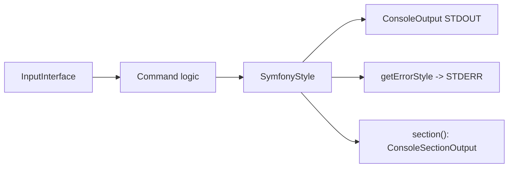

# Input & Output

!!! tip "In a nutshell"
    Les commandes lisent via `InputInterface` et écrivent via `OutputInterface`, mais
    `SymfonyStyle` est l'enveloppe stylée à privilégier par défaut. À retenir pour
    l'examen : STDERR s'obtient avec `getErrorOutput()`, qui n'existe que sur
    `ConsoleOutputInterface` — gardez les données destinées aux pipes sur STDOUT.

!!! example "Real-world analogy"
    Un drive de fast-food a deux canaux clairement séparés. Vous énoncez votre commande
    dans le micro (l'entrée, lue via `InputInterface`) et vous recevez votre repas au
    guichet (la sortie, écrite via `OutputInterface`) ; un équipier bien formé, avec son
    casque et son script bien rodé, c'est la couche stylée `SymfonyStyle` au-dessus des
    deux. Point crucial : le sac de nourriture que vous emportez (STDOUT, les données
    envoyées dans le pipe) sort par un guichet tandis que toute réclamation ou l'annonce
    « plus de frites » passe par un haut-parleur séparé (STDERR, `getErrorOutput()`),
    de sorte que les deux flux ne se mélangent jamais.

!!! abstract "Learning objectives"
    À la fin de ce chapitre, vous saurez :

    - [ ] Lire des valeurs via `InputInterface`
    - [ ] Écrire via `OutputInterface` et choisir la bonne verbosité
    - [ ] Construire des interfaces riches avec `SymfonyStyle` (title, table, progress, prompts)
    - [ ] Utiliser les output sections et router les erreurs vers STDERR

    **Syllabus:** `Console → Input & Output` ·
    **Level:** Advanced ·
    **Est. time:** 30 min ·
    **Prerequisites:** [Arguments & options](options-arguments.md)

---

## Theory

Chaque commande communique avec le monde extérieur via deux contrats :

- **`Symfony\Component\Console\Input\InputInterface`** — lire arguments et options :
  `getArgument()`, `getOption()`, `hasArgument()`, `isInteractive()`.
- **`Symfony\Component\Console\Output\OutputInterface`** — écrire du texte :
  `write()`, `writeln()`, plus verbosité et formatage.

Au-dessus se trouve **`Symfony\Component\Console\Style\SymfonyStyle`**, le helper
recommandé qui enveloppe les deux dans une API cohérente et stylée — l'examen attend
de vous que vous la connaissiez.

```php
// InputInterface: read what was typed
$path  = $input->getArgument('path');     // positional value
$force = $input->getOption('force');      // named value / flag
$hasIt = $input->hasArgument('path');     // is it defined?
$tty   = $input->isInteractive();         // can we prompt the user?

// OutputInterface: write text
$output->write('no newline');             // write()
$output->writeln('with newline');         // writeln()

// SymfonyStyle: the styled wrapper over both contracts
$io = new SymfonyStyle($input, $output);
$io->success('Done.');
```

!!! question "Predict first"
    Vous voulez des messages de progression sur STDERR tout en envoyant des données
    dans un pipe sur STDOUT. Pouvez-vous appeler `getErrorOutput()` sur n'importe
    quel `OutputInterface` ?

??? note "Reveal"
    Non. `getErrorOutput()` n'existe que sur `ConsoleOutputInterface`, pas sur
    l'`OutputInterface` de base. Protégez l'appel avec un `instanceof`, sinon une
    sortie ordinaire lève une erreur de type. Router les messages d'état vers STDERR
    garde propres les données STDOUT envoyées dans le pipe.

## Deep Dive — how it works internally

`SymfonyStyle` implémente `StyleInterface` et `OutputInterface`, décorant la sortie
sous-jacente et tirant un `QuestionHelper` pour les prompts. Ses méthodes produisent
le rendu standard de Symfony (espacement, blocs colorés). Méthodes clés :

| Méthode | Effet |
|---|---|
| `title()` / `section()` | Titres |
| `text()` / `listing()` | Paragraphes / liste à puces |
| `table(headers, rows)` | Tableau formaté |
| `progressBar()` / `progressStart/advance/finish` | Interface de progression |
| `ask()` / `askHidden()` / `confirm()` / `choice()` | Prompts |
| `success()` / `warning()` / `error()` / `note()` / `caution()` | Blocs de résultat |

```php
$io->title('Import');                          // heading
$io->section('Validation');                    // sub-heading
$io->text('Checking rows...');                 // paragraph
$io->listing(['row 1', 'row 2']);              // bullet list
$io->table(['Id', 'Name'], [[1, 'Ada']]);      // table(headers, rows)

$io->progressStart(2);                         // progress UI
$io->progressAdvance();
$io->progressFinish();

$answer = $io->ask('Name?', 'demo');           // prompts
$secret = $io->askHidden('Password?');
$ok     = $io->confirm('Proceed?', true);
$env    = $io->choice('Env?', ['dev', 'prod']);

$io->success('OK'); $io->warning('Careful');   // result blocks
$io->error('Boom'); $io->note('FYI'); $io->caution('Danger');
```

La sortie CLI concrète est `Symfony\Component\Console\Output\ConsoleOutput`, qui
implémente `ConsoleOutputInterface` et expose **deux flux** :

- **STDOUT** — sortie normale.
- **STDERR** — `getErrorOutput()`. `SymfonyStyle::getErrorStyle()` écrit ici.

Router les erreurs et la progression vers STDERR garde propre le STDOUT envoyé dans
un pipe (par exemple `bin/console app:export > data.csv` affiche quand même la
progression dans le terminal).

```php
if ($output instanceof ConsoleOutputInterface) {
    // STDERR: status that must not pollute piped STDOUT data
    $output->getErrorOutput()->writeln('Exporting...');
}

// Same idea through SymfonyStyle
$io->getErrorStyle()->writeln('Exporting...');   // writes to STDERR
```

Les **output sections** (`ConsoleSectionOutput`, créées par `$output->section()`) sont
des zones réinscriptibles indépendamment : vous pouvez `overwrite()` ou `clear()` une
section sans perturber les autres — la base de plusieurs barres de progression
simultanées.

```php
$progress = $output->section();            // ConsoleSectionOutput
$log      = $output->section();

$progress->writeln('Progress: 0%');
$log->writeln('Started');
$progress->overwrite('Progress: 100%');    // rewrites only this section
$log->clear();                             // clears only the log section
```



!!! note "Source reference"
    `SymfonyStyle` et `ConsoleOutput::getErrorOutput()` —
    [symfony/symfony `8.0`](https://github.com/symfony/symfony/blob/8.0/src/Symfony/Component/Console/Style/SymfonyStyle.php).

## Configuration & code

=== "SymfonyStyle"

    ```php
    <?php
    declare(strict_types=1);

    namespace App\Command;

    use Symfony\Component\Console\Attribute\AsCommand;
    use Symfony\Component\Console\Command\Command;
    use Symfony\Component\Console\Style\SymfonyStyle;

    #[AsCommand(name: 'app:import', description: 'Import records')]
    final class ImportCommand
    {
        public function __invoke(SymfonyStyle $io): int
        {
            $io->title('Import');
            $io->section('Validating');

            if (!$io->confirm('Proceed?', true)) {
                $io->warning('Aborted.');

                return Command::SUCCESS;
            }

            $io->table(['Id', 'Name'], [[1, 'Ada'], [2, 'Linus']]);

            $io->progressStart(3);
            for ($i = 0; $i < 3; ++$i) {
                $io->progressAdvance();
            }
            $io->progressFinish();

            $io->success('Done.');

            return Command::SUCCESS;
        }
    }
    ```

=== "Raw Output + STDERR"

    ```php
    <?php
    declare(strict_types=1);

    namespace App\Command;

    use Symfony\Component\Console\Attribute\AsCommand;
    use Symfony\Component\Console\Command\Command;
    use Symfony\Component\Console\Output\ConsoleOutputInterface;
    use Symfony\Component\Console\Output\OutputInterface;
    use Symfony\Component\Console\Input\InputInterface;

    #[AsCommand(name: 'app:export')]
    final class ExportCommand extends Command
    {
        protected function execute(InputInterface $input, OutputInterface $output): int
        {
            $output->writeln('id,name');          // STDOUT (pipeable data)

            if ($output instanceof ConsoleOutputInterface) {
                $output->getErrorOutput()->writeln('Exporting…'); // STDERR
            }

            return Command::SUCCESS;
        }
    }
    ```

=== "Output sections"

    ```php
    // inside execute(), $output is ConsoleOutputInterface
    $section1 = $output->section();
    $section2 = $output->section();
    $section1->writeln('Downloading');
    $section2->writeln('Progress: 0%');
    $section2->overwrite('Progress: 100%');  // rewrites only section 2
    ```

## Best practices & anti-patterns

| ✅ À faire | ❌ À éviter |
|---|---|
| Utiliser `SymfonyStyle` pour l'interface utilisateur | Formater espacements/couleurs à la main |
| Envoyer les données sur STDOUT, les messages d'état sur STDERR | Mélanger la progression avec la sortie envoyée dans un pipe |
| Protéger `getErrorOutput()` avec un `instanceof` | Supposer que chaque `OutputInterface` sépare les flux |
| Utiliser les sections pour des mises à jour multi-lignes en direct | Réimprimer tout l'écran manuellement |

## When (not) to use it / alternatives

Utilisez `SymfonyStyle` dans presque toutes les commandes — c'est idiomatique et
testable. Recourez à l'`OutputInterface` brute quand vous avez besoin d'une sortie
exacte à l'octet près (CSV/JSON sur STDOUT), sans style. Les output sections brillent
pour les tableaux de bord de progression ; évitez-les pour des messages ponctuels.

!!! danger "Certification traps"
    - `getErrorOutput()` existe sur `ConsoleOutputInterface`, **pas** sur
      l'`OutputInterface` de base — vérifiez le type d'abord.
    - `SymfonyStyle` implémente `OutputInterface`, vous pouvez donc la passer partout
      où une sortie est attendue.
    - Les output **sections** exigent `ConsoleOutputInterface` (une vraie CLI), pas
      n'importe quelle sortie.
    - `write()` n'ajoute pas de retour à la ligne ; `writeln()` si.

!!! warning "Common mistakes"
    - Appeler `getErrorOutput()` sur une `OutputInterface` ordinaire — erreur de type
      fatale.
    - Supposer que `SymfonyStyle::error()` écrit sur STDOUT — elle utilise le flux
      d'erreur.

## Exercises

1. **(Basic)** Affichez un titre, un tableau à deux colonnes et un bloc de succès avec
   `SymfonyStyle`.
2. **(Intermediate)** Écrivez des lignes CSV sur STDOUT tout en émettant un message de
   progression sur STDERR uniquement lorsque la sortie le permet.

??? success "Solutions"

    **1.**

    ```php
    $io->title('Report');
    $io->table(['Metric', 'Value'], [['Users', 42], ['Orders', 7]]);
    $io->success('Generated.');
    ```

    **2.**

    ```php
    $output->writeln('id,total');
    if ($output instanceof ConsoleOutputInterface) {
        $output->getErrorOutput()->writeln('Working…');
    }
    ```

## Certification questions

??? question "Q1. Which method returns the STDERR stream in a CLI command?"
    - [ ] A. `OutputInterface::getErrorOutput()`
    - [x] B. `ConsoleOutputInterface::getErrorOutput()` ✅
    - [ ] C. `SymfonyStyle::stderr()`
    - [ ] D. `InputInterface::getError()`

    **Why:** la méthode de séparation des flux appartient à `ConsoleOutputInterface`. **Ref:**
    [Console verbosity](https://symfony.com/doc/current/console/verbosity.html).

??? question "Q2. `SymfonyStyle` requires which two constructor arguments?"
    - [x] A. `InputInterface` and `OutputInterface` ✅
    - [ ] B. `Application` and `Command`
    - [ ] C. `QuestionHelper` and `OutputInterface`
    - [ ] D. Only `OutputInterface`

    **Why:** elle enveloppe à la fois l'entrée (pour les prompts) et la sortie. **Ref:**
    [Console style](https://symfony.com/doc/current/console/style.html).

??? question "Q3. What does `$output->section()` return?"
    - [x] A. A `ConsoleSectionOutput` you can `overwrite()`/`clear()` ✅
    - [ ] B. A new `Application`
    - [ ] C. A `SymfonyStyle`
    - [ ] D. A boolean

    **Why:** les sections sont des zones réinscriptibles indépendamment. **Ref:**
    [Console](https://symfony.com/doc/current/console.html).

??? question "Q4. Difference between `write()` and `writeln()`?"
    - [x] A. `writeln()` appends a newline; `write()` does not ✅
    - [ ] B. `write()` goes to STDERR
    - [ ] C. `writeln()` disables colors
    - [ ] D. They are identical

    **Why:** `writeln()` = `write()` + saut de ligne. **Ref:**
    [Console](https://symfony.com/doc/current/console.html).

## Key takeaways

- Lisez via `InputInterface`, écrivez via `OutputInterface`.
- `SymfonyStyle(input, output)` est l'interface stylée de référence
  (title/table/progress/ask).
- STDERR, c'est `ConsoleOutputInterface::getErrorOutput()` — gardez les données
  destinées aux pipes sur STDOUT.
- Les output **sections** permettent des réécritures indépendantes, en direct.

## Last-minute revision

!!! tip "Cheat sheet"
    - `new SymfonyStyle($input, $output)`.
    - `title/section/text/listing/table/progressBar/ask/confirm/choice`.
    - `write()` sans retour à la ligne, `writeln()` avec.
    - STDERR : `$output->getErrorOutput()` (ConsoleOutputInterface uniquement).

## Connections

- **Depends on:** [Arguments & options](options-arguments.md) — `InputInterface`
  expose les valeurs liées à partir de ces définitions.
- **Reused in:** [Testing — Functional tests](../testing/functional-tests.md) — un
  `CommandTester` capture cette sortie pour que vous puissiez faire des assertions
  dessus.
- **Confused with:** [Helpers](helpers.md) — `SymfonyStyle` enveloppe les helpers ;
  l'`OutputInterface` brute sert aux sorties exactes à l'octet près, sans style.

## Official References
- [Official Symfony docs — Console style](https://symfony.com/doc/current/console/style.html)
- [Official Symfony docs — Verbosity & STDERR](https://symfony.com/doc/current/console/verbosity.html)
- [Symfony source — SymfonyStyle](https://github.com/symfony/symfony/blob/8.0/src/Symfony/Component/Console/Style/SymfonyStyle.php)

## Video references

!!! tip "Watch & learn"
    Voici des chaînes vidéo officielles, mises à jour en continu — cherchez-y
    « Symfony console » pour consolider ce chapitre. Nous lions des chaînes stables
    plutôt que des vidéos individuelles afin que les références ne périment jamais.

    - [SymfonyCasts screencasts](https://symfonycasts.com/tracks/symfony) — tutoriels scénarisés à suivre en codant.
    - [Symfony official YouTube](https://www.youtube.com/@SymfonyOfficial) — conférences et keynotes SymfonyCon.
    - [Official docs for this topic](https://symfony.com/doc/current/console/verbosity.html) — certaines pages de la doc Symfony intègrent un screencast.

## Confidence check

Je suis prêt quand je peux :

- [ ] expliquer **pourquoi** `SymfonyStyle` existe et quel problème d'interface cohérente elle résout
- [ ] lire l'entrée et écrire une sortie stylée (title/table/progress) avec Symfony 8
- [ ] déboguer un appel fatal à `getErrorOutput()` sur une `OutputInterface` ordinaire
- [ ] repérer le piège séparant `write()` de `writeln()` et STDOUT de STDERR
- [ ] expliquer les output sections (`ConsoleSectionOutput`) et les réécritures indépendantes

---

<small>Related: [Helpers](helpers.md) · [Arguments & options](options-arguments.md) · [Verbosity](verbosity.md)</small>
