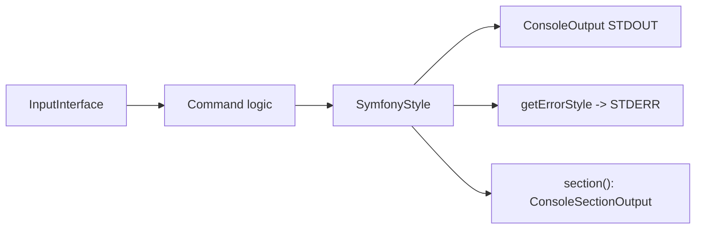

# Input & Output

!!! tip "In a nutshell"
    Commands read through `InputInterface` and write through `OutputInterface`, but
    `SymfonyStyle` is the styled wrapper you should reach for by default. Remember
    for the exam: STDERR is `getErrorOutput()`, which lives on
    `ConsoleOutputInterface` only — keep piped data on STDOUT.

!!! abstract "Learning objectives"
    By the end of this chapter you can:

    - [ ] Read values through `InputInterface`
    - [ ] Write through `OutputInterface` and pick the right verbosity
    - [ ] Build rich UIs with `SymfonyStyle` (title, table, progress, prompts)
    - [ ] Use output sections and route errors to STDERR

    **Syllabus:** `Console → Input & Output` ·
    **Level:** Advanced ·
    **Est. time:** 30 min ·
    **Prerequisites:** [Arguments & options](options-arguments.md)

---

## Theory

Every command talks to the outside world through two contracts:

- **`Symfony\Component\Console\Input\InputInterface`** — read arguments and options:
  `getArgument()`, `getOption()`, `hasArgument()`, `isInteractive()`.
- **`Symfony\Component\Console\Output\OutputInterface`** — write text:
  `write()`, `writeln()`, plus verbosity and formatting.

On top sits **`Symfony\Component\Console\Style\SymfonyStyle`**, the recommended
helper that wraps both into a consistent, styled API — the exam expects you to know
it.

!!! question "Predict first"
    You want progress messages on STDERR while piping data on STDOUT. Can you call
    `getErrorOutput()` on any `OutputInterface`?

??? note "Reveal"
    No. `getErrorOutput()` lives on `ConsoleOutputInterface`, not the base
    `OutputInterface`. Guard with `instanceof` first, or a plain output throws a
    type error. Routing status to STDERR keeps piped STDOUT data clean.

## Deep Dive — how it works internally

`SymfonyStyle` implements `StyleInterface` and `OutputInterface`, decorating the
underlying output and pulling a `QuestionHelper` for prompts. Its methods emit the
standard Symfony look-and-feel (spacing, colored blocks). Key methods:

| Method | Effect |
|---|---|
| `title()` / `section()` | Headings |
| `text()` / `listing()` | Paragraphs / bullet list |
| `table(headers, rows)` | Formatted table |
| `progressBar()` / `progressStart/advance/finish` | Progress UI |
| `ask()` / `askHidden()` / `confirm()` / `choice()` | Prompts |
| `success()` / `warning()` / `error()` / `note()` / `caution()` | Result blocks |

The concrete CLI output is `Symfony\Component\Console\Output\ConsoleOutput`, which
implements `ConsoleOutputInterface` and exposes **two streams**:

- **STDOUT** — normal output.
- **STDERR** — `getErrorOutput()`. `SymfonyStyle::getErrorStyle()` writes here.

Routing errors and progress to STDERR keeps piped STDOUT clean (e.g.
`bin/console app:export > data.csv` still shows progress on the terminal).

**Output sections** (`ConsoleSectionOutput`, created by `$output->section()`) are
independently re-writable regions: you can `overwrite()` or `clear()` one section
without disturbing others — the basis for multiple concurrent progress bars.



!!! note "Source reference"
    `SymfonyStyle` and `ConsoleOutput::getErrorOutput()` —
    [symfony/symfony `8.0`](https://github.com/symfony/symfony/blob/8.0/src/Symfony/Component/Console/Style/SymfonyStyle.php).

## Configuration & code

=== "SymfonyStyle"

    ```php
    <?php
    declare(strict_types=1);

    namespace App\Command;

    use Symfony\Component\Console\Attribute\AsCommand;
    use Symfony\Component\Console\Command\Command;
    use Symfony\Component\Console\Style\SymfonyStyle;

    #[AsCommand(name: 'app:import', description: 'Import records')]
    final class ImportCommand
    {
        public function __invoke(SymfonyStyle $io): int
        {
            $io->title('Import');
            $io->section('Validating');

            if (!$io->confirm('Proceed?', true)) {
                $io->warning('Aborted.');

                return Command::SUCCESS;
            }

            $io->table(['Id', 'Name'], [[1, 'Ada'], [2, 'Linus']]);

            $io->progressStart(3);
            for ($i = 0; $i < 3; ++$i) {
                $io->progressAdvance();
            }
            $io->progressFinish();

            $io->success('Done.');

            return Command::SUCCESS;
        }
    }
    ```

=== "Raw Output + STDERR"

    ```php
    <?php
    declare(strict_types=1);

    namespace App\Command;

    use Symfony\Component\Console\Attribute\AsCommand;
    use Symfony\Component\Console\Command\Command;
    use Symfony\Component\Console\Output\ConsoleOutputInterface;
    use Symfony\Component\Console\Output\OutputInterface;
    use Symfony\Component\Console\Input\InputInterface;

    #[AsCommand(name: 'app:export')]
    final class ExportCommand extends Command
    {
        protected function execute(InputInterface $input, OutputInterface $output): int
        {
            $output->writeln('id,name');          // STDOUT (pipeable data)

            if ($output instanceof ConsoleOutputInterface) {
                $output->getErrorOutput()->writeln('Exporting…'); // STDERR
            }

            return Command::SUCCESS;
        }
    }
    ```

=== "Output sections"

    ```php
    // inside execute(), $output is ConsoleOutputInterface
    $section1 = $output->section();
    $section2 = $output->section();
    $section1->writeln('Downloading');
    $section2->writeln('Progress: 0%');
    $section2->overwrite('Progress: 100%');  // rewrites only section 2
    ```

## Best practices & anti-patterns

| ✅ Do | ❌ Avoid |
|---|---|
| Use `SymfonyStyle` for user-facing UI | Hand-formatting spacing/colors |
| Send data to STDOUT, status to STDERR | Mixing progress into piped output |
| Guard `getErrorOutput()` with an `instanceof` | Assuming every `OutputInterface` splits streams |
| Use sections for live multi-line updates | Reprinting the whole screen manually |

## When (not) to use it / alternatives

Reach for `SymfonyStyle` in nearly every command — it is idiomatic and testable. Use
the raw `OutputInterface` when you need byte-exact output (CSV/JSON on STDOUT) with
no styling. Output sections shine for progress dashboards; skip them for one-shot
messages.

!!! danger "Certification traps"
    - `getErrorOutput()` lives on `ConsoleOutputInterface`, **not** the base
      `OutputInterface` — check the type first.
    - `SymfonyStyle` implements `OutputInterface`, so you can pass it where output is
      expected.
    - Output **sections** require `ConsoleOutputInterface` (real CLI), not any
      output.
    - `write()` does not append a newline; `writeln()` does.

!!! warning "Common mistakes"
    - Calling `getErrorOutput()` on a plain `OutputInterface` — fatal type error.
    - Assuming `SymfonyStyle::error()` prints to STDOUT — it uses the error stream.

## Exercises

1. **(Basic)** Print a title, a two-column table, and a success block using
   `SymfonyStyle`.
2. **(Intermediate)** Write CSV rows to STDOUT while emitting a progress message to
   STDERR only when the output supports it.

??? success "Solutions"

    **1.**

    ```php
    $io->title('Report');
    $io->table(['Metric', 'Value'], [['Users', 42], ['Orders', 7]]);
    $io->success('Generated.');
    ```

    **2.**

    ```php
    $output->writeln('id,total');
    if ($output instanceof ConsoleOutputInterface) {
        $output->getErrorOutput()->writeln('Working…');
    }
    ```

## Certification questions

??? question "Q1. Which method returns the STDERR stream in a CLI command?"
    - [ ] A. `OutputInterface::getErrorOutput()`
    - [x] B. `ConsoleOutputInterface::getErrorOutput()` ✅
    - [ ] C. `SymfonyStyle::stderr()`
    - [ ] D. `InputInterface::getError()`

    **Why:** the split-stream method lives on `ConsoleOutputInterface`. **Ref:**
    [Console verbosity](https://symfony.com/doc/current/console/verbosity.html).

??? question "Q2. `SymfonyStyle` requires which two constructor arguments?"
    - [x] A. `InputInterface` and `OutputInterface` ✅
    - [ ] B. `Application` and `Command`
    - [ ] C. `QuestionHelper` and `OutputInterface`
    - [ ] D. Only `OutputInterface`

    **Why:** it wraps both input (for prompts) and output. **Ref:**
    [Console style](https://symfony.com/doc/current/console/style.html).

??? question "Q3. What does `$output->section()` return?"
    - [x] A. A `ConsoleSectionOutput` you can `overwrite()`/`clear()` ✅
    - [ ] B. A new `Application`
    - [ ] C. A `SymfonyStyle`
    - [ ] D. A boolean

    **Why:** sections are independently re-writable regions. **Ref:**
    [Console](https://symfony.com/doc/current/console.html).

??? question "Q4. Difference between `write()` and `writeln()`?"
    - [x] A. `writeln()` appends a newline; `write()` does not ✅
    - [ ] B. `write()` goes to STDERR
    - [ ] C. `writeln()` disables colors
    - [ ] D. They are identical

    **Why:** `writeln()` = `write()` + line break. **Ref:**
    [Console](https://symfony.com/doc/current/console.html).

## Key takeaways

- Read via `InputInterface`, write via `OutputInterface`.
- `SymfonyStyle(input, output)` is the go-to styled UI (title/table/progress/ask).
- STDERR is `ConsoleOutputInterface::getErrorOutput()` — keep piped data on STDOUT.
- Output **sections** allow live, independent re-writes.

## Last-minute revision

!!! tip "Cheat sheet"
    - `new SymfonyStyle($input, $output)`.
    - `title/section/text/listing/table/progressBar/ask/confirm/choice`.
    - `write()` no newline, `writeln()` newline.
    - STDERR: `$output->getErrorOutput()` (ConsoleOutputInterface only).

## Official References
- [Official Symfony docs — Console style](https://symfony.com/doc/current/console/style.html)
- [Official Symfony docs — Verbosity & STDERR](https://symfony.com/doc/current/console/verbosity.html)
- [Symfony source — SymfonyStyle](https://github.com/symfony/symfony/blob/8.0/src/Symfony/Component/Console/Style/SymfonyStyle.php)

---

<small>Related: [Helpers](helpers.md) · [Arguments & options](options-arguments.md) · [Verbosity](verbosity.md)</small>
