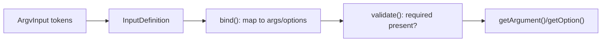

# Arguments & Options

!!! tip "In a nutshell"
    Les arguments sont des entrées positionnelles ; les options sont des `--flags` nommés
    avec des raccourcis `-x` optionnels. À retenir pour l'examen : mémorisez les entiers
    des modes — arguments REQUIRED=1 / OPTIONAL=2 / IS_ARRAY=4, et options VALUE_NONE=1 /
    REQUIRED=2 / OPTIONAL=4 / IS_ARRAY=8 / NEGATABLE=16.

!!! example "Real-world analogy"
    Commander au comptoir d'un café illustre bien la différence. Vous énoncez l'essentiel
    dans un ordre fixe — « grand, latte » — et si vous les inversez, le barista est perdu,
    exactement comme les arguments positionnels où l'ordre compte. Les extras, eux, sont
    nommés et peuvent venir dans n'importe quel ordre : « avec lait d'avoine », « sans
    sucre », « très chaud » — à l'image des options nommées comme `--milk=oat` ou du
    on/off `--sugar` / `--no-sugar` d'un flag négatable. Certains extras ne font que
    basculer un état sans valeur (un flag), tandis que d'autres exigent toujours une
    valeur : c'est précisément ce qu'encodent les différents modes d'options.

!!! abstract "Learning objectives"
    À la fin de ce chapitre, vous saurez :

    - [ ] Déclarer des arguments avec les modes d'`InputArgument` et les combiner
    - [ ] Déclarer des options avec chaque mode d'`InputOption`, y compris `NEGATABLE`
    - [ ] Ajouter des raccourcis et des valeurs par défaut, et relire les valeurs depuis `InputInterface`
    - [ ] Expliquer comment l'`InputDefinition` lie et valide l'entrée brute

    **Syllabus:** `Console → Arguments & Options` ·
    **Level:** Advanced ·
    **Est. time:** 30 min ·
    **Prerequisites:** [Custom commands](custom-commands.md)

---

## Theory

Il existe deux types d'entrées :

- **Arguments** — *positionnels*, sensibles à l'ordre : `git clone <url> <dir>`.
- **Options** — *nommées*, sans contrainte d'ordre, préfixées `--` (ou un raccourci `-x`) :
  `--force`, `-f`, `--env=prod`.

```console
$ php bin/console app:clone https://example.com/repo.git ./target   # 2 positional arguments
$ php bin/console app:deploy --force --env=prod                     # named options, any order
$ php bin/console app:deploy -f                                     # -f shortcut for --force
```

**Modes d'argument** (`Symfony\Component\Console\Input\InputArgument`) :

| Mode | Valeur | Signification |
|---|---|---|
| `REQUIRED` | 1 | Doit être fourni |
| `OPTIONAL` | 2 | Peut être omis (a une valeur par défaut) |
| `IS_ARRAY` | 4 | Collecte une liste ; **doit être en dernier** |

Combinez-les avec un bitmask, par exemple `IS_ARRAY | OPTIONAL`.

```php
use Symfony\Component\Console\Input\InputArgument;

$this->addArgument('path', InputArgument::REQUIRED);                          // 1
$this->addArgument('format', InputArgument::OPTIONAL, 'Format', 'json');      // 2, with default
$this->addArgument('files', InputArgument::IS_ARRAY | InputArgument::OPTIONAL); // 4|2, last
```

**Modes d'option** (`Symfony\Component\Console\Input\InputOption`) :

| Mode | Valeur | Signification |
|---|---|---|
| `VALUE_NONE` | 1 | Flag booléen ; sans valeur (`--force`) |
| `VALUE_REQUIRED` | 2 | Doit recevoir une valeur (`--iter=5`) |
| `VALUE_OPTIONAL` | 4 | Valeur optionnelle (`--yell` ou `--yell=loud`) |
| `VALUE_IS_ARRAY` | 8 | Répétable (`--id=1 --id=2`) |
| `VALUE_NEGATABLE` | 16 | Ajoute un jumeau `--no-…` (`--ansi`/`--no-ansi`) |

```php
use Symfony\Component\Console\Input\InputOption;

$this->addOption('force', 'f', InputOption::VALUE_NONE);                          // 1: flag
$this->addOption('iter', null, InputOption::VALUE_REQUIRED, 'Iterations', 1);     // 2
$this->addOption('yell', null, InputOption::VALUE_OPTIONAL);                      // 4
$this->addOption('id', null, InputOption::VALUE_IS_ARRAY | InputOption::VALUE_REQUIRED); // 8|2
$this->addOption('color', null, InputOption::VALUE_NEGATABLE, 'Colorize', true);  // 16: --no-color
```

!!! question "Predict first"
    Vous déclarez `--force` en `VALUE_NONE` et tentez de lui donner `false` comme valeur
    par défaut. Que se passe-t-il ?

??? note "Reveal"
    Cela lève une `LogicException`. Un flag `VALUE_NONE` ne peut **pas** porter de valeur
    par défaut : il vaut `false` s'il est absent, puis `true`. Les valeurs par défaut
    appartiennent aux options `VALUE_REQUIRED` / `VALUE_OPTIONAL` (et `NEGATABLE`, dont la
    valeur par défaut s'applique quand ni `--foo` ni `--no-foo` n'est passé).

## Deep Dive — how it works internally

Une commande possède une `Symfony\Component\Console\Input\InputDefinition` — l'ensemble
ordonné des `InputArgument` et la table des `InputOption`. Quand `run()` s'exécute,
`$input->bind($definition)` fait correspondre les tokens bruts de l'`ArgvInput` avec
cette définition ; puis `$input->validate()` lève une
`Symfony\Component\Console\Exception\RuntimeException` si un argument `REQUIRED` ou la
valeur d'une option `VALUE_REQUIRED` est manquant.

Règles imposées par la définition :

- **Un seul** argument `IS_ARRAY`, et il doit être en **dernier** (il consomme
  gloutonnement le reste).
- Un argument requis ne peut pas suivre un argument optionnel.
- Les options `VALUE_NONE` ne peuvent **pas** porter de valeur par défaut — elles valent
  toujours `false` sauf si présentes, alors `true`.
- Une option `VALUE_NEGATABLE` vaut `true` avec `--foo`, `false` avec `--no-foo`, et sa
  valeur par défaut sinon.



Dans les commandes **invokables**, vous sautez `addArgument`/`addOption` : les attributs
`#[Argument]` et `#[Option]` sur les paramètres d'`__invoke()` construisent la définition.
Le type et la valeur par défaut du paramètre déterminent le mode : une option `bool` →
`VALUE_NONE` ; un `array` → `VALUE_IS_ARRAY` ; un paramètre avec valeur par défaut →
optionnel.

!!! note "Source reference"
    `InputArgument`, `InputOption`, `InputDefinition` —
    [symfony/symfony `8.0`](https://github.com/symfony/symfony/blob/8.0/src/Symfony/Component/Console/Input/InputOption.php).

## Configuration & code

=== "Invokable"

    ```php
    <?php
    declare(strict_types=1);

    namespace App\Command;

    use Symfony\Component\Console\Attribute\Argument;
    use Symfony\Component\Console\Attribute\AsCommand;
    use Symfony\Component\Console\Attribute\Option;
    use Symfony\Component\Console\Command\Command;
    use Symfony\Component\Console\Style\SymfonyStyle;

    #[AsCommand(name: 'app:notify', description: 'Send notifications')]
    final class NotifyCommand
    {
        /**
         * @param string[] $recipients
         */
        public function __invoke(
            SymfonyStyle $io,
            #[Argument(description: 'Recipient emails')]
            array $recipients,                 // IS_ARRAY, required (no default)
            #[Option(description: 'Repeat count', shortcut: 'c')]
            int $count = 1,                    // VALUE_REQUIRED, default 1
            #[Option(description: 'Dry run')]
            bool $dryRun = false,              // VALUE_NONE flag
        ): int {
            $io->writeln(sprintf('%d recipients x%d%s', \count($recipients), $count, $dryRun ? ' (dry)' : ''));

            return Command::SUCCESS;
        }
    }
    ```

=== "Classic (configure)"

    ```php
    <?php
    declare(strict_types=1);

    namespace App\Command;

    use Symfony\Component\Console\Attribute\AsCommand;
    use Symfony\Component\Console\Command\Command;
    use Symfony\Component\Console\Input\InputArgument;
    use Symfony\Component\Console\Input\InputInterface;
    use Symfony\Component\Console\Input\InputOption;
    use Symfony\Component\Console\Output\OutputInterface;

    #[AsCommand(name: 'app:notify')]
    final class NotifyCommand extends Command
    {
        protected function configure(): void
        {
            $this
                ->addArgument('recipients', InputArgument::IS_ARRAY | InputArgument::REQUIRED, 'Emails')
                ->addOption('count', 'c', InputOption::VALUE_REQUIRED, 'Repeat count', 1)
                ->addOption('dry-run', null, InputOption::VALUE_NONE, 'Dry run')
                ->addOption('color', null, InputOption::VALUE_NEGATABLE, 'Colorize', true);
        }

        protected function execute(InputInterface $input, OutputInterface $output): int
        {
            $recipients = $input->getArgument('recipients');   // array
            $count = (int) $input->getOption('count');
            $dry = (bool) $input->getOption('dry-run');

            return Command::SUCCESS;
        }
    }
    ```

=== "Console"

    ```console
    $ php bin/console app:notify a@x.io b@x.io --count=3 --dry-run
    $ php bin/console app:notify a@x.io -c 3
    $ php bin/console app:notify a@x.io --no-color
    ```

## Best practices & anti-patterns

| ✅ À faire | ❌ À éviter |
|---|---|
| Placer l'argument tableau en **dernier** | Un argument tableau avant un scalaire |
| Utiliser `VALUE_NONE` pour les flags booléens | `VALUE_OPTIONAL` pour un interrupteur oui/non |
| Donner une valeur par défaut sensée aux optionnels | Compter sur `null` puis deviner |
| Utiliser `NEGATABLE` pour les paires on/off | Deux flags séparés `--x`/`--no-x` |

## When (not) to use it / alternatives

Les arguments conviennent à *ce sur quoi* la commande agit (identifiants, chemins) ; les
options conviennent à *comment* elle se comporte (flags, réglages). Si vous avez beaucoup
d'entrées optionnelles, préférez les options — elles sont auto-documentées et sans
contrainte d'ordre. Le questionnement interactif (voir
[input & output](input-output.md)) peut remplir les arguments manquants dans `interact()`.

!!! danger "Certification traps"
    - `VALUE_NONE = 1`, `VALUE_REQUIRED = 2`, `VALUE_OPTIONAL = 4`,
      `VALUE_IS_ARRAY = 8`, `VALUE_NEGATABLE = 16`.
    - `InputArgument` : `REQUIRED = 1`, `OPTIONAL = 2`, `IS_ARRAY = 4`.
    - Une option `VALUE_NONE` ne peut **pas** avoir de valeur par défaut.
    - Un seul argument `IS_ARRAY`, et il doit être en **dernier**.
    - Les raccourcis sont réservés aux **options** ; les arguments n'en ont pas.

!!! warning "Common mistakes"
    - Passer une valeur par défaut à une option `VALUE_NONE` — lève une
      `LogicException`.
    - Déclarer un argument requis après un argument optionnel.

## Exercises

1. **(Basic)** Ajoutez un argument `path` requis et une option `--depth` optionnelle
   (valeur par défaut `1`) à une commande.
2. **(Intermediate)** Ajoutez une option répétable `--tag` (tableau) et une option
   négatable `--cache` valant `true` par défaut ; lisez les deux dans `execute()`.

??? success "Solutions"

    **1.**

    ```php
    $this
        ->addArgument('path', InputArgument::REQUIRED, 'Target path')
        ->addOption('depth', null, InputOption::VALUE_REQUIRED, 'Max depth', 1);
    ```

    **2.**

    ```php
    $this
        ->addOption('tag', null, InputOption::VALUE_IS_ARRAY | InputOption::VALUE_REQUIRED, 'Tags')
        ->addOption('cache', null, InputOption::VALUE_NEGATABLE, 'Use cache', true);
    // $input->getOption('tag') -> string[]; $input->getOption('cache') -> bool
    ```

## Certification questions

??? question "Q1. Which mode makes an option a valueless boolean flag?"
    - [x] A. `InputOption::VALUE_NONE` ✅
    - [ ] B. `InputOption::VALUE_OPTIONAL`
    - [ ] C. `InputArgument::OPTIONAL`
    - [ ] D. `InputOption::VALUE_REQUIRED`

    **Why:** `VALUE_NONE` n'accepte aucune valeur ; sa présence signifie `true`. **Ref:**
    [Console input](https://symfony.com/doc/current/console/input.html).

??? question "Q2. What is the integer value of `InputOption::VALUE_IS_ARRAY`?"
    - [ ] A. 4
    - [x] B. 8 ✅
    - [ ] C. 16
    - [ ] D. 2

    **Why:** le bitmask des modes d'option est 1,2,4,8,16. **Ref:**
    [Console input](https://symfony.com/doc/current/console/input.html).

??? question "Q3. Which is true about an `IS_ARRAY` argument?"
    - [x] A. There can be only one and it must be declared last ✅
    - [ ] B. It must be declared first
    - [ ] C. You may have several per command
    - [ ] D. It cannot be combined with `REQUIRED`

    **Why:** l'argument tableau consomme gloutonnement les tokens restants. **Ref:**
    [Console input](https://symfony.com/doc/current/console/input.html).

??? question "Q4. Which mode produces a `--no-foo` counterpart to `--foo`?"
    - [ ] A. `VALUE_OPTIONAL`
    - [ ] B. `VALUE_NONE`
    - [x] C. `VALUE_NEGATABLE` ✅
    - [ ] D. `VALUE_IS_ARRAY`

    **Why:** les options négatables ajoutent le jumeau `--no-`. **Ref:**
    [Console input](https://symfony.com/doc/current/console/input.html).

## Key takeaways

- Les arguments sont positionnels ; les options sont nommées, avec des raccourcis `-x` optionnels.
- Modes d'argument : `REQUIRED=1`, `OPTIONAL=2`, `IS_ARRAY=4`.
- Modes d'option : `VALUE_NONE=1`, `REQUIRED=2`, `OPTIONAL=4`, `IS_ARRAY=8`,
  `NEGATABLE=16`.
- L'`InputDefinition` lie et valide ; `VALUE_NONE` n'a pas de valeur par défaut.

## Last-minute revision

!!! tip "Cheat sheet"
    - `addArgument(name, mode, desc, default)`.
    - `addOption(name, shortcut, mode, desc, default)`.
    - Argument tableau = en dernier ; un seul.
    - Lecture via `$input->getArgument()` / `$input->getOption()`.

## Connections

- **Depends on:** [Custom commands](custom-commands.md) — les arguments/options sont
  déclarés sur la commande (via attributs ou `configure()`).
- **Reused in:** [Input & output](input-output.md) — vous relisez les valeurs liées
  via `InputInterface`.
- **Confused with:** [Configuration](configuration.md) — `configure()` *déclare* les
  options ; c'est l'`InputDefinition` qui les *lie et valide*.

## Official References
- [Official Symfony docs — Console input](https://symfony.com/doc/current/console/input.html)
- [Symfony source — InputOption](https://github.com/symfony/symfony/blob/8.0/src/Symfony/Component/Console/Input/InputOption.php)
- [Symfony source — InputArgument](https://github.com/symfony/symfony/blob/8.0/src/Symfony/Component/Console/Input/InputArgument.php)

## Video references

!!! tip "Watch & learn"
    Voici des chaînes vidéo officielles, mises à jour en continu — cherchez-y
    "Symfony console" pour consolider ce chapitre. Nous lions des chaînes stables plutôt
    que des vidéos individuelles pour que les références ne se périment jamais.

    - [SymfonyCasts screencasts](https://symfonycasts.com/tracks/symfony) — tutoriels scénarisés, à coder en suivant.
    - [Symfony official YouTube](https://www.youtube.com/@SymfonyOfficial) — conférences et keynotes SymfonyCon.
    - [Official docs for this topic](https://symfony.com/doc/current/console/input.html) — certaines pages de la doc Symfony intègrent un screencast.

## Confidence check

Je suis prêt quand je peux :

- [ ] expliquer **pourquoi** arguments (positionnels) et options (nommées) diffèrent et quand utiliser chacun
- [ ] déclarer chaque mode d'`InputArgument`/`InputOption`, y compris `NEGATABLE`, en Symfony 8
- [ ] déboguer une erreur « required argument after optional » ou un argument tableau mal placé
- [ ] repérer le piège sur les entiers des modes et l'absence de valeur par défaut pour `VALUE_NONE`
- [ ] expliquer comment l'`InputDefinition` lie et valide les tokens bruts de l'`ArgvInput`

---

<small>Related: [Custom commands](custom-commands.md) · [Input & output](input-output.md) · [Helpers](helpers.md)</small>
