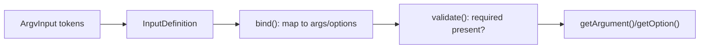

# Arguments & Options

!!! tip "In a nutshell"
    Arguments are positional inputs; options are named `--flags` with optional `-x`
    shortcuts. Remember for the exam: memorise the mode integers — arguments
    REQUIRED=1 / OPTIONAL=2 / IS_ARRAY=4, and options VALUE_NONE=1 / REQUIRED=2 /
    OPTIONAL=4 / IS_ARRAY=8 / NEGATABLE=16.

!!! example "Real-world analogy"
    Ordering at a coffee counter shows the difference. You state the essentials in a fixed
    order — "large, latte" — and if you swap them the barista is confused, exactly like
    positional arguments where sequence matters. The extras, though, are named and can come
    in any order: "with oat milk", "no sugar", "extra hot" — mirroring named options like
    `--milk=oat` or the on/off `--sugar` / `--no-sugar` of a negatable flag. Some extras
    just toggle a state with no value (a flag), while others always need a value, which is
    precisely what the different option modes encode.

!!! abstract "Learning objectives"
    By the end of this chapter you can:

    - [ ] Declare arguments with the `InputArgument` modes and combine them
    - [ ] Declare options with every `InputOption` mode, including `NEGATABLE`
    - [ ] Add shortcuts and defaults, and read values back from `InputInterface`
    - [ ] Explain how the `InputDefinition` binds and validates raw input

    **Syllabus:** `Console → Arguments & Options` ·
    **Level:** Advanced ·
    **Est. time:** 30 min ·
    **Prerequisites:** [Custom commands](custom-commands.md)

---

## Theory

Two kinds of input exist:

- **Arguments** — *positional*, order-sensitive: `git clone <url> <dir>`.
- **Options** — *named*, order-free, prefixed `--` (or a `-x` shortcut):
  `--force`, `-f`, `--env=prod`.

```console
$ php bin/console app:clone https://example.com/repo.git ./target   # 2 positional arguments
$ php bin/console app:deploy --force --env=prod                     # named options, any order
$ php bin/console app:deploy -f                                     # -f shortcut for --force
```

**Argument modes** (`Symfony\Component\Console\Input\InputArgument`):

| Mode | Value | Meaning |
|---|---|---|
| `REQUIRED` | 1 | Must be provided |
| `OPTIONAL` | 2 | May be omitted (has a default) |
| `IS_ARRAY` | 4 | Collects a list; **must be last** |

Combine with a bitmask, e.g. `IS_ARRAY | OPTIONAL`.

```php
use Symfony\Component\Console\Input\InputArgument;

$this->addArgument('path', InputArgument::REQUIRED);                          // 1
$this->addArgument('format', InputArgument::OPTIONAL, 'Format', 'json');      // 2, with default
$this->addArgument('files', InputArgument::IS_ARRAY | InputArgument::OPTIONAL); // 4|2, last
```

**Option modes** (`Symfony\Component\Console\Input\InputOption`):

| Mode | Value | Meaning |
|---|---|---|
| `VALUE_NONE` | 1 | Boolean flag; no value (`--force`) |
| `VALUE_REQUIRED` | 2 | Must supply a value (`--iter=5`) |
| `VALUE_OPTIONAL` | 4 | Value optional (`--yell` or `--yell=loud`) |
| `VALUE_IS_ARRAY` | 8 | Repeatable (`--id=1 --id=2`) |
| `VALUE_NEGATABLE` | 16 | Adds a `--no-…` twin (`--ansi`/`--no-ansi`) |

```php
use Symfony\Component\Console\Input\InputOption;

$this->addOption('force', 'f', InputOption::VALUE_NONE);                          // 1: flag
$this->addOption('iter', null, InputOption::VALUE_REQUIRED, 'Iterations', 1);     // 2
$this->addOption('yell', null, InputOption::VALUE_OPTIONAL);                      // 4
$this->addOption('id', null, InputOption::VALUE_IS_ARRAY | InputOption::VALUE_REQUIRED); // 8|2
$this->addOption('color', null, InputOption::VALUE_NEGATABLE, 'Colorize', true);  // 16: --no-color
```

!!! question "Predict first"
    You declare `--force` as `VALUE_NONE` and try to give it a default of `false`.
    What happens?

??? note "Reveal"
    It throws a `LogicException`. A `VALUE_NONE` flag **cannot** carry a default: it
    is `false` unless present, then `true`. Defaults belong to `VALUE_REQUIRED` /
    `VALUE_OPTIONAL` options (and `NEGATABLE`, whose default applies when neither
    `--foo` nor `--no-foo` is passed).

## Deep Dive — how it works internally

A command owns an `Symfony\Component\Console\Input\InputDefinition` — the ordered
set of `InputArgument`s and the map of `InputOption`s. When `run()` executes,
`$input->bind($definition)` matches the raw `ArgvInput` tokens against it; then
`$input->validate()` throws
`Symfony\Component\Console\Exception\RuntimeException` if a `REQUIRED` argument or
`VALUE_REQUIRED` option value is missing.

```php
$definition = new InputDefinition([
    new InputArgument('path', InputArgument::REQUIRED),
    new InputOption('depth', null, InputOption::VALUE_REQUIRED, 'Max depth', 1),
]);

$input = new ArgvInput();     // raw argv tokens
$input->bind($definition);    // match tokens against the definition
$input->validate();           // throws RuntimeException if "path" is missing
```

Rules the definition enforces:

- **Only one** `IS_ARRAY` argument, and it must be **last** (it greedily consumes
  the rest).
- A required argument cannot follow an optional one.
- `VALUE_NONE` options **cannot** carry a default — they are always `false` unless
  present, then `true`.
- A `VALUE_NEGATABLE` option is `true` with `--foo`, `false` with `--no-foo`, and
  its default otherwise.

```console
$ php bin/console app:notify --color      # NEGATABLE -> true
$ php bin/console app:notify --no-color   # NEGATABLE -> false
$ php bin/console app:notify              # neither -> the declared default
$ php bin/console app:notify --force      # VALUE_NONE -> true (false when absent)
```



In **invokable** commands you skip `addArgument`/`addOption`: the `#[Argument]` and
`#[Option]` attributes on `__invoke()` parameters build the definition. Parameter
type and default decide the mode: a `bool` option → `VALUE_NONE`; an `array` →
`VALUE_IS_ARRAY`; a parameter with a default → optional.

```php
public function __invoke(
    #[Argument] string $path,          // required argument (no default)
    #[Argument] array $files = [],     // IS_ARRAY argument, must stay last
    #[Option] bool $force = false,     // bool -> VALUE_NONE flag
    #[Option] array $tags = [],        // array -> VALUE_IS_ARRAY
    #[Option] int $depth = 1,          // default -> optional, value required
): int {
    return Command::SUCCESS;
}
```

!!! note "Source reference"
    `InputArgument`, `InputOption`, `InputDefinition` —
    [symfony/symfony `8.0`](https://github.com/symfony/symfony/blob/8.0/src/Symfony/Component/Console/Input/InputOption.php).

## Configuration & code

=== "Invokable"

    ```php
    <?php
    declare(strict_types=1);

    namespace App\Command;

    use Symfony\Component\Console\Attribute\Argument;
    use Symfony\Component\Console\Attribute\AsCommand;
    use Symfony\Component\Console\Attribute\Option;
    use Symfony\Component\Console\Command\Command;
    use Symfony\Component\Console\Style\SymfonyStyle;

    #[AsCommand(name: 'app:notify', description: 'Send notifications')]
    final class NotifyCommand
    {
        /**
         * @param string[] $recipients
         */
        public function __invoke(
            SymfonyStyle $io,
            #[Argument(description: 'Recipient emails')]
            array $recipients,                 // IS_ARRAY, required (no default)
            #[Option(description: 'Repeat count', shortcut: 'c')]
            int $count = 1,                    // VALUE_REQUIRED, default 1
            #[Option(description: 'Dry run')]
            bool $dryRun = false,              // VALUE_NONE flag
        ): int {
            $io->writeln(sprintf('%d recipients x%d%s', \count($recipients), $count, $dryRun ? ' (dry)' : ''));

            return Command::SUCCESS;
        }
    }
    ```

=== "Classic (configure)"

    ```php
    <?php
    declare(strict_types=1);

    namespace App\Command;

    use Symfony\Component\Console\Attribute\AsCommand;
    use Symfony\Component\Console\Command\Command;
    use Symfony\Component\Console\Input\InputArgument;
    use Symfony\Component\Console\Input\InputInterface;
    use Symfony\Component\Console\Input\InputOption;
    use Symfony\Component\Console\Output\OutputInterface;

    #[AsCommand(name: 'app:notify')]
    final class NotifyCommand extends Command
    {
        protected function configure(): void
        {
            $this
                ->addArgument('recipients', InputArgument::IS_ARRAY | InputArgument::REQUIRED, 'Emails')
                ->addOption('count', 'c', InputOption::VALUE_REQUIRED, 'Repeat count', 1)
                ->addOption('dry-run', null, InputOption::VALUE_NONE, 'Dry run')
                ->addOption('color', null, InputOption::VALUE_NEGATABLE, 'Colorize', true);
        }

        protected function execute(InputInterface $input, OutputInterface $output): int
        {
            $recipients = $input->getArgument('recipients');   // array
            $count = (int) $input->getOption('count');
            $dry = (bool) $input->getOption('dry-run');

            return Command::SUCCESS;
        }
    }
    ```

=== "Console"

    ```console
    $ php bin/console app:notify a@x.io b@x.io --count=3 --dry-run
    $ php bin/console app:notify a@x.io -c 3
    $ php bin/console app:notify a@x.io --no-color
    ```

## Best practices & anti-patterns

| ✅ Do | ❌ Avoid |
|---|---|
| Put the array argument **last** | Array argument before a scalar one |
| Use `VALUE_NONE` for boolean flags | `VALUE_OPTIONAL` for a yes/no switch |
| Give a sensible default for optionals | Relying on `null` then guessing |
| Use `NEGATABLE` for on/off pairs | Two separate `--x`/`--no-x` flags |

## When (not) to use it / alternatives

Arguments suit *what* the command acts on (identifiers, paths); options suit *how*
it behaves (flags, tuning). If you have many optional inputs, prefer options — they
are self-documenting and order-free. Interactive prompting (see
[input & output](input-output.md)) can fill missing arguments in `interact()`.

!!! danger "Certification traps"
    - `VALUE_NONE = 1`, `VALUE_REQUIRED = 2`, `VALUE_OPTIONAL = 4`,
      `VALUE_IS_ARRAY = 8`, `VALUE_NEGATABLE = 16`.
    - `InputArgument`: `REQUIRED = 1`, `OPTIONAL = 2`, `IS_ARRAY = 4`.
    - A `VALUE_NONE` option **cannot** have a default value.
    - Only one `IS_ARRAY` argument, and it must be **last**.
    - Shortcuts are for **options only**; arguments have no shortcuts.

!!! warning "Common mistakes"
    - Passing a default to a `VALUE_NONE` option — throws
      `LogicException`.
    - Declaring a required argument after an optional one.

## Exercises

1. **(Basic)** Add a required `path` argument and an optional `--depth` option
   (default `1`) to a command.
2. **(Intermediate)** Add a repeatable `--tag` option (array) and a negatable
   `--cache` option defaulting to `true`; read both in `execute()`.

??? success "Solutions"

    **1.**

    ```php
    $this
        ->addArgument('path', InputArgument::REQUIRED, 'Target path')
        ->addOption('depth', null, InputOption::VALUE_REQUIRED, 'Max depth', 1);
    ```

    **2.**

    ```php
    $this
        ->addOption('tag', null, InputOption::VALUE_IS_ARRAY | InputOption::VALUE_REQUIRED, 'Tags')
        ->addOption('cache', null, InputOption::VALUE_NEGATABLE, 'Use cache', true);
    // $input->getOption('tag') -> string[]; $input->getOption('cache') -> bool
    ```

## Certification questions

??? question "Q1. Which mode makes an option a valueless boolean flag?"
    - [x] A. `InputOption::VALUE_NONE` ✅
    - [ ] B. `InputOption::VALUE_OPTIONAL`
    - [ ] C. `InputArgument::OPTIONAL`
    - [ ] D. `InputOption::VALUE_REQUIRED`

    **Why:** `VALUE_NONE` accepts no value; presence means `true`. **Ref:**
    [Console input](https://symfony.com/doc/8.0/console/input.html).

??? question "Q2. What is the integer value of `InputOption::VALUE_IS_ARRAY`?"
    - [ ] A. 4
    - [x] B. 8 ✅
    - [ ] C. 16
    - [ ] D. 2

    **Why:** the option-mode bitmask is 1,2,4,8,16. **Ref:**
    [Console input](https://symfony.com/doc/8.0/console/input.html).

??? question "Q3. Which is true about an `IS_ARRAY` argument?"
    - [x] A. There can be only one and it must be declared last ✅
    - [ ] B. It must be declared first
    - [ ] C. You may have several per command
    - [ ] D. It cannot be combined with `REQUIRED`

    **Why:** the array argument greedily consumes the remaining tokens. **Ref:**
    [Console input](https://symfony.com/doc/8.0/console/input.html).

??? question "Q4. Which mode produces a `--no-foo` counterpart to `--foo`?"
    - [ ] A. `VALUE_OPTIONAL`
    - [ ] B. `VALUE_NONE`
    - [x] C. `VALUE_NEGATABLE` ✅
    - [ ] D. `VALUE_IS_ARRAY`

    **Why:** negatable options add the `--no-` twin. **Ref:**
    [Console input](https://symfony.com/doc/8.0/console/input.html).

## Key takeaways

- Arguments are positional; options are named with optional `-x` shortcuts.
- Argument modes: `REQUIRED=1`, `OPTIONAL=2`, `IS_ARRAY=4`.
- Option modes: `VALUE_NONE=1`, `REQUIRED=2`, `OPTIONAL=4`, `IS_ARRAY=8`,
  `NEGATABLE=16`.
- The `InputDefinition` binds and validates; `VALUE_NONE` has no default.

## Last-minute revision

!!! tip "Cheat sheet"
    - `addArgument(name, mode, desc, default)`.
    - `addOption(name, shortcut, mode, desc, default)`.
    - Array argument = last; only one.
    - Read via `$input->getArgument()` / `$input->getOption()`.

## Connections

- **Depends on:** [Custom commands](custom-commands.md) — arguments/options are
  declared on the command (via attributes or `configure()`).
- **Reused in:** [Input & output](input-output.md) — you read the bound values back
  through `InputInterface`.
- **Confused with:** [Configuration](configuration.md) — `configure()` *declares*
  options; the `InputDefinition` is what *binds and validates* them.

## Official References
- [Official Symfony docs — Console input](https://symfony.com/doc/8.0/console/input.html)
- [Symfony source — InputOption](https://github.com/symfony/symfony/blob/8.0/src/Symfony/Component/Console/Input/InputOption.php)
- [Symfony source — InputArgument](https://github.com/symfony/symfony/blob/8.0/src/Symfony/Component/Console/Input/InputArgument.php)

## Video references

!!! tip "Watch & learn"
    These are official, continuously-updated video channels — search them for
    "Symfony console" to reinforce this chapter. We link stable channels rather than
    individual videos so the references never rot.

    - [SymfonyCasts screencasts](https://symfonycasts.com/tracks/symfony) — scripted, code-along tutorials.
    - [Symfony official YouTube](https://www.youtube.com/@SymfonyOfficial) — SymfonyCon conference talks & keynotes.
    - [Official docs for this topic](https://symfony.com/doc/8.0/console/input.html) — some Symfony doc pages embed a screencast.

## Confidence check

I'm ready when I can:

- [ ] explain **why** arguments (positional) and options (named) differ and when to use each
- [ ] declare every `InputArgument`/`InputOption` mode, including `NEGATABLE`, in Symfony 8
- [ ] debug a "required argument after optional" or misplaced array-argument error
- [ ] spot the trick on the mode integers and `VALUE_NONE` having no default
- [ ] explain how the `InputDefinition` binds and validates raw `ArgvInput` tokens

---

<small>Related: [Custom commands](custom-commands.md) · [Input & output](input-output.md) · [Helpers](helpers.md)</small>
