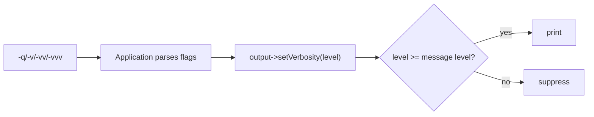

# Niveaux de verbosité

!!! tip "In a nutshell"
    La verbosité contrôle la quantité d'affichage d'une commande sans changer ce qu'elle
    fait ; les utilisateurs la choisissent avec `-q`, `-v`, `-vv` ou `-vvv`. À retenir
    pour l'examen : les constantes valent 16/32/64/128/256 et elles vivent sur l'output,
    pas sur l'input.

!!! example "Real-world analogy"
    La verbosité, c'est comme le niveau de zoom d'une carte numérique. Zoomer ou dézoomer
    ne change jamais le territoire lui-même — les routes et les rivières restent les
    mêmes, tout comme la logique d'une commande reste inchangée — cela contrôle seulement
    la quantité de détails dessinés. Au niveau le plus éloigné, vous ne voyez que les
    grandes villes (`-q`), et en zoomant vous révélez progressivement les bourgs, puis les
    rues, puis chaque ruelle étiquetée (`-vvv`). Et ce réglage appartient à l'écran à
    travers lequel vous regardez, pas aux données sous-jacentes de la carte — c'est
    pourquoi la verbosité vit sur l'output, pas sur l'input.

!!! abstract "Learning objectives"
    À la fin de ce chapitre, vous saurez :

    - [ ] Associer `-q`, `-v`, `-vv`, `-vvv` aux constantes `VERBOSITY_*`
    - [ ] Conditionner l'affichage avec `isVerbose()`, `isVeryVerbose()`, `isDebug()`
    - [ ] Émettre une ligne uniquement à une verbosité choisie
    - [ ] Expliquer comment la verbosité est définie sur l'output et ses valeurs entières

    **Syllabus:** `Console → Verbosity` ·
    **Level:** Advanced ·
    **Est. time:** 20 min ·
    **Prerequisites:** [Input & output](input-output.md)

---

## Theory

La verbosité contrôle **la quantité** d'affichage d'une commande, sans changer sa
logique. Les utilisateurs la choisissent via des flags globaux ; les commandes la
respectent quand elles écrivent leur sortie.

| Flag | Constante de niveau | Entier |
|---|---|---|
| `--quiet` / `-q` | `VERBOSITY_QUIET` | 16 |
| *(défaut)* | `VERBOSITY_NORMAL` | 32 |
| `-v` | `VERBOSITY_VERBOSE` | 64 |
| `-vv` | `VERBOSITY_VERY_VERBOSE` | 128 |
| `-vvv` | `VERBOSITY_DEBUG` | 256 |

`-q` réduit au silence toute la sortie normale (les erreurs remontent toujours) ; les
niveaux supérieurs révèlent davantage de détails de diagnostic. Les constantes vivent sur
`Symfony\Component\Console\Output\OutputInterface`.

!!! question "Predict first"
    Pour décider d'imprimer ou non une ligne de diagnostic, vérifiez-vous la verbosité
    sur l'`InputInterface` ou sur l'`OutputInterface` ?

??? note "Reveal"
    Sur l'**output**. L'Application analyse `-v/-vv/-vvv/-q` et appelle
    `$output->setVerbosity()` : la verbosité est donc une propriété de l'output.
    Conditionnez avec `$output->isVerbose()` / `isDebug()` (également disponibles sur
    `SymfonyStyle`).

## Deep Dive — how it works internally

L'`Application` analyse les flags globaux `-v/-vv/-vvv/-q` **avant** de dispatcher vers
une commande et appelle `$output->setVerbosity()` en conséquence. La verbosité est donc
une propriété de l'**output**, pas de l'input.

Deux façons de la respecter :

1. **Gardes** — `isQuiet()`, `isVerbose()`, `isVeryVerbose()`, `isDebug()` sur l'output
   (et disponibles aussi sur `SymfonyStyle`). Enveloppez la sortie coûteuse/de diagnostic
   dans ces gardes.
2. **Niveau par message** — passez un masque de verbosité comme second argument de
   `write()` / `writeln()` ; le message ne s'imprime que si le niveau courant est au
   moins égal à cette valeur :

```php
$output->writeln('debug detail', OutputInterface::VERBOSITY_DEBUG);
```

Comme les constantes sont des entiers ordonnés (16 < 32 < 64 < 128 < 256), un message
étiqueté `VERBOSITY_VERBOSE` (64) s'affiche à `-v`, `-vv` et `-vvv`, mais pas en normal
(32) ni en quiet (16). En interne, `write()` compare
`$this->verbosity >= $messageVerbosity`.



!!! note "Source reference"
    `OutputInterface::VERBOSITY_*` et le contrôle de verbosité de `Output::write()` —
    [symfony/symfony `8.0`](https://github.com/symfony/symfony/blob/8.0/src/Symfony/Component/Console/Output/OutputInterface.php).

## Configuration & code

=== "Guards"

    ```php
    <?php
    declare(strict_types=1);

    namespace App\Command;

    use Symfony\Component\Console\Attribute\AsCommand;
    use Symfony\Component\Console\Command\Command;
    use Symfony\Component\Console\Output\OutputInterface;
    use Symfony\Component\Console\Style\SymfonyStyle;

    #[AsCommand(name: 'app:sync')]
    final class SyncCommand
    {
        public function __invoke(SymfonyStyle $io, OutputInterface $output): int
        {
            $io->writeln('Syncing…');                       // normal

            if ($output->isVerbose()) {
                $io->writeln('Connecting to remote host');  // -v and up
            }

            if ($output->isDebug()) {
                $io->writeln('Payload dump: {...}');         // -vvv only
            }

            return Command::SUCCESS;
        }
    }
    ```

=== "Per-message level"

    ```php
    <?php
    declare(strict_types=1);

    use Symfony\Component\Console\Output\OutputInterface;

    function report(OutputInterface $output): void
    {
        $output->writeln('always');                                   // normal+
        $output->writeln('more', OutputInterface::VERBOSITY_VERBOSE); // -v+
        $output->writeln('trace', OutputInterface::VERBOSITY_DEBUG);  // -vvv
    }
    ```

=== "Console"

    ```console
    $ php bin/console app:sync            # normal
    $ php bin/console app:sync -v         # verbose
    $ php bin/console app:sync -vvv       # debug
    $ php bin/console app:sync -q         # quiet (suppress normal output)
    ```

## Best practices & anti-patterns

| ✅ À faire | ❌ À éviter |
|---|---|
| Placer les diagnostics derrière `isVerbose()`/`isDebug()` | Toujours afficher les stack traces |
| Étiqueter les messages avec un niveau de verbosité | Tout imprimer au niveau normal |
| Garder le résultat essentiel au niveau normal | Cacher le vrai résultat derrière `-v` |
| Respecter `-q` pour les scripts/cron | Forcer l'affichage malgré `-q` |

## When (not) to use it / alternatives

La verbosité sert aux *diagnostics humains*. Pour une sortie lisible par machine,
préférez une option explicite `--format=json` ou écrivez des données structurées sur
STDOUT (voir [input & output](input-output.md)) ; ne comptez pas sur la verbosité pour
basculer entre formats de données. En `-vvv` (debug), Symfony affiche aussi les traces
complètes des exceptions en cas d'erreur.

!!! danger "Certification traps"
    - Les constantes sont **16/32/64/128/256** (QUIET/NORMAL/VERBOSE/VERY_VERBOSE/DEBUG).
    - `-v` = verbose, `-vv` = very verbose, `-vvv` = debug.
    - La verbosité vit sur l'**output**, définie par l'Application à partir des flags.
    - `-q` supprime la sortie normale mais la commande s'exécute quand même et retourne son code.
    - Un niveau supérieur affiche tous les messages étiquetés à ce niveau **ou en dessous**.

!!! warning "Common mistakes"
    - Lire la verbosité depuis l'*input* — elle est sur l'*output*.
    - Croire que `-q` saute l'exécution ; il ne fait que couper l'affichage.

## Exercises

1. **(Basic)** Affichez `"connecting"` uniquement à partir de `-v` et `"raw response"`
   uniquement à `-vvv`.
2. **(Intermediate)** Écrivez les mêmes trois lignes en utilisant des masques de
   verbosité par message au lieu de gardes `if`.

??? success "Solutions"

    **1.**

    ```php
    if ($output->isVerbose())  { $output->writeln('connecting'); }
    if ($output->isDebug())    { $output->writeln('raw response'); }
    ```

    **2.**

    ```php
    $output->writeln('connecting', OutputInterface::VERBOSITY_VERBOSE);
    $output->writeln('raw response', OutputInterface::VERBOSITY_DEBUG);
    ```

## Certification questions

??? question "Q1. Which flag corresponds to `VERBOSITY_VERY_VERBOSE`?"
    - [ ] A. `-v`
    - [x] B. `-vv` ✅
    - [ ] C. `-vvv`
    - [ ] D. `-q`

    **Why:** `-vv` correspond à very verbose (128) ; `-vvv` à debug (256). **Ref:**
    [Console verbosity](https://symfony.com/doc/current/console/verbosity.html).

??? question "Q2. What is the integer value of `VERBOSITY_NORMAL`?"
    - [ ] A. 0
    - [ ] B. 16
    - [x] C. 32 ✅
    - [ ] D. 64

    **Why:** QUIET=16, NORMAL=32, VERBOSE=64, VERY_VERBOSE=128, DEBUG=256. **Ref:**
    [Console verbosity](https://symfony.com/doc/current/console/verbosity.html).

??? question "Q3. Where does the current verbosity level live?"
    - [x] A. On the `OutputInterface` (set by the Application) ✅
    - [ ] B. On the `InputInterface`
    - [ ] C. On the `Command`
    - [ ] D. In an environment variable only

    **Why:** l'Application appelle `$output->setVerbosity()` à partir des flags. **Ref:**
    [Console verbosity](https://symfony.com/doc/current/console/verbosity.html).

??? question "Q4. A message written with `VERBOSITY_VERBOSE` appears at…"
    - [x] A. `-v`, `-vv`, and `-vvv` ✅
    - [ ] B. only `-v`
    - [ ] C. normal and above
    - [ ] D. `-q` and above

    **Why:** tout niveau ≥ au niveau du message l'imprime. **Ref:**
    [Console verbosity](https://symfony.com/doc/current/console/verbosity.html).

## Key takeaways

- Flags : `-q` (quiet), *(aucun)* normal, `-v`, `-vv`, `-vvv` (debug).
- Constantes : 16/32/64/128/256 sur `OutputInterface`.
- Conditionnez avec `isVerbose()`/`isVeryVerbose()`/`isDebug()` ou étiquetez les messages par niveau.
- La verbosité est une propriété de l'**output** ; `-q` coupe l'affichage, pas l'exécution.

## Last-minute revision

!!! tip "Cheat sheet"
    - `-v`→VERBOSE(64), `-vv`→VERY_VERBOSE(128), `-vvv`→DEBUG(256), `-q`→QUIET(16).
    - `writeln($msg, OutputInterface::VERBOSITY_VERBOSE)`.
    - `$output->isVerbose()`, `isVeryVerbose()`, `isDebug()`, `isQuiet()`.
    - `-vvv` affiche aussi les traces complètes des exceptions.

## Connections

- **Depends on:** [Input & output](input-output.md) — la verbosité est une propriété de
  l'`OutputInterface`, l'objet même par lequel vous écrivez.
- **Reused in:** [Built-in commands](built-in-commands.md) — `-v/-vv/-vvv/-q` sont des
  options globales dont hérite chaque commande.
- **Confused with:** [Input & output](input-output.md) — la verbosité règle *la quantité*
  à imprimer, pas les formats machine (utilisez `--format`/STDOUT pour les données).

## Official References
- [Official Symfony docs — Console verbosity](https://symfony.com/doc/current/console/verbosity.html)
- [Symfony source — OutputInterface](https://github.com/symfony/symfony/blob/8.0/src/Symfony/Component/Console/Output/OutputInterface.php)

## Video references

!!! tip "Watch & learn"
    Voici des chaînes vidéo officielles, mises à jour en continu — cherchez-y
    "Symfony console" pour consolider ce chapitre. Nous lions des chaînes stables plutôt
    que des vidéos individuelles pour que les références ne se périment jamais.

    - [SymfonyCasts screencasts](https://symfonycasts.com/tracks/symfony) — tutoriels scénarisés, à coder en suivant.
    - [Symfony official YouTube](https://www.youtube.com/@SymfonyOfficial) — conférences et keynotes SymfonyCon.
    - [Official docs for this topic](https://symfony.com/doc/current/console/verbosity.html) — certaines pages de la doc Symfony intègrent un screencast.

## Confidence check

Je suis prêt quand je peux :

- [ ] expliquer **pourquoi** la verbosité existe (ajuster les diagnostics sans changer le comportement)
- [ ] conditionner l'affichage avec `isVerbose()`/`isDebug()` ou des masques par message en Symfony 8
- [ ] déboguer une sortie qui disparaît sous `-q` ou ne s'affiche jamais sans `-v`
- [ ] repérer le piège sur les constantes 16/32/64/128/256 et le placement input vs output
- [ ] expliquer comment `write()` compare le niveau et pourquoi un niveau supérieur affiche les lignes étiquetées plus bas

---

<small>Related: [Input & output](input-output.md) · [Events](events.md) · [Built-in commands](built-in-commands.md)</small>
