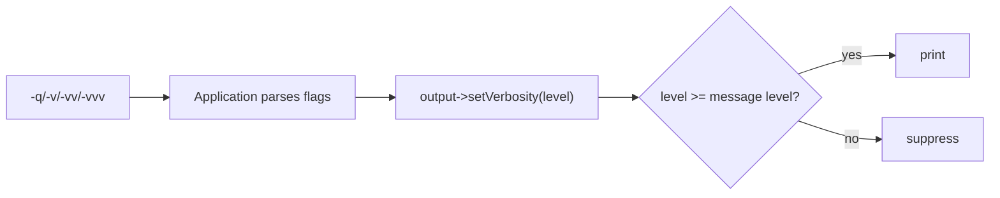

# Verbosity Levels

!!! abstract "Learning objectives"
    By the end of this chapter you can:

    - [ ] Map `-q`, `-v`, `-vv`, `-vvv` to the `VERBOSITY_*` constants
    - [ ] Gate output using `isVerbose()`, `isVeryVerbose()`, `isDebug()`
    - [ ] Emit a line only at a chosen verbosity
    - [ ] Explain how verbosity is set on the output and its integer values

    **Syllabus:** `Console → Verbosity` ·
    **Level:** Advanced ·
    **Est. time:** 20 min ·
    **Prerequisites:** [Input & output](input-output.md)

---

## Theory

Verbosity controls **how much** a command prints, without changing its logic. Users
choose it with global flags; commands respect it when writing output.

| Flag | Level constant | Integer |
|---|---|---|
| `--quiet` / `-q` | `VERBOSITY_QUIET` | 16 |
| *(default)* | `VERBOSITY_NORMAL` | 32 |
| `-v` | `VERBOSITY_VERBOSE` | 64 |
| `-vv` | `VERBOSITY_VERY_VERBOSE` | 128 |
| `-vvv` | `VERBOSITY_DEBUG` | 256 |

`-q` silences all normal output (errors still surface); higher levels reveal more
diagnostic detail. The constants live on
`Symfony\Component\Console\Output\OutputInterface`.

## Deep Dive — how it works internally

The `Application` parses the global `-v/-vv/-vvv/-q` flags **before** dispatching to
a command and calls `$output->setVerbosity()` accordingly. Verbosity is therefore a
property of the **output**, not the input.

Two ways to honour it:

1. **Guards** — `isQuiet()`, `isVerbose()`, `isVeryVerbose()`, `isDebug()` on the
   output (and mirrored on `SymfonyStyle`). Wrap expensive/diagnostic output in
   these.
2. **Per-message level** — pass a verbosity mask as the second argument to
   `write()` / `writeln()`; the message prints only if the current level is at least
   that value:

```php
$output->writeln('debug detail', OutputInterface::VERBOSITY_DEBUG);
```

Because the constants are ordered integers (16 < 32 < 64 < 128 < 256), a message
tagged `VERBOSITY_VERBOSE` (64) shows at `-v`, `-vv` and `-vvv`, but not at normal
(32) or quiet (16). Internally `write()` compares
`$this->verbosity >= $messageVerbosity`.



!!! note "Source reference"
    `OutputInterface::VERBOSITY_*` and `Output::write()`'s verbosity check —
    [symfony/symfony `8.0`](https://github.com/symfony/symfony/blob/8.0/src/Symfony/Component/Console/Output/OutputInterface.php).

## Configuration & code

=== "Guards"

    ```php
    <?php
    declare(strict_types=1);

    namespace App\Command;

    use Symfony\Component\Console\Attribute\AsCommand;
    use Symfony\Component\Console\Command\Command;
    use Symfony\Component\Console\Output\OutputInterface;
    use Symfony\Component\Console\Style\SymfonyStyle;

    #[AsCommand(name: 'app:sync')]
    final class SyncCommand
    {
        public function __invoke(SymfonyStyle $io, OutputInterface $output): int
        {
            $io->writeln('Syncing…');                       // normal

            if ($output->isVerbose()) {
                $io->writeln('Connecting to remote host');  // -v and up
            }

            if ($output->isDebug()) {
                $io->writeln('Payload dump: {...}');         // -vvv only
            }

            return Command::SUCCESS;
        }
    }
    ```

=== "Per-message level"

    ```php
    <?php
    declare(strict_types=1);

    use Symfony\Component\Console\Output\OutputInterface;

    function report(OutputInterface $output): void
    {
        $output->writeln('always');                                   // normal+
        $output->writeln('more', OutputInterface::VERBOSITY_VERBOSE); // -v+
        $output->writeln('trace', OutputInterface::VERBOSITY_DEBUG);  // -vvv
    }
    ```

=== "Console"

    ```console
    $ php bin/console app:sync            # normal
    $ php bin/console app:sync -v         # verbose
    $ php bin/console app:sync -vvv       # debug
    $ php bin/console app:sync -q         # quiet (suppress normal output)
    ```

## Best practices & anti-patterns

| ✅ Do | ❌ Avoid |
|---|---|
| Put diagnostics behind `isVerbose()`/`isDebug()` | Always dumping stack traces |
| Tag messages with a verbosity level | Printing everything at normal level |
| Keep essential result at normal level | Hiding the actual result behind `-v` |
| Respect `-q` for scripts/cron | Forcing output regardless of `-q` |

## When (not) to use it / alternatives

Verbosity is for *human diagnostics*. For machine-readable output prefer an explicit
`--format=json` option or write structured data to STDOUT (see
[input & output](input-output.md)); do not rely on verbosity to toggle data
formats. In `-vvv` (debug), Symfony also shows full exception traces on errors.

!!! danger "Certification traps"
    - The constants are **16/32/64/128/256** (QUIET/NORMAL/VERBOSE/VERY_VERBOSE/DEBUG).
    - `-v` = verbose, `-vv` = very verbose, `-vvv` = debug.
    - Verbosity lives on the **output**, set by the Application from the flags.
    - `-q` suppresses normal output but the command still runs and returns its code.
    - A higher level shows all messages tagged at that level **or lower**.

!!! warning "Common mistakes"
    - Reading verbosity from the *input* — it is on the *output*.
    - Assuming `-q` skips execution; it only silences output.

## Exercises

1. **(Basic)** Print `"connecting"` only at `-v` or higher and `"raw response"` only
   at `-vvv`.
2. **(Intermediate)** Write the same three lines using per-message verbosity masks
   instead of `if` guards.

??? success "Solutions"

    **1.**

    ```php
    if ($output->isVerbose())  { $output->writeln('connecting'); }
    if ($output->isDebug())    { $output->writeln('raw response'); }
    ```

    **2.**

    ```php
    $output->writeln('connecting', OutputInterface::VERBOSITY_VERBOSE);
    $output->writeln('raw response', OutputInterface::VERBOSITY_DEBUG);
    ```

## Certification questions

??? question "Q1. Which flag corresponds to `VERBOSITY_VERY_VERBOSE`?"
    - [ ] A. `-v`
    - [x] B. `-vv` ✅
    - [ ] C. `-vvv`
    - [ ] D. `-q`

    **Why:** `-vv` is very verbose (128); `-vvv` is debug (256). **Ref:**
    [Console verbosity](https://symfony.com/doc/current/console/verbosity.html).

??? question "Q2. What is the integer value of `VERBOSITY_NORMAL`?"
    - [ ] A. 0
    - [ ] B. 16
    - [x] C. 32 ✅
    - [ ] D. 64

    **Why:** QUIET=16, NORMAL=32, VERBOSE=64, VERY_VERBOSE=128, DEBUG=256. **Ref:**
    [Console verbosity](https://symfony.com/doc/current/console/verbosity.html).

??? question "Q3. Where does the current verbosity level live?"
    - [x] A. On the `OutputInterface` (set by the Application) ✅
    - [ ] B. On the `InputInterface`
    - [ ] C. On the `Command`
    - [ ] D. In an environment variable only

    **Why:** the Application calls `$output->setVerbosity()` from the flags. **Ref:**
    [Console verbosity](https://symfony.com/doc/current/console/verbosity.html).

??? question "Q4. A message written with `VERBOSITY_VERBOSE` appears at…"
    - [x] A. `-v`, `-vv`, and `-vvv` ✅
    - [ ] B. only `-v`
    - [ ] C. normal and above
    - [ ] D. `-q` and above

    **Why:** any level ≥ the message's level prints it. **Ref:**
    [Console verbosity](https://symfony.com/doc/current/console/verbosity.html).

## Key takeaways

- Flags: `-q` (quiet), *(none)* normal, `-v`, `-vv`, `-vvv` (debug).
- Constants: 16/32/64/128/256 on `OutputInterface`.
- Guard with `isVerbose()`/`isVeryVerbose()`/`isDebug()` or tag messages by level.
- Verbosity is an **output** property; `-q` silences output, not execution.

## Last-minute revision

!!! tip "Cheat sheet"
    - `-v`→VERBOSE(64), `-vv`→VERY_VERBOSE(128), `-vvv`→DEBUG(256), `-q`→QUIET(16).
    - `writeln($msg, OutputInterface::VERBOSITY_VERBOSE)`.
    - `$output->isVerbose()`, `isVeryVerbose()`, `isDebug()`, `isQuiet()`.
    - `-vvv` also prints full exception traces.

## References

- [Official Symfony docs — Console verbosity](https://symfony.com/doc/current/console/verbosity.html)
- [Symfony source — OutputInterface](https://github.com/symfony/symfony/blob/8.0/src/Symfony/Component/Console/Output/OutputInterface.php)

---

<small>Related: [Input & output](input-output.md) · [Events](events.md) · [Built-in commands](built-in-commands.md)</small>
